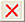
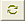
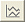
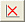

# Variograms: Data Selection

To access this screen:

  * Display the [Variogram](<VARMOD_Introduction.md>) screen and select the Data Selection tab.

Load and display experimental variograms from one or more files.

Note: When a project file is opened which contains charts that make used of linked files (and not loaded data) and the linked file(s) cannot be located (perhaps it is unavailable, has been renamed or moved), a message like this displays:  
  
  
  
Clicking OK lets you browse and select the required file(s).

To display variograms in an experimental variogram file:

  1. Display the **Variograms** screen.

  2. Select the **Data Selection** tab.

  3. In **Experimental Variogram File(s)** , browse for a Datamine file containing experimental variogram data. Multiple variograms can be represented by a single file.

Note: Experimental variogram data is generated by the **VGRAM** process, and also as part of advanced estimation functions in Studio RM.

You can also delete () or refresh () variogram data from the source file.

  4. Optionally, check Draw Perpendicular Variograms to display all variograms that are perpendicular to the selected variogram(s) (selected by ticking the checkbox to the left of the listed variogram).

  5. You can display only variogram points that have a Minimum No. of Pairs, or leave the default setting (0) to display all variogram points.

  6. Choose your Variogram Type:

     * Variogram

     * Log Variogram

     * Pairwise Relative Variogram

     * Covariance

     * Madogram

     * Corelogram

  7. Select the Value field. This is the grade or quality field being modelled.

  8. Choose how variograms display in relation the value field:

     * 

Draw all the experimental variograms for the selected value field.

     * 

Hide all the experimental variograms for the selected value field.

  9. If present, select one of the available **Key Fields** (for example, to delineate a rock type, zone, reef and so on). This filters the listed variograms.

  10. Select the required key field value(s) using Key Values. Again, select for each field to filter the listed variograms.

  11. Review the **Variograms** table. This lists the experimental variograms for the Value Field, Key Field and Key Value combination selected above.

Check or uncheck a variogram to show or hide it in the graph.

The order in which the variograms are selected in the Variograms list is the order:

     * in which they will be drawn in the Preview pane on the left and the legend.

     * used to define the variogram model XYZ axes.

Review the other table columns:

     * GRADE The name of the field selected in Value Field above.

     * AZI The azimuth or dip direction, in the local coordinate system, of the varogram; '-' denotes the omnidirectional variogram.

     * DIP The dip, in the local coordinate system, of the variogram; ; '-' denotes the omnidirectional variogram.

Note: The local coordinate system is measured relative to the reference plane that was defined when the experimental variograms were created e.g. using [VGRAM](<../Process_Help_XML/vgram.md>). If the horizontal plane was defined as the reference plane (the default) then the local and world angles are the same.  

     * WAZI The azimuth or dip direction,in the world coordinate system, of the varogram; '-' denotes the omnidirectional variogram.

     * WIP The dip, in the world coordinate system, of the varogram.

Note: '-' denotes the omnidirectional variogram.

Note: Choosing a new set of fields will create a new list so that other variograms can be selected for display on the same chart. If you want to remove variograms from the first set of fields you must reselect the old fields and then untick the variograms. A potentially quicker method of controlling which variograms are displayed is available from the [Charts](<VARMOD_Charts.md>) tab.  

To format the preview of displayed variograms:

  1. Display the required variogram using the **Variograms** table.

  2. In the same pane, right-click the variogram item, select Edit Propeties.

  3. On the Variogram Properties screen, define the **Colour** and **Symbol** parameters, click OK.

  4. Review the variogram in the chart preview pane. 

See [Variogram Properties](<VARMOD_Properties.md>).

Related topics and activities

  * [Variograms](<VARMOD_Introduction.md>)

  * [Variogram Properties](<VARMOD_Properties.md>)

  * [Format Tab](<VARMOD_Format.md>)

  * [Variograms: Charts](<VARMOD_Charts.md>)

  * [Data Tab](<VARMOD_Data.md>)

  * [Model Fitting Tab](<VARMOD_Model_Fitting.md>)

  * [Editing Variograms Interactively](<VARMOD_Preview.md>)