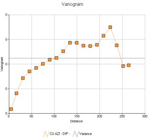
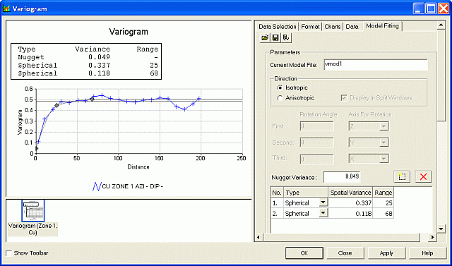

# Variograms

This Variogram Display and Modeling functionality has the following features:

  * Uses the Datamine Charting framework which is shared by the [Histograms](<Chart_Histogram.md>), [Scatter Plots](<Chart_ScatterPlot.md>) and [Stereonet](<../Stereonet/Stereonet%20Introduction.md>) options.

  * Report-quality graphics that can be saved as standard image files (.jpeg, .gif, etc) or as plot items in the Plots window.

  * Ability to save one or more 'variogram display and modeling scenarios', each as a single case with all its parameters.

Note: A case is set up by creating a new variogram chart sheet, represented by a single tab in the Plots Window.  

  * The simultaneous opening of multiple cases, together with Histogram, Scatterplot and Stereonet charts.

  * Selection of multiple experimental variograms from one or more files created by the variogram calculation process (**VGRAM**).

  * Selection and display of experimental variograms using up to three key fields.

  * Interactive model fitting by dragging control points with the mouse or by typing parameters into dialogs.

  * Fitting of anisotropic models in a single window, or in three individual windows with full linking of common parameters.

  * Choice of model type for up to five structures.

  * Detailed formatting options to specify axes, annotation, titles, line styles, colors, etc.

  * Display of variogram rotation angles in either the world coordinate system, or relative to a rotated plane.

  * Choice of display of variogram, relative variogram, log variogram or covariance. Any of which can be normalized.

  * Creation of a wireframe ellipsoid from the variogram model, to aid in visualizing variogram ranges and axis rotation angles.

An example of a variogram chart

Note: Experimental variogram data is generated by the VGRAM process, and also as part of advanced estimation functions in Studio RM.

## The Variogram Screen

To display this screen:

  * In any data window, activate the  Estimate ribbon and select  Variograms >> Fit .

The Variogram screen controls aspects of histogram display, formatting and modeling. The screen consists of two main areas: a preview area on the left and a controls area on the right.

;>)

#### The Preview Area

The [preview area](<VARMOD_Preview.md>) is used for:

  * Previewing the current settings for the displayed variogram(s).

  * Interactive model fitting.

  * Interactive positioning of the following chart components:

    * Chart title box.

    * Variogram model parameters box.

    * Legend box.

#### The Controls Area

The control area, on the right is, divided into the following tabs:

  * Data Selection: load and display experimental variograms from one or more files. 

See [Variograms: Data Selection](<VARMOD_Data_Selection.md>).

  * Format: configure the variogram chart's **Annotation** , **Axes** , **Grid** , **Comments** , **Colour** , **Legend** and **Options** parameters. 

See [Variograms: Format](<VARMOD_Format.md>).

  * Charts: control the display of loaded variograms using the folder tree. 

See [Variograms: Charts](<VARMOD_Charts.md>)

  * Data: view the lag details for the selected variogram. 

See [Variograms: Data](<VARMOD_Data.md>)

  * Model Fitting: fit a model to the current variogram chart. 

See [Variograms - Model Fitting](<VARMOD_Model_Fitting.md>)

## Create a Variogram Chart Sheet

To create a new variogram chart sheet, for displaying and modelling:

  1. Display the Variogram screen.

  2. As a minimum, in the [Data Selection](<VARMOD_Data_Selection.md>) tab, load an experimental variogram file(s), and define the associated parameters and click Apply.

Note: You'll need an experimental variogram file for this, typically created using **VGRAM** or as part of advanced estimation.  

  3. If a variogram model is to be created, in the [Model Fitting](<VARMOD_Model_Fitting.md>) tab, specify a model file and define a set of model parameters.

Related topics and activities

  * [Data Selection Tab](<VARMOD_Data_Selection.md>)

  * [ Format Tab](<VARMOD_Format.md>)

  * [Charts Tab](<VARMOD_Charts.md>)

  * [ Data Tab](<VARMOD_Data.md>)

  * [ Model Fitting Tab](<VARMOD_Model_Fitting.md>)

  * [Editing Variograms Interactively](<VARMOD_Preview.md>)