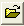
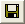
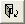
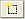
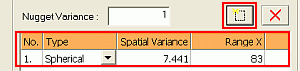
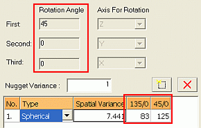
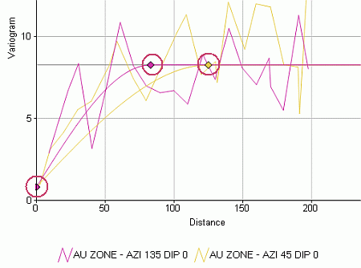

# Variograms - Model Fitting

To access this screen:

  * Display the [Variogram](<VARMOD_Introduction.md>) screen.

  * Load an experimental variogram data file. See [Variograms: Data Selection](<VARMOD_Data_Selection.md>).

  * Display the **Model Fitting** tab.

Fit a model to the current variogram chart. 

Axis rotation angles are calculated when an anisotropic variogram model is applied. The angles are calculated from the azimuth and dip of the experimental variograms and are based on a fixed sequence of rotations the first about Z, the second around the Y axis and the third around the X axis.

Positive rotation angles indicate a clockwise rotation looking down the corresponding axis (in the direction of the axis origin); negative rotation angles are anticlockwise. 

Axes are orientated using the Left Hand Rule where, held orthogonal to one another, the thumb points in the positive Z coordinate direction, the index finger points in the positive Y coordinate direction and the second finger in the positive X coordinate direction.

The icons at the top of the screen represent the following:

 | Browse and select a variogram model file.  
---|---  
 |  Save the current model to the variogram model file. Displays the **Save Model As** screen.

  1. Enter an Existing Ref No. A variogram reference (relating to the index ofa defined structure.
  2. Enter a Reference No.
  3. Enter a Description.

  
 | Open a model to populate the remainder of fields on the **Model Fitting** tab.  
  
To define model fitting parameters:

  1. Either accept the Current Model File name or generate a new file by entering a new name.

  2. Choose the **Direction** , which can be:

     * Isotropic Select this option if the new model is to be the same in all directions. 

     * Anisotropic Select this option if the new model is to be different in at least two of the three orthogonal axes. Anisotropic configurations have the following additional options: 

       * Display in Split Window Display each of the three orthogonal variograms in a separate split preview panes. Each of the three variogram charts will a separate pane and corresponding thumbnail. Double-clicking a chart thumbnail in the lower part of the preview window displays the full chart in the upper pane.

       * Display Omni-directional variogram Display the omni-directional variogram for visual reference purposes. This has no effect on variogram model axes or parameters.

  3. Define the first, second and third Axis for Rotation. 

Note: **Rotation Angle** values are calculated automatically.

  4. Add a model structure () and define a value for the variogram model nugget (**Nugget Variance**).

  5. For each structure, review and edit the following model parameters:

     * No Variogram model structure number.

     * Type Select the variogram model type i.e. [Spherical], [Exponential] or [Gaussian].

Note: By default a spherical model is selected for a new structure. This can be changed using the drop-down list.  

     * Spatial Variance Define a spatial variance by typing in a value or using the cursor to drag the corresponding point in the preview pane.

     * Range X/Y/Z Define a range by typing in a value or using the cursor to drag the corresponding point in the preview pane. You can define a range value for each major axis.

Tip: The variogram model's nugget, spatial variance(s) and range parameters can also be interactively positioned in the preview pane once the model's structure(s) has been added to the model parameter pane with the Add New Structure button. See [Interactive Structure Editing](<VARMOD_Preview.md#InteractiveVariogramModelFitting>).

  6. Choose general **Options** :

     * Display Model Allows the model display to be switched on and off.
     * Lock Sill Value Check to fix the upper sill of the model at its current level. Moving the control point for the highest structure will then only change the range. Moving control points for other structures (if any) will change the spatial variances (Ci values).

     * Lock all C Values Check to lock all variance values. Moving control points will then only change the ranges.

     * Lock Range Value Check to keep the current range values. Moving control points will then only change the spatial variances.

     * Decimals for Variances The number of decimal places to be used for displayed variance values (default '3').

     * Decimals for Ranges The number of decimal places to be used for displayed range values (default '0').

     * Reset Sill to Variance Initially the sill is set equal to the variance. If the sill has been changed then it can be reset to the variance.

## Worked Example

Creating a New Anisotropic Variogram Model

  1. In the Data Selection tab, select two or more orthogonal experimental variograms in the Variograms list.  

  2. In the Model Fitting tab, Parameters group, define the current variogram model file.

  3. In the Direction group, select the Anisotropic option.

  4. Optionally select Display in Split Windows.

  5. Define a Nugget Variance value.

  6. Click Add New Structure and check that a new model has been added to the list, like the one shown below:  
  

  7. In the **Variogram Model** list, for this new model, select a model Type from the drop-down.

  8. Define the corresponding model parameters e.g. Spatial Variance, Range X, Range Y and Range Z.

Note: When Add New Structure is clicked, the displayed experimental variogram data is used to calculate estimates for the new variogram model's parameters. These can be edited by clicking in each field and typing in a different value.  

  9. Click Apply.

  10. Check the Rotation Angle parameters and corresponding Dip Direction/Dip model parameters for the XYZ axes of the selected experimental variograms i.e. those selected in step 1.  
  

  11. In the **Preview** pane, check that displayed variogram model for each of the **XYZ** axes.

  12. If required, adjust the **Nugget** , **Spatial Variance** and **Range** parameters interactively using the mouse cursor by click-and-dragging the relevant synbol left, right, up or down:  
  
;>)

Note: The selected Lock options in the Options group control which parameters can be interactively adjusted. 

  13. Click Save Variogram Model to File.

  14. Repeat steps 6. to 13 for each variogram model structure.

Note: This example applies when a spherical variogram model type is used to model a variogram and which contains more than one structure (for example, a 2 structure spherical model).

Related topics and activities

  * [Variograms](<VARMOD_Introduction.md>)

  * [VGRAM Process](<../Process_Help_XML/vgram.md>)

  * [Variogram Properties](<VARMOD_Properties.md>)

  * [Variograms: Data Selection](<VARMOD_Data_Selection.md>)

  * [Variograms: Charts](<VARMOD_Charts.md>)

  * [Data Tab](<VARMOD_Data.md>)

  * [Variograms: Format](<VARMOD_Format.md>)

  * [Editing Variograms Interactively](<VARMOD_Preview.md>)