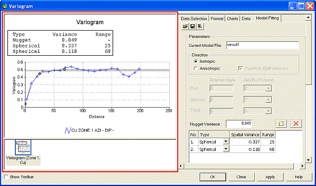
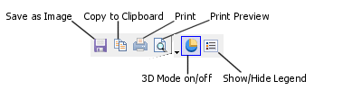

# Editing Variograms Interactively

To access this functionality:

  * Display the [Variogram](<VARMOD_Introduction.md>) screen. The preview area is on the left.

The Variogram screen's preview area is used to view the displayed variograms, interactively fit the current variogram model, interactively position chart components, access the toolbar and context menu:

;>)

The Variogram screen showing a chart preview

## The Preview Toolbar

The preview area has a dedicated toolbar which can be displayed by selecting the Show Toolbar check box at the bottom of the screen.

Tip: Once displayed, the toolbar can be dragged to any side of the preview area.

The Preview toolbar contains the following functions:

  * Save as Image Save the current chart image to a standalone image file. Files can be saved in .bmp, .jpg, .jpeg, .tiff, .gif or .emf formats.

  * Copy to Clipboard Copy the contents of the preview area to the clipboard. This information can be pasted into any external application that supports the pasting of image metadata. For more information on how to paste into external applications, please refer to the relevant documentation for the system in context.

  * Print Send the displayed chart to any supported local or network printing device. 

Note: This will launch your system's proprietary print control dialog, and you should refer to your system documentation for more details on how to set up particular printing formats for your hardware.

  * Print Preview Display the **Print Preview** screen.

  * 3D Mode Enable or disable 3D chart mode. If this option is enabled, you can rotate the chart in the preview area by dragging the mouse with the right-button held down. If the option is disabled, a 2D flat view is set and no rotation can be performed.

  * Show/Hide Legend Show or hide the chart legend; it is displayed by default.

Tip: If a chart legend is displayed, double-click the legend item's legend block or label in the preview panel to open up the[Chart Series Style](<Charts_ChartSeriesStyle.md>) screen or the [Legend Properties](<Charts_LegendProperties.md>)screen respectively, for further formatting options. 

## Menu Options

Right-clicking the preview area displays a context menu:

Note: Tooltips are displayed in a popup, in the preview pane, when the cursor is hovered over an experimental variogram data point .

Tooltips >> Display Value Field | Show or hide value field names  
---|---  
Tooltips >>Display Key/Value in Legend | Show or hide the key value (if a key field has been specified in the experimental variogram file).  
Tooltips >>Display AZI Value |  Show or hide the azimuth for the variogram.  
Tooltips >>Display DIP Value | Show or hide the dip for the variogram.  
Tooltips >>Display No. of Pairs | Show or hide the number of pairs for the data point (shown by default).  
Lock Sill Value | Check to fix the upper sill of the model at its current level. Moving the control point for the highest structure will then only change the range. Moving control points for other structures (if any) will change the spatial variances (Ci values).  
Lock all C Values | Check to lock all model variance values. Moving control points will then only change the ranges.  
Lock Range Value | Check to lock the current model range values. Moving control points will then only change the spatial variances.  
Display Normalized Variograms |  Check for ensure all variogram values are divided by the statistical variance of the original data.  This means that the theoretical sill of each variogram is 1. This is useful if you want to display variograms for different grades on the same chart as it will mean that the variograms are approximately the same scale in the Y direction.  Note: If you have previously selected **Custom Axis** you may need to update the maximum Y value.  
Display Symbol at Each Point | Show or hide the symbol that is displayed at each experimental variogram point on the chart.  
Display Sample Pairs | Show or hide the annotation for the number of pairs of samples used to calculate each variogram point.  
Display Variance of Samples | Show or hide the horizontal line on the chart representing the sample variance statistic. This is often used as a starting point for defining the variogram model sill.  
Display Angle in World Coordinate System | Toggle between displaying the local and world coordinate system **AZI** and **DIP** values.  
  
## Interactive Fitting

The variogram model control points can be moved interactively using click-and-drag actions; the cursor changes to indicate the permitted movement direction(s). These depend on the type of model control that has been selected and the defined model fitting settings (see note below), and change the model parameters as follows:

  * Nugget Variance point Move the point vertically up/down to increase/decrease the value.

  * Spatial Variance/Range points (1-5) Move the point(s) vertically up/down to increase/decrease the spatial variance value(s).

  * Spatial Variance/Range points (1-5) Move the point(s) horizontally right/left to increase/decrease the range value(s).

Note: Permitted model point movements (horizontal, vertical or both) are further restricted by Options in the [Model Fitting](<VARMOD_Model_Fitting.md>) tab.

Related topics and activities

  * [Variograms](<VARMOD_Introduction.md>)

  * [VGRAM Process](<../Process_Help_XML/vgram.md>)

  * [Variogram Properties](<VARMOD_Properties.md>)

  * [Variograms: Data Selection](<VARMOD_Data_Selection.md>)

  * [Variograms: Charts](<VARMOD_Charts.md>)

  * [Data Tab](<VARMOD_Data.md>)

  * [Variograms: Format](<VARMOD_Format.md>)