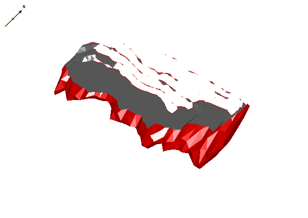
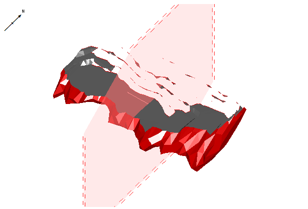
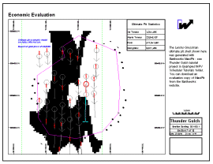
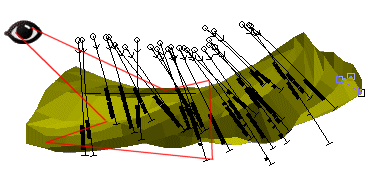
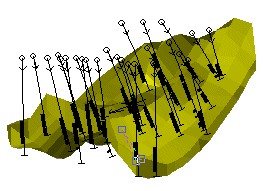
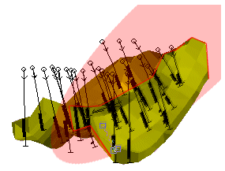
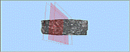
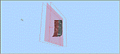

# Sections and Projections

The [Plots](<../COMMON/Window_PLOTS_Overview.md>) window uses sections and projections to display 3D data.

A **projection** is a display of 3D data, viewed from a particular direction. It can also be a 'slice' through data. This slice is known as a **section**. 

You can also display the section itself, as part of a 3D view, without actually showing a slice of data. 

Consider the following example. A projection has been added to a plot sheet automatically using the **[create-plot-view](<../command_help/create-plot-view.md>)** command, and a 3D overlays group was created. See [Projection Overlay Types](<Projection%20Overlay%20Types.md>):

;>)

In the **3D** window, the default section intersects the data at an angle that is not orthogonal to the view (in other words, the section was not being used to control or lock the 3D view. On the resulting plot, with the section line displayed, you can see data and _section_ together in the single _projection_.

;>)

The view of the projection can be altered easily to align it with the section (there are several ways to do this, such as the **Projection Properties** screen's **Align with Section** (_Perpendicular_) setting).

In summary, a _projection_ represents a _view_ of 3D data. This can optionally be clipped with a _section_ to view a slice of data, or using a specific view direction in relation to a _section_. A projection can be supported by multiple projections (defined by a section definition table) but only one can be active at a time in each projection.

A plot sheet can contain multiple projections, potentially will each having its own view direction and section definitions.

**Note** : Projection settings, including section and view direction data, are saved to [Plot Sheet Templates](<PLOTS_Plot%20Templates.md>).

## Plot Sections

A projection has a single view direction. If you are viewing a data slice (by clipping around a 3D section), that data can be viewed either 'head on' or at any angle. 

Sections provide a reference plane from which data can be clipped and (optionally) the view within a projection oriented.

 |  You can extend this functionality with the use of a section master; with a section master, the section definition in one view can be used to control the display of data in any other projections.  Changing the active section definition width, dip and/or azimuth in any view using the section master automatically updates all other views using the same section master. Changing the section position in any one of these views is applied to all views.  
---|---  
  
For example, your report may comprise multiple plot sheets, with each sheet displaying a plan view of a section (slice) through a loaded wireframe volume. Using a section master, the same section definition can be used for the other sheets (say, to show a slice at the same position of a block model and drillhole data set). Updating the master section definition updates all projections in all plot sheets that use it.

Typically, you will use multiple sections to present your data effectively. Several default section alignments are available, and you can also create your own custom sections.

When talking about sections, the following concepts are important:

  * A section is a full definition of a 3D plane. 

  * Sections can be used to orient the view and clip data, or just to show a planar position in relation to 3D data.

  * A complete family of sections is defined by a single section definition. For example; if the drilling data extends between northings 1000N and 2000N, by defining a single East-West section at 1000N (or 2000N or 1356N, for example) and a section width of 100 meters, the program will auto-range the extents of the data and create a total of 11 East-West sections, with each one 100 meters apart. 

  * Where sections are required that aren't parallel, a 'section definition table' can reference multiple unrelated sections. This can be useful to produce a series of sections that intersect with data at landmark positions, but aren't parallel.

Horizontal (benched), inclined and vertical sections can be quickly defined using the Section Wizard by selecting the section type, section azimuth, section width and the center point coordinate of any one of the sections. The creation of plan and 3D views is a simple one step process. For more information on creating and editing sections, see [Creating and Defining Sections](<insertsection.md>). 

Having created the default section, plan or 3D view, the section definition, page size and view settings can be modified. Changes made to the section definition can be displayed dynamically to giveimmediate visual feedback.

The section may also be redefined or repositioned interactively by picking the centre point or end points of a new section in an existing view, or snapping to a particular hole collar or sample.

## Projection Ribbons

Selecting a projection in a plot sheet automatically displays a pair of context-sensitive ribbons, both under the **Projection** group: **Section** and **View**. These present the commonly-used settings that define a 3D section (see above) and the view direction of the projection (the angle from which data is now being viewed).

  * **Section ribbon** Settings that define the currently active section. Changing these settings can affect the selected projection and any others that display or use the same section.

  * **View ribbon** The view direction of the target projection.

These settings are also accessible from other screens and **Properties** control bar readouts. The ribbons are just a convenient way of getting to them more quickly.

**Tip** : You can customize any ribbon in Studio products. See [Ribbon Customization](<../COMMON/Ribbon_Customization.md>).

## Projection View Settings

A projection is a view of data. The view is determined by a virtual camera position and orientation. This is the same for both 3D views and plots. In a projection, data can be viewed from any angle. 

For example, in the image below, a wireframe orebody is viewed in the direction indicated by the red arrow:

Once this view definition is set for a projection, you would see something like this:

However, this example is potentially misleading, so it is important to reiterate that the view direction is not the same as a projection (although there is a 1:1 relationship). In contrast, a section is a 3D plane that can be used to slice or automatically orient the view.

To display a cross section of data in a projection, the orientation of a section of data determines how a data is cut, for example:

The projection and section are, at this stage, not aligned. This could be, for example, because the data is being viewed from an angle that suits the presentation of the 3D data, but for useful 2D plot data to be drawn in another projection, a section elsewhere is required.

**Note** : You can also set the view direction automatically to preset angles such as plan, north-south and so on, using the **View** ribbon's **View** command group. There are also commands to alter the section definition to the same preset orientations.

## The Section 'Corridor'

A section has a front and back width. If using a section to display a slice of data, 'clipping' is often useful. This allows data that lies beyond a specified distance away from the section plane to be hidden.

For example, in the image below, a front and back section width of 75 are specified (resulting in a section corridor of 150), and clipping is applied:

Reducing the front and back section width to 10 apiece results in a section corridor of 20:

See [Clipping Data](<ClipView.md>) and [Section Width](<Plots-ViewSettings-SectionWidth.md>).

## Aligning the Section and View

There are several ways to align a projection's view direction in relation to a section:

To align the view direction with the section definition (ribbon method - no locking):

  1. Display a plot sheet with at least one projection.

  2. Select the projection (**[Page Layout](<PageLayoutMode.md>)** mode does not have to be active).

  3. **(Projection) View** ribbon **> > Orientation >> Align to View**.

The projection's view definition updates to be orthogonal to the currently active section.

Note: This method does not 'lock' the view to the section definition. Thus, changing the section definition afterwards will not automatically update the view. See below for an activity to lock a section and view together.

To lock the view direction of a projection to a section (Properties bar method - locking):

  1. Display a plot sheet with at least one projection.

  2. Select the projection (**[Page Layout](<PageLayoutMode.md>)** mode does not have to be active).

  3. Double-click the projection.

The **[Projection Properties](<projection%20properties.md>)** screen displays.

  4. In the **View Direction** group expand the Align with Section menu.

  5. Choose an orientation in relation to the section:

     * _No_ Unlock the section from the view. The view will no longer display or adjust in relation to a section.

     * _Perpendicular_ Set the view to be orthogonal to the section (the 'head on' view).

     * _Side View_ View the data sideways to the active section. For example, if the section plane is horizontal, the side view will become east-west.

     * _Top View_ Actually, a 'rotated plan' view. The view is perpendicular to the section but rotated 90 degrees.

     * _Reversed Perpendicular_ View data from underneath, orthogonally to the section.

     * _Side View Perpendicular_ view from the opposite direction to side view, for example, if the section is horizontal, the view is from south-north.

     * _Reversed Top View_ As Top View (see above), but from underneath the section.

**Note** : Unless _No_ is selected, the view updates automatically to honour the new setting.

**Note** : You can also use the **(Plots) View** ribbon's **View >> Align** command to display the **View Alignment** screen. This adjusts the view without changing the section definition.