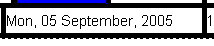
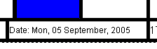

# Cell Contents Dialog

 |  Cell Contents Dialog How to use the Cell Contents dialog to edit the contents of a title box plot item.  
---|---  
  
# Cell Contents Dialog

### To access this dialog:

  * In the [Title Box Properties](<title%20box%20contents%20dialog.md>) dialog, click Contents.

This dialog is used to modify the content and format of the selected cell.

Field Details:

Category: this list contains descriptions of all available data types that can be selected and represented in the active table view. Selecting an item from this list will automatically update the Field list with items relevant to the selected category. If the [Static] option is selected, the Value field becomes available for editing, allowing you to enter a string manually, for inclusion within the title box. In all other cases, any Category-Field selection results in a read-only display in the Value field.

The information shown in the Value field, resulting from the Category-Field selection, is as follows:

Category |  Field |  Description  
---|---|---  
Date |  Any |  The current date in various formats.  
Time |  Any |  The current time in various formats.  
Application |  Name |  The name of the current application in use.  
|  Version |  The current major version of the application in use, e.g. '3.0'  
User |  User ID |  The ID of the currently logged in user, according to the settings in the [Options](<../COMMON/Options.md>) dialog, Information tab.  
|  User Name |  The fullk name of the currently logged in user, according to the settings in the [Options](<../COMMON/Options.md>) dialog, Information tab.  
|  Company |  The company name of the currently logged in user, according to the settings in the [Options](<../COMMON/Options.md>) dialog, Information tab.  
Scale |  Any |  The current scale of the current plot view, set to various decimal places, as set in the [View Settings](<../COMMON/Section%20Definition%20Dialog.md>) dialog, or the Scale toolbar.  
Exaggeration |  X/Y/Z |  The exaggeration of the current view along the 3 axes, as set in the [View Settings](<../COMMON/Section%20Definition%20Dialog.md>) dialog.  
Projection |  Title |  The full title of the current projection (view).  
|  Azimuth |  The azimuth of the current section, according to the current section definition, as set in the [View Settings](<../COMMON/Section%20Definition%20Dialog.md>) dialog.  
|  Dip |  The dip of the current section, according to the current section definition, as set in the [View Settings](<../COMMON/Section%20Definition%20Dialog.md>) dialog.  
Section |  Name |  The name of the currently displayed section, as shown on the tab at the bottom of the display area.  
|  Width |  The width of the current section (i.e. the extent of data clipping along the line of view).  
|  Mid. Point |  The mid-point location of the current section in the format xxxx.xx, yyyy.yy, zzzz.zz  
|  Easting |  The easting value of the current section.  
|  Northing |  The northing value of the current section.  
|  Elevation |  The elevation value of the current section.  
|  Azimuth |  The azimuth value of the current section.  
|  Dip |  The dip value of the current section.  
|  Number |  The number of the current section (i.e. its position in the overall sequence of sections)  
|  Num. of Sections |  The number of sections currently generated through the loaded data set.  
|  Section ? of ? |  A fuller description of the current section, and its position within the overall set.  
|  Title |  The title of the current section.  
  
Field: shows all appropriate formatting types for the currently selected category (see above). For example, selecting the [Scale] category will show options to display between 1 and 4 decimal places..

Include Label: specify whether the field label suffixes the data field in the cell, e.g. the data format below is shown without a label:

and with a label:

Value: this shows the read-only value of the selected Field item (see above) for the currently active cell. Note that these values are read-only (information is derived from various sources on the system - see above), with the only exception being if the [Static] Category is selected, in which case the field becomes available for editing, to enter any ad hoc text that may be required in the title box.

 | Changes made in theCell Contentsdialog will be applied to the resulting cell when theOKorApplybutton is clicked, regardless of whether theView | Redraw Dynamicallytoggle is set.  
---|---  
  
 |  Related Topics  
---|---  
| [The Cell Format Dialog](<cell%20format%20dialog.md>)