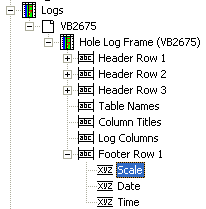

# Cell format dialog

 |  Cell Format Dialog How to use the Format Cell Dialog to format log header, footer or column title cell contents  
---|---  
  
# Cell Format Dialog

### To access this dialog:

  * In the [Log View Properties](<Log%20View%20Hole%20Properties.md>) dialog, Header, Column Titles or Footer tab, click Format or,

  * In the Sheets control bar, Logs folder, Hole Log Frame, right-click a cell item, select Properties. e.g.:  
  

This dialog is used to format the cell contents of a log sheet or plot item's header, footer or column title cells.

Field Details:

Include:

Border: select this option to display a border around the selected cell.

Font:

Use default font: if this checkbox is selected, the system default font will be used to display information. If cleared, the Modify... button is enabled, allowing you to select another font.

Modify: if the Use default font check box is cleared (see above), this button is enabled, and when clicked, displays the font editor to allow you to change the font type, size and format.

Horizontal: this group of options controls the horizontal alignment of a cell's text. The following options are available:

  * Left: left-align the contents of the selected cell.

  * Right: right-align the contents of the selected cell.

  * Centre: centre-align the contents of the selected cell.

  * Wrap: wrap cell contents onto the next line.

Vertical: this group of options controls the vertical alignment of a cell's text. Select from one of the following options:

  * Top: align text to the top of the cell.

  * Middle: align the cell contents to the vertical centre.

  * Bottom: align the cell contents to the bottom of the cell.

Opaque: select (tick) this option to display an opaque cell background colour; if not selected (default), the background color of the cell will be transparent.

 |  Related Topics  
---|---  
|  [Cell Contents Dialog](<cell%20contents.md>)