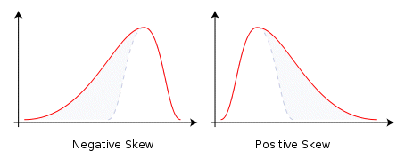
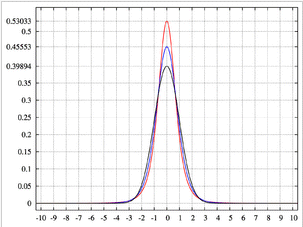

 |  Histograms - Statistics Configuring the information your chart will display  
---|---  
  
# Displaying Histogram Chart Statistics

### To access this dialog:

  * Open the [Histogram](<Chart_Histogram.md>) dialog, select a chart from the histogram thumbnails pane, select the Statistics tab.

The Statistics tab is used to define which summary statistics will be displayed on your histogram chart.

 |  The Statistics tab only contains data if the Individual Charts option was selected on the [Data Selection](<Chart_Histogram_DataSelection.md>) tab. It is otherwise empty if the Compound Charts option was selected.  
---|---  
  
Field Details:

Statistics: this group contains graphical statistics controls and a pane listing the summary statistics for the chart data in tabular format:

Display Parameters Graphically: tick this box to display the following statistics graphically on the charts.

  1.      * Mean: select a color from the drop-down.

     * Log Est Mean: select a color from the drop-down.

     * Geometric Mean: select a color from the drop-down.

     * Percentiles: select a color from the drop-down.

 |   In order to display these parameter lines on the chart:

  * In the Statistics tab:
  *     * Tick the Display Parameters Graphically option in the Statistics group
    * Tick the required statistic (i.e Mean, Log Estimate of Mean, Geometric Mean, nth Percentile) in the summary statistics table
  * In the [Histogram Properties](<Chart_Histogram_ChartProperties.md>) dialog, tick the Display Statistics option.

  
---|---  
  
Statistics grid: a tabular listing of the summary statistics; select the check boxes to display the listed item in the charts statistics box:  

 |  For the purpose of generating the log statistics (Sum of Logs, Mean of Logs, Logarithmic Variance), all values (i.e. those for the selected Value Fields), which are <= 0 (zero) or absent (-), are ignored. Logarithmic values are calculated to base 'e'.  
---|---  
  
  1.      1.         * Column Header Rows: the column headers NAME (name of statistic), VALUE and DECIMALS (number of decimal places).

 |  The number of decimal places listed under the DECIMALS column can be edited individually for each statistic; this is done by typing in a new value in the corresponding cell in the displayed statistics table.  
---|---  
  
  1.      1.         * Total Records: the total number of data records for the selected object or file. This includes all keys and records with absent data values.

        * Total Samples: the total number of samples used to create the current chart. This takes into account any key fields that have been specified for the chart but does not include records with absent Value or Weight fields.

        * No. of Missing Values: the number of samples not used to create the current chart. This is the difference between Total Records and Total Samples.

        * No. of Values > Trace: the "trace" value is defined as 0.10E-29 (i.e. Trace = 0.000000000000000000000000000001). The number of values greater than trace is therefore effectively the number of values greater than zero.

        * Maximum: the maximum value used to create the current chart.

        * Minimum: the minimum value used to create the current chart.

        * Range: the range of data values. This is equal to Maximum-Minimum.

        * Total: the sum total of all values used to create the current chart.

        * Mean: the mean of all values used to create the current chart.

        * Variance: the statistical variance of the values used to create the current chart. This is calculated as:   
  
Variance = ∑( xi ẍ)2/ n = [ ∑xi2 (∑xi)2/ n ] / n   
  
where xi are sample values, ẍ is the mean of the samples and n is the number of samples.  
  
See http://en.wikipedia.org/wiki/Variance for more information on Variance...*

        * Standard Deviation: the square root of the variance.

        * Standard Error: the standard error is also know as "the standard error of the mean" and is calculated as the Standard Deviation divided by the square root of Total Samples.

        * Coefficient of Variation: this is defined as the ratio of the Standard Deviation to the Mean.

        * Skewness: this is a measure of the asymmetry of the probability distribution of a variable. A negative skewness indicates that the left tail is longer than the right. Conversely, a positive skewness indicates the opposite - right is longer. A Standard Normal distribution has a skewness of zero:  
  

        * Kurtosis: this is a measure of the "peakedness" of the probability distribution. A high kurtosis distribution has a sharper "peak" and longer, thinner "tails", while a low kurtosis distribution has a more rounded peak with wider "shoulders" (i.e., shorter "fatter" tails)*. A Standard Normal distribution has a kurtosis of zero:  
  
  
Image showing a high-kurtosis peak in red, and lower-kurtoses results in blue

        * Geometric Mean: The geometric mean is a type of average which is calculated by multiplying the n sample values together and then taking the nth root of the product. 

        * Sum of Logs: the sum of the logs (base e) of the sample values.

        * Mean of Logs: the mean of the logs (base e) of the sample values.

        * Logarithmic Variance: the variance of the logs (base e) of the sample values.

        * Log Estimate of Mean: an estimate of the arithmetic mean of the samples assuming a lognormal distribution.

        * Correlation Coefficient: this is a measure of the degree of linear correlation between two variables, here the Y Axis and X Axis field values. These two variables are said to be correlated if the scatter plot shows a significant rectilinear (straight line) trend. Correlation coefficient values range from -1 (a straight line with negative slope) to 1 (a straight line with positive slope). Both ends of this range indicate strong correlation between the variables; a lack of straight line correlation is indicated by values close to zero. The formula used to calculate the correlation coefficient (cc) is as follows:

        *           * cc = (N * ∑XY - ∑X*∑Y) / sqrt((N*∑XX - ∑X*∑X) * (N*∑YY - ∑Y*∑Y))  
  
where:

          *             * N is the number of pairs

            * ∑X is the sum of the X values

            * ∑Y is the sum of the Y values

            * ∑XY is the sum of the product of X and Y

            * ∑XX is the sum of the product of X and X

            * ∑YY is the sum of the product of Y and Y

 |  The value displayed here is the same in each of the Y Axis and X Axis columns as the value was calculated using from both sets of values; all the other statistics listed in the table are calculated separately for each axis.  
---|---  
  
  1.      1.         * 5th ... 95th Percentile: the value of the variable (X Axis, Y Axis fields) below which a the Nth percent of the values fall; here these percentile values are calculated separately for each of the Y Axis and X Axis values.

## Displaying the Statistics on the Chart

A range of parameters can be displayed, and if selected, this information will be shown above each chart, aligned to the left border, e.g.:  
  

Select a check box on this panel to automatically update the preview with the relevant information. Note that the values to be displayed are shown in the green column in the table.

By default, the displayed statistics are positioned top left - they can be repositioned using the mouse cursor to click-and-drag.

|  Related Topics  
---|---  
| [Histogram - Introduction](<Chart_Histogram.md>)[  
Histogram - Data Selection](<Chart_Histogram_DataSelection.md>)[  
Histogram - Format](<Chart_Histogram_Format.md>)[  
Histogram - Charts](<Chart_Histogram_Charts.md>)[  
Histogram - Chart Data](<Chart_Histogram_ChartData.md>)[  
Histogram - Color Collection Editor](<Chart_Histogram_ColorCollectionEditor.md>)