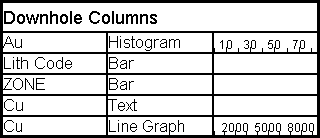

 |  Downhole Column Contents Inserting a Downhole Columns List Box  
---|---  
  
# Downhole Column Contents Dialog

### To access this dialog:

  * Using theManageribbon, selectDownhole Columnsfrom thePlot Itemdrop-down list

  * Double-click a Columns List Box plot item.

  * Right-click a Columns List Box and select Columns Box Properties.

This dialog is used to define the contents of a columns list box plot item, which displays a list of downhole columns in section views.

Select a data category or categories from the displayed list by enabling the relevant check boxes, and click OK to insert the new item.

Moving and Resizing Plot Items

Plot items can be edited by dragging the resizer components shown when the Plots window is in Page Layout Mode (if this mode is not active, you will see a dotted line around highlighted screen components - this mode is toggled using theManageribbon andLayout Mode

  * By default, objects will 'snap' to neighbouring items to allow you to align things more easily. You can override this behaviour by holding down the <CTRL> key during resizing.

  * You can maintain the aspect ratio of a plot item by holding down the <SHIFT> key during resizing using one of the corner sizer bars (using one of the central bars will automatically alter the aspect ratio regardless).

 |  The other tab of the Downhole Column dialog - [Frame Properties](<title%20box%20properties%20dialog.md>) \- can be used to define the layout of the new plot item.  
---|---  
  
##  

## Inserting a Columns List Box

The following procedure describes how to insert and edit a Columns List Box Plot Item:

  1. To display a list of downhole columns in the Plots window, using theManageribbon, selectDownhole Columnsfrom thePlot Itemdrop-down list

  2. This will open the Downhole Column dialog.

  3. Check the boxes against the items you want to list. Click OK.

  4. The contents of the Columns List Box will be updated automatically as you add, remove or modify downhole columns.  
  

## To display the properties of a columns list box

  1. Double-click inside the box to open the Downhole Column dialog.

  2. Edit the options on this dialog as explained here.

  3. Choose Apply and then OK.

 |  When resizing the width of cells, holding the <SHIFT> key down will ensure that all cells in that column will remain the same width.  
---|---  
  

### Rotate a Plot Item

Plot items that display a green rotation symbol after selection can be rotated. 

To rotate a plot item:

  1. Select the Manage ribbon and enable **Layout Mode**.

  2. Ensure the **Lock** toggle on the plot item's ribbon is not active. If it is, deactivate it. If the **Lock** toggle is active, the height and width (and rotation) cannot be changed.

  3. Left click to select a plot item.

The resize and rotate controls display, for example:

  4. Left click and drag the green rotate control.

  5. Release the left mouse button to redraw the control at the new orientation.

**Tip** : Small plot item resize handles can blend into each other. **[Zoom in](<Zooming.md>)** to see each resizer more clearly.

  
 |  Related Topics  
---|---  
|  [Inserting, editing and moving a text box](<TextBox.md>)[  
Inserting, editing and moving a title block](<TitleBlock.md>)[  
Frame Properties Dialog](<title%20box%20properties%20dialog.md>)