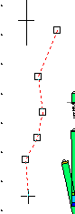

 |  Create Line Dialog How to a 3D Line plot feature using the Create Line dialog  
---|---  
  
# Create Line

 |  The Create Line dialog is second (and final) step involved in 3D plot line creation (using Manageribbon |Insert | Line) in the Plots window. Lines are held in memory as objects, which are discrete 'packets' of data that represent an aspect of your project. This command can either create a standalone string object, or can be attached to other existing objects. The first stage of line creation involved [digitizing](<Digitizing.md>) points in the Plots window. After digitizing, the next step will have involved specifying the type of feature to be inserted (an ore boundary, a contact zone, fault or other type - see [Insert Line Dialog](<InsertLineDialog.md>)). This dialog is used to determine how the line is to be held within memory, and within the project when it is saved. A new object can be created if necessary. If you create a new object you have the choice as to whether to store the data in your project or have the data stored externally. If you choose to store it externally, (NOT within the document), you will have to use the Data Source Drivers to export the data to an external file so it is not lost. Even if you choose to store the data in the document you can still export it to an external file if required.  
---|---  
  
These lines can be exported for use in other packages.

These lines are stored in your project as if they are added to one of the groups of [Annotation Line objects](<annotationboundaries.md>) which are automatically set up by your application.

Field Details:

3d Object: this list displays all currently available 3D objects. If you wish to add the current string data to an existing object, select the relevant description from this list.

New Object: if you wish to create a new object to contain your string data, click this button and you will be presented with a dialog asking you for a name. This name must be unique to the current project (the OK button will not be enabled until a unique name has been specified).

Store in Document: select this check box to store the data within the current project file, or leave it clear to store the data externally at a later time, using Data Export routines.

| If you elect to store the new data externally, you must use the Data Source Drivers to export it to an external file otherwise the new data will not be retained when the session is closed.  
---|---  
  
Close line: to create a continuous outline (and join the first and last points of the digitized line), select this check box. If clear, the resulting line will be open.

|  Related Topics  
---|---  
| [Digitizing](<Digitizing.md>)