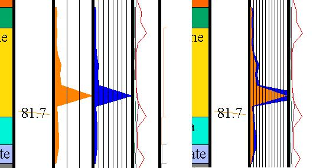

 |  Cumulative Graphs Creating a cumulative graph  
---|---  
  
# Creating a cumulative graph

A cumulative graph is one in which the data values in two columns are added together and presented as a pair of superimposed histograms or line graphs, with the first of the component values on top of the sum of the values.

To create a cumulative graph in a log plot, first ensure that the columns to be added are adjacent and of the same graphical type (i.e. either both line graphs or both histograms).

  1. Right-click a visible log and select Format Display to open the Log View Properties dialog.

  2. In the Columns in View window, use the Up and Down buttons to rearrange the columns such that the those of interest are adjacent to one another.

  3. Select the second of the columns of interest from the list.

  4. Click on the Graph/Color tab of the dialog then check the Cumulative Graph check box.

  5. Click on the Width/Margins tab then check the Overlap Previous Column check box.

  6. Choose Apply or OK.

The first column values will be displayed on top of cumulative value graph.

as it can be seen in the image below, the orange and blue graphs are added to form the cumulative graph on the far right.

