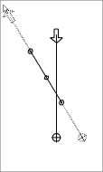
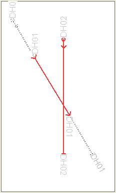
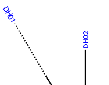
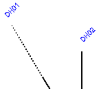
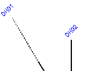
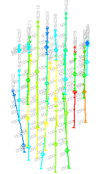

 |  Drillhole Traces Dialog Formatting the display of drillhole traces  
---|---  
  
# Drillhole Traces Dialog

### To access this dialog:

  * Formatting all loaded drillholes: From the Plots window, activate theManageribbon and selectFormat | Overlays The Dynamic/Static Drillholes tab is available at the top of the dialog.

  * Formatting a specific drillhole overlay: Activate theManageribbon and selectFormat | Overlays in the Plots window and select a static drillhole overlay using the Overlays tab. Select the Drillholes sub-tab and enable the Display Drillhole Traces check box. Click Format...

This tab is used to configure the display settings for both static and dynamic drillhole objects. Drillhole data can be displayed or hidden according to whether it is 'on-section' (the data for the drillhole lies within the same viewable zone as the current section view) or 'off-section' (data lies off of the current section view).

In addition, you can configure the colours, symbols, labels and line drawing styles used during drillhole display.

The preview panel on the right of the dialog shows the result of the currently selected display settings. In the following example, the red lines indicate the drillhole data that lies within the section view ('on-section') and the dotted lines represent the off-section data. Symbols have been used for collar positions, intersections and the end-of-hole positions:

The preview panel will be updated automatically when changes are made in this dialog.

Drillholes, Object Filters, Columns and Column Filters

Drillhole data objects are often coupled with 'downhole column' data to provide more information about the drillhole data. This could be in the form of a histogram, listed grade values, braces, bar charts etc. Downhole columns are formatted separately (using the [Format Column Display Dialog](<Format%20Column%20Display%20Dialog.md>)) from the actual drillhole data (which uses the Traces as Holes dialog).

View Filtering can be applied to any object in memory, including drillholes, to control the data that is displayed at any one time. This is controlled by a filter expression which can be defined by various methods, including the [Data Object Manager](<../COMMON/Data%20Manager%20Dialog.md>) or, to specifically filter drillhole data, using the [filter-drillholes](<../command_help/filter-drillholes.md>) command.

Drillhole segments and downhole columns will always honor this object-level filter. If data does not pass the filter, neither it nor the associated downhole column data will be shown.

However, the situation is slightly more complex where a 'column-specific' filter exists. All downhole columns can be associated with their own filter (using the [Filter tab on the Format Columns dialog](<Format_Column_Filter_Dialog.md>)). In this case, an aspect of the downhole column will only be shown if it passes both the object-level and column-level filters. For example; if a drillhole object was filtered in the Data Object Manager to only show data above the X value 150, only column and drillhole data would be shown above the 150 position. If an AU column was set to show results only where the grade surpasses the 1.0 grade cut-off point, downhole column data would only be shown above 150 in X and where grade values exceed 1.0 ppm.

Dialog Structure

The number of tabs shown on this dialog depends on whether the formatting you are applying relates to all loaded drillholes (using the Dynamic Drillholes tab) or to a specific drillhole object overlay (using the Dynamic/StaticDrillholes tab):

  * The Dynamic Drillholes tab is broken down into two sub-panels, Lines & Symbols and Labels.

  * The Static Drillholes tab, part of the Traces as Holes dialog, contains an additional tab - Color \- to allow you to select a legend to be used to display the selected overlay.

For more information on a particular tab, select a link from below:

  * Lines & Symbols

  * Labels

  * Color (overlay formatting only)

A description of all possible fields is shown below, and in all cases, you can click Apply to update the current section view with the new details, or OK to do the same, and dismiss the formatting dialog:

General Details:

The top section of the dialog shows the following fields:

Enable Drillhole Traces and Downhole Columns (Dynamic/StaticDrillholes Tab): this check box is used to control the overall visibility setting for columns and drillholes. If cleared, data will not be displayed, regardless of any further display settings.

Note that this field will not be displayed if drillhole traces are being formatted using the Traces as Holes dialog, which is used to format overlay-specific display settings for static drillholes.

Display Drillhole Traces: select this check box to control whether drillhole data is displayed. This option is only available if the Enable Drillhole Traces and Downhole Columns field is selected (see above).

Lines & Symbols Tab Details:

Selecting the Lines & Symbols tab reveals the following fields, used to set general display properties for static drillhole datas:

Holes Passing Section/All Holes: this check box is used to control the the display of drillholes with relation to the selected section view.

  * If the Holes Passing Section option is selected, drillhole data will only be displayed if it intersects or passes through the current section view. All other drillhole data objects will not be drawn.

  * If the All Holes option is selected, drillhole data will be displayed regardless of its relation to the section view. Note that you cannot select this option unless both On Section and Off Section fields are selected (see below).

If all holes currently pass through the section view, this setting will have no effect.

Note that although these options control which drillhole data is displayed, the resulting view is also subject to any clipping settings that may be applied. For more information on this, see [Clipping Data](<ClipView.md>).

On Section/Off Section: you can independently control whether data on- or off-section is drawn, and the display settings for each option. For each check box, the following fields are available:

  * Line style: select a drawing style for the drillhole trace using the drop-down list.

  * Thickness: use the spin buttons to specify a line thickness in pixels, or enter a value directly into the middle field.

  * Color: select a color using the displayed color picker utility.

Use Secondary Clipping: if you have specified secondary clipping limits (using Clipping Limits in the Design window), this option will allow these limits to be applied to the current section view.

Symbols: to enable the display of symbols for a particular part of the drillhole (and to choose which symbols to use for each key location), enable the relevant check box and then pick a pixel size using the supplied spin buttons, or by entering a value directly into the appropriate field. Then, select a symbol shape using the Pick Symbol drop-down list provided.

The full list of available symbol options are listed below (all options support the selection of a size and symbol type):  
  
Collar: indicates the collar position of the drillhole trace.

Section Plane Pierce Point: indicates the position at which the drillhole intersects with the currently defined section plane.

Section Corridor Entry and Exit: elect to apply symbols at the terminal points of the trace where they intersect with the clipping limits relevant to the section plane.

End-of-hole: indicate an end of hole position with this option. If this option is enabled, you are granted access to two additional controls; enable and use the drop-down list to choose which value to display - you can select any data column from the drillhole object in context.

The Distance From Section check box is used to display the real-world distance from the currently defined section plane to the end-of-hole position. If enabled, this information will either be shown in brackets after the end-of-hole value label (if active) or as a standalone value. You can define precisely how this text is aligned by clicking Configure. The configuration dialog allows you to set the rotation of the text to be either Parallel with the final drillhole segment, or at any custom Angle.

You can also use the Label dialog to specify the offset of the text from the drillhole axis. Click OK to update the preview and return to the Traces as Holes dialog.

 |  Governing bodies often require the inclusion of borehole warnings in the vicinity of the excavations. In order to represent those borehole warnings it is necessary to get from view plans the boreholes projections (entry, exit and pierce points) from a specified view definitions (borehole traces at specified radius - clipping limits - with entry point, pierce point and exit point).  
---|---  
  
Labels Tab Details:

The Labels sub-tab is used to control how drillhole labels are displayed, and the extent to which labelling takes place.

The first four components of the Labels tab are broken down into the following sections;

  * Collar

  * SectionEntry

  * Section Exit

  * End-of-hole

  * Depth Intervals

Each section contains 3 basic components:

Visibility Check Box: this check box determines whether a label will be displayed for the selected drillhole area.

Field Selection Drop-down List:When selected, a drop-down list is enabled allowing you to select a database column to use to define the value displayed.

The selectable values at this point will depend on how you arrived at the formatting screen:

  * If you accessed the drillhole formatting functions using the Static Drillholes tab of the Format Display dialog, You can select a value from any loaded drillhole definition table (assays, lithology etc.)

  * If your formatting is overlay-specific, using the Overlays tab of the Format Display dialog, you will be able to select any value from any data column associated with the drillhole object itself (LENGTH, A0, B0, C0 etc.).

 |  If a trace is to be labeled by a property which may have many values within the drillhole such as lithology or grade then certain rules are applied. Properties like lithology use the most plentiful criterion i.e. the lithology of which there is most not necessarily in a single continuous instance. Properties like grade are composited averages for the entire drillhole length.  
---|---  
  
Configure:click this button to show the Label Edit dialog, which can be used to set up how a label is displayed. The following fields are available:

Parallel/Angle: select one of these options to align your label parallel to the drillhole trace, or at a specific angle. If set to Angle, you can define the angle in degrees with which to display the label's value. The following image shows a parallel label setting in action:

Note how the angle of the label will vary according to the angle of the drillhole trace. If an Angle of 45 degrees is specified:

Note that all labels will be displayed at 45 degrees from a flat horizon - this setting is not relative to the display of the drillhole itself.

Centre: toggles if the label is aligned laterally with the centre of the drillhole trace. The image above shows a disabled Centre setting, hence the label start position is in line with the axis of the drillhole. If enabled, the label will be positioned equilaterally with the drillhole axis:

Position Offset: specify the distance (along the axis of the drillhole) that the label will be displayed from the origin point.

Depth Intervals: this option is available for the application of ticks along an entire downhole length, at predefined intervals. The associated annotation (to indicate depth values) is optional, but if present, can be configured with regards to font, alignment and orientation. This field is listed separately as, although it share identical configuration options with regards to the label (as described above), it also supports a Show Depth option. If enabled, the depth (Z value) will be shown for each interval indicator, e.g.:

  
  
Font: this global setting can be accessed for all currently active label components. This button will set a global font property for each selected label component. Clicking it will launch the Font dialog, used throughout your application to configure the font face, size and style for a particular context.

Color Tab Details:

The Color tab is only displayed if overlay-specific formatting is being applied, and is used to select the color of on- and off-section data, and optionally to specify a legend containing instructions to color data. The following fields are available:

On Section/Off Section: the following controls dictate how data that is shown either inside or outside of the section view limits is colored. To be able to edit the controls for each category of data, you must ensure that either the On Section and/or Off Section fields are displayed in the Lines & Symbols tab. The following controls are available for either on- or off-section data:

Fixed color: select a fixed color to be used to display the entire object overlay.

Color using legend: select this option to select a legend, and data column within the selected object that it will be applied to, using the Column and Legend fields below.

Legend/Column: these fields are only available if either (or both) of the On Section or Off Section categories above are set to Color using legend. Select a data column containing the values used to define a color, and a corresponding legend to define how each color will be chosen. You can also use the preview legend icon to show a key representing the selected legend. Clicking the Edit Legend icon will launch the Legends Manager to allow you to make changes to the legend.  
  
You can also create a default legend automatically for any selected column.

Note that, if any data values in the selected column cannot be matched to an interval, the currently selected Fixed Color (see above) will be used for on/off section data.  
  
For more information on using legends, please refer to your Legends online Help.

 |  Related Topics  
---|---  
| [Format Display Dialog](<../COMMON/Format%20Overlays%20Dialog.md>)[  
Format Display Dialog: Overlays](<../COMMON/format%20display%20dialog_overlays.md>)[  
Formatting downhole columns](<FormatHoleColumn.md>)