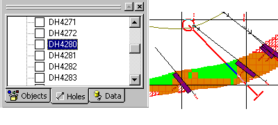

 |  Hole Selection Using the Holes control bar  
---|---  
  
# Hole Selection

The easiest way to select a hole by its identifier is from the Holes control bar.

Simply select the desired hole from the list and the current section or log view will be adjusted to contain the hole. In section views the selected hole is highlighted with a red line, e.g.:

 |  Related Topics  
---|---  
| [Selecting Samples](<SelectingSamples.md>)[  
Compositor Tool](<Composite_Tool.md>)