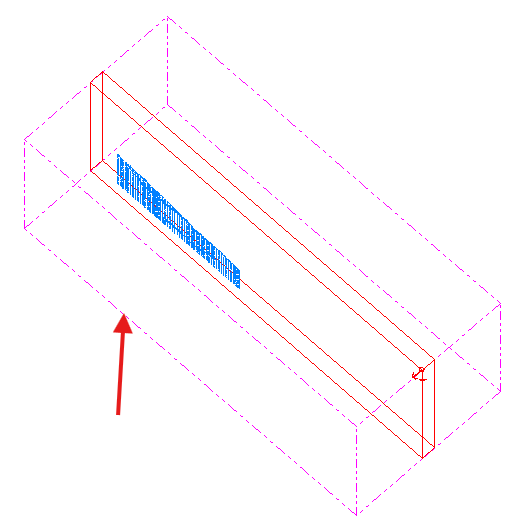

# Hull Properties  
  
To access this screen:

  1. Select a plot projection (**3D** type).

  2. Select a plot projection (**Plan** or **Section** type, with Only display in 3D views set to _No_).

  3. Display the [**Format Display**](<../COMMON/format%20display%20dialog_overlays.md>) screen using the "fdd" quick key combination.

  4. Select the **Hull Properties** tab.

**Note** : A hull string is shown in 3D-viewed projections by default. You can use this screen to make it appear in other axis-view-oriented projections.

The **Hull Properties** screen lets you format the appearance of the outer hull of a data object, optionally displayed.

;>)

A block model shown in section with a pink hull displayed

Settings relating to the size of the cuboid hull are read-only if **Fit to data** is set to _Yes_ , otherwise you can define your own cuboid using From and To coordinates for each axis. **Mid Point** and **Span** settings describe the centroid position and lengths of each side of the cuboid respectively, and are always read-only.

**Appearance** settings can be adjusted:

  * **Color**

  * Line Style 

  * **Hide** Use this to hide the hull in all projections.

  * **Only display in 3D views** _Yes_ by default, meaning a hull only appears in 3D-type projections (not aligned to a major axis). If set to _No_ , the hull can also appear in Plan View and Section projection types. See [Projection Overlay Types](<Projection%20Overlay%20Types.md>).

You can also choose whether to **share** data property changes with other instances of the same data in other logs, reports, tables, sheets and projections.

  * _Not shared_ Data changes are only represented in the target projection, log sheet, report or table.

  * _Within sheet_ Data changes automatically update all other instances of the data item within the plot sheet (all projections).

  * _Within document_ Data changes automatically update all other instances of the data item within all projections of all plot sheets.

Related topics and activities:

  * [Formatting Object Overlays](<../COMMON/Formatting%203D%20Objects.md>)

  * [Views, sheets and overlays](<../COMMON/concept_views%20sheets%20overlays.md>)

  * [Plot Sheet Templates](<PLOTS_Plot%20Templates.md>)

  * [Format 2D Drillhole Overlays](<../COMMON/Format%20Drillholes.md>)