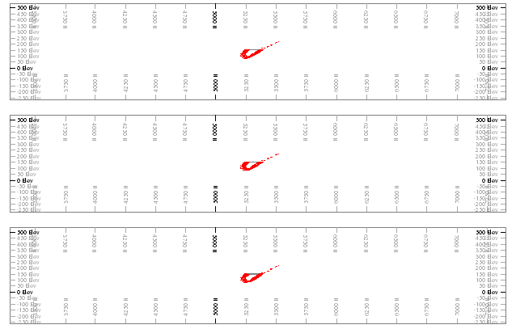
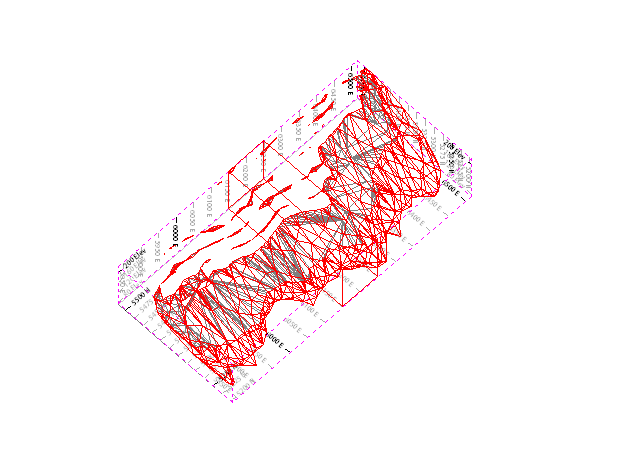
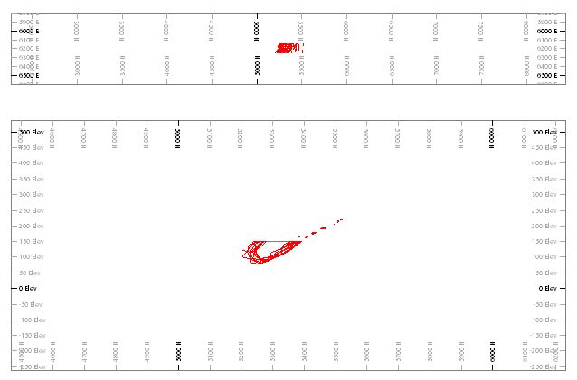

# Add a Sheet or Projection  
  
When you create a new plot sheet, you can automatically create a default projection. This projection will have a preset view direction. The projection will display data from the view direction specified.

See [Sections and Projections](<alignviewwithsection.md>).

### Create Sheets and Projections

To create a new plot sheet and projection with a preset view direction (3D window method):

  1. Display data in a **3D** window, as you'd like it to appear in a report.

  2. Run the command **[create-plot-view](<../command_help/create-plot-view.md>)**.

  3. Select either 2D (legacy) or 3D overlays.

  4. Click **OK**.

A new plot sheet with a 3D projection is created and displays.

To create a new plot sheet using the Sheets or Project Data control bar:

  1. In the **Sheets** or **Project Data** control bar, right-click the top-level **Plots** icon.

  2. Expand the **New Plot Sheet** menu.

  3. Pick one of the following:

     * _From Template_ Create a new plot sheet according to template data. See [Plot Sheet Templates](<PLOTS_Plot%20Templates.md>).

     * _Vertical Section_ Create a new sheet with a single projection showing a view of data in the north-south alignment.

     * _Plan_ As above, but create a plan view projection.

     * _Custom_ Choose a projection reset from the **[Plot Item Library](<plotitemlibrary.md>)**.

To create a new plot sheet and projection with a preset view direction (Plots window method):

  1. Display the **Plots** window.

  2. **Manage** ribbon **> > Sheets >> New Sheet**.

  3. Select a sheet creation option:

     * _From Template_ Create a plot sheet according to the contents of a **[plot sheet template](<PLOTS_Plot%20Templates.md>)**.

     * _Plan_ Create a plot sheet, viewing the data in plan view.

     * _Vertical Section_ Create a plot sheet, viewing the data in north-south view direction.

     * _Custom_ Choose from a list of preset plot layouts:

       * _3 Parallel Sections_ Create a plot sheet with 3 horizontal projections, like this:

;>)

       * _3D Projection_ Create a plot sheet with a single projection showing data at an oblique angle:

;>)

       * _Linked Replica_ Create one or more plot sheets with linked components. See [Linked Replica Wizard](<linked_replica_wizard_dialog.md>).

       * Plan ProjectionCreate a new plot sheet with a plan projection.

**Note** : You can also do this using the **Manage** ribbon's **Insert >> Sheet >> Plan** command.

       * _Projection Wizard_ Create a plot sheet following the steps of the **[Projection Wizard](<Projection_Wizard_Dialog.md>)**.

       * _Vertical Section_ Create a new plot sheet with a north-south projection.

       * _Vertical Section & Plan_Create a two-projection plot sheet with a projection showing a vertical view direction above a plan projection, for example:

;>)

To add a new projection to an existing plot sheet (right-click sheet method):

  1. Enable [Page Layout](<PageLayoutMode.md>) mode.

  2. Display a plot sheet (with or without existing projections).

  3. Right-click the border of the plot sheet.

  4. Select **Insert**.

The **[Plot Item Library](<plotitemlibrary.md>)** displays.

  5. Select one of the following:

     * 3 Parallel Sections

     * 3D Projection

     * Plan Projection

     * _Projection Wizard_. See [Projection Wizard](<Projection_Wizard_Dialog.md>).

     * Vertical Section

     * Vertical Section & Plan

A new projection is added to the existing sheet.

To add a new projection to an existing plot sheet (Manage ribbon method):

  1. Enable [Page Layout](<PageLayoutMode.md>) mode.

  2. Display a plot sheet (with or without existing projections).

  3. **Manage** ribbon **> > Sheet Layout >> New Projection**.
  4. Select one of the following:

     * _Plan View_ Add a projection to the sheet showing a plan view direction.

     * _Section_ Add a projection that uses the currently active section to determine the view direction (it will be orthogonal to that).

     * _3D_ Add a projection showing data at an oblique angle (_Azimuth_ = 45, _Dip_ = 60).

A new projection is added to the existing sheet.

To add a new sheet by copying another one:

  1. Enable [Page Layout](<PageLayoutMode.md>) mode.

  2. Right click the outer border of a plot sheet.

  3. Select **Copy**. 

  4. In the **Sheets** or **Project Data** control bar, right-click the top-level **Plots** icon.

  5. Select **Paste**.

A copy of the original plot sheet is created and displays.

Related topics and activities

  * [Custom Sections](<CustomSections.md>)

  * [Align section](<alignsection.md>)

  * [Sheet and View Properties](<SectionViewProperties.md>)

  * [Master Sections](<MasterSection.md>)

  * [Page Layout Mode](<PageLayoutMode.md>)

  * [Projection Wizard](<Projection_Wizard_Dialog.md>)

  * [Linked Replica Wizard](<linked_replica_wizard_dialog.md>)