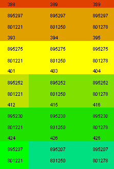

 |  Labelling Objects Labeling 3D Objects  
---|---  
  
# Labeling 3D Objects

Choose the Labels tab on the [Format Display](<../COMMON/Format%20Overlays%20Dialog.md>) dialog to annotate 3D objects with up to 12 data values. Controls are provided for text formatting and applying color legends.

For more information on adding labels to 3D objects, see [Format Display Dialog: Labels](<../COMMON/Format%20Display%20Dialog_Overlays_Labels.md>).

|  Related Topics  
---|---  
| Importing 3D objects[  
Formatting 3D objects](<../COMMON/Formatting%203D%20Objects.md>)[  
Format Display Dialog: Labels](<../COMMON/Format%20Display%20Dialog_Overlays_Labels.md>)[  
Format Display Dialog: Label Item Format](<../COMMON/Format%20Display%20Dialog_Label%20Item%20Format.md>)