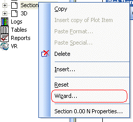

 |  Log / Section Wizard Using the Log/Section wizard  
---|---  
  
# Log / Section Wizard

This wizard is used to define the 'top-level' settings for a section, and can be accessed by right-clicking a section description in the Sheets control bar and selecting Wizard..., e.g.:

 |  With regards to the Plots window (and to a lesser extent, the Logs window), much of the hierarchical structure of a particular sheet can be stored in template form. This minimizes the effort required to generate a consistent look and feel across a range of presentation projects by automatically generating a standard arrangement of sheets, projections and, if required, data object overlays. [Find out more about Plot Templates...](<PLOTS_Plot%20Templates.md>)  
---|---  
  

The procedure for using this wizard is:

  1. Select a page size from the displayed list.

  2. Click Next.

  3. Select a Landscape or Portrait orientation.