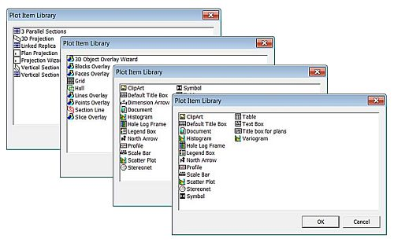

# Plot Item Library  
  
To access the Plot Item Library:

  * In the Sheets or Project Data control bar, right-click on Plots, select New Plot Sheet >> Custom.

  * In the Sheets or Project Data control bar, Plots folder, right-click on a sheet, projection or overlay, select Insert.

  * In the Plotsor Logs window, right-click on a sheet, select Insert (Page Layout Mode).

  * In the Plots window, right-click on a sheet, select Insert >> Locatable Plot Item (Normal Mode).

Note: You can also add specific plot items to your sheet using the Manage ribbon's Plot Items command group.

The **Plot Item Library** (PIL) provides tools to let you assemble a plot. The contents of the library will depend on the currently selected plot data.

For example, if the outer boundary of a plot sheet is selected, and the PIL is displayed, everything that can be added to a plot sheet is available. Including plot projections, sections and plot items such as north arrow, title box and so on. If a project is selected, the contents relate to projection items only (and the list is a bit shorter).

;>)

Plot Item Library examples

As such, the Plots window supports the concept of 'child' and 'parent' objects; some plot items are reliant on parent objects - such as a North Arrow, for example; a North Arrow must be associated with a projection in order to 'know' where to point. In this situation, plot items are added by inserting them at the correct layer of the Plots window hierarchy. See [The View Hierarchy](<../COMMON/View%20Hierarchy.md>)

When inserting plot items using the Sheets control bar's right click menu it is useful to remember that any plot items that relate to a particular projection (for example, a title bar that will list the description of a projection) should not be added at the Sheets level or above, instead, they should be added by right-clicking the relevant Projection folder and selecting Insert.

## Plot Item Ribbons

Highlighting a plot item anywhere on a plot displays a dedicated ribbon containing various options for resizing, formatting and managing the contents of the target. All commonly-used properties can be accessed here and is generally the most convenient option for configuring plot items.

The options that appear depend on what you select. For example, selecting a [Title Box](<TitleBlock.md>) plot item displays a ribbon to let you manage the arrangement of cells within it, whilst selecting a **[North Arrow](<NorthArrow.md>)** item displays a different set of controls to determine the arrow's appearance:

;>)

The Title Box ribbon

;>)

The North Arrow ribbon

**Note** : To return to more general plot management functions, activate the **Manage** ribbon. Plot item ribbons only display for as long as the plot item is selected.

**Note** : Deselect a plot item by holding <CTRL> and left clicking it.

Related topics and activities

  * [3D Overlays](<3D%20Overlay%20Concept.md>)

  * [Title Box Plot Item](<TitleBlock.md>)

  * [Dimension Arrows](<Dimension_arrows.md>)

  * [Text Box Plot Items](<TextBox.md>)

  * [Legend Boxes](<legendbox.md>)

  * [Plot Tables](<Inserttable.md>)

  * [Clip Art](<ClipArt.md>)

  * [North Arrow Plot Item](<NorthArrow.md>)

  * [Scale Bars](<ScaleBar.md>)

  * [Downhole Column Contents Dialog](<columnslistplotitem.md>)

  * [Locatable Plot Items](<Locatable%20Plot%20Items.md>)

  * [The View Hierarchy](<../COMMON/View%20Hierarchy.md>)