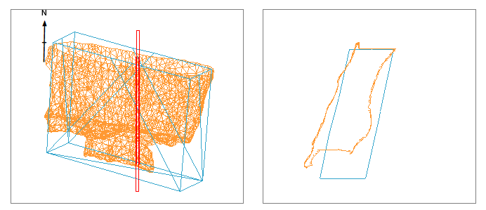

# Section Line

To insert a section line overlay into a 2D projection:

  * In the **Sheets** or **Project Data** control bar, right-click a projection's overlays folder and click **Insert**. Pick _Section Line_ and click **OK**.

A section line is a way of indicating the position of the currently active section in a projection. See [Sections and Projections](<alignviewwithsection.md>).

A section can be used to orient the view of a projection, but can also be viewed from any angle to indicate the position of, say, a cross section of data displayed in another projection, like this example, showing the cross section of a surveyed and design stope wireframe for the purposes of reconciliation:

;>)

The section line (shown in red) is a standalone plot item, and has its own properties, independent of the data it transects and (if one is displayed) a 3D section. The section line always aligns with the currently active section. 

Whilst the base section properties (orientation, clipping and so on can be managed using the **[Section](<alignviewwithsection.md>)** ribbon and the [Projection Properties](<projection%20properties.md>) screen, a _section line_ is a standalone plot item. It is actually the legacy representation of a section in a projection (the newer [3D projection overlays](<Projection%20Overlay%20Types.md>) can display a 3D section plane using the same technology as the **3D** window).

### Section Line Properties

The following properties appear on the **Section Line** screen and in the **Properties** control bar if a section line is selected:

General  
---  
Name | This is always "Section Line"  
Share |  Choose if the section line should be available in other projections:

  * _Not Shared_ The section line will not appear in any other projection.
  * _Within Sheet_ The section line can appear within any projection of the current sheet, if the view direction permits it.
  * _Within Document_ The section line can appear within any projection of any plot sheet, if the view direction permits it.

  
Appearance  
Show all sections | Only relevant if a section definition table is loaded, in which case, _Yes_ means a section line is drawn for all sections in the table. _No_ means only the active section line is drawn.  
Colour | Pick a section line colour.  
Line Style | Choose the style of line.  
Hide | Toggle the visibility of the section line. You can also do this using the **Sheets** or **Project data** control bar.  
Only display in 3D views | If _Yes_ , a section line is only drawn if the view is not aligned to the section (meaning a "3D projection"). If _No_ , the section line is drawn in all projections where the view direction permits it.  
Limits  
Fit to data | If _Yes_ , the section cuboid wraps around the outer hull of all displayed data. If _No_ , the remaining settings on the screen determine the display format.  
X From/To | Set the minimum and maximum extents in X for the section line cuboid.  
Y From/To | As above, but for the Y axis range.  
Z From/To | As above, but for the Z axis range.  
Mid Point  
X/Y/Z Mid | Choose the mid point in world coordinates for the section's mid point. By default, this equates to the mid point of displayed data.  
Span  
X/Y/Z Span | Adjust the dimensions of the section line cuboid. This adjusts the corresponding From and To locations equally to fit the new size.  
  
Related topics and activities

  * [Projection Overlay Types](<Projection%20Overlay%20Types.md>)

  * [Sections and Projections](<alignviewwithsection.md>)

  * [Section Definition](<CustomSections.md>)

  * [Projection Properties](<projection%20properties.md>)

  * [Clipping Plots Data](<ClipView.md>)

  * [Plot Items](<LogPlotitems.md>)

  * [3D Sections](<../VR_Help/Sections.md>)