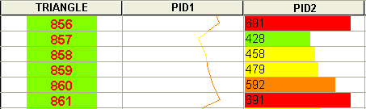
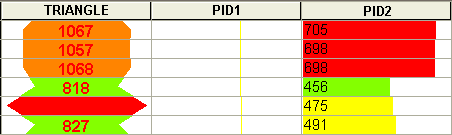

 |  Table Dialog How to use the Table dialog to format, sort, filter and use hole sets.  
---|---  
  
# Table Filter/Sort Dialog

### To access this dialog:

  * In the Plots window, double-click a Table plot item or,

  * In the Sheetscontrol bar,Tablesfolder, right-click a table, selectSort,FilterorFormat.

 | The same dialog is used to format and filter both Plot Sheet, Table plot items and tables listed in the Sheets control bar, Tables folder.  
---|---  
  
This dialog is used to format, sort, filter and use hole sets for managing the selected table's data. This dialog comprises four tabs:

  * Columns/Contents: used to configure the display method used for data within a table. [More...](<Format%20Column%20Display%20Dialog.md>)

  * Define Index: this is used to sort the contents of the current table and is also accessed using the Table | Sort... command. More...

  * Filters: filter data in the current table with this command. This tab is also displayed when the Table | Filter... command is selected. More...

  * Hole Set: here you will see the different hole sets added to the project and the individual holes. [More...](<Format%20HoleSetDialog.md>)

 | The Hole Set tab is only available for drillhole related tables.  
---|---  
  
Define Index Tab Details:

This tab is used to specify the sort criterion (or criteria) for the selected column. You can specify one or more columns as index values. For example, to sort borehole sample data in descending order of the borehole ID, followed by an gold grade value, you would specify the ID as the first index, and the grade as the second value in the Index list, and select the Descending order check box.

Columns: displays a list of all available properties associated with the active table (which are not currently used as sort values).

You can make a column an index item by moving it to the Index list by highlighting the required property and using the > button. If items already exist in the index list, the new value will be added to the bottom of the list (although this can be changed - see below).

When an item is moved to the Index list, it is removed from the Columns list.

Index: shows a list of all values currently used to sort the table. You can change the order of the indices displayed by selecting a sort criterion and promoting it or demoting it in the list using the up and down arrow buttons.

The primary sort criterion is shown at the top of the list, and data is sorted according to items progressively lower in the list. For example, the following image shows a table representing the TRIANGLE, PID1 and PID2 values for a wireframe object, sorted in order of TRIANGLE-PID1-PID2 (each table column is represented by a different column display format - for more information on changing the format of table data, see Related Topics):

By changing the index order to PID1-TRIANGLE-PID2, the columns are sorted as follows:

Unique Index: if selected, only the first instance of any index (or index combination if more than one value is used) will be displayed in the resulting table. For example, in the top image, two PID2 values of '691' exist. If the only index value was PID2, and this check box was selected, the row corresponding to the TRIANGLE value of '861' will not be shown. However, if both TRIANGLE and PIDS are specified as sort criteria, both rows will be shown as the combination of indices would be unique.

Descending Order: by default, columns are sorted in ascending order, according to index values specified. Selecting this check box will sort all table columns in descending order.  

Filters Tab Details:

The Filters tab is used to streamline the contents of a table, according to specific expressions. For example, you may wish to include all borehole sample data below a minimum grade cut-off point, or only include data from boreholes with a specific borehole ID prefix.

The following fields are available:

Filters: this list shows all currently applied filters for the current table.

Add: displays the [Table Filter Expression](<Table%20Filter%20Expression%20Dialog.md>) dialog, which allows you to define a filter expression to be applied to the current table. For example, TRIANGLE < 100 will show wireframe data table rows up to a TRIANGLE value of 99.

Edit: displays the [Table Filter Expression](<Table%20Filter%20Expression%20Dialog.md>) dialog to edit the currently selected filter expression.

 | ClickApplyto update the current table with the latest filter expression list.  
---|---  
  
Delete: delete the selected filter from the list.

 |  Related Topics  
---|---  
| [Format Column Display Dialog](<Format%20Column%20Display%20Dialog.md>) [Formatting Hole Sets](<HoleSets.md>)