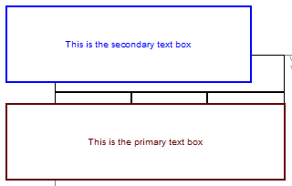
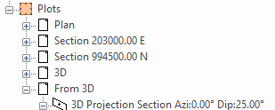

# Text Box

To access this screen:

  * Double click a **[text box](<TextBox.md>)** on a plot sheet.

  * Right click a text box and select **Text Box Properties**.

This screen is used to format a [text box plot item](<TextBox.md>) on a plot sheet.

The following tabs are shown:

  * Text Box PropertiesAll editable title box properties are shown here. See below.
  * **Alignment** Control the alignment of text within the text box. See below.
  * Drawing OrderUsed to determine at which point in the screen drawing process the current item is drawn to the screen. See [Drawing Order](<Format_Drawing_Order_Dialog.md>).

### Sharing Text Box Properties

Sometimes, for consistency, you want multiple plot items on the same sheet to share the same characteristics. This could be visual formatting, for example, so you can make more general changes to the appearance of your plot report without having to adjust multiple plot item properties.

To achieve this, use **Share Properties**. First, decide on the items that will share properties, then choose which properties to share. 

Consider the following example, where two text boxes exist on a plot sheet. They both (intentionally) have different colouring and text contents, but they would look better if they were the same width:

To make these text boxes (always) have the same width:

  1. Display the [**Properties**](<../COMMON/properties%20control%20bar%20overview.md>) control bar.

  2. Display the **Plots** window and the plot sheet containing the text boxes.

  3. Define the extent of sharing permitted for the current project. This is done by setting the **Share** property on the **Overlays** object of the projection:

     1. Display the **Sheets** or **Project Data** control bar.

     2. Expand the **Plots >> [Plot Sheet Name] >> [Projection Name]** folders, for example:

     3. The projection group (regardless of whether it is a 2D or 3D projection type) will contain an **Overlays** entry.

     4. Right-click the **Overlays** item and select **Overlays Properties**.

The **Overlays** screen displays.

     5. Ensure the Share value is _Within Sheet_. 

**Note** : You can also share text box information with other plot sheets using the _Within Document_ option.

  4. Select the primary text box.

The properties of the plot item display in the **Properties** control bar.

  5. In the **Properties** control bar, expand the **Sharing** group.

  6. Change **Share Properties** to _Yes_.

  7. Add a unique value to **Set ID**. This ID is used to link text boxes on the sheet, so won't be unique for long.

  8. Change the Width setting to _Yes_.

  9. Ensure all other settings are set to _No_.

  10. Click into the secondary text box.

  11. In the **Properties** control bar, expand the **Sharing** group.

  12. Change **Share Properties** to _Yes_.

  13. Add a unique value to **Set ID**. This ID is used to link text boxes on the sheet, so won't be unique for long.

  14. Change the Width setting to _Yes_.

Both text boxes are now the same width, and adjusting one will automatically adjust the other.

### Text Box Properties

The following settings can be applied to text boxes using the **Text Box** screen:

Text Box Properties Tab  
---  
Fit Text to Box | Expand or contract the text in the text box to fill all available space. If this is checked, **Fit Box to Text** cannot be checked (see below).  
Fit Box to Text | Snap the text box to fit the existing text size. This can be used instead of **Fit Text to Box** (see above).  
Width | Specify the width of the text box in mm. You can use the spin buttons or type a value directly into the field.  
Height | Set the height of the text box in mm.  
Font... | Displays a font picker to set the font face of the text contained within the current text box.  
Colour | Set the colour of all text box elements, including borders and text.  
Opaque | Determines whether the unfilled parts of the text box are opaque or transparent.   
Border | Toggle the display of the check box border.  
Strikeout | Toggle the use of strikethrough font within the text box.  
Underline | Toggle the use of font underlining.  
Contents |  The text to be displayed. **Tip** : Press CTRL and ENTER to add a line feed.  
Alignment Tab  
Horizontal | Choose _Left_ , _Right_ or _Centre_ alignment.  
Vertical | Choose _Top_ , _Middle_ or _Bottom_ alignment.  
  
**Note** : A complete list of text box plot item properties is accessible using the **[Properties](<Symbol-properties.md>)** control bar.

Related topics and activities

  * [Text Box Plot Items](<TextBox.md>)

  * [Text Box Properties](<Text-box-properties.md>)
  * [Plot Items](<LogPlotitems.md>)
  * [Plot Item Library](<plotitemlibrary.md>)

  * [Drawing Order](<Format_Drawing_Order_Dialog.md>)