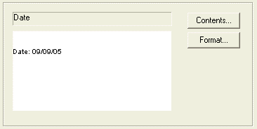

 |  Log Header/Footer Frame Properties An explanation of fields and properties  
---|---  
  
# Log Header/Footer Frame Properties

This dialog is used to describe and define the properties of a Log Sheet Header Box or Footer box, and contains the following tabs:

  * Header: define the information to be displayed within the log header (see below)

  * Footer: define the information to be displayed within the log footer (see below)

  * Frame Properties: define how the frame of this plot item is to be displayed. [More...](<title%20box%20properties%20dialog.md>)

  * Drawing Order: used to determine at which point in the screen drawing process the current item is drawn to the screen. [More...](<Format_Drawing_Order_Dialog.md>)

 |  As with any scalable plot item, you can edit dimensions by entering Page Layout Mode (toggled with theManageribbon andLayout | Layout Mode) and dragging the resize boxes on screen. When resizing a plot item:

  * By default, objects will 'snap' to neighbouring items to allow you to align things more easily. You can override this behaviour by holding down the <CTRL> key during resizing.
  * You can maintain the aspect ratio of a plot item by holding down the <SHIFT> key during resizing using one of the corner sizer bars (using one of the central bars will automatically alter the aspect ratio regardless).

  
---|---  
  
Contents Details:

Row: used in conjunction with the Cell field (see below) this setting allows you to activate a particular cell within the plot item. Select a row number from the drop down list and the cell contents pane at the bottom of the dialog will update to show the information currently assigned to that row/cell combination. You can, if you wish Insert a row, or Delete a row using the buttons in this area.

Cell: select a cell number from the drop down list. The contents of the row/cell combination will be displayed at the bottom of the dialog. You can insert or delete a cell into the selected row using the buttons to the right of the Cell field.

Cell Contents Area: the contents of the currently selected row/cell are displayed in this area. The value associated with the data is shown in the text field at the top, and the actual contents are shown at the bottom e.g.:

You cannot modify the contents of this area directly, instead, click Contents to display the [Cell Contents](<cell%20contents.md>) dialog. This will allow you to select a data type from a selection list, or enter custom text.

You can also change the way the text is displayed by clicking Format... This displays the [Cell Format](<cell%20format%20dialog.md>) dialog.

 |  Related Topics  
---|---  
| [The Cell Contents dialog](<cell%20contents.md>)[  
The Cell Format dialog](<cell%20format%20dialog.md>)[  
The Log Frame Properties dialog](<title%20box%20properties%20dialog.md>)