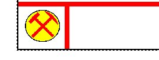
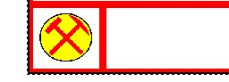

# Title Box Properties  
  
To access this screen: 

  * Double-click the exterior border of a [title box](<TitleBlock.md>) on a plot sheet.

  * Right-click a title box plot item and select Properties.

Set the formatting of a [title box plot item](<TitleBlock.md>). 

  * PropertiesAll editable title box properties are shown here. See below for more information.
  * Drawing OrderUsed to determine at which point in the screen drawing process the current item is drawn to the screen. See [Drawing Order](<Format_Drawing_Order_Dialog.md>).

Changes are applied automatically to the target plot item when changed. 

**Note** : Many of the formatting options below are also available on the **Title Box** ribbon, and via the **[Properties](<../COMMON/properties%20control%20bar%20overview.md>)** control bar.

Appearance  
---  
Border |  Choose if the title box has a visible external border. This setting only applies to the outer boundary of the entire title box.  
Border Colour | Set the colour of the outer border of the plot item.  
Border Cell Width | Set the width of the outer border of the plot item.  
Inner/Outer Cell Borders |  Enable or disable the internal and/or external cell borders. For example, the following image shows disabled Outer Cell Borders but enabled Inner Cell Borders:  With both borders enabled:    
  
Cell Border Colour | Control the color of the interior cells of the title box, if they are displayed.  
Cell Border Width | Set the width of interior cell borders within the plot item. This applies to the interior boundaries of all cells.  
Cell Margins | Choose if cell 'padding' is used within a cell to introduce white space around the cell contents.  
Cell Margin Width | If Cell Margins (see above) are used, the width of those margins (for all sides of the cell).  
Cell Contents Colour | For cell contents that have a colour, choose the default colour here. This applies to all items that don't have a custom colour.  
Visible | Is the control visible or hidden?  
Opaque | Can you 'see through' the unfilled parts of the cell or not.  
Font  
Font | The font face, for example, Arial.  
Height | The height of the font in points.  
Bold | Make text elements **bold**.  
Underline | Make text elements _underlined_.  
Italic | Make text elements _italicized_.  
Position  
X | The distance, in mm, from the left side of the plot item to the left side of the plot sheet.  
Y | The vertical distance from the top of the plot sheet to the top of the plot item.  
Width  | The overall width of the plot item.  
Height | The overall height of the plot item.  
  
For more information on the following settings, see [Locatable Plot Items](<Locatable%20Plot%20Items.md>).

Location  
---  
Has Location | Is this a locatable plot item or not?  
Location Type | Only displayed if **Has Location** = Yes, set if the location is represented by a fixed point in 3D space (_Point_) or as a 3D line intersecting with other projections in 3D space (_Line_).   
Plot Position | Determines how the plot item is positioned in relation to its associated location, either as a _Fixed_ or _Relative_ position.   
Show Connector | If the plot item is located, and this is set to "Yes", an arrow connects the plot item to the associated position on the current plot. If set to "No" the arrow is not displayed.  
Line Width | If a connector is displayed, this is the width of the arrow.  
Arrow Size | If a connector is displayed, this is the width of the arrow head.  
Line Colour | The colour of a connector line, if one is displayed.  
Location Point 1 (if Has Location = _Yes_)  
X/Y/Z | The absolute position of the locator point in 3D space, or the first point of the line if the **Location Type** = _Line_.  
Location Point 2  
X/Y/Z | If **Location Type** = _Line_ , the world coordinates of the end point of the location line in 3D space.   
  
Related topics and activities

  * [Title Box Plot Item](<TitleBlock.md>)

  * [Locatable Plot Items](<Locatable%20Plot%20Items.md>)

  * [Properties Control Bar](<../COMMON/properties%20control%20bar%20overview.md>)

  * [Drawing Order](<Format_Drawing_Order_Dialog.md>)