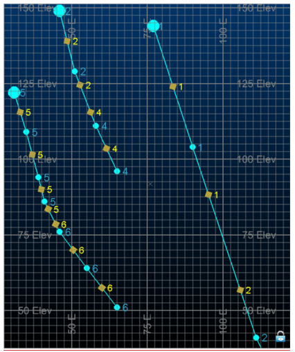

# ANISOANG Process  
  
To access this process:

  * **Model** ribbon **> > Dynamic Anisotropy >> Angles**.
  * View the **[Find Command](<../COMMON/findcommand.md>)** screen, select **ANISOANG** and click **Run**.

  * Enter "ANISOANG" into the [Command Line](<../COMMON/Command_Toolbar.md>) and press <ENTER>.

See this process in the [Command Table](<../command_help/_COMMAND%20TABLE_A.md#ANISOANG>).

## Process Overview

**Note** : This is a _superprocess_ and running it may have an effect on other Datamine files in the project.

The processes [ESTIMA](<estima.md>) and [COKRIG](<cokrig.md>) include a dynamic anisotropy option that allows the rotation angles for the search ellipsoid to be defined individually for each cell in the model so that the search ellipsoid is aligned with the axes of mineralisation. This therefore requires the rotation angles to be interpolated into the model cells which in turn requires a set of angles as the input data file for interpolation. 

**Note** : ANISOANG can work with both rotated and unrotated input data and can handle inputs of any rotation type.

See [ANISOANG Workflow](<../z-Release-notes/RM-Release-notes/Version-specific-Notes/RM%202.0%20ANISOANG%20Workflow.md>).

The **ANISOANG** process is designed to assist you to create a suitable input data file, and offers two methods for defining the dip and dip direction of the major axis of anisotropy:

  * Digitising strings in plan and section.
  * Calculating the angles from wireframe triangles.

If sections are used and are oriented in the dip direction then the output **POINTS** file will contain the true dip of the mineralisation. If sections are not oriented in the dip direction then the output POINTS file will include the apparent dip. The apparent dip should then be interpolated into the model and process [APTOTRUE](<aptotrue.md>) used to convert to the true dip.

Further information and examples are available in the Dynamic Anisotropy User Guide, and **[a worked example of ANISOANG](<../STUDIO_RM/ANISOANG_Example.md>)**.

### **Plan Strings**

File PLANSTR contains strings digitised in a horizontal plan which can be used to define the strike, and the true dip direction is then calculated as 90o or 270o from strike. Alternatively the plan strings can represent the true dip direction, but this would not be the usual case. Parameter **PLANMODE** is used to define what the strings represent. The direction in which the strings are digitised is important. If the azimuth of a string segment, measured from point N to point N+1, is Ao and **PLANMODE** =1 or 2 then the true dip direction is calculated as A+90o or A+270o from strike. The XYZ coordinates of the mid-point of the string segment will be written to the output **POINTS** file together with the strike and true dip direction angles.

### **Section Strings**

File **SECTSTR** contains strings digitised in vertical sections to define the dip. If parameter **SECTMODE** is set to 2 then the sections are oriented in the dip direction and so the dip will be the true dip of mineralisation and the orientation of the section line will be the true dip direction. Both these angle will be written to the output **POINTS** file together with the coordinates of the mid-point of the string segment. If **SECTMODE** is set to 1 then the sections are not oriented in the dip direction and so only the apparent dip can be calculated. In this case the sections must be parallel, so that they all have the same apparent dip direction. The apparent dip angle can then be interpolated into the model and process **APTOTRUE** used to convert from apparent to true dip. The direction in which the strings are digitised is important as the dip is measured for each string segment from point N to point N+1. 

### **Wireframes**

If parameter **TRIPTS** =1 the dip and dip direction of each triangle in the wireframe is calculated and written to the output **POINTS** file together with the coordinates of the centre of gravity of the triangle. The calculated angles are assumed to represent the true dip and true dip direction of the mineralisation. Calculating the angles from a wireframe is particularly suitable for narrow seams where the mineralisation follows the hangingwall and / or footwall, but is not so appropriate for massive deposits or narrow veins of irregular shape.

Input from wireframes and digitised strings can be used together. However in this case the string sections must be oriented in the dip direction so that true dip and true dip direction angles are calculated by both methods. All output is written to the single **POINTS** file.

### **ZONE Field**

ZONE is an optional attribute field (numeric or alphanumeric) in input wireframe triangle file that is used to identify individual solid models, optional attribute field in variogram model or optional attribute field in search parameters. The field is assigned to points in the output POINTS file. 

If ZONE values between **WIRETR** and **VMODEL** or **WIRETR** and **SRCPARM** match then a matching rotation is used for determining the dynamic **ANGLE3** field. **SREFNUM** or **VREFNUM** is used for identifying a rotation for unmatched data.

### Attribute Fields

Attribute fields can be used to assign fields from the **PLANSTR** and **SECTSTR** files to the **POINTS** file. The attribute fields can then be used as Zone fields when the angles fields are estimated into the block model. The allows the estimates to be made in a single run of **COKRIG** or **ESTIMA**.

A set of up to 5 attribute fields can be defined for each point in the plan and section string files. If attributes are not defined then the orientation of each string segment is calculated and the angles are assigned to the mid-point of each segment and saved to file **POINTS**. If attributes are defined and the values of each attribute are the same at either end of a segment then the attribute values and angles are assigned to the mid-point of the segment. If one or more attributes do not have the same value at either end of the segment then the segment is split in half and the mid-point of each half segment is assigned the attributes of the nearer of the two segment ends. The half segment mid-points are also assigned the angle values.

The graphic below illustrates the assignment of attribute fields. Three strings from a **SECTSTR** file are coloured cyan. Each point in each string is annotated with numeric attribute value A1. Attribute values coloured brown are written to the **POINTS** file.

Two segments are displayed for the string on the right side of the graphic. The top and bottom of the first segment have A1 values of 1 so the top point will also have an A1 value of 1 (in brown). The second segment has an A1 value of 1 at the top and 2 at the bottom. As the A1 values are different the segment is split into two. The top half segment has an A1 value of 1 at its centre and the bottom half segment has an A1 value of 2 at its centre. The angles and attribute(s) of both points are written to the **POINTS** file.

The five symbolic fields PLNFLDi, i=1,5, will select attribute fields from the **PLANSTR** file. They will also select attribute fields with the same field name from the **SECTSTR** file. Similarly the five symbolic fields SCTFLDi, i=1,5, will select attribute fields from the **SECTSTR** file. They will also select attribute fields with the same field name from the **PLANSTR** file. It does not matter if an attribute field is selected twice.

### **Output Points File**

The output **POINTS** file includes coordinate fields **XPT** , **YPT** and **ZPT**. It also includes a subset of four fields as shown in the table:

Field Description |  True Dip  
Direction |  True Dip |  Apparent  
Dip  
Direction |  Apparent  
Dip  
---|---|---|---|---  
Field Name |  TRDIPDIR |  TRDIP |  APDIPDIR |  APDIP  
Wireframe |  |  |  |   
Plan |  |  |  |   
Sections in dip direction |  |  |  |   
Sections not in dip direction |  |  |  |   
  
If parameter ADDSYMB=1 then a set of symbol fields are added. These have the reserved field names for displaying 3D symbols in a **3D** window.

SYMBOL| Symbol code. The symbol is selected by parameter **PLANSYMB** for points created from plan strings, **SECTSYMB** for points created from section strings and **WFSYMB** for points created from wireframe triangles. Codes range from 201 to 267 which are shown in the graphic.  
  
---|---  
COLOUR| Colour of SYMBOL. This is defined by parameters **PLANCOL** , **SECTCOL** and **TRICOL**.  
  
DIPDIRN| Field used to define the dip direction of the 3D SYMBOL. This is set equal to **TRDIPDIR** or **APDIPDIR** depending on whether true or apparent dips have been calculated.  
  
SDIP| Field used to define the dip of the 3D SYMBOL. This field is set equal to **TRDIP** or **APDIP** depending on whether true or apparent dips have been calculated. For plans string data SDIP is set equal to 0 (horizontal).  
  
SYMSIZE| Size of the symbol in mm as defined by parameter **SYMSIZE**.  
  
DAANGLE 1/2/3| Additional fields provided if the **ROTATION** input is specified. Angles represent rotations around ZXZ.  
  
If one or more Attribute fields have been defined then the following two fields will be included in the POINTS file:

PT_TYPE Point Type. This defines the source of the Point values:

  * PLAN_1 single segment in PLANSTR file
  * PLAN_2 first half segment in PLANSTR file
  * PLAN_3 second half segment in PLANSTR file
  * SECT_1 single segment in SECTSTR file
  * SECT_2 first half segment in SECTSTR file
  * SECT_3 second half segment in SECTSTR

COLOUR1 Colour field corresponding to PT_TYPE:

  * \- 2 (PLAN_1), 3 (PLAN_2), 4 (PLAN_3), 5 (SECT_1), 6 (SECT_2), 7 (SECT_3)

#### Using Search Parameters or a Variogram Model as Inputs

If either a search volume parameters (**SRCPARM**) or variogram model (**VMODEL**) input are chosen (if both are selected, **SRCPARM** is used), an additional field is output - **ANGLE3** which may be used in dynamic anisotropic calculations as a rotation around Z-X-Z (3-1-3).

  * If **SRCPARM** is specified, search distances must be listed in the input file in ascending order, for example, DIST1 > DIST2 > DIST3).

    * If a search volume parameter file is specified, it must include a field **SREFNUM** which defines a unique reference number for each search volume. The **SREFNUM** parameter then defines which search volume will be used. If the **SREFNUM** parameter is set to absent data (the default), then the first search volume in the file will be used.

  * If **VMODEL** is specified, variogram ranges must be listed in ascending order. 

    * If a variogram model (**VMODEL**) is specified, then it must include a field **VREFNUM** which defines a unique reference number for each variogram model. The **VMODEL** parameter then defines which variogram model will be used. If the **VREFNUM** parameter is set to absent data (the default), then the first variogram model in the file will be used.

## **Minimum and Maximum Angles**

If angles are derived from a wireframe then it is sometimes useful to specify minimum and maximum values for dip and dip direction. For example if the wireframe represents a seam and is endlinked then the triangles at either end can be eliminated. Similarly the triangles at the start and end of each section could be removed.

## @FLAT

The parameter **FLAT** =1 is set when the calculation of **DIP** , **DIPDIRN** and dynamic **ANGLE3** from **ANISOANG** for horizontal or sub-horizontal horizons which may be interpolated into a block model for use with grade estimation using dynamic anisotropy. This aligns local search orientations when the major direction of the variogram or search is predominantly flat (where the major and semi-major (**SDIST1** and **SDIST2** around **SAXIS1** and **SAXIS2**) are falling in the horizontal or sub-horizontal plane, and the shortest distance **SDIST3** is for **SAXIS3** , is approximately vertical). In this case, **ANISOANG** will substitute the major direction **VANGLE1** or **SANGLE1** as **TRDIPDIR** and vary results of **TRDIP** and dynamic **ANGLE3** , calculated from the surface. 

Note: Please always validate results using [DAELLIPS](<daellips.md>).

## Input Files

Name| I/O Status| Required| Type| Description  
---|---|---|---|---  
PLANSTR| Input| No| String| Input strings, digitised in plan, defining the direction of the mineralisation.  
SECTSTR| Input| No| String| Input strings, digitised in section, defining the dip and dip direction of the mineralisation.  
WIRETR| Input| No| Wireframe Triangle| Input wireframe triangle file.  
WIREPT| Input| No| Wireframe Points| Input wireframe points file.  
SRCPARM| Input| No | Search Volume Parameters|  Input search volume parameter file adding a dynamic **ANGLE3** field when an input wireframe surface is used. Either a **SRCPARM** or **VMODEL** should be selected; if both are selected the **SRCPARM** will be used. This file must contain the fields **SREFNUM** , **SANGLE1** , **SANGLE2** , **SANGLE3** , **SAXIS1** , **SAXIS2** , **SAXIS3** , **SDIST1** , **SDIST2** , and **SDIST3** , which define the orientation and dimensions of the search volume. Search distances must be in descending order, with **SDIST1** >= **SDIST2** >= **SDIST3**.  
VMODEL| Input| No| Variogram model|  Input variogram model file for adding a dynamic **ANGLE3** field when an input wireframe surface is used. Either a **SRCPARM** or **VMODEL** should be selected; if both are selected only the SRCPARM will be used and the **VMODEL** will be ignored. This file must contain the fields **VREFNUM** , **VANGLE1** , **VANGLE2** , **VANGLE3** , **VAXIS1** , **VAXIS2** , **VAXIS3** , **ST1** , **ST1PAR1** , **ST1PAR2** and **ST1PAR3** (for up to 10 structures) which define the orientation and dimensions of the variogram model. Variogram ranges must be in descending order.  
ROTATION| Input| No| Variogram model or Search Parameter file|  Input file (variogram model or search parameter) containing a rotation for aligning input wireframe. Including this option will output an additional three angles [**DAANGLE1** , **DAANGLE2** , **DAANGLE3**] rotated around the axes ZXZ (313) in the output points which may be used for Dynamic Anisotropy with the input search or variogram model rotation. This option will also output a rejected points containing points that fall outside the specifed **THRESH1** and **THRESH2**  
  
## Output Files

Name| I/O Status| Required| Type| Description  
---|---|---|---|---  
POINTS| Output| Yes| Points| Output points file including fields SDIP, **DIPDIRN** , **SYMBOL** and **SYMSIZE**.  
  
## Fields

Name| Description| Source| Required| Type| Default  
---|---|---|---|---|---  
ZONE| Optional attribute field (numeric or alphanumeric) in input wireframe triangle file used to identify individual solid models, optional attribute field in variogram model or optional attribute field in search parameters. The field is assigned to points in the output POINTS file. If *ZONE between WIRETR and VMODEL or WIRETR and SRCPARM match then matching rotation will be used for determining dynamic ANGLE3 field. SREFNUM or VREFNUM is used for identifying a rotation for unmatched data.| WIRETR  
VMODEL  
SRCPARM| No| Any| Undefined  
PLNFLD1 - 5| Attribute field in **PLANSTR** file to be added to **POINTS** file| PLANSTR| No| Any| Undefined  
SCTFLD1 - 5| Attribute field in **SECTSTR** file to be added to **POINTS** file| SECTSTR| No| Any| Undefined  
  
## Parameters

Name| Description| Required| Default| Range| Values  
---|---|---|---|---|---  
TRIPTS| Flag to indicate whether the output points file should include points from triangles. Default 1.0 = Do not create points from triangles. The wireframe is only used for assigning the **ZONE** field.1 = Create points from triangles| No| 1| 0,1| 0,1  
PLANMODE| Flag to indicate how the dip direction is calculated from strings that have been digitised in plan. Default 1.1 = String represents strike direction, and dip direction is 90 degrees to the direction of strike.2 = String represents strike direction, and dip direction is 270 degrees to the direction of strike.3 = String represents the dip direction.| No| 1| 1,3| 1,2,3  
SECTMODE| Flag to indicate whether sections are parallel to the dip direction, thus giving true dips. Default 1.1 = Sections are not parallel to the dip direction, so apparent dips are calculated.2 = Sections are parallel to the dip direction, so true dips are calculated.| No| 1| 1,2| ,2  
MINDIP| Minimum value (in degrees) of dip angle to be written to the output points file. If a value less than the minimum is calculated it will be rejected. Default -90.| No| -90| -90,90| Undefined  
MAXDIP| Maximum value (in degrees) of dip angle to be written to the output points file. If a value greater than the maximum is calculated it will be rejected. Default +90.| No| 90| -90,90| Undefined  
MINDIRN| Minimum value (in degrees) of dip direction angle to be written to the output points file. If a value less than the minimum is calculated it will be rejected. Angles are calculated from minimum to maximum in a clockwise direction. Hence a minimum of 330o and a maximum of 20o will define a window of 50o. If **MINDIRN** is not defined, or set to absent, it will not be used. If **MINDIRN** is defined it must lie between 0o and 360o. Both **MINDIRN** and **MAXDIRN** must be specified in order for limits to be applied. The default is absent data, so limits will not be applied.| No| Undefined| 0,360| Undefined  
MAXDIRN| Maximum value (in degrees) of dip direction angle to be written to the output points file. If a value greater than the maximum is calculated it will be rejected. Angles are calculated from minimum to maximum in a clockwise direction. Hence a minimum of 330o and a maximum of 20o will define a window of 50o. If **MAXDIRN** is not defined, or set to absent, it will not be used. If **MAXDIRN** is defined it must lie between 0o and 360o. Both **MINDIRN** and **MAXDIRN** must be specified in order for limits to be applied. The default is absent data, so limits will not be applied.| No| Undefined| 0,360| Undefined  
ADDSYMB| Flag to indicate whether symbol fields **SYMBOL** , **COLOUR** , **DIPDIRN** , **SDIP** and **SYMSIZE** should be added to the output POINTS file.0 = Do not add symbol fields to POINTS file.1 = Add symbol fields to POINTS file.| No| 0| 0,1| 0,,1  
PLANSYMB| Symbol code to select symbol to be displayed for points derived from digitised plans. Valid values are 201-267. Symbols are shown in the Full Description.| No| 216| 201,276| Undefined  
SECTSYMB| Symbol code to select symbol to be displayed for points derived from digitised sections. Valid values are 201-267. Symbols are shown in the Full Description.| No| 216| 201,276|   
WFSYMB| Symbol code to select symbol to be displayed for points derived from wireframe triangles. Valid values are 201-267. Symbols are shown in the Full Description.| No| 224| 201,276| Undefined  
PLANCOL| Colour assigned to symbol to be displayed for points derived from digitised plans.| No| 1| 1,64| Undefined  
SECTCOL| Colour assigned to symbol to be displayed for points derived from digitised sections.| No| 2| 1,64| Undefined  
WFCOL| Colour assigned to symbol to be displayed for points derived from wireframe triangles.| No| 3| 1,64| Undefined  
SYMSIZE| Symbol size in mm.| No| 2| 0,50| Undefined  
SREFNUM|  If a search volume parameter file (SRCPARM) is specified, then it must include a field SREFNUM which defines a unique reference number for each search volume. The SREFNUM parameter then defines which search volume will be used. If the SREFNUM parameter is set to absent data (the default), then the first search volume in the file will be used.| No| 1| Undefined| Undefined  
VREFNUM|  If a variogram model (VMODEL) is specified, then it must include a field VREFNUM which defines a unique reference number for each variogram model. The VMODEL parameter then defines which variogram model will be used. If the VREFNUM parameter is set to absent data (the default), then the first variogram model in the file will be used.| No| 1| Undefined| Undefined  
FLAT|  Set to create dynamic anisotropy points for flat lying structure. Using this mode will align points (orientation defined by **TRDIPDIR** , **TRDIP** and dynamic **ANGLE3** around the axis 3-1-3) with the major direction defined by **SANGLE1** (in **SRCPARM**) or **VANGLE1** (in **VMODEL**). These points are suitable for locally orientating grade estimation with dynamic anisotropy for a horizontal or sub-horizontal surface. Use with **WIREPT** and **WIRETR** ; and either **SRCPARM** or **VMODEL** should be selected.  =0 : Create points for a dipping wireframe (Default). =1 : Create points for a horizontal / sub-horizontal wireframe.See "@FLAT", above, for more information.| No| 0| 0,1| 0,1  
  
## Example
    
    
    !ANISOANG   
  
---  
      
    
     &PLANSTR(_VSPLNST),&SECTSTR(_VSSECST),&POINTS(POINTS1),  
      
    
              @TRIPTS=1.0,@PLANMODE=2.0,@SECTMODE=1.0,@ADDSYMB=1.0,  
      
    
              @PLANSYMB=216.0,@SECTSYMB=216.0,@WFSYMB=224.0,@PLANCOL=1.0,  
      
    
              @SECTCOL=2.0,@WFCOL=3.0,@SYMSIZE=3.0,@FLAT=0ANISOANG ... creating   
      
    
     points from plan strings... creating points from section stringsDip direction   
      
    
     of section strings (APDIPDIR) = 90Angle creation   
      
    
     complete - Points file POINTS1 created with 403 records  
      
    
       
  
Related topics and activities

  * [ANISOANG - Worked Example](<../STUDIO_RM/ANISOANG_Example.md>)

  * [ANISOANG Workflow](<../z-Release-notes/RM-Release-notes/Version-specific-Notes/RM%202.0%20ANISOANG%20Workflow.md>)

  * [COKRIG Process](<cokrig.md>)

  * [ESTIMA Process](<estima.md>)

  * [Dynamic Anisotropy with ESTIMA](<../STUDIO_RM/Dynamic%20Anisotropy%20-%20Introduction.md>)

  * [DAELLIPS Process](<daellips.md>)

  * [Advanced Estimation & Variography](<../STUDIO_RM/Multivariate_Introduction.md>)