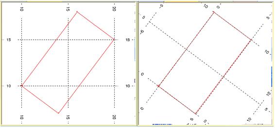

# CDTRAN Process  
  
To access this process:

  * **Data** ribbon **> > Transform >> Simple XYZ**.
  * View the **[Find Command](<../COMMON/findcommand.md>)** screen, select **CDTRAN** and click **Run**.
  * Enter "CDTRAN" into the [Command Line](<../COMMON/Command_Toolbar.md>) and press <ENTER>.

See this process in the [Command Table](<../command_help/_COMMAND%20TABLE_C.md#CDTRAN>).

## Process Overview

**CDTRAN** provides a general three-dimensional coordinate rotation and translation capability within your application.

The input is any file with **X** , **Y** and **Z** fields, which must be all numeric and explicit. The output is a copy of the input file, with a new set of **X** , **Y** and **Z** fields in the new coordinate system. These fields may be new fields, or the new fields may replace the old if required.

Two other functions are provided. The first is co-ordinate scaling, so that for example meters may be converted to feet, miles to kilometers etc. This is controlled by the optional @**FACTOR** parameter. The second function is that an inverse co-ordinate rotation may be carried out (the @**INVERSE** parameter), so that co-ordinates which are in a rotated system may easily be converted back to the original unrotated system, simply by defining the same transformation as originally, but with the @**INVERSE** parameter set to 1.

**Note** : Any points in the input file which have absent data X, Y or Z values are ignored without a message.

The **CDTRAN** process allows, for example, data in two different co-ordinate systems to be converted to a common one for processing together, or for a model to be generated in a rotated co-ordinate system with respect to the drillhole data. In this latter example, the standard sample format ([DESURV](<desurv.md>) output) would first be rotated and translated through **CDTRAN** before model building took place. Note that there is an associated plot process **PLOTGR** which will permit a grid of the original co-ordinate system to be plotted over the plans of the rotated model.

**Warning** : Orebody models should not usually be rotated using **CDTRAN**. If they are, then cells may overlap each other in the new model, and the **IJK** order will be out of sequence. However, the cells and sub-cells may, if required, be treated as data points, which are rotated and re-interpolated into a new rotated model. 

The rotation and translation process carried out is the following:

  1. The points X,Y,Z are translated to the defined origin **X0** , **Y0** and **Z0**.

> 
>     X = X - X0, Y = Y - Y0, Z = Z - Z0

  2. The translated points X,Y,Z are rotated about this point through one, two or three angles as defined by **ANGLE1** , **ANGLE2** , and **ANGLE3**. In fact, in the following description, it is the axes of the coordinate system which are rotated from their initial unrotated position, relative to the data.

> The axes, about which the rotations are applied, are defined using parameters **ROTAXIS1** , **ROTAXIS2** and **ROTAXIS3**. The possible values of these **ROTAXIS** _ parameters are 1, 2, 3 or 0, where 1 corresponds to the X axis, 2 to the Y axis, 3 to the Z axis, and 0 to no rotation. A rotation about axis 'N' is measured positively in the clockwise direction when viewed along axis N from high N values towards low values.
> 
> For the first rotation of **ANGLE1** around **ROTAXIS1** , the rotation is around one of the unrotated axes. For the second rotation of **ANGLE2** around **ROTAXIS2** the rotation will be around an axis which has already been rotated, as will be the case for the third rotation.
> 
> The default values of parameters **ROTAXIS1** , **ROTAXIS2** and **ROTAXIS3** are 3, 1 and 3 respectively. In this case **ANGLE1** is a clockwise azimuth rotation angle in the X-Y plane, measured from the Y axis. **ANGLE2** is a dip angle, measured downwards from the X-Y plane. **ANGLE3** is a clockwise rotation in the dip plane. 
> 
> Under some conventions this may be described as the plunge angle. The three angles for the default ROTAXISn values, are illustrated in Figure 1. Note that in this default case of **ROTAXIS1** =3, **ROTAXIS2** =1, **ROTAXIS3** = 3, if **ANGLE2** is zero, then **ANGLE1** and **ANGLE3** are additive.
> 
> It can sometimes be helpful to use the fingers of your left hand to simulate the rotations. Point your index finger straight out in front of you, your thumb up in the air, and your second finger to the right across your body. Write the number 1 on your second finger, 2 on your index finger and 3 on your thumb. Your second finger is the X axis, pointing East, your index finger is the Y axis pointing North and your thumb is the Z axis pointing upwards.
> 
> To simulate the three rotations, first hold your left thumb with your right hand and rotate the other two fingers clockwise. Then hold your second finger and rotate your index finger and thumb clockwise in a vertical plane. Finally hold your left thumb again and rotate your other two fingers clockwise. Your fingers are now pointing along the axes of the rotated coordinate system.

  3. The rotated points are then translated to a new origin **XR0** , **YR0** , **ZR0** in the rotated co-ordinate system.

> 
>     X = X + XR0, Y = Y + YR0, Z = Z + ZR0  
> 
> This has the effect that the point **X0** , **Y0** , **Z0** in the unrotated system coincides in space with the point **XR0** , **YR0** , **ZR0** in the rotated system. This coincidence need not be within the region of interest of the data, but can lie well outside. The rotation takes place about this point.

### Factoring

If the optional @**FACTOR** parameter is set, then the units of the points in the rotated system will be @**FACTOR** times the units of the unrotated system. This means that, for example, if @**FACTOR** =0.3048 and input units are meters then the output units will be feet.

@**FACTOR** is the number of input units which equals one output unit. The input point **X0** , **Y0** , **Z0** will be in input units, and **XR0** , **YR0** , **ZR0** will be in output units.

## Input Files

Name |  Description |  I/O Status |  Required |  Type  
---|---|---|---|---  
IN |  Input file. Must contain at least X , Y and Z explicit numeric fields. |  Input |  Yes |  Undefined  
PROTOROT |  Optional file containing the rotation and translation parameters stored as the default of implicit fields ANGLE1, ANGLE2, ANGLE3, X0, Y0, Z0, XMORIG, YMORIG, ZMORIG, ROTAXIS1, ROTAXIS2 and ROTAXIS3. Fields XMORIG, YMORIG and ZMORIG correspond to parameters XR0, YR0 and ZR0. The other nine fields have the same name as the corresponding parameters. If this file is specified and has valid values for all twelve fields then the parameter entries for rotation and translation are ignored. This file can be created using the Rotated Model option in the process PROTOM . Data will then be transformed into the local (rotated) coordinate system of the model. |  Input |  No |  Undefined  
  
## Output Files

Name |  I/O Status |  Required |  Type |  Description  
---|---|---|---|---  
OUT |  Output |  Yes |  Undefined |  Output file. Will contain all input file fields + NEWX , NEWY and NEWZ.  
  
## Fields

Name |  Description |  Source |  Required |  Type |  Default  
---|---|---|---|---|---  
X |  X co-ordinate field in input file. |  IN |  Yes |  Numeric |  Undefined  
Y |  Y co-ordinate field in input file. |  IN |  Yes |  Numeric |  Undefined  
Z |  Z co-ordinate field in input file. |  IN |  Yes |  Numeric |  Undefined  
NEWX |  X co-ordinate field in output file. May be the same as X. |  OUT |  Yes |  Numeric |  Undefined  
NEWY |  Y co-ordinate field in output file. May be the same as Y. |  OUT |  Yes |  Numeric |  Undefined  
NEWZ |  Z co-ordinate field in output file. May be the same as Z. |  OUT |  Yes |  Numeric |  Undefined  
  
## Parameters

Name |  Description |  Required |  Default |  Range |  Values  
---|---|---|---|---|---  
ANGLE1 |  First rotation angle clockwise in degrees, around axis ROTAXIS1. It must lie between -360.0 and +360.0. A value of zero indicates no rotation. (0) |  No |  0 |  -360,360 |  Undefined  
ANGLE2 |  Second rotation angle clockwise in degrees, around axis ROTAXIS2. It must lie between 360.0 and +360.0. A value of zero indicates no rotation. (0) |  No |  0 |  -360,360 |  Undefined  
ANGLE3 |  Third rotation angle clockwise in degrees, around axis ROTAXIS3. It must lie between -360.0 and +360.0. A value of zero indicates no rotation. (0) |  No |  0 |  -360,360 |  Undefined  
ROTAXIS1 |  Axis around which first rotation angle will occur. 0 for no rotation, 1 for X axis, 2 for Y axis, 3 for Z axis. (3) |  No |  3 |  0,3 |  0,1,2,3  
ROTAXIS2 |  Axis around which second rotation angle will occur. 0 for no rotation, 1 for X axis, 2 for Y axis, 3 for Z axis. (1) |  No |  1 |  0,3 |  0,1,2,3  
ROTAXIS3 |  Axis around which third rotation angle will occur. 0 for no rotation, 1 for X axis, 2 for Y axis, 3 for Z axis. (3) |  No |  3 |  0,3 |  0,1,2,3  
X0 |  X co-ordinate of known point in both systems, in unrotated co-ordinate system. (0) |  No |  0 |  Undefined |  Undefined  
Y0 |  Y co-ordinate of known point in both systems, in unrotated co-ordinate system. (0) |  No |  0 |  Undefined |  Undefined  
Z0 |  Z co-ordinate of known point in both systems, in unrotated co-ordinate system. (0) |  No |  0 |  Undefined |  Undefined  
XR0 |  X co-ordinate of known point in both systems, in rotated co-ordinate system. (0) |  No |  0 |  Undefined |  Undefined  
YR0 |  Y co-ordinate of known point in both systems, in rotated co-ordinate system. (0) |  No |  0 |  Undefined |  Undefined  
ZR0 |  Z co-ordinate of known point in both systems, in rotated co-ordinate system. (0) |  No |  0 |  Undefined |  Undefined  
FACTOR |  The rotated co-ordinate system units will be e.g. 0.3048 for a grid in metres on an unrotated grid in feet (1). |  No |  1 |  Undefined |  Undefined  
INVERSE |  |  Option |  Description  
---|---  
0 |  ; rotate from [X,Y,Z] through [ANGLE1, ANGLE2,ANGLE3] to [NEWX,NEWY,NEWZ].  
1 |  ; inverse transformation to above; X,Y,Z are in rotated system; NEWX,NEWY,NEWZ in unrotated system; ANGLE1-3 are same angles as for 0.  
No | 0 | 0,1 | 0,1  
PRINT |  >=1; display input and output points for each record (0). |  No |  0 |  0,1 |  0,1  
  
## Example
    
    
    !START M1!REM ==================================================================  
  
---  
      
    
    !REM Create a rectangular perimeter with an azimuth of 36.8699 degrees  
      
    
    !REM ==================================================================  
      
    
    !INPFIL &OUT(DATA1)  
      
    
    Data in World Coordinate System  
      
    
    PVALUE N Y 0  
      
    
    PTN N Y 0  
      
    
    XP N Y 0  
      
    
    YP N Y 0  
      
    
    ZP N Y 0  
      
    
    ]  
      
    
    OK  
      
    
    # no system file  
      
    
    1, 1, 10, 10, 0  
      
    
    1, 2, 16, 18, 0  
      
    
    1, 3, 20, 15, 0  
      
    
    1, 4, 14, 7, 0  
      
    
    1, 5, 10, 10, 0  
      
    
    !REM ==================================================================  
      
    
    !REM Define the rotation such that the axes of the rotated system  
      
    
    !REM are parallel to the sides of the perimeter.  
      
    
    !REM The bottom left hand corner of the rectangle becomes the origin in  
      
    
    !REM the rotated system.  
      
    
    !REM ==================================================================  
      
    
    !CDTRAN &IN(DATA1), &OUT(DATA2),  
      
    
    *X(XP),*Y(YP),*Z(ZP), *NEWX(XP), *NEWY(YP), *NEWZ(ZP),  
      
    
    @ANGLE1=36.8699, @ANGLE2=0, @ANGLE3=0,  
      
    
    @ROTAXIS1=3, @ROTAXIS2=0, @ROTAXIS3=0,  
      
    
    @X0=10, @Y0=10, @Z0=0,  
      
    
    @XR0=0, @YR0=0, @ZR0=0,  
      
    
    @FACTOR=1, @INVERSE=0  
      
    
    !LIST &IN(DATA2),*F1(XP),*F2(YP),*F3(ZP),@PROMPT=0  
      
    
    !END  
      
    
       
      
    
    The listing of file DATA2 is as follows:  
      
    
    ======================================================================  
      
    
    FILENAME DATA2  
      
    
    FILE CREATED BY SYSTEM USING CDTRAN ON 97/10/08  
      
    
    ----------------------------------------------------------------------  
      
    
    FILE CONTAINS 5 RECORDS EACH OF LENGTH 5  
      
    
    ----------------------------------------------------------------------  
      
    
    FIELD TYPE WORD.NO STORED START DEFAULT  
      
    
    ----------------------------------------------------------------------  
      
    
    XP N 1 Y 1 0.0  
      
    
    YP N 1 Y 2 0.0  
      
    
    ZP N 1 Y 3 0.0  
      
    
    PVALUE N 1 Y 4 0.0  
      
    
    PTN N 1 Y 5 0.0  
      
    
    ======================================================================  
      
    
    XP YP ZP  
      
    
    ======================================================================  
      
    
    0.0 0.0 0.0  
      
    
    0.0 10.0 0.0  
      
    
    5.0 10.0 0.0  
      
    
    5.0 0.0 0.0  
      
    
    0.0 0.0 0.0  
      
    
       
  
;>)

The graphic above shows the results of the rotation. The red rectangle on the left is from the **DATA1** file and is rotated by 36.87 degrees relative to the world coordinate system and has one of its corners at 10,10,0. If you then define a rotation of 36.87 degrees around the Z axis and define the new local origin as 0,0,0 as in the macro above, you get the new coordinate system as shown in the right side graphic. Output file **DATA2** contains the coordinates in the new system. Remember that it is always the axes that are rotated, not the data.

## Error and Warning Messages

Message | **Description**  
---|---  
>>> ESSENTIAL FIELD NOT IN FILE <<< >>> ERR 130 <<< ( n) IN CDTRAN |  One or more of the fields *X, *Y and *Z is missing from the input file. n=1 for X, 2 for Y and 3 for Z. Fatal; the process is exited.  
>>> FIELD IS NOT NUMERIC <<< >>> ERR 131 <<< ( n) IN CDTRAN |  One or more of the *X, *Y or *Z fields is alphanumeric. n=1 for X, 2 for Y, 3 for Z. Fatal; the process is exited.  
>>> EXISTING OUTPUT FIELD OF INAPPROPRIATE TYPE <<< >>> ERR 132 <<< ( n) IN CDTRAN |  One or more of the * **NEWX** , * **NEWY** , * **NEWZ** fields already exists in the input file, but is implicit or alphanumeric. n=1 for X, 2 for Y, 3 for Z. Fatal; the process is exited.