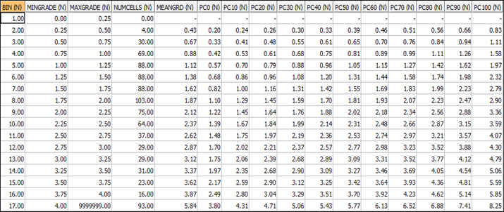
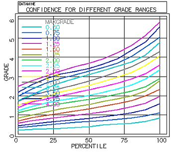

# CELLCONF Process  
  
To access this process:

  * **Simulate** ribbon **> > Conditional Simulation >> Confidence >> Cells**.
  * View the **[Find Command](<../COMMON/findcommand.md>)** screen, select **CELLCONF** and click **Run**.
  * Enter "CELLCONF" into the [Command Line](<../COMMON/Command_Toolbar.md>) and press <ENTER>.

See this process in the [Command Table](<../command_help/_COMMAND%20TABLE_C.md#CELLCONF>).

## Process Overview

**Note** : This is a _superprocess_ and running it may have an effect on other Datamine files in the project.

This process creates a summary table and graph of confidence for parent cells in a block model which has been created using conditional simulation.

The [CSMODEL](<csmodel.md>) process calculates very detailed information for confidence values of every parent cell in the simulated model. The CELLCONF process then summarizes this information into a table showing average confidence values for cells in different grade ranges. The following observations could potentially be derived from the results of this process:

For a cell whose estimated value lies between 1.5 and 1.75 g/t Au:

  * there is a 10% probability that the actual grade will be less than 1.0 g/t;
  * there is a 10% probability that it will exceed 2.23 g/t.

For a cell whose estimated value lies between 3.0 and 3.25 g/t:

  * there is a 10% probability that the actual grade will be less than 2.06 g/t;
  * there is a 10% probability that it will exceed 4.12 g/t.

### Input Model File

The input STATMOD model, previously created by the CSMODEL process, must include at least one percentile field, PCxx, where xx is the numeric percentile value. It must also include the field **MEAN** , the average of all the simulated values for each cell, also known as the **EType** estimated grade of the cell.

### Cutoffs

The required input includes a series of cutoff grades which define grade ranges for which average confidence values are calculated.

  * If a regular set of cutoff grades is appropriate, then cutoffs can be defined using the CUTINT (cutoff interval) and CUTMAX (maximum cutoff) parameters. For example if CUTINT=0.5 and CUTMAX=3, then 7 grade ranges (bins) are defined as follows:

Minimum value |  Maximum value  
---|---  
0.00 |  0.50  
0.50 |  1.00  
1.00 |  1.50  
1.50 |  2.00  
2.00 |  2.50  
2.50 |  3.00  
4.00 |  ∞  
  
  * If irregular intervals are required, then cutoff values can be input from the CUTOFF file - the field name COGRADE must be used for cutoff grades.

Otherwise:

  * A zero cutoff value should not be included in the file.
  * An extra bin from the maximum cutoff to 9999999 will always be automatically included for both the parameter and file definition methods.
  * If both the file and parameter methods are specified, then the file method is used.

## Input Files

Name |  Description |  I/O Status |  Required |  Type  
---|---|---|---|---  
STATMOD |  Created by the CSMODEL process, this model must include at least one percentile field - PCxx \- where xx is the numeric percentile value. It must also include the field MEAN \- the average of all the simulated values for each cell. |  Input |  Yes |  Model  
CUTOFF |  Allows irregular intervals to be used by specifying cutoff values in this file. |  Input |  No - only used if irregular intervals are required |  Table  
  
## Output Files

Name |  I/O Status |  Required |  Type |  Description  
---|---|---|---|---  
CONF_TBL |  Output |  Yes |  Table |  Output table for displaying confidence for each grade bin defined for successive cutoff values.  
CONF_PLT |  Output |  No |  Plot template |  Output plot template for displaying confidence for each grade bin defined for successive cutoff values.  
  
## Parameters

Name |  Description |  Required |  Default |  Range |  Values  
---|---|---|---|---|---  
CUTINT |  For regular cutoff grades, this field defines the interval between successive cutoff grades. Only required if a CUTOFF file has not been specified. |  No |  1 |  0.00001,9999999 |  Undefined  
CUTMAX |  For regular cutoff grades, this field defines the maximum cutoff value. Only required if a CUTOFF file has not been specified |  No |  10 |  0.00002,9999999 |  Undefined  
PLOT_TBL |  Flag to specify whether a plot data table is output. This contains the data used to create the CONF_PLT plot files, and could be used to recreate the plot in other software, such as Excel. The plot data table name is the same as the plot file, except that "_P" is replaced by "_T". |  No |  0 |  0,1 |  0,1  
DISPLAY |  Flag to display whether plot files are displayed as the process is run. |  No |  1 |  0,1 |  '0' - do not display plot files. '1' - display plot files as the process is run.  
  
## Example
    
    
    !CELLCONF  &STATMOD(statmod1_2),   
  
---  
      
    
     &CONF_TBL(cell_conf_table,  
      
    
    &CONF_PLT(cell_conf_plot),  
      
    
    @CUTINT=0.25,   
      
    
     @CUTMAX=4, @DISPLAY=1, @PLOT_TBL=1  
      
    
    CELLCONF  
      
    
    ...importing files, fields and parameters  
      
    
    -16 cutoff grades defined  
      
    
    ...calculating confidence  
      
    
    -9 percentile fields in statistics model   
      
    
     STATMOD1_2  
      
    
    CELLCONF   
      
    
     finished  
      
    
       Confidence   
      
    
     table cell_conf_table contains 17 records  
      
    
       Confidence   
      
    
     plot file cell_conf_plot_P contains 321 records  
      
    
       Confidence   
      
    
     plot data table cell_conf_plot_T contains 165 records  
  
### Confidence Table

A confidence table is shown below, as an example (click to expand):

;>)

Model cells have been classified by their MEANGRD (EType Estimator) value, as defined by the input cutoffs. The minimum (MINGRADE) and maximum (MAXGRADE) for each grade range (BIN) are included in the table.

Note the following:

  * There are no cells with MEAN values in the range 0 - 0.25 g/t (BIN 1).
  * 4 cells have an estimated MEAN value between 0.25 and 0.5 g/t.
  * The average of these 4 MEAN values is shown in the MEANGRD column as 0.43 g/t.

The PCxx columns show the average percentile values for the cells - for example, the following probability values are shown for BIN 13 (3.0 - 3.25 g/t):

  * There is a 10% probability that the actual grade will be below 2.06.
  * There is a 20% probability that the actual grade will be below 2.39.
  * There is a 30% probability that the actual grade will be below 2.68.

### Confidence Plot

An example is shown below of a draft quality plot that was created from the confidence table. The legend is coloured according to the MAXGRADE value - that is, the upper limit of each grade bin:

Related topics and activities

  * **[CSMODEL Process](<csmodel.md>)**