# CHART Process

To access this process:

  * View the **[Find Command](<../COMMON/findcommand.md>)** screen, select **CHART** and click **Run**.
  * Enter "CHART" into the [Command Line](<../COMMON/Command_Toolbar.md>) and press <ENTER>.

See this process in the [Command Table](<../command_help/_COMMAND%20TABLE_C.md#CHART>).

## Process Overview

**Note** : This is a _superprocess_ and running it may have an effect on other Datamine files in the project.

This process transforms data into a suitable format for creating charts and optionally creates and displays a draft quality plot.

The input data file may include up to three levels of key fields. In this way multiple information can be displayed on a single chart. The output file **OUT** contains the chart data and the file **PLOT** contains the plot file. At least one of these two files must be specified.

The output plot file **PLOT** is created using the batch graphics processes and can therefore only be considered as draft quality. The output file **OUT** can be exported and can be used in Excel or a charting package to produce high quality plots.

**Note** : CHART is a legacy process. Your product provides a wide range of interactive charting tools that work with loaded data objects. See [Creating and Editing Histograms](<../PLOTS_LOGS/Chart_Histogram.md>), [Creating and Editing Scatter Plots](<../PLOTS_LOGS/Chart_ScatterPlot.md>) or search for "Charts".

## Plot Size and Scaling

Size and scaling information can be defined using an input plot prototype file, as created using **[PROTOP](<protop.md>)**. Alternatively, the values can be specified using the parameters **XPAPER** , **XMIN** , **XMAX** , **XSCALE** for X and similarly for Y. If the minimum, maximum and scaling parameters are undefined then suitable defaults will be calculated automatically. The default plot size is 240x200mm.

## Scattergram

A scattergram is simply a plot of a symbol at each X,Y point. 

For example, data file **sample1** is a desurveyed drillhole file containing fields **AU** , **CU** , **ROCK** and , where has been assigned according to the **ROCK** value. A scattergram will show the relationship between the **AU** **and** CU values.

[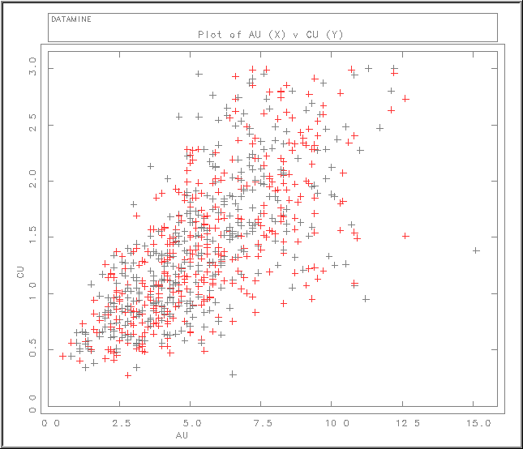](<javascript:void\(0\);>)

To add a legend in the bottom right corner we will need to make the following changes:

Type |  Name |  Value  
---|---|---  
Field |  KEY1 |  ROCK  
Parameter |  LEGEND |  2  
  
By specifying a key field the plot will use the different symbols for each key field combination. **SYMBOL1** =92 so the + symbol will be plotted for the first key field combination (**ROCK** =1). **SYMBOL2** =0 so different symbols will be plotted for the second and subsequent key field combinations (only two key fields in this example), starting with the value of SYMBOL1 plus 1 ie 93 which is the X symbol.

[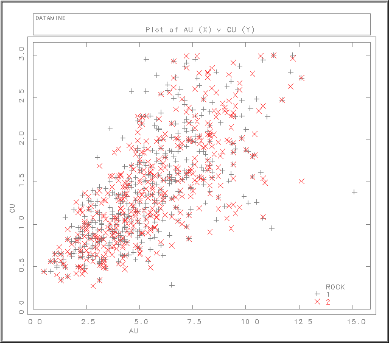](<javascript:void\(0\);>)

The output file sctable1 includes the key field and the X and Y fields. The output file is really only useful if a probability scale (eg **XTRANS** =4) or a histogram (**CHARTTYP** =3) have been selected.

If you want to define your own title and axis annotation then you should specify an **ANNO** file. This contains the three fields **XANNO** , **YANNO** and **TITLE** which should be alpha fields with a maximum of 40 characters.

[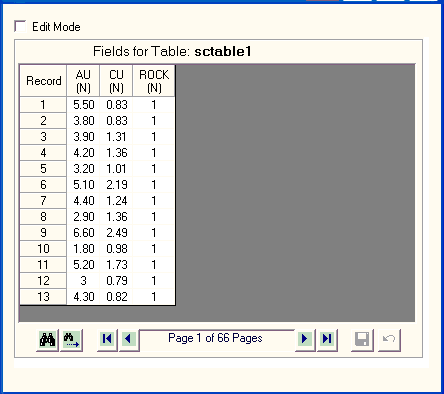](<javascript:void\(0\);>)

[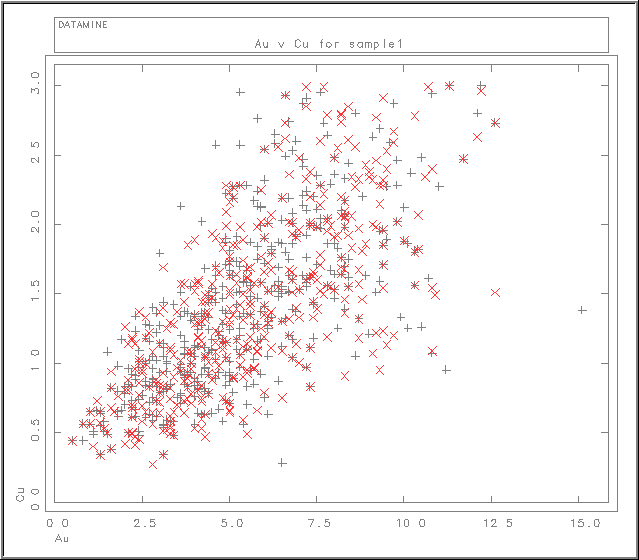](<javascript:void\(0\);>)

## Line Chart

A good example of a line chart is an experimental variogram. If vgram1 is the output file from the variogram calculation process **[VGRAM](<vgram.md>)** , then the variograms for different azimuths can be displayed.

[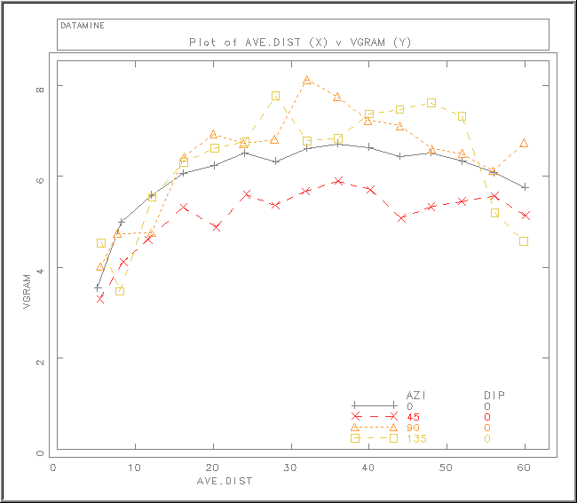](<javascript:void\(0\);>)

## Probability Plot

One way to test whether a set of data conforms to a Normal distribution is to create a normal probability plot. This is a plot of grade against cumulative probability where the scaling on the probability axis is constructed in such a way that a Normal distribution appears as a straight line.

[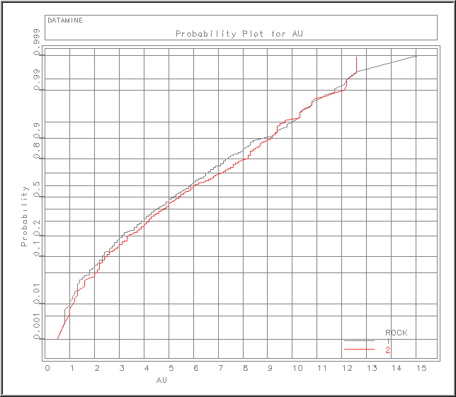](<javascript:void\(0\);>)

The OUT file includes the following fields, sorted on ROCK and AU:

Field |  Description  
---|---  
ROCK |  KEY field  
|  The field  
AU |  The log of the selected grade field  
PHI |  Standard normal distribution value  
CUMPROB |  Cumulative probability %  
  
To test whether the samples conform to a Lognormal distribution, make the following change:

Type |  Name |  Value  
---|---|---  
Parameter |  XTRANS |  2  
  
The X axis is then plotted using a logarithmic scale. If the samples conform to a Lognormal distribution the plots will be straight lines.

[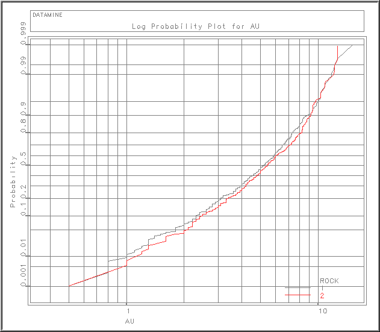](<javascript:void\(0\);>)

## Histogram

The following chart example shows AU histograms for the two ROCK values displayed on the same plot.

[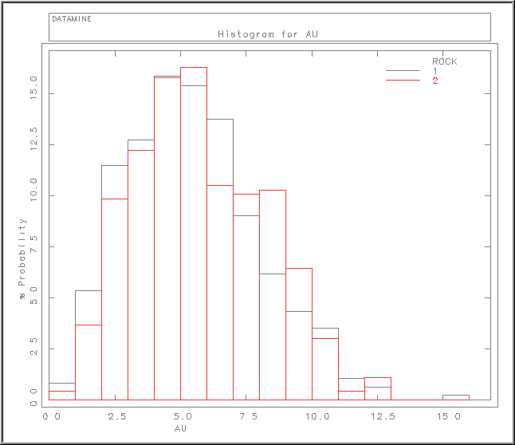](<javascript:void\(0\);>)

Selecting **HISTTYP** =1 (bin plot) is probably not the best way of displaying two histograms simultaneously. Selecting **HISTTYP** =3 (line plot) would be better:

Type |  Name |  Value  
---|---|---  
Parameter |  HISTTYP |  3  
  
[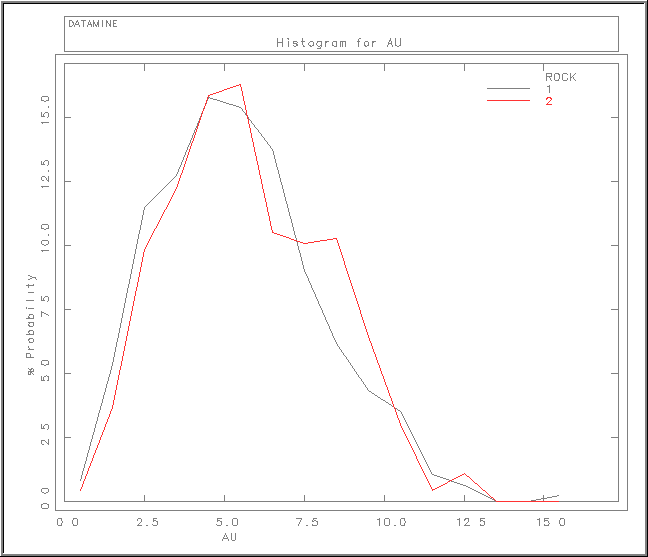](<javascript:void\(0\);>)

The **OUT** file includes the following fields, sorted on ROCK and LOWER:

[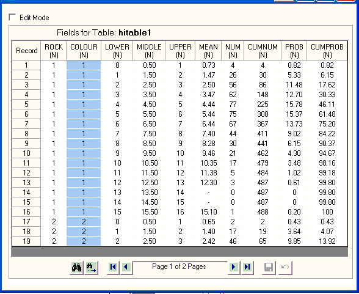](<javascript:void\(0\);>)

Field |  Description  
---|---  
ROCK |  KEY field  
|  The field  
LOWER |  Lower bin value  
MIDDLE |  Mid bin value  
UPPER |  The log of the selected grade field  
MEAN |  Mean grade within bin  
NUM |  Number of samples within bin  
CUMNUM |  Cumulative number of samples up to and including current bin  
PROB |  % probability in bin  
CUMPROB |  Cumulative % probability up to and including current bin  
  
in order to calculate the log histogram change the XTRANS parameter:

Type |  Name |  Value  
---|---|---  
Parameter |  XTRANS |  2  
  
[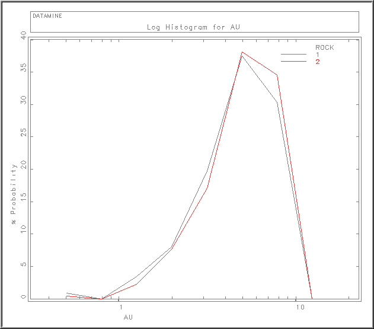](<javascript:void\(0\);>)

## Reserved Field Names

Field names that are created in the output file OUT cannot be used as input fields for **X** , **Y** , **WEIGHT** , **KEY1** , **KEY2** , **KEY3**. The reserved field names are **LOWER** , **MIDDLE** , **UPPER** , **MEAN** ,**NUM** , **CUMNUM** , **PROB** , **CUMPROB** and **PHI**.

## Input Files

Name |  Description |  I/O Status |  Required |  Type  
---|---|---|---|---  
IN |  Input data file. |  Input |  Yes |  Table  
PROTO |  Plot prototype file. Must contain the fields X, Y, S1, S2 and CODE (numeric, explicit) and XMIN, XMAX, YMIN, YMAX, XSCALE, YSCALE (numeric, implicit). |  Input |  No |  Plot Prototype  
ANNO |  Input file containing annotation for plot axes and title. Must contain the fields XANNO, YANNO and TITLE (alpha, explicit). The file should only include one record. |  Input |  No |  Table  
  
## Output Files

Name |  I/O Status |  Required |  Type |  Description  
---|---|---|---|---  
OUT |  Output table. If CHARTTYP =3 this will be a histogram table. Otherwise the table will contain fields suitable for creating a plot. At least one output file ( PLOT or OUT ) must be specified. |  Output |  No |  Table  
PLOT |  Output plot file. At least one output file ( PLOT or OUT ) must be specified. |  Output |  No |  Plot  
  
## Fields

Name |  Description |  Source |  Required |  Type |  Default  
---|---|---|---|---|---  
X |  Field in input file IN to be plotted along the X axis. Not required if probability is to be plotted along the X axis XTRANS =4. |  IN |  No |  Numeric |  Undefined  
Y |  Field in input file IN to be plotted along the Y axis. Not required if probability is to be plotted along the Y axis YTRANS =4. |  IN |  No |  Numeric |  Undefined  
WEIGHT |  Weighting field in input file IN . Only applicable if histogram ( CHARTTYP =3) has been selected. |  IN |  No |  Numeric |  Undefined  
KEY1 |  First key field in the input IN file. |  IN |  No |  Numeric |  Undefined  
KEY2 |  Second key field in the input IN file. |  IN |  No |  Numeric |  Undefined  
KEY3 |  Third key field in the input IN file. |  IN |  No |  Numeric |  Undefined  
  
## Parameters

Name |  Description |  Required |  Default |  Range |  Values  
---|---|---|---|---|---  
CHARTTYP |  Type of chart. Default (1). |  Option |  Description  
---|---  
1 |  Scattergram  
2 |  Line chart  
3 |  Histogram  
  
For scattergram [1] and histogram [3] the process will first sort file IN by key field(s), if key field(s) have been specified.  
No |  1 |  1, 3 |  1,2,3  
HISTTYP |  Type of histogram \- only used if CHARTTYP =3: |  Option |  Description  
---|---  
1 |  histogram using bin plotting  
2 |  cumulative histogram using bin plotting  
3 |  histogram using line plotting  
4 |  cumulative histogram using line plotting  
No |  1 |  1,4 |  1,2,3,4  
BINSIZE |  Histogram bin size - only used if CHARTTYP =3. If a log histogram is selected then the bin size should still be specified in non-transformed units. The process will then recalculate the bin size, so as to create the same number of bins as the normal histogram. |  No |  1 |  Undefined |  Undefined  
BINMIN |  Minimum grade for histogram calculation ( CHARTTYP =3). If the grade is less than the minimum and BINMETH =1 the sample will be ignored. If the grade is less than the minimum and BINMETH =2 the sample will be assigned to the bottom bin. |  No |  0 |  Undefined |  Undefined  
BINMAX |  Maximum grade for histogram calculation ( CHARTTYP =3). If the grade is greater than or equal to the maximum and BINMETH =1 the sample will be ignored. If the grade is greater than or equal to the maximum and BINMETH =2 the sample will be assigned to the top bin. If undefined then the maximum value will be set to the maximum sample value. |  No |  Undefined |  Undefined |  Undefined  
BINMETH |  Bin selection method for histogram calculation ( CHARTTYP =3): |  Option |  Description  
---|---  
1 |  if grade is less than the minimum or greater than or equal to the maximum then the sample will be ignored.  
2 |  if grade is less than the minimum or greater than or equal to the maximum then the sample will be assigned to the bottom or top bin.   
No |  1 |  1,2 |  1,2  
XTRANS |  Transform to be applied to data values plotted on X axis. Default (1). |  Option |  Description  
---|---  
1 |  No transform - X values plotted  
2 |  Log base 10 of X values  
3 |  Log base e of X values  
4 |  Probability values [phi] calculated from Y values  
No |  1 |  1,4 |  1,2,3,4  
YTRANS |  Transform to be applied to data values plotted on Y axis. Default (1). |  Option |  Description  
---|---  
1 |  No transform - Y values plotted  
2 |  Log base 10 of Y values  
3 |  Log base e of Y values  
4 |  Probability values [phi] calculated from X values  
No |  1 |  1,4 |  1,2,3,4  
LOGMIN |  If X or Y values are less than LOGMIN they are reset to this value before a log transform is applied. This is only relevant if XTRANS or YTRANS are set to 2 or 3. Default (0.01). |  No |  0.01 |  0.0000001,999999 |   
FRAMETYP |  This parameter defines the type of frame for the plot: |  Option |  Description  
---|---  
0 |  Neither a frame or a title will be plotted.  
1 |  Linear scaling will be used irrespective of the values of XTRANS or YTRANS .  
2 |  If a transform has been selected for either of the axes [ XTRANS >=2 or YTRANS >=2] then the frame will include probability and/or log scales as appropriate. Also XINC , YINC , NDX and NDY will be ignored.   
No |  2 |  0,2 |  o,1,2  
XFACTOR |  Dividing factor applied to X values before any transform using XTRANS . Default (1). |  No |  1 |  |   
YFACTOR |  Dividing factor applied to Y values before any transform using YTRANS . Default (1). |  No |  1 |  |   
LINETYP1 |  Line type to be used for first key field combination. Default (1). Line Types: |  Option |  Description  
---|---  
1 |  Solid line  
2 |  Bold line  
3 |  Dashed line  
4 |  Dotted line  
5 |  Dot-Dash line  
6 |  Just use symbols at data points  
No |  1 |  1,6 |  1,2,3,4,5,6  
SYMBOL1 |  Plotted symbol at each point for first key field combination. Default (92). |  Option |  Description  
---|---  
91 |  Circle (o)  
92 |  Cross (+)  
93 |  Cross (x)  
94 |  Triangle  
95 |  Box  
96 |  Diamond  
97 |  Star  
98 |  Pie Segment  
No |  92 |  91,98 |  91,92,93,94,95,96,97,98  
SYMSIZE1 |  Symbol size in millimetres for first key field combination (3). Set to 0 for no symbol. |  No |  3 |  Undefined |  Undefined  
COLOUR1 |  Line and symbol colour number for first key field combination (1). |  No |  12 |  Undefined |  Undefined  
LINETYP2 |  Line type to be used for second and subsequent key field combinations. Default (0). Line Types: |  Option |  Description  
---|---  
0 |  Different line types for different key field combinations  
1 |  Solid line  
2 |  Bold line  
3 |  Dashed line  
4 |  Dotted line  
5 |  Dot-Dash line  
6 |  Just use symbols at data points  
No |  0 |  0,6 |  0,1,2,3,4,5,6  
SYMBOL2 |  Plotted symbol at each point for second and subsequent key field combinations. Default (0). | Option | Description  
---|---  
0 | Different symbols for different key field combinations  
91 | Circle (o)  
92 | Cross (+)  
93 | Cross (x)  
94 | Triangle  
95 | Box  
96 | Diamond  
97 | Star  
98 | Pie Segment  
No |  0 |  0,98 |  0,91,92,93,94,95,96,97,98  
SYMSIZE2 |  Symbol size in millimetres for second and subsequent key field combinations (3). Set to 0 for no symbol. |  No |  3 |  Undefined |  Undefined  
COLOUR2 |  Line and symbol colour number for second and subsequent key field combinations. Set to (0) for different colours for different key field combinations. |  No |  |  |   
APPEND |  Plot append flag. Default (0): |  Option |  Description  
---|---  
0 |  Do not append new plot file to existing PLOT file.  
1 |  If PLOT file already exists and is a valid plot file then the new plot will be appended to it.  
No |  0 |  0,1 |  0,1  
COLFLAG |  Colour flag. Default (1). |  Option |  Description  
---|---  
0 |  If the field exists in the IN file then it will be ignored.  
1 |  If the field exists in the IN file then the field value will be used for the plot and 1 and 2 will be ignored. If =1 and a legend is selected then there should only be one value for each key field combination; otherwise extra lines will be inserted into the legend each time the changes within a key field combination.  
No |  1 |  0,1 |  0,1  
LEGEND |  Flag to show if legend is required and legend position. Default (0). |  Option |  Description  
---|---  
0 |  no legend  
1 |  top right  
2 |  bottom right  
3 |  bottom left  
4 |  top left  
No |  |  0,4 |  0,1,2,3,4  
LEGCHSIZ |  Legend character size (3). |  No |  3 |  Undefined |  Undefined  
TCHARSZ |  Title character size in mm. |  No |  3 |  Undefined |  Undefined  
TCOLOUR |  Title colour. |  No |  12 |  Undefined |  Undefined  
XINC |  Grid increment on X axis. Not used if one of the axes has a probability scale. |  No |  Undefined |  Undefined |  Undefined  
YINC |  Grid increment on Y axis. Not used if one of the axes has a probability scale. |  No |  Undefined |  Undefined |  Undefined  
NDX |  Number of decimal places for annotation on X axis. If undefined then an appropriate number will be calculated automatically. |  No |  Undefined |  0,6 |  0,1,2,3,4,5,6  
NDY |  Number of decimal places for annotation on Y axis. If undefined then an appropriate number will be calculated automatically. |  No |  Undefined |  0,6 |  0,1,2,3,4,5,6  
IGRID |  |  Option |  Description  
---|---  
0 |  frame only;  
1 |  frame + outwards ticks;  
2 |  frame + crosses at grid intersections;  
3 |  frame + inwards ticks;  
4 |  grid;  
5-9 |  as 0-4 minus frame.  
10 |  as 4 but annotation parallel to grid lines.  
11-20 |  as 1-10 with annotation on right and top as well. Negative values of IGRID give an additional frame around the full plot area.  
No |  3 |  -20,20 |  Undefined  
FCHARSZ |  Frame character size in mm. |  No |  3 |  Undefined |  Undefined  
FCOLOUR |  Frame colour. |  No |  12 |  Undefined |  Undefined  
XPAPER |  Paper size in mm in X direction. |  No |  240 |  Undefined |  Undefined  
YPAPER |  Paper size in mm in Y direction. |  No |  200 |  Undefined |  Undefined  
XMIN |  Minimum value of X for plot. In order for this value to be used two parameters from XMIN , XMAX , and XSCALE and two parameters from YMIN , YMAX , and YSCALE must be specified. |  No |  Undefined |  Undefined |  Undefined  
XMAX |  Maximum value of X for plot. In order for this value to be used two parameters from XMIN , XMAX , and XSCALE and two parameters from YMIN , YMAX , and YSCALE must be specified. |  No |  Undefined |  Undefined |  Undefined  
YMIN |  Minimum value of Y for plot. In order for this value to be used two parameters from XMIN , XMAX , and XSCALE and two parameters from YMIN , YMAX , and YSCALE must be specified. |  No |  Undefined |  Undefined |  Undefined  
YMAX |  Maximum value of Y for plot. In order for this value to be used two parameters from XMIN , XMAX , and XSCALE and two parameters from YMIN , YMAX , and YSCALE must be specified. |  No |  Undefined |  Undefined |  Undefined  
XSCALE |  X scale in user data units per millimetre. In order for this value to be used two parameters from XMIN , XMAX , and XSCALE and two parameters from YMIN , YMAX , and YSCALE must be specified. |  No |  Undefined |  Undefined |  Undefined  
YSCALE |  Y scale in user data units per millimetre. In order for this value to be used two parameters from XMIN , XMAX , and XSCALE and two parameters from YMIN , YMAX , and YSCALE must be specified. |  No |  Undefined |  Undefined |  Undefined  
PROGRESS |  Flag to control amount of output written to Output Window (1). |  Option |  Description  
---|---  
0 |  no output  
1 |  progress messages  
No |  1 |  0,1 |  0,1  
DISPLAY |  Flag to select whether or not to display plot file. |  Option |  Description  
---|---  
0 |  do not display plot file  
1 |  display plot file  
No |  1 |  0,1 |  0,1  
  
Related topics and activities

  * [PROTOP Process](<protop.md>)