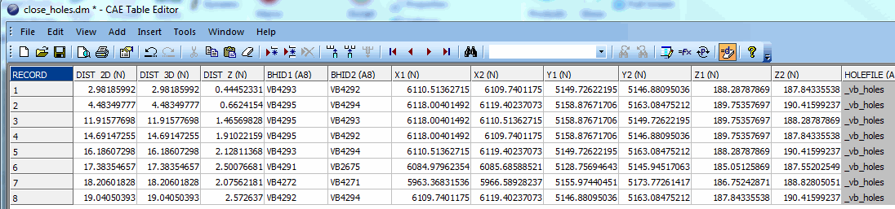
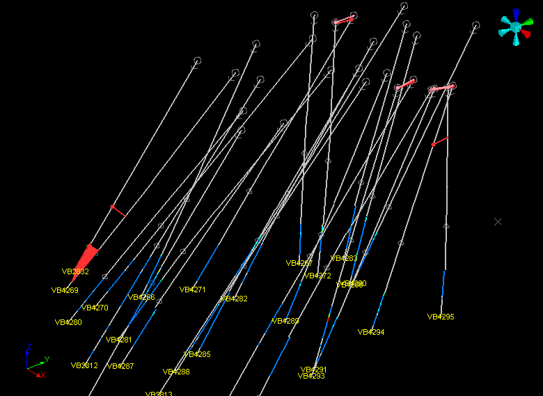

# CLOSEPTS Process

To access this process:

  * **Sample Analysis** ribbon **> > Plan >> Close Points**.
  * View the **[Find Command](<../COMMON/findcommand.md>)** screen, select **CLOSEPTS** and click **Run**.
  * Enter "CLOSEPTS" into the [Command Line](<../COMMON/Command_Toolbar.md>) and press <ENTER>.

See this process in the [Command Table](<../command_help/_COMMAND%20TABLE_C.md#CLOSEPTS>).

## Process Overview

**Note** : This is a _superprocess_ and running it may have an effect on other Datamine files in the project.

**CLOSEPTS** identifies closely spaced collars or points in a drillhole or point data file. 

It is useful to check for and remove closely spaced samples to avoid potential problems with Kriging. The input file can be one of either a desurveyed drillhole file or a point/sample file. The closeness is specified using the @**DISTANCE** parameter.

## Input Files

### HOLES File

If a drillhole file **HOLES** is specified as an input both closely spaced samples and collars can be identified. The collar positions are back calculated from the centre point and azimuth and dip of the first sample so may differ slightly from the original collar locations before desurveying. The amount of variation will depend on the amount of deviation from the vertical and the length of the sample.

### POINTS File

Closely spaced points can be identified in any points or sample file with X, Y and Z coordinate fields. A desurveyed drillhole file can be specified as a **POINTS** file if required. The X, Y and Z field names in the input file are specified using the *X, *Y and *Z field names.

If both a HOLES and a POINTS file are specified the POINTS file is ignored and only the HOLES file is processed.

### Output Files

If an input **HOLES** drillhole file is being processed the output files **CLOSHOLE** and **CLOSEPTS** can be created to identify both the closely spaced collars and the closely spaced samples. If a **POINTS** file is being processed only the **CLOSEPTS** file is created. The format of both the **CLOSHOLE** and **CLOSEPTS** files is the same. They contain the 2D, 3D and vertical distances between the identified proximate points as well as the point coordinates. An example output file is shown in the image below.

;>)

## Output String Files

Optionally string files can be output to help visualise the location of closely spaced points. The **BHSTR** file contains 2 point strings connecting all the closely spaced drillhole collars. The **PTSSTR** file contains 2 point strings connecting all the closely spaced points. An example output is shown below. The pink strings connect the collars and the red strings connect the closely spaced samples. The distance used in this example was 20.

;>)

## Input Files

Name |  Description |  I/O Status |  Required |  Type  
---|---|---|---|---  
HOLES |  Input drillhole file within which to find closely spaced points. This file is optional but one of either the input HOLES or POINTS file must be specified. If both a HOLES and POINTS file are specified only the HOLES file is processed. |  Input |  No |  Drillhole  
POINTS |  Input points or sample file within which to find closely spaced points. This file is optional but one of either the input HOLES or POINTS file must be specified. If both a HOLES and POINTS file are specified only the HOLES file is processed. |  Input |  No |  Points  
  
## Output Files

Name |  I/O Status |  Required |  Type |  Description  
---|---|---|---|---  
CLOSHOLE |  Output |  No |  Undefined |  Output file containing a record for each pair of closely spaced collars in the HOLES file. This file is ignored if no HOLES file is specified.  
CLOSEPTS |  Output |  No |  Undefined |  Output file containing a record for each pair of closely spaced sample points in the HOLES file, or closely spaced points in the POINTS file.  
BHSTR |  Output |  No |  String |  Output string file containing a two point string for each pair of closely spaced collars in the input HOLES file  
PTSSTR |  Output |  No |  String |  Output string file containing a two point string for each pair of closely spaced points/samples in the input HOLES or POINTS file  
  
## Fields

Name |  Description |  Source |  Required |  Type |  Default  
---|---|---|---|---|---  
BHID |  Name of the field containing the drillhole identification code or a point identifier field. |  IN |  Yes |  Alphanumeric |  BHID  
X/Y/Z |  Coordinate field in the input HOLES or POINTS file |  IN |  No |  Numeric |  X/Y/Z  
  
## Parameters

Name |  Description |  Required |  Default |  Range |  Values  
---|---|---|---|---|---  
DISTANCE |  Distance within which to find closely spaced points. |  Yes |  2 |  - |  -  
  
## Example
    
    
    !CLOSEPTS   
  
---  
      
    
     &HOLES(_vb_holes),&CLOSHOLE(close_holes),&CLOSEPTS(close_pts),&BHSTR(coll_str),  
      
    
    &PTSSTR(pts_str),*BHID(BHID),*X(X),*Y(Y),*Z(Z),   
      
    
     @DISTANCE=20.0  
      
    
    CLOSEPTS   
      
    
     Identify closely spaced points and hole collars within distance of 20   
      
    
     from each other  
      
    
    ... Finding   
      
    
     closely spaced collars in holes file _vb_holes  
      
    
    ... Finding   
      
    
     closely spaced samples in holes file _vb_holes  
      
    
    ... Processing   
      
    
     pairs data  
      
    
    ... Generating   
      
    
     string file BHSTR  
      
    
    ... Generating   
      
    
     string file PTSSTR  
      
    
    ... 8 close   
      
    
     collar locations have been identified  
      
    
    ... Output   
      
    
     holes summary file close_holes contains 8 records  
      
    
    ... Holes   
      
    
     string file coll_str contains 16 records  
      
    
    ... 173   
      
    
     close point locations have been identified  
      
    
    ... Output   
      
    
     holes summary file close_pts contains 173 records  
      
    
    ... Points   
      
    
     string file coll_str contains 346 records  
      
    
    ... CLOSEPTS   
      
    
     Completed  
  
Related topics and activities

  * [Drillhole Break Through and Proximity Warnings](<../COMMON/Borehole_Warning_Report.md>)

  * [borehole-warning-report ("bhw")](<../command_help/borehole-warning-report.md>)