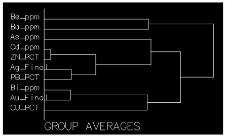
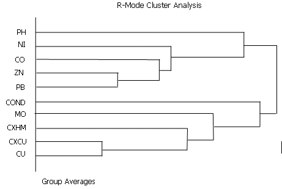
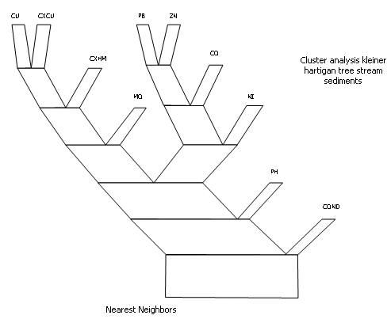

# CLUSTR Process

To access this process:

  * **Sample Analysis** ribbon **> > Geochemical Processes>> R Mode Cluster Analysis**.
  * View the **[Find Command](<../COMMON/findcommand.md>)** screen, select **CLUSTR** and click **Run**.
  * Enter "CLUSTR" into the [Command Line](<../COMMON/Command_Toolbar.md>) and press <ENTER>.

See this process in the [Command Table](<../command_help/_COMMAND%20TABLE_C.md#CLUSTR>).

## Process Overview

Cluster Analysis is a data exploration (mining) tool for dividing a multivariate dataset into natural clusters (groups). We use the methods to explore whether previously undefined clusters (groups) may exist in the dataset. For instance, a marketing department may wish to use survey results to sort its customers into categories (perhaps those likely to be most receptive to buying a product, those most likely to be against buying a product, and so forth).

Cluster Analysis is used when we believe that the sample units come from an unknown number of distinct populations or sub-populations. We also assume that the sample units come from a number of distinct populations, but there is no apriori definition of those populations. Our objective is to describe those populations using the observed data.

Fields are clustered (R-mode) into groups on the basis of the correlation matrix to simplify the structure. R - mode cluster analysis (agglomerative) using the similarity or dissimilarity matrix with interactive screen graphics to define and plot types of clustering:

;>)

The results are presented as a dendrogram and a Kleiner - Hartigan tree (see below for an example). Variables can be selected for clustering using field and retrieval criteria.

### File Handling

The input data file (&IN) must have at least three numeric fields plus a sample identifier field (@**SAMPID**) which must be declared on input. There is also the optional facility of imputing and outputting the correlation matrix.

### Special Features

The user has the option of defining the type of correlation matrix to be used, i.e.. similarity (variance covariance) or dissimilarity (euclidean distance) with the interactive selection of type of cluster linkage model to be applied to the dendrogram. Note, if the similarity matrix is selected (@**MATTYPE** =0) then the default value for the Z transformation of the data (normalized data with the maximum value set to 1) must also be used (@**ZTRAN** =1). If the dissimilarity matrix is used then the Z transformation of the data is optional.

Dendrograms, are plotted from high to low using the similarity coefficients generated from the hierarchical structure. The dissimilarity (distance) matrix is scaled from low (close together) to high (farther away) using the euclidean distance. Ward's method can give high similarity values in excess of -1.0 and care should be taken not to relate the similarities too closely to the matrix correlation coefficients.

The type of hierarchical linkage required to generate the dendrogram (see Figure 1) can be defined interactively by the user including nearest neighbor, furthest neighbor, simple averages, median, group averages, centroid and Ward's method. Difficulties arise in order to select the method to use to give the 'best ' results. Mathematically nearest neighbor is considered the best method.

However as a measure of 'goodness of fit' between the observed data and the generated hierarchical structure, the cophonetic correlation coefficient is used. The cophonetic correlation coefficient is the correlation coefficient between the observed and the hierarchical clustering similarity coefficients. Values greater than 0.75 can be considered 'good'. With different linkage methods, the highest values are given by group averages, followed by simple averages and furthest neighbor. Lowest values are given by Ward's method.

However the user should base his selection not only on the cophonetic correlation coefficient but also on his own knowledge of the data.

Another interactive option is the Kleiner - Hartigan tree which is plotted vertically from the 'root' or 'trunk' (maximum dissimilarity) branching upwards until only one field remains (see Figure 2). The angle between 'branches' is proportional to the similarity. The width of each 'branch' represents the number of variables above it within the 'tree'. The lengths of each 'branch' are fixed and equal. Plotfiles of the individual dendrograms and the Kleiner - Hartigan tree can also be output.

;>)

Dendogram showing two distinct groupings between CU, CXCU, CXHM, MO, Conductivity and PB, ZN, CO, NI and pH in string sediments.

;>)

_Kleiner-Hartigan tree of the same data displayed in Figure 1. The decreasing angle between the branches is proportional to the similarity. The width of the branch is proportional to the number of fields above it within the tree. The groupings vary slightly as the linking algorithm used to produce the tree (nearest neighbour) is different._

## Clustering - Main Options:

  1. Nearest neighbors Single linkage / minimum method.

  2. Furthest neighbors Complete linkage / maximum method.

  3. Simple averages Weighted pair-group method.

  4. Median Weighted pair-group centroid.

  5. Group averages Unweighted pair-group method.

  6. Centroid Unweighted pair-group centroid.

  7. Wards method Minimum group variance.

  8. Secondary options.

  9. Exit Program and close files.

### Clustering - Secondary Options:

  1. Return to Main Options Menu.

  2. To print a summary of all models to the screen.

  3. Print the current model to the screen.

  4. Plot the dendrogram for the current model.

  5. Plot the Kleiner-Hartigan tree for the current model.

  6. Exit the program and close files.

There is a limit of 60 variables and 5000 samples. If missing data is present in the sample, then the sample record is ignored.

## Input Files

Name |  Description |  I/O Status |  Required |  Type  
---|---|---|---|---  
IN |  Optional raw data input file. |  Input |  No |  Undefined  
MATXIN |  Optional matrix input file. |  Input |  No |  Undefined  
  
## Output Files

Name |  I/O Status |  Required |  Type |  Description  
---|---|---|---|---  
MATXFILE |  Output |  No |  Undefined |  Output file containing similarity or dissimilarity matrix.  
  
## Fields

Name |  Description |  Source |  Required |  Type |  Default  
---|---|---|---|---|---  
SAMPID |  Field containing sample identification or variable identification if a matrix input file is used. |  IN |  Yes |  Any |  Undefined  
F1 |  First field to be used. No fields specified means all. |  IN |  No |  Numeric |  Undefined  
F2 |  Second field to be used. |  IN |  No |  Numeric |  Undefined  
F3 |  Third field to be used. |  IN |  No |  Numeric |  Undefined  
F4 |  Fourth field to be used. |  IN |  No |  Numeric |  Undefined  
F5 |  Fifth field to be used. |  IN |  No |  Numeric |  Undefined  
F6 |  Sixth field to be used. |  IN |  No |  Numeric |  Undefined  
F7 |  Seventh field to be used. |  IN |  No |  Numeric |  Undefined  
F8 |  Eighth field to be used. |  IN |  No |  Numeric |  Undefined  
F9 |  Ninth field to be used. |  IN |  No |  Numeric |  Undefined  
F10 |  Tenth field to be used. |  IN |  No |  Numeric |  Undefined  
  
## Parameters

Name |  Description |  Required |  Default |  Range |  Values  
---|---|---|---|---|---  
MATTYPE |  |  Option |  Description  
---|---  
(0) |  Product moment correlation matrix. (Similarity Matrix). Note, using default value here, must use default value for ZTRAN.  
No |  0 |  0,1 |  0,1  
ZTRAN |  |  Option |  Description  
---|---  
0 |  Z Transformation of data not required to calculate matrix. Only applicable for raw data input.  
(1) |  Z Transformation of data required to calculate matrix.  
No |  1 |  0,1 |  0,1  
  
## Example
    
    
    !CLUSTR     &IN(SEDDET),@SAMPID='ID',@MATTYPE=0,@ZTRANF=1  
  
---  
  
## Error and Warning Messages

Message |  Solution  
---|---  
*** Warning *** SAMPID field has nn words. Only the first 3 will be used. |   
*** Warning *** Clustering must be performed on three or more fields. The matrix can be calculated or the process can be terminated now. |   
*** Warning *** No output matrix file will be produced. Clustering is being performed on an input matrix file. |   
*** Error *** SAMPID field (fieldname) is not in input file. |  Ensure specified field exists in input file.  
*** Error *** No numeric fields on file (filename) >>> ERR 122 <<< ( fileno.) IN CLUSTR |  Ensure input file contains expected numeric fields.  
*** Error *** Unable to compute the similarity matrix. |  Check inputs.  
*** Error *** Only one sample in input file. |  Check inputs.  
*** Error *** Illegal combination of parameters specified. Cannot have a similarity matrix without Z transformation. |  Ensure parameter conflicts are resolved.  
*** Error *** No input file has been specified. |  Specify an input file  
*** Error *** Two input files have been specified. |  Specify only one input file  
*** Error *** Cluster analysis requires three or more fields. Process terminated. |  Specify 3 or more fields.  
*** Error *** Clustering cannot be performed on only one field. Process terminated. |  Specify 3 or more fields.  
*** Error *** Compulsory file, field or parameter missing. >>> ERR 120 <<< ( fileno.) IN CLUSTR |  Check inputs.  
*** Error *** File (filename) does not contain a matrix. Check input.Backward links present - no dendrogram possible. |  Check inputs.