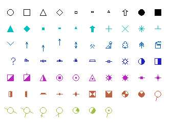

# COGTRI Process  
  
To access this process:

  * **Wireframe** ribbon **> > Process >> Wireframe Processes >> Calculate Triangle Centers**.
  * View the **[Find Command](<../COMMON/findcommand.md>)** screen, select **COGTRI** and click **Run**.
  * Enter "COGTRI" into the [Command Line](<../COMMON/Command_Toolbar.md>) and press <ENTER>.

See this process in the [Command Table](<../command_help/_COMMAND%20TABLE_C.md#COGTRI>).

## Process Overview

**Note** : This is a _superprocess_ and running it may have an effect on other Datamine files in the project.

The process calculates the centre point and the dip and dip direction of each triangle in a wireframe.

Output from the process consists of a wireframe (a wireframe triangle and a wireframe points file), and a points file. Both outputs are optional, although at least one must be defined.

The output wireframe points file is a copy of the input wireframe points file. The output wireframe triangle file is a copy of the input wireframe triangle file, but with the following extra fields:

  * **XCOG** , **YCOG** , **ZCOG** : The coordinates of the centre of each triangle.
  * **XP1** , **YP1** , **ZP1** , **XP2** , **YP2** , **ZP2** , **XP3** , **YP3** , **ZP3** : The coordinates of each vertex of each triangle. These fields are only included if parameter **VERTEX** is set to 1.

The output points file contains the attribute fields of the input wireframe triangle file, plus the following fields:

  * **XPT** , **YPT** , **ZPT** : The coordinates of the centre of each triangle.
  * **SDIP** , **DIPDIRN** : The dip and dip direction in degrees of each triangle.
  * **SYMBOL** , **SYMSIZE** : A symbol code and it's size in mm, as defined by parameters SYMBOL and SYMSIZE.

The default value for SYMBOL is 216, which is a filled arrow. Other SYMBOL codes are shown in the following diagram. The codes for the top line of symbols are 201 to 210, code 211 to 220 for the second row, and so on.

One of the benefits of including the centre of each triangle in the wireframe triangle file is that a field can be set, for example using the command [EXTRA](<extra.md>), so that the triangles are coloured according to the elevation of each triangle.

The output point data file can be displayed in any **3D** Window. The program automatically recognizes and uses the three numeric fields which control the way in which point data is rendered. 

These fields are:

  * **SYMSIZE** : the symbol size.
  * **DIPDIRN** : the symbol rotation in degrees.
  * **SDIP** : the symbol dip in degrees.

The point data file can also be used as input when creating [Stereonet Charts](<../Stereonet/Stereonet%20Introduction.md>).

## Input Files

Name |  Description |  I/O Status |  Required |  Type  
---|---|---|---|---  
WTRIN |  Input wireframe triangle file. |  Input |  Yes |  Wireframe Triangle File  
WPTIN |  Input wireframe points file. |  Input |  Yes |  Wireframe Points File  
  
## Output Files

Name |  I/O Status |  Required |  Type |  Description  
---|---|---|---|---  
WTROUT |  Output |  No |  Wireframe Triangle File |  Output wireframe triangle file. This contains all the fields from the input wireframe triangle file and: - XCOG, YCOG, ZCOG: the XYZ coordinates of the centre of each triangle. - if parameter VERTEX is set to 1 then the fields XP1, YP1, ZP1, XP2, YP2, ZP2, XP3, YP3, ZP3 representing the vertices of each triangle will also be included.  
WPTOUT |  Output |  No |  Wireframe Points File |  Output wireframe points file. This is a copy of the input wireframe points file.  
PTNOUT |  Output |  No |  Point Data File |  Output point data file containing the following fields: - XPT, YPT, ZPT: the XYZ coordinates of the centre of each triangle. - SDIP, DIPDIRN: the dip and dip direction of each triangle, in degrees. - SYMBOL, SYMSIZE: the symbol type and symbol size of the rotated symbol.  
  
## Parameters

Name |  Description |  Required |  Default |  Range |  Values  
---|---|---|---|---|---  
VERTEX |  Flag specifying whether the coordinates of the vertices of each triangle are to be included in the output wireframe triangle file WTROUT: |  No |  0 |  0,1 |  0,1  
SYMBOL |  Code for the rotated symbol to be included in field SYMBOL of the output point data file PTNOUT. The default value of 216 is a filled arrow. |  No |  216 |  0,400 |  Undefined  
SYMSIZE |  The size in mm of the rotated symbol. |  No |  2 |  0,100 |  Undefined  
  
## Example
    
    
    !COGTRI &WTRIN(wtr1), &WPTIN(wpt1), &WTROUT(wtr2),   
  
---  
      
    
             &WPTOUT(wpt2), &PTNOUT(pts2), @VERTEX=0, @SYMBOL=216,   
      
    
             @SYMSIZE=4  
      
    
       
      
    
    COGTRI - Calculate centre of each triangle in a wireframe.  
      
    
    .. input validation  
      
    
    .. checking files, fields and parameters  
      
    
    .. calculating results  
      
    
    .. wireframe triangle file wtr2  
      
    
    contains 72 records  
      
    
    .. wireframe points file wpt2  
      
    
    contains 78 records  
      
    
    .. points file pts2  
      
    
    contains 72 records  
      
    
    .. process complete.