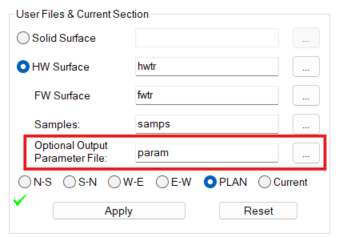

# COKRIG Process  
  
To access this process:

  * **COKRIG** is accessed automatically using the **[Advanced Estimation](<../STUDIO_RM/Multivariate_Introduction.md>)** wizard.
  * Enter "COKRIG" into the [Command Line](<../COMMON/Command_Toolbar.md>) and press <ENTER>.

See this process in the [Command Table](<../command_help/_COMMAND%20TABLE_C.md#COKRIG>).

## Process Overview

COKRIG performs grade estimation using univariate and multivariate methods, including ordinary, simple kriging, inverse distance weighting and nearest neighbour. 

This process is used as part of the [Advanced Estimation](<../STUDIO_RM/Multivariate_Introduction.md>) wizard, although it can also be accessed independently via the command line as a standalone process. 

## COKRIG Inputs

Retrieval Criteria can be used and apply to all input files.

**Note** : [ESTIMA](<estima.md>) parameter files can be imported and transformed for use in **COKRIG** using the Advanced Estimation import function ([Parameters](<../STUDIO_RM/Multivariate_Import_Parameters.md>) panel).

### SAMPLES (Input Samples File)

#### Sample Coordinates

The **SAMPLES** file must include x, y and z coordinate fields. The default values for these fields are _XPT_ , _YPT_ , _ZPT_. If the file does not use these defaults then the actual values must be specified using the field assignments *XPT, *YPT, *ZPT.

#### Zonal Control

Zonal control allows you to specify that model cells with a particular zone value(s) are estimated using samples with the same zone value(s). To use zonal control one or two zone control fields must be specified using the field assignments *ZONE1_F and *ZONE2_F. The specified zone fields must then be included in the **SAMPLES** file.

#### Key Field

The Key field is used to define the optimum and maximum number of samples selected for estimating a cell that have the same Key value. The Key field name must be specified using the field assignment *KEY. The most common use of this is to set *KEY to _BHID_ so that the optimum and maximum number of samples for each estimate can be defined. The *KEY field must therefore be included in the **SAMPLES** file in order to use this option. The optimum and maximum number of samples is set using fields _OPTKEY_ and _MAXKEY_ in the search parameter file **SPAR**. 

You can set the zone control fields to absent, meaning you can potentially set up a grade estimate using the same parameters over multiple zones. This can be particularly useful for a grade that uses the inverse distance method with the same search volume for each zone. Rather than specifying each zone as a separate record, setting a zone field to absent data means using the same parameters for each zone. 

### PROTO (Input Prototype Model File)

#### Model Structure

&PROTO defines the prototype block model into which estimates will be made. A prototype file will usually contain cells and subcells defining the geological model. If the prototype only contains the model definition (no cells or subcells) then parent cells will be created at each potential cell location if there are sufficient samples within the search volume.

The prototype can include the optional rotated model fields.

**Note** : &**PROTO** must not be the same file as &**OUTMODEL**.

#### Zonal Control

If zonal control is being used, the *_ZONE1_F_ and optionally *_ZONE2_F_ fields must be present in the prototype model and the prototype model must contain cells..

#### Simple Kriging

If simple kriging with local means is being used for any estimation run (IMETHOD = 4), then the local means field must be specified in the &FIELDS file and must be present in the prototype model. The prototype model must contain cells.

### EPAR (Input Estimation Parameters File)

The estimation parameters input file allows multiple estimations to be defined. It includes the following fields. All fields are numeric.

Field Name |  Reqd? |  Description  
---|---|---  
EREFNUM |  Y |  Estimation reference number. Refers to &**FIELDS** file. For **univariate NN, IPD, OK, and SK** , using the same **EREFNUM** for unique variables produces a faster univariate estimate. In this case, the search and variogram parameters must be consistent. For multivariate cases (**OK** or **SK** with a cross-variogram), **EREFNUM** groups the variables to be estimated together. Note: If consistent search neighbourhoods and/or variogram models are defined with unique **EREFNUM** values, they are automatically merged for a faster estimate, unless @**MERGEST** =0.  
VSETNUM |  Y for all methods except NN and IPD |  Variogram set number. Refers to &VMODEL file  
SREFNUM |  Y |  Search volume reference number. Refers to &SPAR file  
ZREFNUM |  N |  Custom Zone reference number for specifying multiple sample zones to estimate into a model zone; of soft boundary estimation. Refers to &ZPAR file.   
IMETHOD |  Y |  Estimation Method: 1 = Nearest Neighbour (NN) 2 = Inverse Power of Distance (IPD). Note that with this method, if the POWER (see below) is set to 0, COKRIG will estimate the arithmetic mean of all samples within the search volume. 3 = Ordinary Kriging (OK) 4 = Simple Kriging with Sample Mean (SK) 8 = Angular estimation using Inverse Power of Distance * 11 = Simple Kriging with Local Mean 12 = Angular estimation using Nearest Neighbour * * angular estimation data can be imported using the Advanced Estimation console, whereupon the Estimate angles tab ([Select Prototype](<../STUDIO_RM/Multivariate_Select_Prototype.md>) page) is populated. If there are more than one angular estimation records in the file, the first estimation record is used as reference and the input variables from any subsequent estimation records (which matches the reference estimation) are added to it. Estimation parameter files can contain information relating to both grade and angular interpolation, or separate models can be used.  
  
POWER |  N |  Power value for inverse distance weighting. Default = 2.  
**ANISO** | N |  IPD estimates only. The field **ANISO** is used to define which transformed distance to use. This field can have the values:

  0. No transformation i.e. isotropic. Distances are calculated from the coordinate system used in the Sample Data file.
  1. Use the transformed distances defined by the search volume (default if no field or value present).

**Note** : Where estimation parameters are imported from **[ESTIMA](<estima.md>)** , the **ANISO** parameter is handled in the same way as the **ESTIMA** process for values 0, 1 and 2 (2 is not supported directly in **COKRIG** but is handled via import for consistency).  
  
When **COKRIG** or **ESTIMA** run Dynamic Anisotropy and less than 3 angles are used, the process replaces the missing angles with angles from the selected search or variogram.  
SDYNAISO |  N |  Dynamic anisotropy search rotation flag: 

  0. Do not use.
  1. Use field specified by symbolic field assignment e.g. *SANGL1_F(DIPDIRN), *SANGL2_F(DIP)

  
VDYNAISO |  N |  Dynamic anisotropy variogram rotation flag: 

  0. Do not use
  1. Use field specified by symbolic field assignment e.g. *VANGL1_F(DIPDIRN) *VANGL2_F(DIP)

  
DISCX/Y/Z |  N |  Number of discretization points in X/Y/Z direction.  
PARENT |  N |  Parent cell estimation flag: 

  0. No (subcell estimation)
  1. Yes (parent cell estimation)

Default = 1  
ZONE1 |  N |  Zone field 1. Only required if zone control field *ZONE1_F specified. Must be same type (alpha or numeric) as *ZONE1_F  
ZONE2 |  N |  Zone field 1. Only required if zone control field *ZONE2_F specified. Must be same type (alpha or numeric) as *ZONE2_F  
USEPK |  N |  USEPK defines which kriging option to use:

  0. Do no use point kriging, use block kriging.
  1. Use point kriging. This only affects the Kriging Variance (KV) and not the estimate.

The parameter is only used if Ordinary Kriging (IMETHOD=3) or Simple Kriging (IMETHOD=4 or 11) have been selected and if the number of discretisation points is 1x1x1. The USEPK parameter affects the calculation of the Kriging Variance but not the Kriging Estimate.  
SAMPOUT | N |  Indicates if an estimate should be included or excluded from the SAMPOUT file.

  0. Do not write this estimate to the SAMPOUT file.
  1. Write this estimate to the SAMPOUT file (DEFAULT).

  
KRIGNEGW |  |  Treatment of -ve weights:

  * 0 = -ve weights kept and used.
  * 1 = Ignore samples with -ve weights

  
  
If zone control fields *ZONE1_F and *ZONE2_F have been specified then the output model file will include an additional combined zone field called _C_ZONE_N_ (or alternatively, in the form _CMBZ_###_ if a field called _C_ZONE_N_ already exists in the &SAMPLES or &PROTO file).

If an estimation run uses multiple zones, the _DISCX_ , _DISCY_ , _DISCZ_ values from the first record of that estimation run are used.

### FIELDS (Input Field List File)

The field list file is used to specify which grades/variables will be used for each estimation and which output fields will be created. Field EREFNUM is numeric but all other fields are alpha. Field IN_VAR must exist in the &SAMPLES file. All other field names will be created in the output model file.

Field Name |  Reqd? |  Description  
---|---|---  
EREFNUM |  Y |  Estimation reference number. Refers to &EPAR file  
IN_VAR |  Y |  Input grade field in &SAMPLES file.  
LOC_MEAN |  N |  Local mean field for Simple Kriging (SK) with _IMETHOD_ =11. Input field in &PROTO file  
EST |  Y |  Estimated grade value.  
VAR |  N |  Kriging variance.  
NUMSAMP |  N |  Number of samples used for estimation.  
NUMKEY_F |  N |  Number of holes used for estimation  
WTOFMEAN |  N |  Kriged weight assigned to mean grade for SK  
SUMPOSWT |  N |  Sum of positive weights  
CORZZSTR |  N |  Corr ( Z, Z* ). Correlation between actual value and estimate  
COVZZSTR |  N |  Cov ( Z, Z* ). Covariance between actual value and estimate  
COVZ1SZS |  N |  Cov ( Z1*, Z* ). Covariance between two estimates multivariate case only  
SLPZZSTR |  N |  Slope of regression Z / Z*; actual value on estimate  
VARZSTR |  N |  Variance of the estimator (Z*)  
KRIGEFF |  N |  Kriging efficiency. Comparative measure of confidence in block estimate  
LAGRANGE |  N |  Lagrange parameter. Calculated when solving kriging matrix  
SINDEX |  N |  Search volume index. Search volume used for making the estimate  
MINDIST | N | Distance from the block centre to the nearest sample used for estimation.   
AVEDIST | N | Average distance from the block centre to all samples used for estimation.   
TMINDIST | N | Transformed minimum distance from the block centre to the nearest sample used for estimation.   
TAVEDIST | N | Transformed average distance from the block centre to the nearest sample used for estimation.   
  
**Note** : All output field values (i.e. everything other than IN_VA/LOC_MEAN) must be unique as they will be used for column names in the output block model.

Note: If output fields are more than 24 characters they will be truncated (a warning will be displayed).

Certain fields have prerequisites and need one or more fields to be created. If the prerequisite fields do not exist, the field will not be created.

  * _CORZZSTR_ requires variance (_VAR_), the correlation between actual and estimate (_COVZZSTR_) and Variance of Z* _VARZSTR_.

  * Slope of regression (_SLPZZSTR_) requires variance (_VAR_), the correlation between actual and estimate (_COVZZSTR_) and Variance of Z* _VARZSTR_.

  * Kriging efficiency (KRIGEFF) requires variance (VAR)

### VMODEL (Variogram Model File)

The format of the variogram model required for COKRIG is very similar to the variogram used for ESTIMA.

Field Name |  Reqd? |  Description  
---|---|---  
GRADE |  Y |  First grade to which model applies. **Important** : This field must exist in the input variogram file or estimation will not complete.  
GRADE2 |  Y |  Second grade to which model applies; if variogram this will be the same as GRADE; if covariogram this will be different from GRADE **Important** : This field must exist in the input variogram file or estimation will not complete.  
VSETNUM |  Y |  Variogram set number; models must be in the same set if they are created as multivariate.

  * For univariate variograms, **VSETNUM** should be unique (usually equal to **VREFNUM**).
  * For multivariate variograms, **VSETNUM** groups variograms within a set, identified by unique **VREFNUM** values.

  
VREFNUM | Y for multivariate | 

  * For univariate estimation, optional (typically equal to **VSETNUM**). 
  * For multivariate estimation, mandatory. Within a **VSETNUM** , **VREFNUM** provides unique integer identifiers for the variograms forming the co-variograms. For two variables, this includes: 
    1. Direct variogram of variable 1 (set in **GRADE1**). 
    2. Cross variogram of **GRADE1** /**GRADE2**.
    3. Direct variogram of variable 2 (set in **GRADE2**).

  
GOODFITP |  N |  System parameter indicating goodness of the automatic variogram model fitting.  
FITCONV |  N |  System parameter for the fitting convention  
TRANS |  N |  System parameter indicating if the model needs to be back transformed from Gaussian to normal space. Default (0).   
VANGLE1 |  Y |  First variogram rotation angle (degrees)  
VANGLE2 |  Y |  Second variogram rotation angle (degrees)  
VANGLE3 |  Y |  Third variogram rotation angle (degrees)  
VAXIS1 |  Y |  First rotation axis ( 1=X, 2=Y, 3=Z )  
VAXIS2 |  Y |  Second rotation axis ( 1=X, 2=Y, 3=Z )  
VAXIS3 |  Y |  Third rotation axis ( 1=X, 2=Y, 3=Z )  
NUGGET |  Y |  Nugget variance  
ST1 |  Y |  Model type for structure 1 (1=Spherical, 2=Not Used, 3=Exponential, 4=Gaussian).  
ST1PAR1 |  Y |  Range in X direction prior to rotation for structure 1  
ST1PAR2 |  Y |  Range in Y direction prior to rotation for structure 1  
STIPAR3 |  Y |  Range in Z direction prior to rotation for structure 1  
ST1PAR4 |  Y |  Sill of structure 1  
STiPAR1 |  N |  Range in X direction prior to rotation for structure i, i=2,9  
STiPAR2 |  N |  Range in Y direction prior to rotation for structure i, i=2,9  
STiPAR3 |  N |  Range in Z direction prior to rotation for structure i, i=2,9  
STiPAR4 |  N |  Sill of structure i, i=2,9  
  
The main differences between the variogram models for COKRIG and ESTIMA are:

  * A variogram model set number (_VSETNUM_) is used instead of a variogram reference number (_VREFNUM_)

  * The variogram model requires two additional fields _GRADE_ and _GRADE2_ to identify the grade or grades in the case of cross-variograms, to which the model applies.

Variogram models from either COKRIG or ESTIMA can be specified when using COKRIG/Advanced Estimation.

#### Univariate Estimation

  * The GRADE and GRADE2 values must be identical and must match the value of the IN_VAR grade field in the &FIELDS file.

  * Different grades may have different VSETNUMs or they may all have the same VSETNUM. However VSETNUM in the variogram model file must match VSETNUM in the estimation parameters file &EPAR.

The Variogram model file is an optional input for _Inverse Power of Distance_ estimates.

#### Multivariate Estimation

  * The variogram model file must include a model for each grade (GRADE = GRADE2) and should have a cross-variogram model for pairs of grades (GRADE ≠ GRADE2).

  * If a cross-variogram model is not supplied then zero covariance will be assumed for those two grades.

  * A variogram model must be supplied for each input grade specified in the &FIELDS file

  * All models for a multivariate estimate must have the same VSETNUM.

  * Range values and structure type for each structure must be identical between all variograms and cross-variograms.

  * Nugget and sill matrices must be positive definite or zero.

An example of part of a variogram model file is given below:

GRADE |  GRADE2 |  Desc |  VSETNUM |  VANGLE1 |  VAXIS1 |  NUGGET |  ST1 |  ST1PAR1 |  ST1PAR2 |  ST1PAR3 |  **ST1PAR4**  
---|---|---|---|---|---|---|---|---|---|---|---  
V |  V |  Mod. V |  4 |  70 |  3 |  9010 |  1 |  17 |  12 |  5 |  31889  
U |  U |  Mod. U | 4 |  70 |  3 |  60000 |  1 |  17 |  12 |  5 | 265240  
U |  V |  Cross UV |  4 |  70 |  3 |  11567 |  1 |  17 |  12 |  5 |  27201  
V |  V |  Mod. V |  5 |  70 |  3 |  9010 |  1 |  17 |  12 |  5 |  31889  
U |  U |  Mod. U |  5 |  70 |  3 |  60000 |  1 |  17 |  12 |  5 |  265240  
  
_VSETNUM_ = 4 identifies the models used to co-estimate V and U (multivariate estimation) while VSETNUM = 5 the models used to estimate V and U but assuming no covariance (univariate estimations)

#### VSETNUM and VREFNUM

A variogram model parameter file is created when an estimation is run from the [Advanced Estimation](<../STUDIO_RM/Multivariate_Introduction.md>) wizard. It can also be created using the Export model variogram option in the Fit Models panel of the wizard. The file contains both a VSETNUM and a VREFNUM field.

  * VSETNUM   
  
If cross-variograms have been selected when creating the experimental variograms then both univariate and cross-variograms will be created. When models are fitted the univariate and cross-variogram models will be assigned the same _VSETNUM_ identifier. When two or more univariate models are fitted (different grades) they will also be assigned the same VSETNUM identifier.  
  
If zonal control has been defined then all models for each _VSETNUM_ will be for the same zone value(s).

  * VREFNUM   
  
When the variogram model parameter file is created by the wizard it will also include a _VREFNUM_ field. This is just the record number within the file. If the experimental variograms are recalculated with a different set of grades (eg omitting one of the grades) then the model for one or more of the grades may have a different _VREFNUM_ value.  
  
The _VREFNUM_ field is not used by COKRIG. It is only created when the file is created by the wizard in order to be consistent with the required fields for [ESTIMA](<estima.md>).  
  
The COKRIG process can be run successfully without a _VREFNUM_ field in the input variogram model file. The process matches the variogram model to the estimation parameter file using the fields _GRADE_ , _GRADE2_ and _VSETNUM_.

### SPAR (Input Search Parameter File)

**Note** : Search volume parameter files used by COKRIG and the Advanced Estimation wizard cannot be used as an input to the [ESTIMA](<estima.md>) process, or [ESTIMATE](<estimate.md>) dialog. They are similar, but COKRIG requires additional fields to be specified.

#### Capping Outliers

This option allows grade capping to be performed during univariate estimation. Upper and/or lower grade values can be capped. High value capping will apply capping/cutting above a threshold and low value capping below a threshold. This option is controlled by the three parameter fields _CAPPING_ , _CAPDIST_ (which can also be used to set a capping distance independently for axis 1, 2 and 3) and _CAPGRADE_ as described in the table below.

Field Name |  Required? |  Description  
---|---|---  
SREFNUM |  Y |  The reference number used by the process to identify the correct set of parameters. If multiple equivalent references are found, the first will be used. Integer values must be used.  
SDIST1/2/3 |  Y |  Length of the initial search volume axis in the X/Y/Z direction.  
SAXIS1/2/3 |  Y |  The first axis around which the volume will be rotated by SANGLE1/2/3.  
SANGLE1/2/3 |  Y |  The angle for the first/second/third rotation, specified in degrees clockwise.  
MINNUM1 |  Y |  Minimum number of samples to be found in the first search volume for a block to be considered for estimation.  
MAXNUM1 |  Y |  The optimum (not maximum) number of samples to be found in the first search volume. If NSECTORS is more than 1, this number is divided by the number of sectors (and rounded up if necessary) and becomes the optimum per sector.  
SMETHOD |  N |  Search volume shape (1 = 3D rectangular, 2 = ellipsoid).  
SVOLFACi |  N |  Search volume axis multiplying factor applied to SDIST1, SDIST2, SDIST3. Used to increase the volume if insufficient samples in previous volume, i=2,9,  
MINNUMi |  N |  Minimum number of samples in search volume i, i=2,9  
MAXNUMi |  N |  Optimum (not maximum) number of samples in search volume i, i=2,9  
NSECTORS |  N |  The number of vertical sectors (like orange segments) which the search volume is to be split into.  
SPLITSEC |  N |  An option to split the sectors horizontally. (1 = split, 0 = no split)  
KALLIBLK |  N |  The keep all in block parameter indicates if the search should always include samples that lie within the target block. Setting this to true (1) may result in the number of samples exceeding the optimal samples. (1 = include all samples in block; 0 = off)   
CAPPING |  N |  Capping flag:  0 = do not use capping,  1 = cap High and Replace,  2 = cap Low and Replace,  3 = cap High and Exclude,  4 = cap Low and Exclude  
CAPANISO |  N |  Determine if capping is applied isotropically or anisotropically: 0 = Capping is applied beyond a distance in any direction. 1 = Capping is applied anisotropically, using CAPDIST1/2/3 to determine the distance along each axis.  
CAPDIST | N |  If capping isotropically (that is, CAPANISO=0), this is the distance in any direction beyond which capping is applied. To apply capping/cutting to all values and effectively ignore distance parameters, set to 0  
CAPDIST1 |  N |  Distance along the first axis beyond which capping is applied. To apply capping/cutting to all values and effectively ignore distance parameters, set to 0. Requires CAPANISO=1.  
CAPDIST2 |  N |  Distance along the second axis beyond which capping is applied. To apply capping/cutting to all values and effectively ignore distance parameters, set to 0. Requires CAPANISO=1.  
CAPDIST3 |  N |  Distance along the third axis beyond which capping is applied. To apply capping/cutting to all values and effectively ignore distance parameters, set to 0. Requires CAPANISO=1.  
CAPGRADE |  N |  Capping grade value  
MAXEMPSC |  N |  The maximum number of empty adjacent sectors.  
MVSEARCH |  N |  The multivariate search level. 0 = off. 1 = Each sector must contain at least one sample of each variable for a block to be estimated. 2 = Samples will only be considered if they contain information for each variable.  
OPTKEY |  N |  The optimum number of samples per KEY value. If initial samples are found on the first pass but OPTKEY has not yet been reached, additional samples will be used up to this value.  
MAXKEY |  N |  The maximum number of samples per KEY value.  
  
### MVSEARCH

The multivariate search level.

  0. Option not used.

  1. Each sector must contain at least one sample of each variable for a block to be estimated.

  2. Samples will only be considered if they contain information for each variable.

This parameter is only used if more than one variable is supplied for estimation within a variogram set (_VSETNUM_).

Option 1 is recommended for multivariate estimation with co-estimation.

If no co-estimation is used then option 0 is recommended.

If a mix of co-estimation and univariate estimation is being performed, option 1 is recommended but with a large enough search volume (or additional search factors) so that additional samples from other variables can be found for the univariate estimations (even though these sample values will not be used for multivariate).

Option 2 is not generally recommended.

#### OPTKEY

If an _OPTKEY_ value is specified, after obtaining the optimum number of samples per sector (_MAXNUM1_), the program will try to find additional samples in that sector with a matching _KEY_ value. Note that this number may be already reached or exceeded. To avoid having too many samples with the same _KEY_ value, you can use the _MAXKEY_ field.

#### MAXNUMi (i=1,9)

The optimum number of samples to be found in a search volume. If _NSECTORS_ is more than 1, this number is divided by the number of sectors (and rounded up if necessary) and becomes the optimum per sector.

Maximum numbers of samples per sector/volume are now specified as optimum as this value may be exceeded if other options (such as _NSECTORS_ /_OPTKEY_ /_MVSEARCH_ =1/2) are used. Other reasons for exceeding the optimum include:

  * All samples that lie within the cell being estimated are always selected.
  * If the global Minimum number of samples has not been reached and sectors are defined then samples can be added to sectors that already contain the optimum number in order to meet the global Minimum.

#### MAXEMPSC

The number of empty adjacent sectors is calculated and compared with the MAXEMPSC value . If it exceeds the MAXEMPSC then the cell is not estimated. If the sectors have been split horizontally then the test is applied independently to the sectors in the upper and lower halves and if either half fails the test then the cell is not estimated.

### ZPAR (Input Custom Zones File)

**Note** : Custom Zones Parameters is an optional parameter file for COKRIG to specify multiple input zones in a drillhole file for estimating into a zone of a block model. This is known as soft boundary estimation. 

An additional optional parameter file may be added to specify combinations of samples from _ZONE1_ and/or _ZONE2_ to estimate into a zone. Only applicable when zonal controls are used. The same _ZREFNUM_ groups multiple records where each record specifies a value of _ZONE1_ and/or _ZONE2_. This allows for samples outside of a zone to be used for the estimation of a zone, when zonal control is set, as is required for soft boundary estimation. 

Field Name | Reqd | Description  
---|---|---  
ZREFNUM |  Y |  Estimation reference number. Multiple records with the same ZREFNUM link to a single ZREFNUM in the Estimation parameter file. Refers to &EPAR file  
ZONE1 |  Y |  Zone field 1. Only required if zone control field *ZONE1_F specified. Must be same type (alpha or numeric) as *ZONE1_F  
ZONE2 |  Y |  Zone field 2. Only required if zone control field *ZONE2_F specified. Must be same type (alpha or numeric) as *ZONE2_F  
COUNTFLD |  Y |  Name of the field created in output model indicating the number of samples from ZONE1 and/or ZONE2 were used in estimation.   
DESCRIPTION |  Y |  Description of soft zone ZREFNUM  
  
### Unfolding Parameters File

An unfolding parameter file contains a single line of parameters for unfolding which is used by all estimates, which describe the unfolding transform applied to strings and samples. These parameters are required by other processes in order to unfold the block model and discretization points during a grade estimation.

  * **UNFOLD** in Advanced Estimation has been added to the [**Advanced Estimation**](<../STUDIO_RM/Multivariate_Introduction.md>) workflow as well as to the underlying process **COKRIG**. The **Advanced Estimation** console can also be used to export an in-use unfolding parameters file.

See [UNFOLD in Advanced Estimation](<../STUDIO_RM/Unfold-advanced-estimation.md>).

  * **UNFOLD** parameters can also be input to the **ESTIMATE** wizard (powered by the **ESTIMA** process) for univariate estimation.

Typically, the unfolding parameters file is created initially by the **Unfold Wizard** , via the **User Files & Current Section** controls:

   
_The Unfold Wizard's parameter file export function_

When this parameter file is used in **Advanced Estimation** or set as an input in **COKRIG** , unfolding is applied to all estimates in a run. It is not possible for some estimates to be unfolded while others are not in a single run of **COKRIG**. Put another way, it is not possible to execute a mixture of estimates in the world coordinate space (WCS) and unfolded coordinate space (UCS).

An _Unfolding parameter file_ contains the following compulsory fields:

Field Name | Type | Description  
---|---|---  
SAMPLE | A24 | Name of unfolded sample file. This name is used to set the sample value in the user interface. When running **COKRIG** , the value of &**SAMPLE** overrides this value if different.   
STRING | A24 | Name of string file e.g. str09_hwfe_valid. When running **COKRIG** , the value of &**STRING** overrides this value if different.  
SECTION | A24 | Section identifier field, for example, SECTION  
BOUNDARY |  | Boundary HW/FW field ID, for example, BOUNDARY  
WSTAG | A24 | Within section tag field, for example, WSTAG  
BSTAG | A24 | Between section tag field, for example, BSTAG  
LINKMODE | N | Method by which within and between section tags are defined, for example, 3  
UCSAMODE | N | Define coordinate adjustment in X , for example, 2 Adjusted  
UCSBMODE | N | Define coordinate adjustment in Y, for example, 3 True length  
UCSCMODE | N | Define coordinate adjustment in Z, for example, 2 Adjusted  
PLANE | N | Orientations of interpretation as vertical section (1) or plane (2)  
HANGID | N | Hangingwall string ID in BOUNDARY, for example, 1  
FOOTID | N | Footwall string ID in BOUNDARY, for example,. 2  
TOLRNC | N | Tolerance in the calculation of the UCSA, for example, 0  
UCSALIMT | N | Limits of UCSA, for example, 1  
ORGTAG | A24 | Tag number or origin, for example, 10001  
  
#### Unfold Parameters & the COKRIG Process

The **Advanced Estimation** wizard is powered primarily by the **COKRIG** process. This process facilitates univariate or multivariate estimation, supporting a wide range of estimation methods.

**COKRIG** supports unfolding as part of the estimation run. It does this by using a specific Unfolding Parameters file (UPAR) and a strings file containing the boundary strings that represent stratified units for unfolding. Typically, UPAR is generated by the **Unfold wizard** and string data generated within that workflow also.

As all unfolding parameters are included in UPAR, the **COKRIG** process doesn't provide explicit parameters to manage unfolding. This is similar to the way search volume, fields, zone and estimation parameters are defined for the process.

As such, **COKRIG** has the following optional inputs to support unfolding:

  * &**UNFOLD** Input parameter file containing a single record of parameters for unfolding. It contains compulsory fields:

    * STRING (A24)

    * SECTION (A24)
    * BOUNDARY (A24)
    * WSTAG (A24)
    * BSTAG (A24)
    * LINKMODE(N)
    * UCSAMODE (N)
    * UCSBMODE (N)
    * UCSCMODE (N)
    * PLANE (N)
    * HANGID (A24)
    * FOOTID (A24)
    * TOLRNC (N)
    * UCSALIMT (N)
    * ORGTAG (A24)

If used by COKRIG, values of **IN** and **STRING** within UPAR are ignored and replaced by the specified inputs * **SAMPLES** and * **STRING** (see below).

  * &**STRING** Input string file holding the boundary strings which define the stratified unit[s] for unfolding. 7 fields are compulsory: 

    * SECTION

    * BOUNDARY
    * PVALUE
    * XP
    * YP
    * ZP
    * PTN. 

3 optional fields are **WSTAG** , **BSTAG** and **TAG**. The file must also be sorted on **SECTION** , **BOUNDARY** and **PTN** , with **SECTION** being the primary keyfield. It is assumed that the section numbering system is such that sorting on **SECTION** will ensure that physically adjacent sections are adjacent in the **STRING** file.

Both unfolding inputs can be specified by macro also, for example:
    
    
    !START M1  
  
---  
      
    
    !LOCDBON  
      
    
    !COKRIG   &SAMPLES(holes_eg1),&PROTO(thismod),&FIELDS(ootmod2_fl),  
      
    
    &EPAR(ootmod2_ep),&VMODEL(ootmod2_vp),  
      
    
    &SPAR(ootmod2_sp),&UNFOLD(ootmod2_up),  
      
    
    &STRING(hwfw_ootmod_str),&OUTMODEL(ootmod2),  
      
    
    *XPT(X),*YPT(Y),*ZPT(Z),*KEY(BHID)  
      
    
    !END  
  
## Outputs

### OUTMODEL (Output Block Model File)

&OUTMODEL defines the name of the output block model which will include the specified output results for each variable as defined in the &FIELDS file. Its structure is defined by &PROTO but will also include the following fields that indicate how may samples from each zone are used to estimate the block:

Field Name |  Description  
---|---  
CMB_ZONE |  A field representing the combination of zones used to estimate the block  
COUNTFLD |  The total number of samples from the combined zone that contribute to the estimate of the block. There will be one column for each combination configured in the model. The value of COUNTFLD will be defined in the Zone Parameter File (ZPAR - see directly above) and, if this is set up using the Advanced Estimation console, the format of the value will be {Zone1}/{Zone2}_N.  
  
### SAMPOUT (Output Sample File)

The output sample file contains details of weights and other statistics for each sample for each cell estimated. Only estimates using ordinary or simple kriging are reported. The fields in the file are described in the table below.

Field Name |  Description  
---|---  
XC |  X coordinate of model cell  
YC |  Y coordinate of model cell  
ZC |  Z coordinate of model cell  
XPT |  X coordinate of sample used for estimating the model cell  
YPT |  Y coordinate of sample used for estimating the model cell  
ZPT |  Z coordinate of sample used for estimating the model cell  
FIELD |  Name of grade field being estimated  
GRADE |  Grade of sample  
WEIGHT |  Kriged weight assigned to sample  
ACTDIST |  The cartesian distance of the sample from the cell centre  
TRANDIST |  The transformed distance of the sample from the cell centre. This is measured as the ratio of the distance of the sample from the cell centre to the length of a vector from the cell centre, passing through the sample location and finishing on the boundary of the initial search volume. This will therefore have a value of 0 for a sample at the cell centre, 1 for a sample located on the boundary of the initial search volume and a value between 0 and 1 for samples lying within the initial search volume. If multiple search volumes are defined then the transformed distance will be greater than 1 if the sample lies outside the initial search volume.  
KEY |  The value of the key field specified using the *KEY option. This will usually be the borehole identifier (BHID). Only included if the *KEY field has been defined.  
BHCOUNT |  The number of different key values used for estimating the cell. Only included if the *KEY field has been defined.  
AV-VGRAM |  Average value of the variogram model between the sample and the discretization points.  
EREFNUM |  The estimation reference number as defined in the EPAR file.  
I_{Zone} |  The {Zone} from which the sample originates (the input zone).  
O_{Zone} |  The {Zone} that the sample affects (the output zone).  
O_IJK |  the IJK value of the block model.  
  
## Parameters

### NTHREADS

This can be used to specify the number of threads for the algorithm to run. The default is -1 which will use the number of virtual cores available on the PC.

### DA_AXIS1/2/3

This represents the axis of first/second/third rotation angles used in dynamic anisotropy for both search volume and variogram model rotation. 1=X, 2=Y, 3=Z.

## COKRIG vs. Estima

#### Key differences to ESTIMA

  * The octant method is not directly supported in COKRIG but can be approximated using the sector method with 4 sectors and a horizontal split

  * Power and De Wijsian variogram models are not supported in COKRIG

  * There is no option to reset negative kriging weights to zero.

  * The Inverse Distance estimation methods are different when there is more than one discretization point. In ESTIMA, each discretization point is estimated using the Inverse Power of Distance method and the cell is then estimated as the average of the point estimates. The COKRIG method calculates the average distance from each sample to the discretization points and uses those values to create a single block estimate.

#### Advantages over ESTIMA

  * Multivariate geostatistics!

  * Optimized for parallel processing speed increase approximately by a factor of the number of (virtual) cores on the computer

  * Significant speed improvements when using large and/or multiple search volumes.

  * More flexible search volume parameters segments/more than 2 additional search volumes

#### Comparing with ESTIMA

  * If you are comparing Ordinary Kriging variances then you need to make sure that:
    * KRIGVARS = 0 in the ESTIMA Estimation Parameters file
    * USEPK = 1 in the COKRIG Estimation Parameter file if 1x1x1 discretization points are used.
  * There is a minor difference in the methods used for the calculation of the block variance. This results in a small difference between the kriging variances if the total number of discretisation points is two or more.

Also see: [Advanced Estimation - Case Study](<../STUDIO_RM/Advanced%20Estimation%20Validation.md>).

## Input Files Summary

Name |  I/O Status |  Required |  Type |  Description  
---|---|---|---|---  
SAMPLES |  Input |  Yes |  Table |  A samples file containing sample positional information and supporting attributes. Details of fields are given in the SAMPLES section above.  
PROTO |  Input |  Yes |  Block_Model_File |  Input model prototype. The input model prototype is a standard block model file containing the 13 compulsory fields. It may contain optional fields such as zone control. It may also contain the rotated model fields. If it includes cells then it must be sorted on IJK.  
EPAR |  Input |  Yes |  Undefined |  The input estimation parameter file used to specify parameters for each estimation run. Compulsory fields are _EREFNUM_ , _VSETNUM_ ,  _SREFNUM_ , _IMETHOD_. Optional fields are _POWER_ , _SDYNAISO_ , _VDYNAISO_ , _DISCX_ , _DISCY_ , _DISCZ_ , _ZONE1_ , _ZONE2_ , _KRIGNEGW_. Details of all fields are given in the EPAR section above.  
FIELDS |  Input |  Yes |  Undefined |  A file that contains field names of input variables to be used for estimation (which must be present in the SAMPLES file) and output variables to be included in the file specified by _OUTMODEL_. These must be defined for each estimation run under the same _EREFNUM_ value. Compulsory fields are _EREFNUM_ , _IN_VAR, EST_. Optional fields are _LOC_MEAN, VAR, NUMSAMP, WTOFMEAN, SUMPOSWT, CORZZSTR. COVZZSTR, COVZ1SZS, SLPZZSTR, VARZSTR, KRIGEFF, LAGRANGE, SINDEX, AVEDIST, MINDIST_. Details of all fields are given in the FIELDS section above.  
VMODEL |  Input |  No |  Variogram - Model |  The input variogram model parameter file. Compulsory fields are _GRADE, GRADE2, VSETNUM, VANGLE1, VANGLE2, VANGLE3, VAXIS1, VAXIS2, VAXIS3, NUGGET, ST1, ST1PAR1, ST1PAR2, ST1PAR3, ST1PAR4_. Optional fields are _STiPAR1, STiPAR2, STiPAR3, STiPAR4, i=2,9_ _VMODEL_ is an optional input for Inverse Power of Distance estimates. Details of all fields are given in the _VMODEL_ section above.  
SPAR | Input | Yes | Search Volume Parameter File |  The input search parameter file. Compulsory fields are _SREFNUM, SDIST1, SDIST2, SDIST3, SAXIS1, SAXIS2, SAXIS3, SANGLE1, SANGLE2, SANGLE3, MINNUM1, MAXNUM1_. Optional fields are _SMETHOD, (SVOLFACi, MINNUMi, MAXNUMi, i=2,9), NSECTORS, SPLITSEC, MAXEMPSC, MVSEARCH, OPTKEY, MAXKEY_. Details of all fields are given in the SPAR section above.  
ZPAR | Input | No | Soft Zone Definition File |  The input soft zone file. This must be specified if soft zones are to be used. It contains the following 2 or 3 mandatory fields: _ZREFNUM_ (numeric) - the soft zone reference number. _ZONE1_ : (numeric or alphanumeric; same as _ZONE1_F_) this contains values of _ZONE1_F_ , the first field used for zone selection. _ZONE2_ : only included if _ZONE2_F_ has been specified (numeric or alphanumeric; same as _ZONE2_F_) this contains values of _ZONE2_F_ , the second field used for zone selection.  _DESCRIPTION_ : Description of soft zone ZREFNUM.  _COUNTFLD_ : Name of the optional field created in output model indicating the number of samples from _ZONE1_ and/or _ZONE2_ that were used in estimation.   
UNFOLD | Input | No | Unfolding Parameters File |  Input parameter file containing a single record of parameters for unfolding. It contains compulsory fields _STRING (A24), SECTION (A24), BOUNDARY (A24), WSTAG (A24), BSTAG (A24), LINKMODE(N), UCSAMODE (N), UCSBMODE (N), UCSCMODE (N), PLANE (N), HANGID (A24), FOOTID (A24), TOLRNC (N), UCSALIMT (N), ORGTAG (A24)_ for unfolding.   
  
## Output Files Summary

Name |  I/O Status |  Required |  Type |  Description  
---|---|---|---|---  
OUTMODEL |  Output |  Yes |  Block Model File |  The output model file containing estimated grades and optional additional statistics.  
SAMPOUT |  Output |  No |  Undefined |  Output sample file containing details of weights and other statistics for each sample for each cell estimated.  
  
## Fields Summary

Name |  Description |  Source |  Required |  Type |  **Default**  
---|---|---|---|---|---  
XPT |  X coordinate of sample data in SAMPLES file. |  SAMPLES  |  No |  Numeric |  XPT  
YPT |  Y coordinate of sample data in SAMPLES file. |  SAMPLES  |  No |  Numeric |  YPT  
ZPT |  Z coordinate of sample data in SAMPLES file. |  SAMPLES  |  No |  Numeric |  ZPT  
ZONE1_F |  First field for zonal control. If a field is specified it must be present in both the SAMPLES and PROTO files. |  PROTO, SAMPLES |  No |  Any |  Undefined  
ZONE2_F |  Second field for zonal control. If a field is specified it must be present in both the SAMPLES and PROTO files. |  PROTO, SAMPLES |  No |  Any |  Undefined  
KEY |  Key field used to specify the field limiting the number of samples for estimation using the optional OPTKEY and MAXKEY parameters in the SPAR file. The field must exist in the SAMPLES file. |  SAMPLES |  No |  Any |  Undefined  
SANGL1_F |  Field containing local angles for first rotation when using search volume dynamic anisotropy. Angles must be specified in degrees. |  PROTO |  No |  Numeric |  Undefined  
SANGL2_F |  Field containing local angles for second rotation when using search volume dynamic anisotropy. Angles must be specified in degrees. |  PROTO |  No |  Numeric |  Undefined  
SANGL3_F |  Field containing local angles for third rotation when using search volume dynamic anisotropy. Angles must be specified in degrees. |  PROTO |  No |  Numeric |  Undefined  
VANGL1_F |  Field containing local angles for first rotation when using variogram model dynamic anisotropy. Angles must be specified in degrees. |  PROTO |  No |  Numeric |  Undefined  
VANGL2_F |  Field containing local angles for second rotation when using variogram model dynamic anisotropy. Angles must be specified in degrees. |  PROTO |  No |  Numeric |  Undefined  
VANGL3_F |  Field containing local angles for third rotation when using variogram model dynamic anisotropy. Angles must be specified in degrees. |  PROTO |  No |  Numeric |  Undefined  
  
## Parameters Summary

Name| Description| Required| Default| Range| **Values**  
---|---|---|---|---|---  
NTHREADS| Number of threads to be used for the main calculation. Any value less than 1 will automatically select the values based on the number of virtual cores on the computer.| No| -1| Undefined| Undefined  
DA_AXIS1/2/3| Axis of first/second/third rotation angle used for both search volume and variogram model dynamic anisotropy. 1=X, 2=Y, 3=Z.| No| 3-1-3| 1,3| 1,2,3  
MERGEEST| Control if estimations are merged together and run as a single estimation or not.If **MERGEEST** is not present or set to **1** (or a non-zero value), estimations are merged together and run as single estimation (as seen from the command/output window). If MERGEEST is set to **0** then the estimations are run separately (as defined).| No| 1| 0,1| 0,1  
  
## Examples 

### Multivariate Estimation Example

A single multivariate estimate for grades U and V:
    
    
    !COKRIG   &SAMPLES(isaacs2),&PROTO(isaacs_mod2),  
  
---  
      
    
                       &FIELDS(outmod_mul_u_v_fl),   
      
    
     &EPAR(outmod_mul_u_v_ep),  
      
    
                       &VMODEL(outmod_mul_u_v_vp),   
      
    
     &SPAR(outmod_mul_u_v_sp),  
      
    
                       &OUTMODEL(outmod_mul_u_v),   
      
    
     &SAMPOUT(sampout_mul)  
      
    
                       *XPT(XPT),   
      
    
     *YPT(YPT), *ZPT(ZPT)  
      
    
     COKRIG    TIME >11:42:26  
      
    
     Estimation started...  
      
    
     Reading in estimation parameters...  
      
    
     Loading sample data from file: c:\database\advest\db\db8_isaacs2\isaacs2.dm...  
      
    
     Creating temporary points file...  
      
    
     Temporary points file created.  
      
    
     Reading and checking field names from file...  
      
    
     Creating output block model file: c:\database\advest\db\db8_isaacs2\outmod_mul_u_v.dm...  
      
    
     The following estimations will be run:  
      
    
     Reference number: 1  
      
    
     Interpolation method: Ordinary Kriging  
      
    
     Variables: U, V    
      
    
     RUNNING ESTIMATION 1 of 1 (Ref. 1)...  
      
    
     Interpolation method: Ordinary Kriging  
      
    
     Discretization: 3x3x3  
      
    
     Estimating into parent cells  
      
    
     The following variables will be estimated into   
      
    
     the output block model:  
      
    
     U  
      
    
     V  
      
    
     The following data will be included in the output   
      
    
     block model:  
      
    
     Kriged estimates  
      
    
     Variance  
      
    
     Number of samples used for estimation  
      
    
     Weight of mean  
      
    
     Sum of positive weights  
      
    
     Search volume index  
      
    
     VSETNUM = 1  
      
    
     SREFNUM = 1  
      
    
     Loading variogram model...  
      
    
     The matrix below indicates variograms present   
      
    
     (+) or absent (-) in the input file:  
      
    
     (U) 0 +  
      
    
     (V) 1 + +  
      
    
           0 1  
      
    
     (Pairs of variables without a cross-variogram   
      
    
     will not be co-estimated)  
      
    
     Loading search parameters...  
      
    
     Calculations started.  
      
    
     Calculations complete.  
      
    
     Estimation successfully completed. Results recorded   
      
    
     to output file:  
      
    
     c:\database\advest\db\db8_isaacs2\outmod_mul_u_v.dm.  
      
    
     Estimation succeeded.  
  
###  Univariate Estimation Example

Two univariate estimates grades U and V:
    
    
    !COKRIG   &SAMPLES(isaacs2),&PROTO(isaacs_mod2),  
  
---  
      
    
                        &FIELDS(outmod_mul_u_v_fl),   
      
    
     &EPAR(outmod_mul_u_v_ep),  
      
    
                        &VMODEL(outmod_mul_u_v_vp),   
      
    
     &SPAR(outmod_mul_u_v_sp),  
      
    
                        &OUTMODEL(outmod_mul_u_v),   
      
    
     &SAMPOUT(sampout_mul)  
      
    
            *XPT(XPT),   
      
    
     *YPT(YPT), *ZPT(ZPT)  
      
    
       
      
    
     COKRIG    TIME >12:17:51  
      
    
     Estimation started...  
      
    
     Reading in estimation parameters...  
      
    
     Loading sample data from file: c:\database\advest\db\db8_isaacs2\isaacs2.dm...  
      
    
     Creating temporary points file...  
      
    
     Temporary points file created.  
      
    
     Reading and checking field names from file...  
      
    
     Creating output block model file: c:\database\advest\db\db8_isaacs2\outmod_uni_u_v.dm...  
      
    
     The following estimations will be run:  
      
    
     Reference number: 1  
      
    
     Interpolation method: Ordinary Kriging  
      
    
     Variables: U  
      
    
     Reference number: 2  
      
    
     Interpolation method: Ordinary Kriging  
      
    
     Variables: V  
      
    
     RUNNING ESTIMATION 1 of 2 (Ref. 1)...  
      
    
     Interpolation method: Ordinary Kriging  
      
    
     Discretization: 3x3x3  
      
    
     Estimating into parent cells  
      
    
     The following variables will be estimated into   
      
    
     the output block model:  
      
    
     U  
      
    
     The following data will be included in the output   
      
    
     block model:  
      
    
     Kriged estimates  
      
    
     Variance  
      
    
     Number of samples used for estimation  
      
    
     Weight of mean  
      
    
     Sum of positive weights  
      
    
     Search volume index  
      
    
     VSETNUM = 1  
      
    
     SREFNUM = 1  
      
    
     Loading variogram model...  
      
    
     Loading search parameters...  
      
    
     Calculations started.  
      
    
     Calculations complete.  
      
    
     RUNNING ESTIMATION 2 of 2 (Ref. 2)...  
      
    
     Interpolation method: Ordinary Kriging  
      
    
     Discretization: 3x3x3  
      
    
     Estimating into parent cells  
      
    
     The following variables will be estimated into   
      
    
     the output block model:  
      
    
     V  
      
    
     The following data will be included in the output   
      
    
     block model:  
      
    
     Kriged estimates  
      
    
     Variance  
      
    
     Number of samples used for estimation  
      
    
     Weight of mean  
      
    
     Sum of positive weights  
      
    
     Correlation between Z and Z*  
      
    
     Covariance between Z and Z*  
      
    
     Covariance between Z1* and Z*  
      
    
     Slope of regression Z/Z*  
      
    
     Variance of Z*  
      
    
     Kriging efficiency  
      
    
     Lagrange parameter  
      
    
     Search volume index  
      
    
     VSETNUM = 2  
      
    
     SREFNUM = 2  
      
    
     Loading variogram model...  
      
    
     Loading search parameters...  
      
    
     Calculations started.  
      
    
     Calculations complete.  
      
    
     2 of 2 estimation runs successfully completed.  
      
    
     Results recorded to output file:  
      
    
     c:\database\advest\db\db8_isaacs2\outmod_uni_u_v.dm.  
      
    
        
      
    
     Estimation succeeded.  
      
    
       
  
### Unfolded data example

An estimate using UNFOLD may be run from a marco using the following syntax. The presence of &STRING (validated hw fw unfolded strings) and an &UNFOLD parameter (containing the Unfolding Parameter File) will unfold all estimates in the set.
    
    
    !COKRIG   &SAMPLES(samps_u),  
  
---  
      
    
    &PROTO(blockmodel2),  
      
    
    &FIELDS(estimate1_fl),  
      
    
    &STRING(str09_hwfe_valid),  
      
    
    &EPAR(estimate1_ep),  
      
    
    &VMODEL(estimate1_vp),  
      
    
    &SPAR(estimate1_sp),  
      
    
    &UNFOLD(estimate1_up),  
      
    
    &OUTMODEL(estimate1),*XPT(UCSA),*YPT(UCSB),*ZPT(UCSC),  
      
    
    *ZONE1_F(GEOLOGY),*KEY(BHID)  
      
    
       
  
Related topics and activities

  * [Advanced Estimation & Variography](<../STUDIO_RM/Multivariate_Introduction.md>)

  * [Grade Estimation Methods](<../STUDIO_RM/Grade%20Estimation%20Methods.md>)

  * [Parameter Summary](<../STUDIO_RM/Grade%20Estimation%20Parameter%20Summary.md>)

  * [Variograms](<../STUDIO_RM/Grade%20Estimation%20Variograms.md>)

  * [Grade Estimation with ESTIMA](<../STUDIO_RM/Grade%20Estimate%20Overview.md>)

  * [UNFOLD Wizard](<../STUDIO_RM/UnfoldWizard.md>)

  * [UNFOLD in Advanced Estimation](<../STUDIO_RM/Unfold-advanced-estimation.md>)

  * [UNFOLD Process](<unfold.md>)