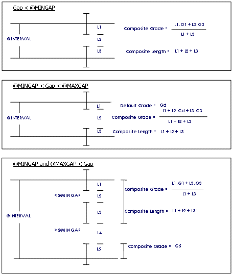

# COMPBE Process

To access this process:

  * **Sample Analysis** ribbon **> > Prepare Samples >> Composite >> Composite Over Benches**.
  * View the **[Find Command](<../COMMON/findcommand.md>)** screen, select **COMPBE** and click **Run**.
  * Enter "COMPBE" into the [Command Line](<../COMMON/Command_Toolbar.md>) and press <ENTER>.

See this process in the [Command Table](<../command_help/_COMMAND%20TABLE_C.md#COMPBE>).

## Process Overview

Composites drillhole data over horizontal benches.

The input file must be in a standard sample format (as output by process [DESURV](<desurv.md>)). The output file is in an identical format. Up to a maximum of 20 explicit numeric data fields may be composited. These do not have to be specified; they are identified by the process as those fields which are not the standard ones (**BHID** , **X** , **Y** , **Z** , **LENGTH** , **A0** , **B0** , **C0** , **RADIUS** , **FROM** , **TO**).

The compositing method is shown in Figure 1. The drillholes are split exactly on horizontal bench elevations, unless the hole ends within a boundary, or the composite becomes longer than a specified length (by default twice the bench height). In the latter case, composites are split into the units of the maximum permitted length. Composites less than a specified minimum length (by default half the bench height) are ignored.

A reference elevation is given by parameter @**ELEV** and a bench height by parameter @**INTERVAL**.

If there is a gap between samples of less than or equal to a specified distance (parameter @**MINGAP**) it will be ignored; that is, the missing part will be assigned the grades of the whole composite. Any gap greater than this, but less than or equal to the parameter @**MAXGAP** , will be replaced by a dummy sample with the default values specified in the file. A gap larger than @**MAXGAP** will be taken to terminate the composite.

If the total length of samples with non-absent grade values within a composite is greater than @**MINCOMP** , then the average grade of those samples is assigned to that grade field for the entire composite. If the total length of samples with non-absent grade values within a composite is less than @**MINCOMP** , then that grade field is assigned an absent data value for the entire composite. For example: FROM TO AU 31.00 31.39 15.2 31.39 32.00 absent If @MINCOMP=0.1, this is less than the assayed length of 0.39 and so the grade of 15.2 is assigned to the whole composite. If @**MINCOMP** = 0.5, this is greater than the assayed length of 0.39 and so the absent data grade of - is assigned to the whole composite.

Note: A progress message is displayed for every 500 samples read.

The file must be in the order of **BHID** and **FROM** , i.e. sorted in drillhole order in increasing downhole distance. This is the order output from the [DESURV](<desurv.md>) and [HOLES3D](<holes3d.md>) processes.

Compositing method used by COMPBE

### Weighting by density

If a density field exists in the file then this may be used to for density weighted compositing. The density field is defined as the optional field *DENSITY. If any density value is absent data then the default density value will be used.

### Weighting by core loss or recovery

To include the effects of core loss, the user may specify one of two optional fields * **CORELOSS** (core loss as a percentage) or * **COREREC** (core recovery as a percentage) to be used during compositing. The lost portion of the core will be taken into account and used in compositing. The actual treatment depends on the optional @LOSS parameter. If @LOSS<=0 (default) then the lost part of the core will be assumed to have exactly the same grades, properties etc. as the recovered part; in other words, the core loss is ignored.

If however @LOSS=1 then the lost core will be assumed to have default grades, density, properties etc. which will be averaged with the recovered core values. If @LOSS>=2 then the lost core will be treated as cavity (zero density and grades) so that the grade of the total sample is effectively reduced by the cavity.

## Input Files

Name |  Description |  I/O Status |  Required |  Type  
---|---|---|---|---  
IN |  Sample data file, sorted on BHID and FROM. Expects fields BHID, FROM, TO, LENGTH, X, Y, Z, A0, B0. |  Input |  Yes |  Drillhole  
  
## Output Files

Name |  I/O Status |  Required |  Type |  Description  
---|---|---|---|---  
OUT |  Output |  Yes |  Drillhole |  Composite file.  
  
## Fields

Name |  Description |  Source |  Required |  Type |  Default  
---|---|---|---|---|---  
BHID |  Drillhole identifier. |  IN |  No |  Any |  BHID  
FROM |  Downhole distance to sample top. |  IN |  No |  Numeric |  FROM  
TO |  Downhole distance to sample bottom. |  IN |  No |  Numeric |  TO  
DENSITY |  If present, composites will be density-weighted |  IN |  No |  Numeric |  DENSITY  
CORELOSS |  If present, will be taken as percentage core loss, and treated according to the LOSS parameter. |  IN |  No |  Numeric |  CORELOSS  
COREREC |  If present, will be taken as percentage core recovery, (100-core loss) and treated according to the LOSS parameter. |  IN |  No |  Numeric |  COREREC  
ZONE |  Name of field for compositing within. (may be numeric or up to 4 character alpha). This field must exist in the IN and will be copied to the OUT file. If specified then new composites will be created each time the value of ZONE changes. |  IN |  No |  Any |  Undefined  
  
## Parameters

Name |  Description |  Required |  Default |  Range |  Values  
---|---|---|---|---|---  
INTERVAL |  Bench height. |  Yes |  Undefined |  Undefined |  Undefined  
MINGAP |  Gap length to be ignored. The default gap is calculated as 0.05 INTERVAL. This default value is applied if the parameter is not specified, or if the value is specified as <=0. A gap of exactly zero is not permitted. If you want the composite to be split at every gap, use a very small value for MAXGAP eg 0.0001. |  No |  0.05 |  Undefined |  Undefined  
MAXGAP |  Gap length for termination of composite (0). |  No |  0 |  Undefined |  Undefined  
ELEV |  Reference bench elevation (0). |  No |  0 |  Undefined |  Undefined  
MINCOMP |  Minimum composite length [0.5 INTERVAL]. |  No |  Undefined |  Undefined |  Undefined  
MAXCOMP |  Maximum composite length [2.0 INTERVAL]. |  No |  Undefined |  Undefined |  Undefined  
LOSS |  If core loss or core recovery field is present, controls how it is handled: |  Option |  Description  
---|---  
0 |  Treat loss as part of sample.  
1 |  Treat loss as default values.  
2 |  treat as cavity [zero density and grades]  
No |  0 |  0,2 |  0,1,2  
PRINT |  >2 to display each composite and output file DD (0). |  No |  0 |  0,2 |  0,1,2  
  
## Example
    
    
    !COMPBE &IN(BHOLES.D), &OUT(COMPS.4), @INTERVAL=4, @ELEV=   
  
---  
      
    
             35  
      
    
       
      
    
    >>> 170 SAMPLES INPUT <<< >>> 67 COMPOSITES   
      
    
     OUTPUT <<<  
  
## Error and Warning Messages

Message |  Description  
---|---  
>>> ERR 122 <<< ( fileno) IN COMPBE |  Missing essential fields in input sample file or there are more than 20 explicit numeric datafields for compositing. Fatal; the process is exited.  
>>> ERR 124 <<< ( fileno) IN COMPBE |  The composite length specified in @**INTERVAL** is negative or zero. Fatal; the process is exited.  
>>> ERR 130 <<< ( 0) IN COMPBE |  The maximum acceptable composite length specified in @**MAXCOMP** is less than the required composite length specified in @**INTERVAL**. Fatal; the process is exited.  
>>> ERR 131 <<< ( 0) IN COMPBE |  The maximum acceptable composite length specified in @**MAXCOMP** is less than the minimum acceptable composite length specified in @**MINCOMP**. Fatal; the process is exited.