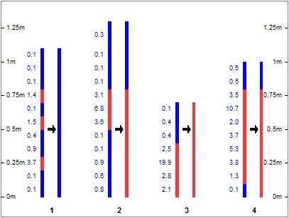
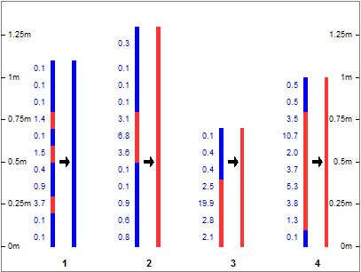
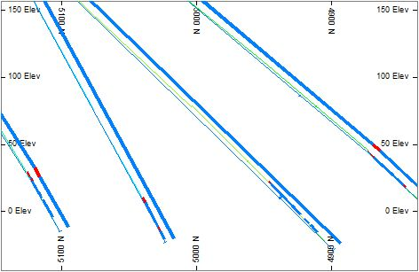

# COMPSE Process  
  
To access this process:

  * **Geology** ribbon **> > Composites >> Optimised Ore/Waste**.
  * View the **[Find Command](<../COMMON/findcommand.md>)** screen, select **COMPSE** and click **Run**.
  * Enter "COMPSE" into the [Command Line](<../COMMON/Command_Toolbar.md>) and press <ENTER>.

See this process in the [Command Table](<../command_help/_COMMAND%20TABLE_C.md#COMPSE>).

## Process Overview

Composites drillhole data by optimizing the composite interval using ore and waste criteria.

The input file must be in standard drillhole sample format (as output by the processes [DESURV](<desurv.md>) and [HOLES3D](<holes3d.md>)).

The output file OUT has a similar format as in the input file. The compositing depends on whether a specified numeric field in the input file is above or below a specified cutoff. This file contains samples which have the FROM and TO values of the composited samples. It will generally have fewer samples than the input file. This file is useful to analyse the number of ore and waste composites that have been identified, but it should be noted that if the input file has non-straight holes the curvature may be lost in this file.

The HOLESOUT file contains the same number of records and the same sample geometry as in the input file but has composited grade values. It may also have the optional OWCODE field which flags whether a sample is ore (OWCODE=1) or waste (OWCODE=0). This file is particularly useful when the input file contains non-straight holes. Any curvature is lost in the OUT file which contains just the composited FROM and TO values.

To compare the input grades with composited grades a copy of the VALUE grade field can be made before using **COMPSE** , e.g. by using the [EXTRA](<extra.md>) process.

It is possible that some output composite samples will have a grade value greater than the **CUTOFF** but be flagged as waste due to internal waste or minimum ore width constraints.

Up to 50 explicit numeric fields may be composited at the same time, and written to the OUT file, but they have no influence on which intervals are grouped together. These extra fields do not have to be specified; they are identified by the process as those numeric fields which are not the standard ones. Standard field names are: BHID, X, Y, Z, LENGTH, A0, B0, C0, RADIUS, FROM, TO.

A maximum of 5,000 samples per hole can be composited.

### COMPSE Rules

The following notes describe the rules used by **COMPSE** to determine the ore and waste composites.

Flag all samples as either ore or waste according to cutoff. Samples with a value greater than or equal to **CUTOFF** are flagged as ore. The remaining samples are flagged as waste. (Note if the **MINGLEN** parameter is set then samples with a length*value > **MINGLEN** are also flagged as ore).

##### Rule 1

  1. Loop through all samples and find all candidate groups of three samples that can be combined with the following configuration:

     1. Wide ore - Narrow waste - Any ore
     2. Any ore - Narrow waste - Wide ore
  2. Select the candidate group with the highest grade and composite into a new ore sample.
  3. Keep executing Rule 1 until no candidate groups remain.
  4. If NARWASTE=2 then the three samples are only considered as a candidate if both adjacent ore samples can independently carry the waste. If NARWASTE=1 then the three samples are considered as a candidate as long as either ore can carry the waste.
  5. Go to Rule 2.

##### Rule 2

  1. Loop through all samples (those composited after rule 1) and look for candidates of 3 samples with the following configuration: 
     1. If ANYORE2=0 : Narrow ore \- Narrow waste - Narrow ore
     2. If ANYORE2=1: Any ore - Narrow waste - Any ore
  2. If **NARWASTE** =2 then the three samples are only considered if both adjacent ore samples can independently carry the waste. If **NARWASTE** =1 then the three samples are considered as a candidate as long as either adjacent ore can carry the waste.
  3. Select the candidate with the highest grade and composite into a new ore sample.
  4. If a candidate sample was found and converted go back to Rule 1.
  5. Go to Rule 3.

##### Rule 3

  1. If **DILUTE** =0 go to Rule 4.
  2. Loop through all samples and see if any narrow ore composites can be combined with adjacent waste samples to create a diluted ore composite. Convert the one with the highest grade. 
     1. Waste - Narrow ore
     2. Narrow ore - Waste
  3. Go to Rule 1.

##### Rule 4

  1. Change any narrow ore composites to be waste and combine with adjacent waste samples.
  2. Go to Rule 5.

##### Rule 5

  1. If DILUTE=0 then finish
  2. For any narrow waste composites find the adjacent ore with the smallest value of length*grade and change it to waste.
  3. Composite the two samples.
  4. Repeat until no narrow waste composites are found.
  5. Finish

### Notes

  * DILUTE=1 will tend to create longer composites of lower grade. It is more aggressive DILUTE=0.
  * NARWASTE=1 will tend to create longer composites of lower grade. It is more aggressive than NARWASTE=2
  * ANYORE2=1 will tend to combine more samples. It is more aggressive than ANYORE2=0
  * DILUTE=1 triggers rules 3 and 5 which are more mining based; they remove narrow samples. 
  * Rule 4, which converts narrow ore composites to waste is always applied.

## Input Files

Name |  Description |  I/O Status |  Required |  Type  
---|---|---|---|---  
IN |  Input sample file, in BHID and FROM order. This must contain the fields BHID,X,Y,Z,FROM,TO and LENGTH |  Input |  Yes |  Drillhole  
  
## Output Files

Name |  I/O Status |  Required |  Type |  Description  
---|---|---|---|---  
OUT |  Output |  Yes |  Drillhole |  Output file of ore and waste composites.  
  
## Fields

Name |  Description |  Source |  Required |  Type |  Default  
---|---|---|---|---|---  
VALUE |  Numeric value field used to control compositing. This may be a grade or a calculated equivalent value from grades of different metals. |  IN |  Yes |  Numeric |  Undefined  
ZONE |  Name of optional field for compositing within. This field must exist in the input file and can be numeric or alpha. It will be copied to the output file. If specified then new composites will be created every time the value of ZONE changes. |  IN |  No |  Numeric |  Undefined  
OWCODE |  Output field to contain an Ore/Waste Flag. This will contain values of zero for waste samples and values of one (1) for Ore samples. It is possible that some output composite samples will have a grade value greater than the CUTOFF but be flagged as waste due to internal waste or minimum ore width constraints. |  - |  No |  Alphanumeric |  Undefined  
  
## Parameters

Name |  Description |  Required |  Default |  Range |  Values  
---|---|---|---|---|---  
CUTOFF |  Minimum value of **VALUE** which is considered to be ore (0). |  Yes |  0 |  Undefined |  Undefined  
MINORE |  Minimum mining width for ore. This must be greater than zero. Output samples must be at least this long to be considered as ore, but see also the MINGLEN parameter. |  Yes |  Undefined |  Undefined |  Undefined  
MINGLEN |  Minimum value of sample length multiplied by **VALUE** that a sample must have to be considered to be ore. The default value is unset ( or zero ). A value of zero is treated as unset. This can be used to treat samples with a length below the minimum mining width as ore when they have a relatively high grade. |  No |  Undefined |  Undefined |  Undefined  
MAXWASTE |  Maximum width for internal waste (0.00001). This must be greater than zero. |  Yes |  0 |  Undefined |  Undefined  
MINASFR |  Minimum fraction of a composited interval which must be assayed for the average assayed value to be given to the composite. This only applies to the extra fields mentioned above. If **VALUE** is 'absent' in a particular record, its default value is used. (0.95) |  Yes |  0.95 |  0,1 |  Undefined  
DILUTE |  Attempt to dilute composites to remove samples with a length less than the minum ore or minimum waste lengths. =0 : Do not attempt to dilute samples. This is more conservative.. =1 : Attempt to dilute narrow ore samples with adjacent waste and narrow waste samples with adjacent ore. This is the more aggressive option and will tend to create longer ore composites of lower grade.  
|  Yes |  1 |  0,1 |  0,1  
NARWASTE |  Test for carrying narrow waste to be applied to either [1] or both [2] adjacent ores (1). =1 : When compositing samples with configuration: ore - Narrow waste - ore, then proceed if either adjacent ore sample can carry the internal waste. This is the more aggressive option and will tend to create longer ore composites of lower grade.. =2 : When compositing samples with configuration: ore - Narrow waste - ore, then proceed only if both adjacent ore samples can independently carry the internal waste. |  Yes |  1 |  1,2 |  1,2  
ANYORE2 |  When applying rule 2 (see start of this Help file) specify whether narrow waste is composited with adjacent narrow ore or wide ore. =0 : When applying Rule 2 composite samples with configuration: Narrow ore - Narrow waste - Narrow ore. =1 : When applying Rule 2 composite samples with configuration: Any ore - Narrow waste - Any ore. This is the more aggressive option and will tend to create longer ore composites of lower grade.. |  Yes |  1 |  0,1 |  0,1  
  
## Examples

### Example 1 - narrow deposit

In the following example of a narrow metalliferous deposit, **COMPSE** is used to define a mining cut, using face sampling data. The following parameters are used:

  * cutoff grade value: 1.2g/t

  * minimum mining width: 0.8m

  * maximum internal waste width: 0.25m

  * minimum assay fraction: 0.95 (default)

  * dilution (@**DILUTE** =1)

  * narrow waste (@**NARWASTE** =1).

The following image shows pairs of face sample lines that have been processed using **COMPSE** , using the above parameters. In each displayed pair, the original samples are situated on the left, coloured red (>1.2g/t) or blue (<1.2g/t); the **COMPSE** processed samples are on the right, coloured using the same legend. Looking at the output COMPSE results:

  * When calculating the composites, the waste dilution is added in the order of the **FROM** sample field; here the lower **FROM** values start at the bottom of each sample line

  * For all sample lines, the output sample line is as long as the input i.e. the total length remains the same for each

  * Sample line 1, colored blue, falls below the defined cutoff grade of 1.2g/t

  * Sample line 2 consists of a lower 0.8m ore composite (diluted with waste from below) and an upper waste composite

  * Sample line 3 consists of a single 0.7m ore composite

  * Sample line 4 has the same makeup as in sample line 2

  * All output ore composites are less than (if the input sample line is less than @**MINORE** but greater than the cutoff grade) or equal to the defined minimum mining width (@**MINORE** parameter).

;>)

Pairs of original and COMPSE processed face samples, @DILUTE=1.

Changing the dilution parameter, so that @**DILUTE** =0, yields the following results, where some of the output ore composites are greater than the defined minimum mining width, diluted with waste, as long as the average grade is above cutoff:

;>)

Pairs of original and COMPSE processed face samples, @DILUTE=0.

### Example 2 - massive deposit

In the following example, the drillholes have been coloured using a 3.25 AU grade cutoff and composited using a minimum mining width of 5m and a cutoff of 3.25. The output composites are shown, for Section 6062 E, to the right of each drillhole:

;>)

The example macro code for generating the above output is shown below.
    
    
    !COMPSE &IN(_VB_HOLES), &OUT(BCOMP1), *VALUE(AU),   
  
---  
      
    
             @CUTOFF=3.25,  
      
    
    @MINORE=5.0, @MAXWASTE=0.75, @MINASFR=0.95, @DILUTE=1.0,   
      
    
    @NARWASTE=1.0  
      
    
       
      
    
    >>>  21 SAMPLES   
      
    
     REDUCED TO 3 COMPOSITES IN VB4294  
      
    
    >>>  19 SAMPLES REDUCED TO 1 COMPOSITES IN VB4295  
      
    
    >>>  54 Records in File C:\Database\Workarea\bcomp1.dm   
      
    
     <<<  
      
    
    >>>  757 SAMPLES INPUT <<<  
      
    
    >>>  54 COMPOSITES OUTPUT <<<  
  
## Error and Warning Messages

Message |  Description |  Solution  
---|---|---  
>>> ERR 120 <<< ( 1) IN COMPSE  
|  General file error. |  Check file contents.  
>>> ERR 122 <<< ( 1) IN COMPSE  
|  Missing essential fields in input sample file. Fatal; the process is exited. |  Check input sample file fields.  
>>> ERR 124 <<< ( 1) IN COMPSE |  There are more than 20 numeric fields in the input file, not counting the standard desurvey fields.  |  Reduce the number to 20 or less and try again.  
>>> ERR 130 <<< ( 1) IN COMPSE  
|  Minimum ore width is less than or equal to zero. |  Define ore width greater than zero.  
>>> ERR 131 <<< ( 1) IN COMPSE  
|  Minimum waste width is less than or equal to zero. |  Define waste width greater than zero.  
>>> ERR 132 <<< ( 1) IN COMPSE  
|  Minimum assayed fraction @**MINASFR** not in range 0.0 to 1.0 |  Define @**MINASFR** to be in range 0.0 to 1.0.  
>>> ERR 133 <<< ( 1) IN COMPSE  
|  Field supplied for * **VALUE** does not appear in input file. |  Reduce the number to 20 or less and try again.