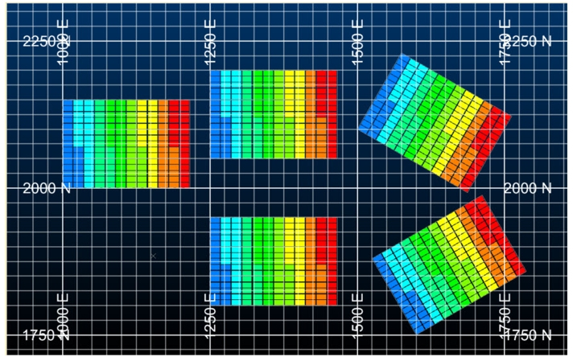

# COPYMOD Process  
  
To access this process:

  * **Model** ribbon **> > Reposition >> Reposition**.
  * View the **[Find Command](<../COMMON/findcommand.md>)** screen, select **COPYMOD** and click **Run**.
  * Enter "COPYMOD" into the [Command Line](<../COMMON/Command_Toolbar.md>) and press <ENTER>.

See this process in the [Command Table](<../command_help/_COMMAND%20TABLE_C.md#COPYMOD>)

## Process Overview

**Note** : This is a _superprocess_ and running it may have an effect on other Datamine files in the project.

**Note** : This process supports **[retrieval criteria](<../COMMON/Retrieval_Criteria_Overview.md>)**.

Copy a normal or rotated model to a rotated or normal model with different origin and/or rotations.

The **COPYMOD** process creates a copy of a model using both translation and rotation. This can be summarised as one of four types using the @**MODTYPE** parameters:

MODTYPE | Input Model | Output Model | Comment  
---|---|---|---  
1 | Normal | Normal | Translation only  
2 | Normal | Rotated | Apply translation and rotation  
3 | Rotated | Normal | Remove rotated  
4 | Rotated | Rotated | Apply translation and rotation  
  
#### Rotated Models

A rotated model file includes information on two grids the world (normal) grid and the local (rotated) grid. The normal origin, [**XYZ**]0, and rotated origin, [**XYZ**]**MORIG** , fields together with the rotation angles, **ANGLE**[**123**], and axes, **ROTAXIS**[**123**], provide the relationship between the two grids. 

The **XC** , **YC** and **ZC** fields in a rotated model file hold the cell centre coordinates for the local (rotated) grid. It is sometimes helpful to see the corresponding coordinates in the world (normal) grid. When using **MODTYPE** s 2 and 4 the **COPYMOD** process allows the world coordinates to be added to the output model. This is done by specifying names for the coordinate fields - * **XWORLD** , * **YWORLD** and * **ZWORLD**.

In order to add world coordinates to an existing model use **MODTYPE** 4 but do not select any of the nine parameters **[XYZ**]**NEWORIG** , **AXIS**[**123**] and **ROTAXIS**[**123**], but do specify field names for the three [**XYZ**]**WORLD** fields. The output model will then be an exact copy of the input model but with the addition of the three world coordinate fields.

## Input Files

Name |  I/O Status |  Required |  Type |  Description  
---|---|---|---|---  
MODELIN |  Output |  Yes |  Block Model File |  Input model prototype This is a standard block model file containing the 13 compulsory fields. It may also contain the rotated model fields.  
  
## Output Files

Name |  I/O Status |  Required |  Type |  Description  
---|---|---|---|---  
MODELOUT |  Output |  Yes |  Block Model File |  Output model containing estimated MIK grades, etc.  
  
## Fields

Name |  Description |  Source |  Required |  Type |  Default  
---|---|---|---|---|---  
XWORLD |  X coordinate of sample data in **SAMPLES** file. If not specified, then XPT is assumed. |  IN |  No |  Numeric |  Undefined  
YWORLD |  Y coordinate of sample data in **SAMPLES** file. If not specified, then YPT is assumed. |  IN |  No |  Numeric |  Undefined  
ZWORLD |  Z coordinate of sample data in **SAMPLES** file. If not specified, then ZPT is assumed. |  IN |  No |  Numeric |  Undefined  
  
## Parameters

Name |  Description |  Required |  Default |  Range |  Values  
---|---|---|---|---|---  
MODTYPE |  Output Model Type

  1. Copy a normal model to a normal model in a different location
  2. Copy a normal model to a rotated model in a different location and rotation
  3. Copy a rotated model to a normal model in a different location
  4. Copy a rotated model to a rotated model in a different location and rotation

|  No |  1 |  1,4 |  1,2,3,4  
X/Y/ZNEWORIG |  **X/Y/Z** coordinate of the origin of the output model in the world coordinate system.  |  No |  Input model world X/Y/Z origin |  Undefined |  Undefined  
ANGLE1/2/3 |  First/second/third rotation angle, clockwise in degrees, around axis **ROTAXIS1/2/3**. A value of zero or absent indicates no rotation. (0). |  No |  0 |  -360,360 |  Undefined  
ROTAXIS1/2/3 |  Axis around which first/second/third rotation angle will occur. 0 for no rotation, 1 for X axis, 2 for Y axis, 3 for Z axis (3). |  No |  3 (**ROTAXIS1**) 1 (**ROTAXIS2**) 2 (**ROTAXIS3**) |  0,3 |  0,1,2,3  
  
## Example
    
    
    !START M1       Create   
  
---  
      
    
     examples for all four values of MODTYPE# @MODTYPE=1  Copy normal   
      
    
     model to normal model  
      
    
    !COPYMOD &MODELIN(Test_Model),   
      
    
       &MODELOUT(MODELOUT1),  
      
    
    @MODTYPE=1,  
      
    
    @XNEWORIG=1250,   @YNEWORIG=2050,   
      
    
       @ZNEWORIG=3000  
      
    
    # @MODTYPE=2  Copy normal   
      
    
     model to rotated model  
      
    
    !COPYMOD &MODELIN(Test_Model),   
      
    
       &MODELOUT(TEMP1),  
      
    
    *XWORLD(WXC),   *YWORLD(WYC),   
      
    
       *ZWORLD(WZC),  
      
    
    @MODTYPE=2,  
      
    
    @XNEWORIG=1500,   @YNEWORIG=2100,   
      
    
       @ZNEWORIG=3000,  
      
    
    @ANGLE1=30,   @AXIS1=3   
      
    
       
      
    
        
      
    
    # SORT is only required so that   
      
    
     the same default legends are used automatically in all 5 models     
      
    
    !SORT  &IN(TEMP1), &OUT(MODELOUT2),   
      
    
     *KEY1(IJK), *KEY2(ABC)  
      
    
    # MODELOUT2 now becomes the input   
      
    
     model for the next two runs of COPYMOD  
      
    
    # @MODTYPE=3  Copy rotated   
      
    
     model to normal model  
      
    
    !COPYMOD &MODELIN(MODELOUT2),   
      
    
       &MODELOUT(MODELOUT3),  
      
    
    @MODTYPE=3,  
      
    
    @XNEWORIG=1250,   @YNEWORIG=1800,   
      
    
       @ZNEWORIG=3000  
      
    
        
      
    
    # @MODTYPE=4  Copy rotated   
      
    
     model to rotated model  
      
    
    !COPYMOD &MODELIN(MODELOUT2),   
      
    
       &MODELOUT(MODELOUT4),  
      
    
    @MODTYPE=4,  
      
    
    @XNEWORIG=1600,   @YNEWORIG=1750,   
      
    
       @ZNEWORIG=3000,  
      
    
    @ANGLE1=-30,  @AXIS1=3    
      
    
    !END  
  
;>)

Model Location | Model File  
---|---  
Top left | Test_Model (input)  
Top centre | MODELOUT1  
Top right | MODELOUT2  
Bottom centre | MODELOUT3  
Bottom right | MODELOUT4