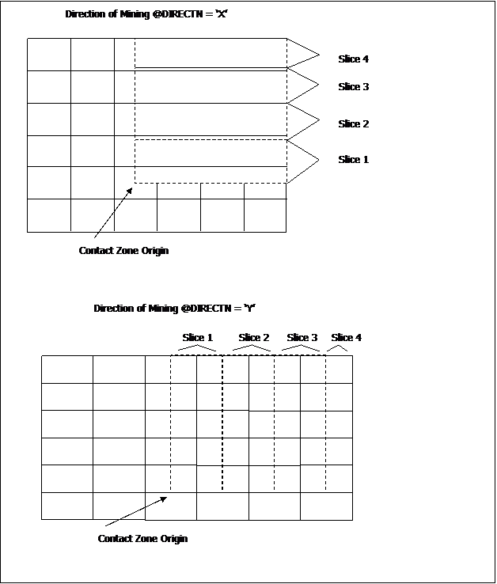
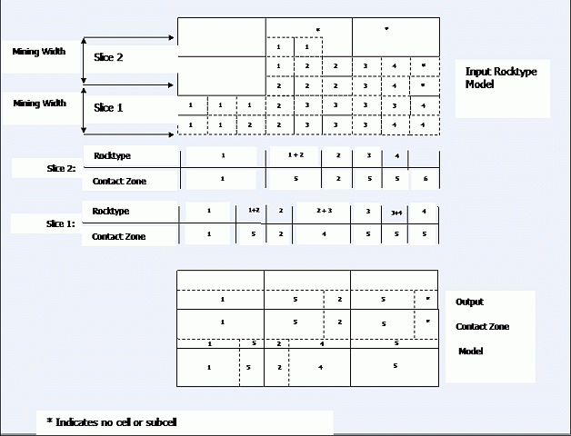

# COZONE Process  
  
To access this process:

  * View the **[Find Command](<../COMMON/findcommand.md>)** screen, select **COUNT** and click **Run**.
  * Enter "COUNT" into the [Command Line](<../COMMON/Command_Toolbar.md>) and press <ENTER>.

See this process in the [Command Table](<../command_help/_COMMAND%20TABLE_C.md#COZONE>)

## Process Overview

The process allows the user to investigate the relationship between mining parameters (bench height, minimum mining width, direction of mining, bench reference elevation) and the rocktype composition of each mining volume, or contact zone.

Contact zones are defined in terms of the constituent rocktypes; eg, zone 1 contains rocktypes 1, 3 and 7; and zone 2 rocktype 2 and 3, and zone 3 just rocktype 2.

The process requires as input a geological model with a numeric rocktype field, and calculates volumes categorized by contact zone. An optional output model may be produced, giving the contact code for each cell of the input model. The output contact zone model may be added to the original grade/rocktype model using process **[ADDMOD](<addmod.md>)** to create a combined model. (Note that the contact zone model must be first sorted on IJK before **ADDMOD** is used). This combined model may then be evaluated using process **[MODRES](<modres.md>)** and the results tabulated using process TABRES, to give grades and tonnages within user-defined perimeters for each contact zone category on each mining bench.

The starting point for contact zone modeling (the contact zone origin) is defined by the optional parameters @**CZXORIG** , @**CZYORIG** and @**CZZORIG**. All cells and sub-cells in the model with X, Y and Z co-ordinates greater than these values will then be classified by contact zone. Upper limits on cells and sub-cells may be imposed by using retrieval criteria on the XC, YC and ZC cell centre values (lower limits can also be imposed this way as well). Default values for these three parameters are the model origin coordinates.

The user defines a minimum mining width, a mining bench height, and a direction of mining. These are independent of the basic cell dimensions of the input rocktype model, and are defined using the parameters @**CZMWID** , @**CZBHHT** and @**DIRECTN**. The benches and mining widths must be parallel to the model axes.

Contact zones are defined using interactive prompting. Zones are numbered, starting at 1, with a maximum number of user definable zones of 18. For each zone the user must supply between 1 and 10 numeric rocktype codes. These are the rocktype codes which have been used in the input model. Although any numeric values are permitted, for the purpose of formatting it is best to restrict values to the range of -999.9 to 9999.9, using a maximum of one decimal place. Contact zones may be defined as any combination of rocktype codes; e.g.
    
    
    CONTACT ZONE 1 >1  
    CONTACT ZONE 2 >1,2  
    CONTACT ZONE 3 >1,4,8,2,99  
    CONTACT ZONE 4 >8,1

However many zones the user has defined (N), a further two zones will always be added.

  * N+1 - to include all other rocktype combinations.

  * N+2 - to include material which has not been specifically modelled, i.e. volumes in the input model where there are no cells or sub-cells.

Volumes will be reported for all N+2 contact zones. However, cells or sub-cells which are in contact zone N+2 are not included in the output model.

There is a maximum of 15 different rocktypes which may be included in the definition of all contact zones. In the above example 5 rocktype codes are used (1, 2, 4, 8 and 99).

The process works through the input model starting at the contact zone origin, completing one bench before starting the next. Within a bench each mining slice is completed before the next is started, as illustrated in Figure 1. The next cell or sub-cell boundary is identified and a vertical plane is drawn from the top to the bottom of the bench perpendicular to the mining slice. The rocktype code for all material lying immediately ahead of this plane (or face) is identified and the material classified according to contact zone. The vertical plane is advanced and the process repeated until the contact zone changes. The rectangular volume enclosed by the two vertical planes, the bench top and bottom, and the slice sides is split into a cell and sub-cell structure consistent with the model parameters of the input model, and written to the output model file. The process is repeated for every slice and every bench. 

An example of contact zone definition is shown in Figure 2. Although this is shown in two dimensions for ease of illustration, the rules are applied in all three dimensions.

;>)

_Mining slices within a bench_

;>)

Subcell structures in input and output models

## Input Files

Name |  Description |  I/O Status |  Required |  Type  
---|---|---|---|---  
IN |  Model containing rock-type information in the form of a numeric rocktype code. The model must also contain at least the fields **XC, YC, ZC, XINC, YINC, ZINC, XMORIG, YMORIG, ZMORIG, NX, NY, NZ, IJK**. |  Input |  Yes |  Block Model  
  
## Output Files

Name |  I/O Status |  Required |  Type |  Description  
---|---|---|---|---  
OUT |  Output |  No |  Undefined |  Output contact zone model. This will contain the standard 13 model fields plus a field named CONTZONE - the numeric contact zone code.  
  
## Fields

Name |  Description |  Source |  Required |  Type |  Default  
---|---|---|---|---|---  
ROCKCODE |  Name of field in input model file containing rocktype code. |  IN |  Yes |  Any |  Undefined  
  
## Parameters

Name |  Description |  Required |  Default |  Range |  Values  
---|---|---|---|---|---  
CZXORIG |  X co-ordinate of start point for contact zone definition.Default=input model X origin |  No |  Undefined |  Undefined |  Undefined  
CZYORIG |  Y co-ordinate of start point for contact zone definition.Default=input model Y origin |  No |  Undefined |  Undefined |  Undefined  
CZZORIG |  Z co-ordinate of start point for contact zone definition.Default=input model Z origin |  No |  Undefined |  Undefined |  Undefined  
CZMWID |  Mining width as measured along either X or Y axis direction of model, depending on the **DIRECTN** parameter. Default is the cell size in the direction parallel to the mining face. That is, **YINC** if **DIRECTN** ='X' , **XINC** if **DIRECTN** ='Y' |  No |  Undefined |  Undefined |  Undefined  
CZBHHT |  Bench height increment as measured vertically upwards from CZZORIG.Default is Z direction cell size [ZINC] of the input model |  No |  Undefined |  Undefined |  Undefined  
DIRECTN |  Direction of face advance [either 'X' or 'Y'] with a default of 'X'; this is perpendicular to the direction in which the mining width **CZMWID** is measured. |  No |  'X' |  Undefined |  'X','Y'  
IJKSORT |  0 - do not sort output model IJK values 1 - sort output model on IJK values |  No |  1 |  0,1 |  0,1  
PRINT |  |  Option |  Description  
---|---  
0 |  for summary of input and total volumes by contact zone. =1 as 0 plus volumes by bench (0)  
No | 0 | 0,1 | 0,1  
  
## Example
    
    
    !COZONE &IN(ROCKMOD), &OUT(CZMOD),   
  
---  
      
    
    *ROCKCODE(ROCK), @CZZORIG=45,   
      
    
             @CZBHHT= 12,   
      
    
    @CZMWID=15, @PRINT= 1  
      
    
    CONTACT ZONE 1   
      
    
     >1  
      
    
    CONTACT ZONE 2 >3  
      
    
    CONTACT ZONE 3 >4  
      
    
    CONTACT ZONE 4 >1,3  
      
    
    CONTACT ZONE5><return>  
      
    
    INPUT MODEL PARAMETERS  
      
    
    ======================  
      
    
    X Y Z  
      
    
    MODEL ORIGIN 10.00 20.00 30.00  
      
    
    MODEL MAXIMUM100.00100.0080.00  
      
    
    > CELL DIMENSIONS 30.00 20.0010.00  
      
    
    NUMBER OF CELLS 3 4 5  
      
    
       
      
    
    CONTACT ZONE PARAMETERS  
      
    
    =======================  
      
    
    CONTACT ZONE X ORIGIN = 15.00  
      
    
    CONTACT ZONE Y ORIGIN = 25.00  
      
    
    CONTACT ZONE Z ORIGIN = 35.00  
      
    
    MINING WIDTH = 15.00  
      
    
    BENCH HEIGHT = 15.00  
      
    
    BENCH HEIGHT = 15.00  
      
    
    MINING DIRECTION SET PARALLEL TO Y AXIS OF MODEL  
      
    
    CONTACT ZONE DEFINITION  
      
    
    =======================  
      
    
    PLEASE ENTER NUMERIC ROCKTYPE CODES FOR EACH CONTACT ZONE.   
      
    
    SEPARATE ROCKTYPE CODES BY A COMMA EG, 2,5,11<RETURN>.   
      
    
    ENTER JUST <RETURN> TO END CONTACT ZONE DEFINITION.  
      
    
    MAX NUMBER OF CONTACT ZONES = 18  
      
    
    MAX NUMBER OF ROCKTYPES PER CONTACT ZONE = 10  
      
    
    MAX NUMBER OF DIFFERENT ROCKTYPES IN ALL ZONES = 15  
      
    
    CONTACT ZONE 1 > 1  
      
    
    CONTACT ZONE 2 > 2  
      
    
    CONTACT ZONE 3 > 3  
      
    
    CONTACT ZONE 4 > 4  
      
    
    CONTACT ZONE 5 > 1,2  
      
    
    CONTACT ZONE 6 > 1,3  
      
    
    CONTACT ZONE 7 >  
      
    
    8 CONTACT ZONES  
      
    
    ===============  
      
    
    CONTACT ZONE1 :1.0  
      
    
    > CONTACT ZONE2 :2.0  
      
    
    CONTACT ZONE3 :3.0  
      
    
    > CONTACT ZONE4 :4.0  
      
    
    CONTACT ZONE5 :1.02.0  
      
    
    > CONTACT ZONE6 :1.03.0  
      
    
    CONTACT ZONE7 : WILL CONTAIN ALL OTHER ROCKTYPE COMBINATIONS  
      
    
    > CONTACT ZONE8 : WILL CONTAIN ALL UNMODELLED VOLUMES  
      
    
    ARE THESE DEFINITIONS CORRECT ?  
      
    
    CONFIRM ? > OK  
      
    
    VIRTUAL ARRAY INITIALISED, SIZE = 180  
      
    
    >>> PLEASE WAIT - LOADING MODEL  
      
    
    >>> 93 RECORDS READ  
      
    
    >>> 3 BENCHES TO BE USED  
      
    
    >>> 6 MINING WIDTHS IN Y DIRECTION  
      
    
    VOLUMES BY CONTACT ZONE FOR BENCH 3 FROM ELEVATION 35.0 TO 50.0  
      
    
    ----------------------------------------------------------------------------  
      
    
    ZONE 1 - VOL23635.0ZONE 2 - VOL0.0     ZONE 3   
      
    
     - VOL0.0  
      
    
    ZONE 4 - VOL18000.0ZONE 5 - VOL11250.0ZONE 6 - VOL 0.0  
      
    
    > ZONE 7 - VOL27000.0ZONE 8 - VOL11250.0ZONE   
      
    
    VOLUMES BY CONTACT ZONE FOR BENCH 2 FROM ELEVATION 50.0 TO 65.0  
      
    
    ----------------------------------------------------------------------------  
      
    
    ZONE 1 - VOL     0.0ZONE 2 - VOL0.0ZONE 3 - VOL0.0  
      
    
    > ZONE 4 - VOL 95625.0ZONE 5 - VOL0.0ZONE 6 - VOL0.0  
      
    
    ZONE 7 - VOL     0.0ZONE 8 - VOL0.0ZONE  
      
    
    VOLUMES BY CONTACT ZONE FOR BENCH 1 FROM ELEVATION 65.0 TO 80.0  
      
    
    ----------------------------------------------------------------------------  
      
    
    ZONE 1 - VOL 0.0ZONE 2 - VOL     0.0ZONE 3 - VOL0.0  
      
    
    ZONE 4 - VOL0.0ZONE 5 - VOL     0.0ZONE 6 - VOL0.0  
      
    
    ZONE 7 - VOL0.0ZONE 8 - VOL95625.0ZONE  
      
    
    VOLUMES BY CONTACT ZONE FOR ALL BENCHES  
      
    
    ---------------------------------------------------------------------------  
      
    
    ZONE 1 - VOL  23635.0ZONE 2 - VOL      0.0ZONE   
      
    
     3 - VOL0.0  
      
    
    ZONE 4 - VOL 113625.0 ZONE 5 - VOL  11250.0 ZONE 6 - VOL0.0  
      
    
    ZONE 7 - VOL  27000.0ZONE 8 - VOL 106875.0 ZONE  
      
    
    >>> 128 RECORDS IN FILE OUTMODEL <<<  
      
    
    END OF PROCESS COZONE  
      
    
    -----------------------------------------  
      
    
    Remember to SORT the output model file on field IJK   
      
    
    before using process ADDMOD which will add the contact   
      
    
    zone definitions to the rocktype/grade model.   
  
## Error and Warning Messages

Message |  Description  
---|---  
101,n,CHKARR,F >>> ERROR: COMPULSORY INPUT FILE NOT SPECIFIED. |  Inconsistency between the system help file and the COZONE process.  
102,n,CHKARR,F >>> ERROR: COMPULSORY ROCKCODE FIELD NOT SPECIFIED. |  Inconsistency between the system help file and the COZONE process.  
102,n,CHKARR,F >>> ERROR: COMPULSORY FIELDS MISSING FROM INPUT FILE. |  The &IN file is not a correctly structured model file.  
>>> ERROR: INVALID BENCH HEIGHT 999999999.00. |  Zero or negative bench height entered.  
>>> ERROR: INVALID MINING WIDTH 999999999.99. |  Zero of negative mining width entered.  
>>> ERROR: CONTACT ZONE Z ORIGIN 99999.99 IS ABOVE THE TOP OF THE MODEL. |  The Z origin specified lies outside model as specified by the default value of the ZINC field and the number of cells NZ and the Z origin ZMORIG.  
>>> ERROR: CONTACT ZONE X OR Y ORIGINS 99999.99, 99999.99 ARE BEYOND THE LIMITS OF THE MODEL. |  The X or Y origin specified lies outside model as specified by the default values of the XINC or YINC fields and the number of cells NX or NY from the origin XMORIG or YMORIG.  
>>> ERROR: 999 BREAK POINTS CALCULATED. THIS IS PROBABLY CAUSED BY A NON STANDARD MODEL. PLEASE ENSURE THAT SUBCELLS DO NOT OVERLAP. |  Usually caused by a corrupt model.  
>>> ERROR: ROCKCODE FIELD MUST BE NUMERIC. USE PROCESS DECODE TO SET UP EQUIVALENT NUMERIC CODES. |  The specified field *ROCKCODE exists, but is alphanumeric.  
>>> ERROR: NO CONTACT ZONES DEFINED.  
>>> ERROR: ROCKTYPE FIELD IS IMPLICIT OR DOES NOT EXIST. |  All the above messages cause the process to exit. The following two messages are warnings, and cause the contact zone prompt to be repeated (first message) or the whole contact zone definition to be re-started (second message).  
>>> ERROR: NUMBER OF ROCKTYPES EXCEEDS 10\. RE-DEFINE CONTACT ZONE NUMBER 999.  
>>> ERROR: MORE THAN 15 DIFFERENT ROCKTYPES ARE INCLUDED IN THE DEFINITION OF THE 999 CONTACT ZONE. |