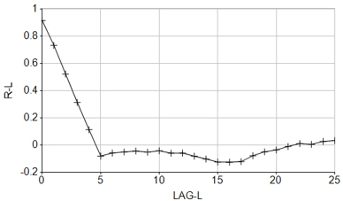

# CRSCOR Process  
  
To access this process:

  * **Sample Analysis** ribbon **> > Geochemical Processes >> Cross Correlation Analysis**.
  * View the **[Find Command](<../COMMON/findcommand.md>)** screen, select **CRSCOR** and click **Run**.
  * Enter "CRSCOR" into the [Command Line](<../COMMON/Command_Toolbar.md>) and press <ENTER>.

See this process in the [Command Table](<../command_help/_COMMAND%20TABLE_C.md#CRSCOR>)

## Process Overview

Cross correlation analysis is used to quantify and define anomalous thresholds and halo size on regularly-gridded soil sample lines. **CRSCOR** can also be used to measure dispersion limits in stream sediments, as long as fixed distances are used for sampling.

The process calculates the auto correlation function R-L of a single field against sample **DISTANCE** or **LAG**. By default, lag distance is used to calculate the auto correlation function. If sample distance, or a multiple of sample distance is required, use the parameter **SAMPDIST**.

This example shows the correlation reaches zero at a lag of 4.5:

Anomalous samples related to lag or sample distance (**LAG** or **DISTANCE**) are identified by strong and well defined peaks of R-L, the covariance between neighboring samples. Dispersion limits from mineralized for stream sediments are defined by breaks in slope along the stream sediment train as defined by LAG-L.

**Note** : There is a restriction of 4000 samples for a given line or dispersion train. For the analysis to be valid the data points must be equi-distant between each other. The two fields for cross correlation are entered interactively and they must have the same number of sample points within them.

## File Handling

The input file (&**IN**) must contain a sample identifier (@**SAMPID**) which is declared on input. There is an obligatory output file (&**OUT**) of results containing LAG-L, DISTANCE, R-L the cross correlation coefficient and **SIGNIF** the significance levels for each observation which can be viewed by the plotting processes such as **[QUIG](<quig.md>)** , **[PLOTDA](<plotda.md>)** and **[PLOTAN](<plotan.md>)**.

## Input Files

Name |  Description |  I/O Status |  Required |  Type  
---|---|---|---|---  
IN |  Input file. Must contain a sample identifier field. |  Input |  Yes |  Undefined  
  
## Output Files

Name |  I/O Status |  Required |  Type |  Description  
---|---|---|---|---  
OUT |  Output |  Yes |  Undefined |  Output file includes **LAG-L** , **DISTANCE** , **R-L** the cross correlation function and **SIGNIC** the significance of the cross correlation function for use in graphical processes.  
  
## Fields

Name |  Description |  Source |  Required |  Type |  Default  
---|---|---|---|---|---  
SAMPID |  Sample identifier field in input file. |  IN |  Yes |  Any |  Undefined  
F1 |  First variable for evaluation. If no variables are selected all variables will be processed. |  IN |  No |  Numeric |  Undefined  
F2 |  Second variable for evaluation. |  IN |  No |  Numeric |  Undefined  
F3 |  Third variable for evaluation. |  IN |  No |  Numeric |  Undefined  
F4 |  Fourth variable for evaluation. |  IN |  No |  Numeric |  Undefined  
F5 |  Fifth variable for evaluation. |  IN |  No |  Numeric |  Undefined  
F6 |  Sixth variable for evaluation. |  IN |  No |  Numeric |  Undefined  
F7 |  Seventh variable for evaluation. |  IN |  No |  Numeric |  Undefined  
F8 |  Eighth variable for evaluation. |  IN |  No |  Numeric |  Undefined  
F9 |  Ninth variable for evaluation. |  IN |  No |  Numeric |  Undefined  
F10 |  Tenth variable for evaluation. |  IN |  No |  Numeric |  Undefined  
  
## Parameters

Name |  Description |  Required |  Default |  Range |  Values  
---|---|---|---|---|---  
SAMPDIST |  |  Option |  Description  
---|---  
(0) |  Distance between sample points to calculate the cross-correlation function. If no distance is specified the sample distance is lag distance.  
No |  0 |  Undefined |  Undefined  
PRINT |  >0 Display results on the screen (0). |  No |  0 |  0,1 |  0,1  
  
## Example
    
    
    !CRSCOR &IN(L10), &OUT(L10CROSS), @SAMPID='ID',   
  
---  
      
    
             @SAMPDIST= 20  
  
Related topics and activities

  * [QUIG Process](<quig.md>)

  * [PLOTDA Process](<plotda.md>)

  * [PLOTAN Process](<plotan.md>)