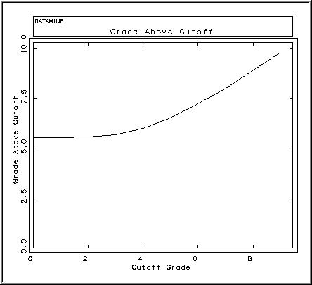

# CSMODEL Process

To access this process:

  * **Estimate** ribbon **> > Conditional Simulation >> Create**.
  * View the **[Find Command](<../COMMON/findcommand.md>)** screen, select **CSMODEL** and click **Run**.
  * Enter "CSMODEL" into the [Command Line](<../COMMON/Command_Toolbar.md>) and press <ENTER>.

See this process in the [Command Table](<../command_help/_COMMAND%20TABLE_C.md#CSMODEL>)

## Process Overview

**Note** : This is a _superprocess_ and running it may have an effect on other Datamine files in the project.

Create an output model, reserve or plot file based on percentile values, simulated points and cutoff grades.

The **CSMODEL** process does the following:

  * inputs a regular grid of simulated points (**POINTS**) as created by [SGSIM](<sgsim.md>) for multiple realizations.
  * inputs a file (**QUANTILE**) specifying a set of percentile values.
  * inputs a file (**CUTOFF**) specifying a set of cutoff grades.
  * creates an output model file (**SIMMOD**) by averaging the simulated points lying within each parent cell giving an average simulated grade for each realization
  * creates an output model file (**STATMOD**) giving statistics, quantiles and proportion and grade above cutoff for each parent cell.
  * creates an output reserves file (**RESERVES**) giving the tonnes, grade and metal above cutoff for the total model.
  * creates output plot files (**PLOT**) displaying the tonnes, grade and metal above cutoff against cutoff for the total model.

## Averaging Simulated Points 

The parameters describing the regular grid of simulated points are read from the default values of the implicit (non stored) fields in the input POINTS file, as created by the **SGSIM** process. These values are stored in terms of the equivalent block model.

Field |  Stored |  Description  
---|---|---  
XPT |  Yes |  X coordinate of simulated point  
YPT |  Yes |  Y coordinate of simulated point  
ZPT |  Yes |  Z coordinate of simulated point  
SIMNUM |  Yes |  The default value of **SIMNUM** must be set to the number of realizations in the input **POINTS** file. This is done automatically by **SGSIM**.  
{grade} |  Yes |  Simulated value  
XPPPC |  No |  Number of points per parent cell in the X direction  
YPPPC |  No |  Number of points per parent cell in the Y direction  
ZPPPC |  No |  Number of points per parent cell in the Z direction  
XMORIG1 |  No |  X origin of model  
YMORIG1 |  No |  Y origin of model  
ZMORIG1 |  No |  Z origin of model  
XINC1 |  No |  Parent cell size in the X direction  
YINC1 |  No |  Parent cell size in the Y direction  
ZINC1 |  No |  Parent cell size in the Z direction  
NX1 |  No |  Number of parent cells in the X direction  
NY1 |  No |  Number of parent cells in the Y direction  
NZ1 |  No |  Number of parent cells in the Z direction  
  
The default values of fields **XPPPC** , **YPPPC** and **ZPPPC** in the input **POINTS** file show the number of points per parent cell in each direction as specified for the **SGSIM** process. In terms of the model these correspond to the number of subcells per parent cell. Hence the first grid point has coordinates X,Y,Z where:
    
    
    X = XMORIG1 + 0.5*XINC1/XPPPC 
    
    
    Y = YMORIG1 + 0.5*YINC1/YPPPC    
    
    
    Z = ZMORIG1 + 0.5*ZINC1/ZPPPC

The number of points per parent cell may be changed by defining the parameters **XPPPC** , **YPPPC** and **ZPPPC**. If these parameters are undefined or set to zero, then the default field values from the input **POINTS** file are used. If these parameters are given positive values, then these values redefine the number of points per parent cell.

The **GRADE** values for each realization are averaged (arithmetic mean) over each parent cell.

## Output SIMMOD file

The output **SIMMOD** file is a block model containing the average **GRADE** value per realization for each cell. The model will only include parent cells - no subcells. The fields containing the simulated grades are named **SIM1** , **SIM2** , **SIM3** , ... for realization 1, 2, 3, ... Therefore the number of realizations that can be stored in a file is limited as described in the "Program Limits" section below.

Field |  Stored |  Description  
---|---|---  
IJK |  Yes |  IJK index  
XC |  Yes |  X coordinate of centre of parent cell  
YC |  Yes |  Y coordinate of centre of parent cell  
ZC |  Yes |  Z coordinate of centre of parent cell  
NPTS |  Yes |  Number of subcells (simulated points) averaged into a parent cell *  
SIM1, SIM2... |  Yes |  Simulated values  
SIMn |  Yes |  nth simulated value  
ETYPE |  Yes |  The average of all the SIMi values  
XINC |  Yes |  Parent cell size in the X direction  
YINC |  Yes |  Parent cell size in the Y direction  
ZINC |  Yes |  Parent cell size in the Z direction  
XMORIG |  No |  X origin of model  
YMORIG |  No |  Y origin of model  
ZMORIG |  No |  Z origin of model  
NX |  No |  Number of parent cells in the X direction  
NY |  No |  Number of parent cells in the Y direction  
NZ |  No |  Number of parent cells in the Z direction  
  
* If there are no absent data grade values then the number of subcells averaged into a parent cell will be **XPPPC** * **YPPPC** * **ZPPPC**. However if there was insufficient data to simulate all points then **NPTS** will be less than this value.

## Output STATMOD file

The output **STATMOD** file is a block model containing the statistical parameters of the distribution of average realizations for each cell. It has the same model parameters as the output **SIMMOD** file.

Field |  Stored |  Description  
---|---|---  
IJK |  Yes |  IJK index  
XC |  Yes |  X coordinate of centre of parent cell  
YC |  Yes |  Y coordinate of centre of parent cell  
ZC |  Yes |  Z coordinate of centre of parent cell  
NSAMPLES |  Yes |  The number of realizations  
MINIMUM |  Yes |  Minimum grade  
MAXIMUM |  Yes |  Maximum grade  
MEAN |  Yes |  Arithmetic mean grade  
VARIANCE |  Yes |  Variance  
STANDDEV |  Yes |  Standard deviation  
STANDERR |  Yes |  Standard error  
SKEWNESS |  Yes |  Skewness - the degree of asymmetry. Zero for normal distribution.  
KURTOSIS |  Yes |  Kurtosis - the degree of peakedness. Zero for normal distributon.  
NPTS |  Yes |  Number of subcells (simulated points) averaged into a parent cell  
PC2.5, PC10... |  Yes |  Percentiles (See quantiles)  
GA0 |  Yes |  Grade above cutoff of 0g/t (See cutoffs)  
GB0 |  Yes |  Grade below cutoff of 0g/t  
PA0 |  Yes |  Proportion above cutoff of 0g/t  
GA0.5 |  Yes |  Grade above cutoff of 0.5g/t  
GB0.5 |  Yes |  Grade below cutoff of 0.5g/t  
PAX.X |  Yes |  Proportion above cutoff of X.Xg/t  
GA9 |  Yes |  Grade above cutoff of 9g/t  
GB9 |  Yes |  Grade below cutoff of 9g/t  
PA9 |  Yes |  Proportion above cutoff of 9g/t  
XINC |  Yes |  Parent cell size in the X direction  
YINC |  Yes |  Parent cell size in the Y direction  
ZINC |  Yes |  Parent cell size in the Z direction  
XMORIG |  No |  X origin of model  
YMORIG |  No |  Y origin of model  
ZMORIG |  No |  Z origin of model  
NX |  No |  Number of parent cells in the X direction  
NY |  No |  Number of parent cells in the Y direction  
NZ |  No |  Number of parent cells in the Z direction  
  
## Quantiles

Each cell includes the percentile values as defined by the **PERCENT** field in the **QUANTILE** file or by the **QUANTILE** parameter. For example if the QUANTILE file contains the 5 records shown below, then the 5 fields P**C2.5** , **PC10** , **PC50** , **PC90** and **PC95** are created giving the 2.5 percentile, the 10 percentile, etc. The minimum simulated GRADE value is the 0 percentile and the maximum is the 100 percentile. These are recorded in the **MINIMUM** and **MAXIMUM** fields respectively. Linear interpolation between the actual values is used to calculate the percentiles.

**PERCENT**  
---  
2.5  
10  
50  
90  
95  
  
If a **QUANTILE** file is not specified then the quantiles are specified using the **QUANTILE** parameter which defines the number of percentiles minus 1. For example if **QUANTILE** = 5 then the 4 percentiles 20%, 40%, 60%, 80% are calculated; if **QUANTILE** = 8 then the 7 percentiles 12.5%, 25%, 37.5%, 50%, 62.5%, 75%, 87.5% are calculated. If **QUANTILE** = 2, the minimum, then just the 50% is calculated ie the median.

## Cutoffs

If cufoffs are specified using either the **CUTOFF** file or the **CUTOFF** parameter then 3 extra fields per cutoff will be created in the output STATMOD file. The names of the 3 fields have the format:

Field |  Description | Example  
---|---|---  
PAxxx |  Proportional of cell above or equal to cutoff xxx |  PA3.4  
GAxxx |  Grade of cell above or equal to cutoff xxx |  GA3.4  
GBxxx |  Grade of cell below cutoff xxx |  GB3.4  
  
The proportion above cutoff (PA) is the number of realized grade values above cutoff divided by the total number of realizations. The grade above cutoff (GA) is the average of those realizations above cutoff, and the grade below cutoff (GB) is the average of those realizations below cutoff. Hence:

GA * PA + GB * (1 - PA) = Mean grade of realizations in a cell.

## Output RESERVES file

The **RESERVES** file includes the following fields and includes one record per cutoff:

Field |  Description  
---|---  
CUTOFF |  Cutoff grade  
PRABOVE |  Proportion of the model above cutoff  
TONABOVE |  Tonnes above cutoff  
GRDABOVE |  Grade above or equal to cutoff  
GRDBELOW |  Grade below cutoff  
METABOVE |  Metal above cutoff (**GRDABOVE** * **TONABOVE**)  
  
This gives the average values over all cells in the model. If the RESCSV parameter is set to 1 then the file will also be output as a CSV file so that it can be read directly into Excel.

## Output PLOT files

Up to 4 plot files can be created showing:

X Axis |  Y Axis  
---|---  
Cutoff Grade |  Grade above cutoff  
Cutoff Grade |  Tonnes above cutoff  
\- units of 1000 tonnes  
Cutoff Grade |  Metal above cutoff  
\- units of 1000 tonnes * grade  
Cutoff Grade |  Tonnes above cutoff (left axis)  
Grade above cutoff (right axis)  
  
The plots are created directly from the **RESERVES** file. These are standard Datamine plot files that can be displayed using Tools | Display Plot File command. Example are given at the end of this section.

;>)

An example of a plot file displayed in the Graphics window, output from CSMODEL

The maximum length of the **PLOT** file name cannot be greater than 18 characters.

## Program Limits

  * Maximum number of quantiles = 30

  * Maximum number of decimal places defining quantile = 2

  * Maximum number of cutoff grades = 16

  * Maximum number of digits (including the decimal point) defining cutoff grades = 6

  * Maximum number of decimal places defining cutoff grades = 2

Number of Decimals |  Maximum Cutoff  
---|---  
0 |  999999  
1 |  9999.9  
2 |  999.99  
  
Note: The maximum number of fields in a legacy .dm file is 256 and for a .dmx file is 2048. See [Datamine File Formats](<../COMMON/Datamine-File-Format.md>).

The **SIMMOD** file has 13 model fields and uses 7 temporary fields. Hence if an output **SIMMOD** file is selected the maximum number of realizations for the single precision version is restricted to 44; for the double precision version 200 are allowed.

The number of fields in the output **STATMOD** file consists of:

Description |  Number of Fields  
---|---  
Model fields |  13  
Statistics fields |  10  
Quantile fields |  Q  
Cutoff fields |  3C  
  
Q is number of quantiles defined in the file or by parameter and C is the number of cutoffs. The total number of fields must be less than 64 (single precision) or 256 (double precision).

## System Files

_csmlog.txt |  Log file. Only useful if there is a problem.  
---|---  
_csm_*.txt |  Temporary system files. These will be deleted if the process terminates cleanly.   
_csm01.mac |  Temporary macro file.  
_sp*.dm | Temporary Datamine files. These will be deleted if the process terminates cleanly.  
  
All files matching the template _csm_*.txt and _sp*.dm will be deleted as the process terminates. Therefore you should not use any of these file names for your own work.

## Input Files

Name |  Description |  I/O Status |  Required |  Type  
---|---|---|---|---  
POINTS |  Input points file containing simulated points as created by **SGSIM**. This must include the coordinate fields **XPT** , **YPT** , **ZPT** , the grade field **GRADE** and the simulation (realization) number field **SIMNUM**.  It must also include the implicit fields **XMORIG1** , **YMORIG1** , **ZMORIG1** , **XINC1** , **YINC1** , **ZINC1** , **NX1** , **NY1** , **NZ1** defining the grid origin, size and number of points, as well as the fields **XPPPC** , **YPPPC** , **ZPPPC** defining the number of points per parent cell for the output model.  The default value of **SIMNUM** must be set to the number of realizations. These implicit fields will have been added automatically by the process **SGSIM** . |  Input |  Yes |  Point Data  
QUANTILE |  Input file containing list of percentile values defined using field **PERCENT**. The **GRADE** value corresponding to each **PERCENT** value is included in the output **STATMOD** file. The maximum number of percentiles defined in the file is 30. If a **QUANTILE** file is not specified then percentiles at equal intervals can be defined using parameter **QUANTILE** . |  Input |  No |  Table  
CUTOFF |  Input file containing list of cutoff grades defined using field **COGRADE**. The proportion of each cell above cutoff, the grade above cutoff and the grade below cutoff are calculated and written to the **STATMOD** file. The maximum number of cutoffs defined in the file is 13 (single precision) or 16 (double precision). If a **CUTOFF** file is not specified then a single cutoff can be defined using parameter **CUTOFF** . |  Input |  No |  Table  
  
## Output Files

Name |  I/O Status |  Required |  Type |  Description  
---|---|---|---|---  
SIMMOD |  Output |  No |  Block Model |  Output block model file containing the simulated **GRADE** values for each cell and each realization. The values are calculated by averaging the simulated points lying within the cell according to the number of points per cell defined by the **XPPPC** , **YPPPC** and **ZPPPC** parameters. The **SIMMOD** file can be the same as the **STATMOD** file. Although **SIMMOD** and **STATMOD** are both optional, at least one of the two must be defined.  
STATMOD |  Output |  No |  Block Model |  Output block model file containing statistical parameters for each cell. The value of each cell for each realization is calculated by averaging the simulated points lying within the cell (as defined by the **XPPPC** , **YPPPC** and **ZPPPC** parameters) and then statistics (mean, variance, etc) are calculated for the simulated cell values for each cell. The statistics are stored in the **STATMOD** file. The **STATMOD** file will also includes the percentile values as defined by the **QUANTILE** file or the **QUANTILE** parameter, and the proportion and grade of each cell above cutoff for cutoffs defined by the **CUTOFF** file or the **CUTOFF** parameter. The **STATMOD** file can be the same as the **SIMMOD** file. Although **SIMMOD** and **STATMOD** are both optional, at least one of the two must be defined.  
RESERVES |  Output |  No |  Table |  Output file containing total tonnes above cutoff, grade above cutoff and grade below cutoff for those cutoffs defined by the **CUTOFF** file or the **CUTOFF** parameter. The four fields in the **RESERVES** file are **CUTOFF** , **TONABOVE** , **GRDABOVE** and **GRDBELOW**. If a **RESERVES** file is specified then the **STATMOD** file must also be defined. If parameter **FULLCELL** =1 then the tonnes and grades apply to the **EType** estimate for parent cells. The **EType** is a smoothed estimate and does not therefore correctly represent the recovered values for Selective Mining Units (SMUs). If **FULLCELL** =0 then the tonnes and grade give the average of the values for individual simulations. This represents the values for SMUs equal to the parent cell size.  
PLOT |  Output |  No |  Plot |  Template name for output plot file(s) showing tonnes, grade and/or metal above cutoff (Y axis) against cutoff (X axis).  The **PLOT** file template name should be a maximum of 18 characters.  One or two characters are added to this name to create the actual file name, as follows: 

  * G - Grade T - Tonnes
  * M - Metal 
  * GT - Grade and Tonnes, on same plot 

The parameters **GPLOT** , **TPLOT** , **MPLOT** and **GTPLOT** define which plots to create.  A minimum of 2 cutoffs must be defined and a **STATMOD** file specified in order for the **PLOT** file(s) to be created.  
  
## Fields

Name |  Description |  Source |  Required |  Type |  Default  
---|---|---|---|---|---  
GRADE |  Field in the input POINTS sample file defining the simulated grade. |  POINTS |  Yes |  Numeric |  Undefined  
  
## Parameters

Name |  Description |  Required |  Default |  Range |  Values  
---|---|---|---|---|---  
XPPPC |  Number of simulated points in the X direction to be averaged into a parent cell. If set to 0 then the value of the **XPPPC** parameter used by command **SGSIM** for creating the **POINTS** sample file will be used. This value is stored as the default value of the **XPPPC** field in the **POINTS** file. |  No |  0 |  0,200 |  Undefined  
YPPPC |  Number of simulated points in the Y direction to be averaged into a parent cell. If set to 0 then the value of the **YPPPC** parameter used by command **SGSIM** for creating the **POINTS** sample file will be used. This value is stored as the default value of the **YPPPC** field in the **POINTS** file. |  No |  0 |  0,200 |  Undefined  
ZPPPC |  Number of simulated points in the Z direction to be averaged into a parent cell. If set to 0 then the value of the **ZPPPC** parameter used by command **SGSIM** for creating the **POINTS** sample file will be used. This value is stored as the default value of the **ZPPPC** field in the **POINTS** file. |  No |  0 |  0,200 |  Undefined  
FULLCELL |  Flag to show whether the **RESERVES** files and plots are to be created using full (1) or partial cell evaluation. |  Option |  Description  
---|---  
0 |  Use partial cell evaluation.  
1 |  Use full cell evaluation.  
  
If full cell evaluation is selected then the mean grade over all realizations is calculated for each cell, and the cell is accepted or rejected depending on whether the mean is above or below cutoff. In this case the mean grade is the EType estimate which is a smoothed estimate and so the results would need to be adjusted for a specific size of selective mining unit (SMU). For partial cell evaluation the proportion of each cell above cutoff and the grade above cutoff are calculated from the conditional distribution for each cell. Therefore full cell evaluation is based on an estimated grade, whereas partial cell evaluation takes account of the individual simulated grade for each cell. The results for partial cell evaluation give the average resource for an SMU size equal to the parent cell.  
No |  1 |  0,1 |  0,1  
QUANTILE |  The number of percentiles minus 1 to be calculated and output in the **STATMOD** file. For example if **QUANTILE** = 5 then the 4 percentiles 20%, 40%, 60%, 80% are calculated; if **QUANTILE** |  No |  2 |  2,30 |  Undefined  
CUTOFF |  The cutoff grade. The proportion of each cell above cutoff, the grade above cutoff and the grade below cutoff are calculated and written to the **STATMOD** file. If more than one cutoff is required then multiple cutoffs can be specified in the **CUTOFF** file. If a **CUTOFF** file is specified then the **CUTOFF** parameter will be ignored. |  No |  Undefined |  Undefined |  Undefined  
DENSITY |  Density. This used for calculating tonnes above cutoff. |  No |  1 |  Undefined |  Undefined  
RESCSV |  Flag to show whether the **RESERVES** file should be created as a CSV file as well as a Datamine file, so that it can be read directly into Excel. The name of the CSV file will be the same as the Datamine file but with the extension .csv. |  Option |  Description  
---|---  
0 |  Do not create a CSV file.  
1 |  Create a CSV file.  
No |  0 |  0,1 |  0,1  
GPLOT |  Flag to indicate whether a plot of grade above cutoff v cutoff should be created. The name of the plot file is defined by the plot file template **PLOT** , with the additional character G. A minimum of 2 cutoffs must be defined and a **STATMOD** file specified in order for the plot file to be created. |  Option |  Description  
---|---  
0 |  Do not create plot  
1 |  Create plot;  
No |  0 |  0,1 |  0,1  
TPLOT |  Flag to indicate whether a plot of tonnes above cutoff v cutoff should be created. The name of the plot file is defined by the plot file template **PLOT** , with the additional character T. A minimum of 2 cutoffs must be defined and a **STATMOD** file specified in order for the plot file to be created. |  Option |  Description  
---|---  
0 |  Do not create plot  
1 |  Create plot  
No |  0 |  0,1 |  0,1  
MPLOT |  Flag to indicate whether a plot of metal above cutoff v cutoff should be created. The name of the plot file is defined by the plot file template **PLOT** , with the additional character M. A minimum of 2 cutoffs must be defined and a **STATMOD** file specified in order for the plot file to be created. |  Option |  Description  
---|---  
0 |  Do not create plot  
1 |  Create plot  
No |  0 |  0,1 |  0,1  
GTPLOT |  Flag to indicate whether a plot of grade above cutoff v cutoff and tonnes above cutoff v cutoff should be created on the same plot. The name of the plot file is defined by the plot file template **PLOT** , with the additional characters GT. A minimum of 2 cutoffs must be defined and a **STATMOD** file specified in order for the plot file to be created. |  Option |  Description  
---|---  
0 |  Do not create plot  
1 |  Create plot  
No |  0 |  0,1 |  0,1  
  
## Example
    
    
    !CSMODEL &POINTS(simpts2),&CUTOFF(cutoff1),&SIMMOD(simmod1),  
  
---  
      
    
    &STATMOD(statmod1),&RESERVES(reserve1),&PLOT(gtplot),  
      
    
    *GRADE(AU),@XPPPC=2.0,@YPPPC=2.0,@ZPPPC=2.0,  
      
    
    @QUANTILE=2.0,@DENSITY=2.5,  
      
    
     @GPLOT=1,@TPLOT=1,@MPLOT=1,@GTPLOT=1  
  
Related topics and activities

  * [SGSIM Process](<sgsim.md>)

  * [MODCONF Process](<modconf.md>)