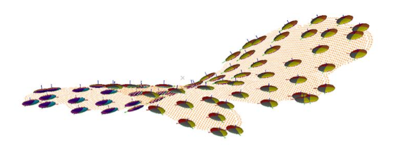

# DAELLIPS Process

To access this process:

  * **Model** ribbon **> > Dynamic Anisotropy >> Validate**.
  * View the **[Find Command](<../COMMON/findcommand.md>)** screen, select **DAELLIPS** and click **Run**.
  * Enter "DAELLIPS" into the [Command Line](<../COMMON/Command_Toolbar.md>) and press <ENTER>.

See this process in the [Command Table](<../command_help/COMMAND%20TABLE_D.md#DAELLIPS>).

## Process Overview

Create ellipsoids from dynamic anisotropy points or model.

Input is either a points or a block model file (not both). 

Typically, points data will be created by the **ANISOANG** process, although it can be from other sources. An input points file must contain coordinate fields (**XPT** /**YPT** /**ZPT**) and at least one angle field. Up to three angle fields can be specified, representing the dip direction (**DIPDIR**), dip (**DIP**) and roll (**ROLL**). Providing at least one directional field is set, the remaining orientations can be static and specified using the @**DIPDIR** , @**DIP** and/or @**ROLL** field.

;>)

Model data will typically be as produced by anisotropic modelling functions. As with points, each cell record must contain at least one angle field.

Ellipsoid centroids, derived from either &**POINTS** or &**MODEL** can be optionally declustered (multiple options) and 3 radii are specified to determine the final ellipsoid shape. @**XGRID** , @**YGRID** and @**ZGRID** parameters will define the declustering grid (if declustering is applied). The original of the grid can be specified (@**XORIG** , @**YORIG** and @**ZORIG**) if the input data is of the points type.

You can also choose (@**CENTRE**) as to how the ellipsoid centroid is positioned, either at the point or subcell centroid (0) or on the centre of the grid or the parent cell within which the point lies.

In all cases, output will be a data file of the ellipsoids data type, and can be loaded into a 3D view to visualize ellipsoid location(s) and orientation(s).

##  Input Files

Name |  Description |  I/O Status |  Required |  Type  
---|---|---|---|---  
POINTS |  Angle data in points format created by ANISOANG. It must include XPT, YPT, ZPT and at least one angle field. Either a POINTS or a MODEL file must be selected but not both. |  Input |  Yes, if &MODEL not specified |  Points  
MODEL |  Angle data in model format created during dynamic anisotropy modelling. It must include at least one angle field. Either a POINTS or a MODEL file must be selected but not both. |  Input |  Yes, if &POINTS not specified |  Block Model  
  
## Output Files

Name |  I/O Status |  Required |  Type |  Description  
---|---|---|---|---  
ELLIPSES |  Output |  Yes |  Ellipsoid |  Output ellipsoids. Ellipsoids to be displayed in the 3D Window.   
  
## Fields

Name |  Description |  Source |  Required |  Type |  Default  
---|---|---|---|---|---  
ANGLE1 |  A field in the POINTS or MODEL file that includes rotation around AXIS1. AXIS1 specified in Parameters.  |  POINTS or MODEL |  No |  Undefined |  Undefined  
ANGLE2 |  A field in the POINTS or MODEL file that includes rotation around AXIS2. AXIS2 specified in Parameters.  |  POINTS or MODEL |  No |  Undefined |  Undefined  
ANGLE3 |  A field in the POINTS or MODEL file that includes rotation around AXIS3. AXIS2 specified in Parameters. |  POINTS or MODEL |  No |  Undefined |  Undefined  
**ZONE** | Optional attribute field (numeric or alphanumeric) in input points or model. This will create an output ellipse for each zone in the input file, and ZONE will be assigned to output ellipsoid.  | POINTS or MODEL | No |  Undefined |  Undefined  
  
## Parameters

Name |  Description |  Required |  Default |  Range |  Values  
---|---|---|---|---|---  
DECLUST |  Flag to select declustering option. Default (0).  **0** :do not use declustering. **1** :random selection within each grid cell (different selection for each run). **2** : pseudo random selection within each grid cell (repeatable)..  **3** : nearest to grid centre. |  No |  Yes |  0,3 |  0,1,2,3  
RAD1/2/3 |  Ellipsoid radius in X/Y/Z direction. |  Yes |  10 |  Numeric |  Undefined  
FACTOR |  Dividing factor for adjusting size of RAD1, RAD2 and RAD3. |  Yes |  1 |  1 |  1  
ANGLE1/2/3 |  ANGLE1/2/3 rotation around AXIS1/2/3. Only used if there is no ANGLE1 field. Default (0).  |  No |  0 |  Numeric |  Undefined  
AXIS1 |  AXIS1 for rotation where 1=X, 2=Y and 3=Z. Default (3).  | No | 3 | 1,3 | 1,2,3  
AXIS2 |  AXIS2 for rotation where 1=X, 2=Y and 3=Z. Default (1).  | No | 1 | 1,3 | 1,2,3  
AXIS3 |  AXIS3 for rotation where 1=X, 2=Y and 3=Z. Default (3). | No | 3 | 1,3 | 1,2,3  
X/Y/ZGRID |  Size of declustering grid in X/Y/Z direction. Not required if @DECLUST=0 or input file is MODEL.  |  No if DECLUST=0, otherwise yes |  10 |  Numeric |  Undefined  
X/Y/ZORIG |  X/Y/Z coordinate of grid origin. Not required if @DECLUST=0 or input file is MODEL. Default (0).  |  No if DECLUST=0, otherwise yes |  0 |  Numeric |  Undefined  
CENTRE |  Flag to define where the ellipsoid should be located. Only required if @DECLUST > 0. **0** : centre the ellipsoid on the coordinates of the point or subcell centre. **1** : centre the ellipsoid on the centre of the grid or parent cell within which the point lies. .  |  No if DECLUST=0, otherwise yes |  1 |  0,1 |  0,1  
  
Related topics and activities

  * [ELLIPSE Process](<ellipse.md>)