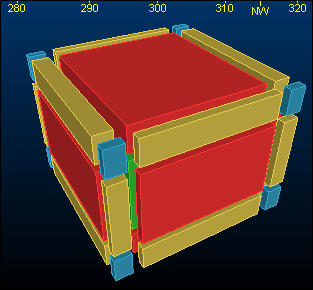
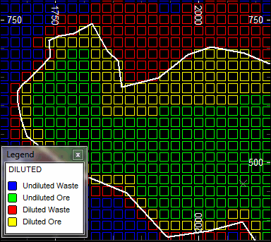
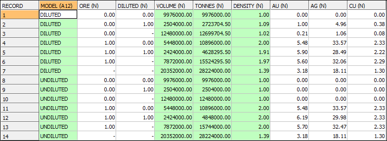

# DILUTMOD Process  
  
To access this process:

  * **Model** ribbon **> > Manipulate >> Adjust Prototype >> Dilute**.
  * View the **[Find Command](<../COMMON/findcommand.md>)** screen, select **DILUTE** and click **Run**.
  * Enter "DILUTE" into the [Command Line](<../COMMON/Command_Toolbar.md>) and press <ENTER>.

See this process in the [Command Table](<../command_help/COMMAND%20TABLE_D.md#DILUTMOD>).

## Process Overview

**Note** : This is a _superprocess_ and running it may have an effect on other Datamine files in the project.

Dilute the grades in a parent cell block model by a dilution width. Grades are adjusted in cells which have adjacent cells of a different rock type.

The user must specify a **ROCK** field and the process identifies every parent cell face at which the the value of the **ROCK** field changes between adjacent cells. The grade of the parent cell is adjusted by the addition of material from the adjacent cell and the loss of the same volume of material to the adjacent cell. The dilution width is defined by parameters which can be different in different directions.

The output files include a copy of the input model with diluted instead of undiluted grades, a combined model containing both undiluted and diluted grades, and a resource table showing tonnes and grades for every value of the **ROCK** field for both the undiluted and diluted models.

### Input Model File

The input MODEL file is a normal or rotated block model containing only parent cells. It must contain a numeric rock type field, *ROCK, which is used to identify the adjacent cell faces across which dilution occurs. The model must also contain at least one grade field.

#### *ROCK Field

The numeric *ROCK field is used to identify the boundaries across which dilution occurs. If dilution is defined as only being between ore and waste then the *ROCK field should have just two values eg ORE=1 for ore and ORE=0 for waste. If the *ROCK field has more than two values then dilution will occur at every face where the *ROCK value changes.

#### Grade Fields

Up to 10 grades can be selected using the *GRADEi fields. A minimum of one grade field must be selected. Grade fields must not have absent data values. If any values are absent the process will terminate with an error message.

**Note** : **GRADE** fields are subject to a 23-character limit, not the typical 24-character limit required elsewhere in Studio. This is because, for each **GRADE** field, an equivalent diluted grade field is created, which automatically includes a "D" prefix. As such, you can only specify grade fields up to 23 characters to ensure there is room for the prefixed equivalent, and that no attempt is made to create identical field names.

#### Density Field

The *DENSITY field can be used to select density from the input model. The default field name is DENSITY. If a density field is not used then the @DENSITY parameter will be used instead. The default value is 1. If a *DENSITY field is selected and there are absent values in the model then the process will terminate with an error message.

### Dilution Method

If two adjacent cells have different * **ROCK** values then the process will mix a volume of material calculated as the area of the common face multiplied by the dilution width perpendicular to the face with the corresponding volume of material from the adjacent cell. The adjusted grade of the parent cell will then be calculated using tonnage weighting.

Dilution will not occur if the adjacent cell has an absent data * **ROCK** value or if there is no adjacent cell in the model.

To calculate the diluted grade each parent cell is divided into 27 subcells as illustrated in the graphic. Initially all subcells are assigned the same grades as the parent cell. After dilution the average diluted grade of the parent cell will be calculated.

Each face of the parent cell includes 9 subcells. Each red subcell can only be diluted with the one corresponding subcell in the adjacent plane. Each yellow subcell can be diluted with one or two adjacent subcells on different planes. Each blue subcell can be diluted with one, two or three adjacent subcells on different planes.

If a subcell is diluted across more than one face then dilution is calculated sequentially. First it is diluted with the adjacent subcell in the negative or positive X direction and its grades are recalculated, then it is diluted with the adjacent subcell in the Y direction and finally with the subcell in the Z direction.

The dilution widths in the X, Y and Z directions are defined by the parameters @**XWIDTH** , @**YWIDTH** and @**ZWIDTH**. These correspond to the subcell sizes in the graphic above for the 26 subcells on the parent cell faces. The blue corner subcells have a size of @**XWIDTH** by @**YWIDTH** by @**ZWIDTH**. In the dilution process the grade of each subcell is averaged with the corresponding subcell in the adjacent parent cell.

### DILUTMOD Outputs

#### Output Model 1

Output model 1 has the same fields as the input model except that:

  * The grades selected by the **GRADEi** fields are the diluted values

  * If the input model did not include a * **DENSITY** field then field **DENSITY** will be added with a value defined by the @**DENSITY** parameter.

#### Output Model 2

Output model 2 has the same fields as the input model except that:

  * It includes both the undiluted and diluted grades. The diluted grade field names are the same as the undiluted names except they are preceded by the letter 'D'.

  * If the input model did not include a * **DENSITY** field then field **DENSITY** will be added with a value defined by the @**DENSITY** parameter.

  * It includes the numeric field **DILUTED** which has a value of 0 if the cell is undiluted and 1 if it is diluted.

;>)

The bench plan above shows the different classifications of material: undiluted waste, undiluted ore, diluted waste and diluted ore.

#### Output Resource Table

The Resources table shows tonnes and grades classified by * **ROCK** field **ORE** for both the diluted and undiluted models.

In the table above the * **ROCK** field **ORE** has a value 1 for ore and 0 for waste and the density of undiluted ore is 2 and waste is 1. The column **DILUTED** identifies undiluted material (0) and diluted material (1). A **DILUTED** value of absent (-) shows the combined undiluted plus diluted material.

For example record 4 shows that in the diluted model there are 5,448,000 m3 of undiluted ore with an **AU** grade of 5.48 g/t and record 5 shows 2,424,000 m3 of diluted ore with an **AU** of 5.90 g/t. Record 6 shows the total of diluted and undiluted ore.

Comparing record 12 with record 5 shows that 2,424,000 m3 of undiluted ore at 6.19 g/t **AU** have been diluted to reduce the grade of this material to 5.90 g/t **AU**.

Records 7 and 14 show the tonnes and grades for the total diluted and undiluted models respectively. These two sets of figures are identical because when averaged over ore and waste there is no change in the grade.

## Input Files

Name |  Description |  I/O Status |  Required |  Type  
---|---|---|---|---  
MODIN |  Input block model file. |  Input |  Yes |  Model  
  
## Output Files

Name |  I/O Status |  Required |  Type |  Description  
---|---|---|---|---  
MODOUT1 |  Output |  Yes |  Model |  Diluted output model file - same as **MODIN** except that all grades are diluted.  
MODOUT2 |  Output |  No |  Model |  Combined output model file - includes both undiluted and diluted grade fields. Diluted grade field names have 'D' as the first character.  
RESOURCE |  Output |  No |  Model |  Resources table comparing tonnes and grade for undiluted and diluted models classified by * **ROCK**.  
  
## Fields

Name |  Description |  Source |  Required |  Type |  Default  
---|---|---|---|---|---  
ROCK |  Rock field. |  IN |  Yes |  Any |  Undefined  
DENSITY |  Density field. If the model does not include a **DENSITY** field then the density can be set with parameter @**DENSITY** |  IN |  No |  Numeric |  Undefined  
GRADE1 |  Grade field 1 |  IN |  Yes |  Any |  Undefined  
GRADE2-10 |  Additional, optional, grade fields. |  IN |  No |  Any |  Undefined  
  
## Parameters

Name |  Description |  Required |  Default |  Range |  Values  
---|---|---|---|---|---  
XWIDTH |  Dilution width in X direction |  No |  1 |  Undefined |  Undefined  
YWIDTH |  Dilution width in Y direction |  No |  1 |  Undefined |  Undefined  
ZWIDTH |  Dilution width in Z direction |  No |  1 |  Undefined |  Undefined  
DENSITY |  Density value to be used if DENSITY field does not exist. |  No |  1 |  Undefined |  Undefined  
  
## Example
    
    
    !DILUTMOD &MODIN(model1), &MODOUT1(model1_dilute),   
  
---  
      
    
    &MODOUT2(model1_combined),   
      
    
     &RESOURCE(model1_resources),  
      
    
    *ROCK(ORE),   
      
    
     *GRADE1(AU), *GRADE2(AG), *GRADE3(CU),  
      
    
    @XWIDTH=1,   
      
    
     @YWIDTH=1, @ZWIDTH=2  
  
Related topics and activities

  * [EXPNDMOD Process](<expndmod.md>)