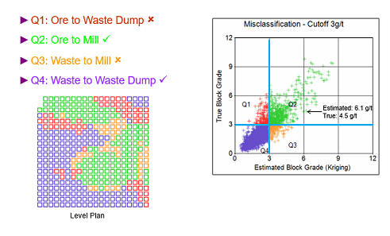
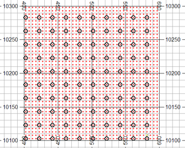
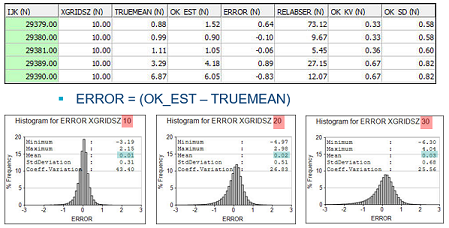
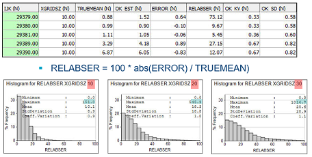
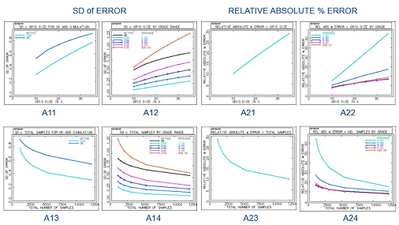
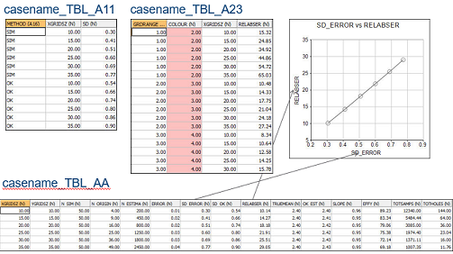
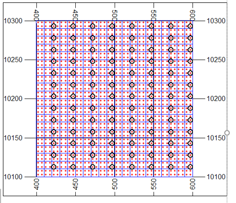
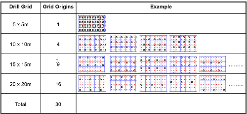

# DRILGRID Process  
  
To access this process:

  * View the **[Find Command](<../COMMON/findcommand.md>)** screen, select **DRILGRID** and click **Run**.
  * Enter "DRILGRID" into the [Command Line](<../COMMON/Command_Toolbar.md>) and press <ENTER>.

See this process in the [Command Table](<../command_help/COMMAND%20TABLE_D.md#DRILGRID>).

## Process Overview

**Note** : This is a _superprocess_ and running it may have an effect on other Datamine files in the project.

Analyse an input samples file to report the expected error for different sizes of a drilling grid. This process is designed to determine the optimum drillhole spacing for any deposit. The **DRILGRID** process provides a convenient and rigorous method for determining the optimum drilling grid.

Inputs include:

  * a set of simulated points with multiple realizations 
  * optional block model to describe the volume to be used for the analysis
  * a set of different sized drilling grids

Tables associated with each graph can be used for creating report quality plots. The tables and compound model file also allow sensitivity analysis and further investigation of all the modelled attributes. Kriging Neighbourhood Analysis (KNA) parameters created by the process can be used to assess the quality of the estimates for any drilling grid.

The minimise misclassification cost algorithm can be replaced by a customized method if required

**DRILGRID** calculates the average of all the simulated points within each model cell for each simulation this is taken as the true value of the cell for that simulation. 

It will also:

  1. Create a set of drillhole data by selecting a subset of the points for grid size 1, simulation 1, grid origin 1.
  2. Estimate the grade of each cell from the simulated drillhole samples
  3. Compare actual v estimate
  4. Repeat for each grid size, simulation and origin
  5. Analyse results

Consider the following misclassification example:

Q2 and Q4 are correctly classified so no additional cost in incurred.

Q1 and Q3 are incorrectly classified and have an associated cost.

Q1: when ore is sent to waste, there is a cost associated with the lost revenue from the block plus any additional haulage cost.

Q3: when waste is sent to the plant the cost of processing the material exceeds the value of the recoverable mineral. Since all plants have a maximum throughput, the opportunity cost associated with displacing ore in order to process waste should also be considered. 

The actual costs will be dependent on the specifics of each operation; however, it is likely that the costs of misclassification will be a linear function of grade just as revenue is a linear function of grade.

The algorithm in DRILGRID is based on a simple cost model. In particular it assumes that the cost of mining ore and waste are equal.

Processing Cost | CP | $/t  
---|---|---  
Recovery  | R | %  
Price | P | $/g  
Grade in Quadrant i | Gi  |  g/t  
Quadrant 1 Loss | L1 | = G1 * P * R - CP   
Quadrant 3 Loss | L3 | = CP - G3 * P * R  
Misclassification Loss | L | = L1 + L3  
  
Additional sampling will improve the estimates and reduce the misclassification loss but additional sampling comes at a price.

DRILGRID calculates the misclassification loss (L) plus the cost of sampling (CS) for each drilling grid. The grid with the lowest combined L+ CS is then the optimum grid size.

### Define the Drilling Grid

The drill grid spacing is a function of the simulated point grid. The red dots are the simulated points at 5m spacing in X & Y.Therefore the drill grid must be in multiples of 5m in both X and Y. The black circles are the drillholes selected here on a 20x20m grid.

**DRILGRID** allows you to select multiple drill grids for a single run. The drill grid sizes in X are defined by three parameters **XGSTART** , **XGINC** and **NGRID**.

**XGSTART** and **XGINC** are specified in units of the X distance between simulated points, for example, 5m. 

  * XGSTART is the smallest grid size to be used eg a value of 2 defines a 10m grid size.
  * XGINC is the increment between successive grid sizes eg a value of 3 defines a 15m increment.
  * NGRID is the number of grid sizes to be evaluated eg a value of 4 defines 4 grid sizes.

The above three parameters define X grid values of 10m, 25m (10+1*3*5), 40m (10+2*3*5) and 55m (10+3*3*5). **YGSTART** , **YGINC** and NGRID are the equivalent parameters in Y.

Progress messages are output during processing, for example:  

    
    
    Sample spacing loop 1 of 6
    
    
    Spacing: 2*2 units 
    
    
    Grid: 10*10 m
    
    
    Simulation 1 of 2
    
    
    12:48:30 
    X grid origin 1 of 2. Y grid origin 1 of 2
    
    
    12340 samples. 144 holes. 
    
    
    Overall loop 1 of 278
    
    
    12:48:44 
    X grid origin 1 of 2. Y grid origin 2 of 2
    
    
    12340 samples. 144 holes. 
    
    
    Overall loop 2 of 278
    
    
    12:48:57 X grid origin 2 of 2. Y grid origin 1 of 2
    
    
    12340 samples. 144 holes. 
    
    
    Overall loop 3 of 278
    
    
    12:49:10 
    X grid origin 2 of 2. Y grid origin 2 of 2
    
    
    12340 samples. 144 holes. 
    
    
    Overall loop 4 of 278

### The Output (Compound) Model File

The output model file consists of multiple models, one for each combination of grid spacing, simulation and grid origin. Therefore although it has all the model fields it cannot be displayed in the graphics windows. A single model could be selected if it were loaded using appropriate filters 

The file contains the 13 standard model fields plus the fields shown below:

Field |  Description  
---|---  
XGRIDSZ |  Drilling grid size in X  
YGRIDSZ |  Drilling grid size in Y  
SIMNUM |  Simulation number  
ORIGIN |  Grid origin number  
TOTHOLES |  Total number of holes for current grid size, simulation, grid origin  
TOTSAMPS |  Total number of samples for current grid size, simulation, grid origin  
MODEL |  Model number sequential starting at 1  
TRUEMEAN |  Average of all simulated points for simulation i within cell  
OK_EST |  Ordinary Kriging estimator  
ERROR |  = OK_EST - TRUEMEAN  
RELABSER |  % Relative Absolute Error (100 * abs(ERROR) / TRUEMEAN)  
OK_KV |  Kriging Variance  
OK_SD |  Kriging Standard Deviation ( = √ (OK_KV))  
NSAMPS |  Number of samples used for kriging  
FVALUE |  Geostatistical F Value (average of value of variogram within cell)  
LAGR |  Lagrange Multiplier from kriging matrix needed for regression slope  
EFFY |  Kriging Efficiency  
SLOPE |  Slope of the regression line  
GRDRANGE |  Grade range - smallest cutoff that is greater than TRUEMEAN.  
  
BLKVAR = SILL FVALUE

SLOPE = (BLKVAR OK_KV + abs(LAGR)) / (BLKVAR OK_KV + 2*abs(LAGR)) 

EFFY = max(100 * (BLKVAR OK_KV) / BLKVAR, 0)

The name of the compound model file is made up of the case name defined by the output file &CASENAME plus the extension _COMPMOD

### The Output Sample (Compound) File

The output sample file consists of multiple samples, one for each combination of grid spacing, simulation and grid origin. The file is in Points format and although it can be displayed in the graphics windows it contains multiple occurrences of the same point so would be slow to view.

The file contains the standard three point coordinate fields **XPT** , **YPT** , **ZPT**

The name of the compound sample file is made up of the case name defined by the output file &**CASENAME** plus the extension _COMPSAMPS

Field |  Description  
---|---  
XGRIDSZ |  Drilling grid size in X  
YGRIDSZ |  Drilling grid size in Y  
SIMNUM |  Simulation number  
ORIGIN |  Grid origin number  
MODEL |  Corresponding model number in the compound model file  
XPT  
YPT  
ZPT |  Sample coordinates  
{grade} |  Grade field in the input sample file  
BHID |  Identifier code for a column of points  
  
### Output Tables and Interpretation

Multiple output plot and table files are generated by **DRILGRID**. You choose the prefix name for these output files using the &**CASENAME** parameter.

  * Standard Deviation of Error Example

This is a function of the grid size, where confidence is directly proportional to SD of Error.

  * Relative Absolute % Error Example

The mean is a function of grid size. Confidence is a function of the mean of RELABSER.

  * Error Graphs Example

Graphs based on 50 simulations using ORIGMETH=3

  * Error Reports Example

   

### The @GRIDMETH parameter

The **GRIDMETH** parameter defines the relationship between the X and Y dimensions of the drilling grid:

  1. The grid size increases in both X and Y
  2. Only the X grid size increases. The Y grid size is constant so YGINC is ignored
  3. Only the Y grid size increases. The X grid size is constant so XGINC is ignored

The table below shows the grid sizes for a simulated point spacing of 5x5m with the following parameters: XGSTART=1, XGINC=2, YGSTART=2, YGINC=3, NGRID=3:

GRIDMETH | Grid 1 | Grid 2 | Grid 3  
---|---|---|---  
1 | 5 x 10 | 15 x 25 | 25 x 40  
2 | 5 x 10 | 15 x 10 | 25 x 10  
3 | 5 x 10 | 5 x 25 | 5 x 40  
  
### The @ORIGMETH parameter

The image above shows:

  * Blue squares 10x10m model cells
  * Red dots simulated points on a 5x5m grid
  * Black circles drillholes on a 25x15m grid

For a 25x15m drill grid there are 15 (5 * 3) possible positions for the grid origin

Parameter **ORIGMETH** has values:

  1. Use just one origin position 
  2. Use all possible origin positions within a cell
  3. Use selected origin positions within the drill grid as defined by parameter **ORIGSEL**

For 2 and 3 **DRILGRID** averages results over all origins and simulations for each drill grid.

##### @ORIGMETH Example

2 simulated points per cell in X and Y with parameters: @**GRIDMETH** =1, @**ORIGMETH** =3, @**ORIGSEL** =1, @**XGSTART** =1, @**XGINC** =1, @**NGRID** =4, @**YGSTART** =1, @**YGINC** =1

30 grid origins x 10 simulations x 867 cells / model = 260,100 cell estimates.

## Input Files

Name |  Description |  I/O Status |  Required |  Type  
---|---|---|---|---  
IN |  Input points file containing simulated points as created by **SGSIM**.  This must include the coordinate fields **XPT** , **YPT** , **ZPT** , the grade field GRADE and the simulation (realization) number field SIMNUM.  It must also include the implicit fields **XMORIG1** , **YMORIG1** , **ZMORIG1** , **XINC1** , **YINC1** , **ZINC1** , **NX1** , **NY1** , **NZ1** defining the grid origin, size and number of points, as well as the fields XPPPC, YPPPC, ZPPPC defining the number of points per parent cell for the output model. These implicit fields will have been added automatically by the process **SGSIM** |  Input |  Yes |  Undefined  
MODEL |  Input block model file containing cells covering the volume to be analysed. This must be same volume, or a subset, as the volume covered by the simulated points file. |  Input |  No |  Undefined  
SRCPARM |  Search volume parameter file.  This contains 24 compulsory fields defining the search volume and the number of samples needed for grade estimation. More than one search volume may be defined. All fields are numeric: **SREFNUM** Search volume reference number. **SMETHOD** Search volume shape.  1 = 3D rectangle  2 = ellipsoid.  **SDIST1** Max search distance in direction 1.  **SDIST2** Max search distance in direction 2.  **SDIST3** Max search distance in direction 3.  **SANGLE1** First rotation angle for search vol.  **SANGLE2** Second rotation angle.  **SANGLE3** Third rotation angle.  **SAXIS1** Axis for 1st rotation (1=X,2=Y,3=Z).  **SAXIS2** Axis for 2nd rotation (1=X,2=Y,3=Z).  **SAXIS3** Axis for 3rd rotation (1=X,2=Y,3=Z).  **MINNUM1** Min number of samples, 1st search vol.  **MAXNUM1** Max number of samples, 1st search vol.  **SVOLFAC2** Axis multiplying factor,2nd search vol.  **MINNUM2** Min number of samples, 2nd search vol.  **MAXNUM2** Max number of samples, 2nd search vol.  **SVOLFAC3** Axis multiplying factor,3rd search vol.  **MINNUM3** Min number of samples, 3rd search vol.  **MAXNUM3** Max number of samples, 3rd search vol.  **OCTMETH** Octant method flag. 0 = no octant search, 1 = use octants.  **MINOCT** Minimum number of octants to be filled.  **MINPEROC** Minimum number of samples in an octant.  **MAXPEROC** Maximum number of samples in an octant.  **MAXKEY** Maximum number of samples with the same key value within an octant  **SANGL1_F** Name of field in the input prototype model file that contains the first rotation angle for dynamic anisotropy.  **SANGL2_F** Name of field in the input prototype model file that contains the second rotation angle for dynamic anisotropy.  **SANGL3_F** Name of field in the input prototype model file that contains the third rotation angle for dynamic anisotropy |  Input |  Yes |  Undefined  
VMODPARM |  Variogram model parameter file.  Each record in this file defines a variogram model type and its parameters. **VREFNUM** Model variogram reference number.  **VANGLE1** Variogram anisotropy angle 1.  **VANGLE2** Variogram anisotropy angle 2.  **VANGLE3** Variogram anisotropy angle 3.  **VAXIS1** Model variogram rotation axis 1. VAXIS2 Model variogram rotation axis 2.  **VAXIS3** Model variogram rotation axis 3.  **NUGGET** Nugget variance. ST1 Variogram model type for structure 1\.  1 = Spherical.  2 = Power [eg 1 - linear].  3 = Exponential.  4 = Gaussian.  5 = De Wijsian.  **ST1PAR1** 1st parameter of structure 1 [Range 1 for spherical model].  **ST1PAR2** 2nd parameter of structure 1 [Range 2 for spherical model].  **ST1PAR3** 3rd parameter of structure 1 [Range 3 for spherical model].  **ST1PAR4** 4th parameter of structure 1 [C variance for spherical model].  **STn** Variogram model type for structure n.  **STnPARp** pth parameter for structure n, where n<=3 |  Input |  No |  Undefined  
CUTOFF |  Input file containing list of cutoff grades defined using field **COGRADE** |  Input |  Yes |  Undefined  
IN |  Input file containing a compound (multiple) block model created and saved during a previous run of **DRILGRID**. It includes multiple models appended into a single file |  Input |  No |  Undefined  
  
## Output Files

Name |  I/O Status |  Required |  Type |  Description  
---|---|---|---|---  
CASENAME |  Output |  Yes |  Undefined |  A case name or code that forms the first part of multiple output plot and table files that are created during processing. The second part of the file name is fixed. A description of each file is given in the main Help.  
  
## Fields

Name |  Description |  Source |  Required |  Type |  Default  
---|---|---|---|---|---  
GRADE |  Field in the input **POINTS** sample file defining the simulated grade |  IN |  Yes |  Numeric |  X  
CUTOFF |  Field in the input **CUTOFF** file defining a set of cutoff grades |  IN |  Yes |  Numeric |  Y  
  
## Parameters

Name |  Description |  Required |  Default |  Range |  Values  
---|---|---|---|---|---  
OUTMODEL |  Flag to select whether output compound model is created =0 : Output compound model is not created.  =1 : Output compound model is created.  |  No |  0 |  0,1 |  0,1  
OUTSAMPS |  Flag to select whether output compound sample file is created =0 : Output compound sample file is not created.  =1 : Output compound sample file is created.  |  No |  0 |  0,1 |  0,1  
PLOTS |  Flag to select which plots to create =0 : No plots created. Therefore no tables will be created either. Just create the compound model and sample file.  =1 : Create plots showing relationship between estimation error and grid spacing/number of samples.  =2 : Create other plots including misclassification cost analysis.  =3 : Create all plots ie both 1 and 2.  |  No |  1 |  0,3 |  0,1,2,3  
TABLES |  Flag to select table output. Note that tables are only created if corresponding plots are selected =0 : No tables created.  =1 : Create tables for which plots have been selected using parameter **PLOTS**.  |  No |  0 |  0,1 |  0,1  
GRIDMETH |  Method for defining relationship between the size of the drilling grid in the X and Y directions =1 : The drilling grid size increases in both X and Y as defined by parameters **XGSTART** , **XGINC** , **NGRID** , **YGSTART** , **YGINC**.  =2 : The drilling grid size increases in X but is constant in Y as defined by parameters **XGSTART** , **XGINC** , **NGRID** , **YGSTART**.  =3 : The drilling grid size increases in Y but is constant in X as defined by parameters **YGSTART** , **YGINC** , **NGRID** , **XGSTART**.  |  No |  1 |  1,3 |  1,2,3  
ORIGMETH |  Method for defining the origin for selecting samples from the simulated points file =1 : Only use one grid origin position. This can lead to biased results as not all relative locations of samples and model cells will be tested. However it will result in amuch faster run time.  =2 : All grid origin positions within a model cell are selected and the results are averaged over all combinations.  =3 : Every nth possible grid origin position in X and Y are selected and the results are averaged over all combinations. The value of n is defined by parameter **ORIGSEL**.  |  No |  3 |  1,3 |  1,2,3  
ORIGSEL |  Origin selection number. If 1 then all possible origin positions will be selected. If 2 then every second origin position will be selected. If n then every nth origin position will be selected. |  No |  1 |  Undefined |  Undefined  
X/YGSTART |  Minimum size of drilling grid in the X/Y direction defined as a multiple of the simulated point spacing in X. For example if the X spacing between points in the POINTS file is 5m and X/YGSTART=2 then the minimum X grid size for drilling spacing will be 5*2=10m |  Yes |  1 |  Undefined |  Undefined  
XYGINC |  Increment in X/Y direction between successive drilling grid sizes defined as a multiple of the simulated point spacing in Y. For example if the Y spacing between points in the POINTS file is 5m and X/YGINC=1 then the increment between successive Y grid sizes will be 5*1=5m |  Yes |  1 |  Undefined |  Undefined  
NGRID |  Number of different drilling grid sizes |  Yes |  2 |  Undefined |  Undefined  
NSIM |  Number of simulations to be used. This must be less than or equal to the maximum number of simulations in the POINTS file. The default is the maximum number in the POINTS file |  No |  1 |  Undefined |  Undefined  
MODX(Y/Z)MIN |  Minimum X(Y/Z)C value of cell in input **MODEL** to be estimated. The default is the model origin |  No |  - |  Undefined |  Undefined  
MODX(Y/Z)MAX |  Maximum X(Y/Z)C value of cell in input **MODEL** to be estimated. The default is the maximum possible XC value in the model |  No |  - |  Undefined |  Undefined  
VMODNUM |  Variogram model number in **VMODPARM** file |  Yes |  - |  Undefined |  Undefined  
X/Y/ZPOINTS |  Number of discretisation points in X/Y/Z |  No |  1 |  Undefined |  Undefined  
REVENUE |  Sales revenue per unit. For example if the simulated values are g/t then the revenue must be defined as $/g |  Yes |  - |  Undefined |  Undefined  
PROCOST |  Processing cost. For example if the simulated values are g/t and the revenue $/g then the processing cost should be $/t |  Yes |  0 |  Undefined |  Undefined  
RECOVERY |  Processing recovery expressed as a percentage |  No |  100 |  Undefined |  Undefined  
SAMPCOST |  Drilling and sampling cost in $/sample. The drilling component of the cost must therefore take account of the sample length |  No |  0 |  Undefined |  Undefined  
CFACTOR |  Cost factor. Dividing factor applied to cost values plotted on the Y axis. For example if **CFACTOR** =1000000 then the annotated units will be millions of dollars |  No |  1 |  Undefined |  Undefined  
DENSITY |  Density. This used for calculating tonnes |  No |  1 |  Undefined |  Undefined  
SCROFF1 |  Flag to select whether command output is sent to a log file. This parameter will be removed for the release version =0 : Output is sent to the Command Window.  =1 : Output is sent to the log file. |  No |  1 |  0,1 |  0,1  
DELETE |  Flag to select whether temporary files are deleted when the command finishes =0 : Do not delete temporary files.  =1 : Delete temporary files.  |  No |  1 |  0,1 |  0,1  
  
## Example
    
    
    !DRILGRID &POINTS(dr_points),&MODEL(model2),&SRCPARM(spar),  
  
---  
      
    
    &VMODPARM(vmodel),&CUTOFF(cutoffs2),&CASENAME(DG),  
      
    
    *GRADE(AU),*CUTOFF(CUT),@OUTMODEL=0.0,@OUTSAMPS=0.0,  
      
    
    @PLOTS=1.0,@TABLES=0.0,@GRIDMETH=1.0,@ORIGMETH=3.0,  
      
    
    @ORIGSEL=1.0,@XGSTART=1.0,@XGINC=1.0,@YGSTART=1.0,  
      
    
    @YGINC=1.0,@NGRID=2.0,@NSIM=1.0,@VMODNUM=1.0,@XPOINTS=1.0,  
      
    
    @YPOINTS=1.0,@ZPOINTS=1.0,@REVENUE=5.0,@PROCOST=0.0,  
      
    
    @RECOVERY=100.0,@SAMPCOST=0.0,@CFACTOR=1.0,@DENSITY=1.0,  
      
    
    @SCROFF1=1.0,@DELETE=1.0  
      
    
    !END