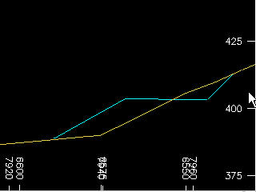
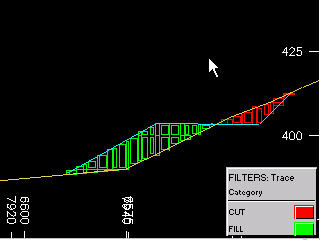
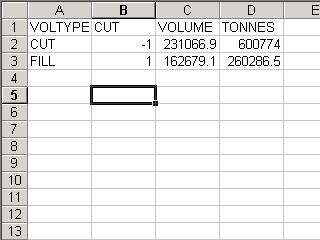

# DTMCUT Process  
  
To access this process:

  * **Report** ribbon **> > Report >> Wireframe**.
  * View the **[Find Command](<../COMMON/findcommand.md>)** screen, select **DTMCUT** and click **Run**.
  * Enter "DTMCUT" into the [Command Line](<../COMMON/Command_Toolbar.md>) and press <ENTER>.

See this process in the [Command Table](<../command_help/COMMAND%20TABLE_D.md#DTMCUT>).

## Process Overview

**Note** : This is a _superprocess_ and running it may have an effect on other Datamine files in the project.

This process allows the modelling and evaluation of cut and fill volumes, based on original and updated wireframe surfaces (DTMs).

Both cut and fill volumes are separately evaluated, and both are described in an output block model, whose block sizes are controlled by an input block model prototype. This input prototype can also define a rotated model structure, which will be honoured as supplied.

A supplied cut attribute field is used for the assignment of the cut and fill volumes. The user therefore supplies the name of this new (numeric) field, and what values will be assigned within 'cut' blocks and 'filled' blocks. This enables clear identification of cut and fill volumes, for both evaluation and plotting/display purposes.

An optional perimeter file may also be supplied, to split the cut and fill volumes into separate regions for evaluation purposes. This allows the cuts to be evaluated in separate mining strips or partitions. These perimeters are treated as boundaries as viewed in an XY plan i.e. the elevations of the perimeters are ignored. If such perimeters are supplied, an optional attribute field can also be defined, to further divide the evaluation data as required.

The degree of accuracy is controlled by the supplied cell splitting parameter. This parameter is utilized in exactly the same manner as the SPLITS parameter in the [TRIFIL](<trifil.md>) process.

Density values must be supplied for the cut and fill material, for use in the subsequent tonnage calculation. These values will also be placed into the density field (whose name is user-defined) of the output cut/fill block model.

The output results file contains all the evaluated tonnages and volumes, split by cut, fill and perimeter attribute. This results file is automatically also written out as a .csv file, for easy import into spreadsheet programs.

## Input Files

Name |  Description |  I/O Status |  Required |  Type  
---|---|---|---|---  
WIRETR1 |  Triangle file of original wireframe surface (DTM). |  Input |  Yes |  Wireframe triangle  
WIREPT1 |  Point file of original wireframe surface (DTM). |  Input |  Yes |  Wireframe points  
WIRETR2 |  Triangle file of update wireframe surface (DTM). |  Input |  Yes |  Wireframe triangle  
WIREPT2 |  Point file of update wireframe surface (DTM). |  Input |  Yes |  Wireframe points  
PROTO |  Input block model prototype. |  Input |  Yes |  Block model  
PERIMIN |  Optional input perimeter file controlling sub-division of cut-and-fill volumes. |  Input |  No |  Perimeter file  
  
## Output Files

Name |  I/O Status |  Required |  Type |  Description  
---|---|---|---|---  
CUTMODOU |  Output |  Yes |  Block model |  Output block model of cut and fill volumes.  
RESULTS |  Output |  Yes |  Results file |  Output evaluation results data file.  
  
## Fields

Name |  Description |  Source |  Required |  Type |  Default  
---|---|---|---|---|---  
DENSITY |  Density field in output block model. |  MODELIN |  Yes |  Numeric |  Undefined  
CUTFLD |  Output numeric field defining cut and fill volumes. |  |  Yes |  Numeric |  Undefined  
ATTRIB |  Optional attribute field from input perimeter file. |  PERIMIN |  No |  Any |  Undefined  
  
## Parameters

Name |  Description |  Required |  Default |  Range |  Values  
---|---|---|---|---|---  
CUTDEN |  Density of cut volumes. |  Yes |  1 |  0,99999 |   
FILLDEN |  Density of filled volumes. |  Yes |  1 |  0,99999 |   
SPLITS |  Subcell splitting of cut and fill block model. |  Yes |  0 |  0,3 |   
CUTVAL |  Value assigned to **CUTFLD** for cells inside cut volume. |  Yes |  -1 |  |   
FILLVAL |  Value assigned to **CUTFLD** for cells inside fill volume. |  Yes |  1 |  |   
  
## Example
    
    
    !DTMCUT WIRETR1(surftr), &WIREPT1(surfpt), &WIRETR2(updtr),   
  
---  
      
    
             &WIREPT2(updpt),   
      
    
    &PROTO(modprot),&PERIMIN(striper),&CUTMODOU(cutmod),   
      
    
       
      
    
             &RESULTS(cutres), *DENSITY(DENSITY),*CUTFLD(CUTFLD),  
      
    
    *ATTRIB(STRIP),   
      
    
             @CUTDEN=2.7,@FILLDEN=1.8,@SPLITS=2,  
      
    
    @CUTVAL=-1,@FILLVAL=1  
  
Input |  ;>) | 

  * Wireframe of original topography
  * Wireframe of updated topography
  * Cut and Fill densities

  
---|---|---  
**Output** |  ;>) | 

  * Block model of Cut and Fill Volumes

  
|  ;>) | 

  * Cut and Fill evaluation results output as Datamine format and as .csv files