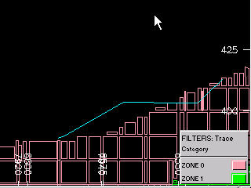
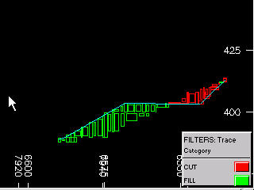
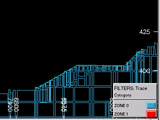
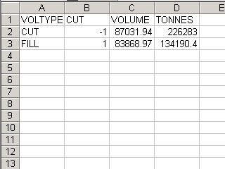

# DTMMOD Process  
  
To access this process:

  * **Report** ribbon **> > Report >> Model**.
  * View the **[Find Command](<../COMMON/findcommand.md>)** screen, select **DTMMOD** and click **Run**.
  * Enter "DTMMOD" into the [Command Line](<../COMMON/Command_Toolbar.md>) and press <ENTER>.

See this process in the [Command Table](<../command_help/COMMAND%20TABLE_D.md#DTMMOD>).

## Process Overview

**Note** : This is a _superprocess_ and running it may have an effect on other Datamine files in the project.

This process allows the update and evaluation of a geological block model, based on an update wireframe surface or DTM.

Both cut and fill volumes will be separately evaluated. The output updated block model will have had the cut volume removed, and the fill volume added. It will also generate a separate block model of both the cut and fill volumes. It is assumed that the input block model does not contain air blocks i.e. the top blocks represent the current topography. This input block can also include a rotated model structure, which will be honoured in the output cut and fill block model.

A supplied cut attribute field is used for the assignment of the cut and fill volumes. The user therefore supplies the name of this new (numeric) field, and what values will be assigned within 'cut' blocks and 'filled' blocks. This enables clear identification of cut and fill volumes, for both evaluation, plotting and display purposes. This facility also enables models to be progressively updated, and each time have an appropriate value assignment, e.g. a period assignment for stockpiling or waste dump purposes.

An optional perimeter file may also be supplied, to split the cut and fill volumes into separate regions for evaluation purposes. This allows the cuts to be evaluated in separate mining strips or partitions. These perimeters are treated as boundaries as viewed in an XY plan, that is, the elevations of the perimeters are ignored. If such perimeters are supplied, an optional attribute field can also be defined, to further divide the evaluation data as required.

A density field has to exist in the input block model, for use in tonnage calculation of the cut volume. A density value must also be supplied for the fill material, for use in the subsequent fill tonnage calculation. This value will also be placed into the density field of the output cut and fill block model.

The degree of accuracy is controlled by the supplied cell splitting parameter. This parameter is utilized in exactly the same manner as the **SPLITS** parameter in the [TRIFIL](<trifil.md>) process.

The output results file contains all the evaluated tonnages and volumes, split by cut, fill and perimeter attribute. This results file is automatically also written out as a .csv file, for easy import into spreadsheet programs.

## Input Files

Name |  Description |  I/O Status |  Required |  Type  
---|---|---|---|---  
WIRETR |  Triangle file of update wireframe surface (DTM). |  Input |  Yes |  Wireframe triangle  
WIREPT |  Point file of update wireframe surface (DTM). |  Input |  Yes |  Wireframe points  
MODELIN |  Original block model. |  Input |  Yes |  Block model  
PERIMIN |  Optional input perimeter file controlling sub-division of cut-and-fill volumes. |  Input |  No |  Perimeter file  
  
## Output Files

Name |  I/O Status |  Required |  Type |  Description  
---|---|---|---|---  
MODELOU |  Output |  No |  Block model |  Updated block model, with cut volume removed.  
CUTMODOU |  Output |  Yes |  Block model |  Output block model of cut and fill volumes.  
RESULTS |  Output |  Yes |  Results file |  Output evaluation results data file.  
  
## Fields

Name |  Description |  Source |  Required |  Type |  Default  
---|---|---|---|---|---  
DENSITY |  Density field in input block model. |  MODELIN |  Yes |  Numeric |  Undefined  
CUTFLD |  Output numeric field defining cut and fill volumes. |  |  Yes |  Numeric |  Undefined  
ATTRIB |  Optional attribute field from input perimeter file. |  PERIMIN |  No |  Any |  Undefined  
  
## Parameters

Name |  Description |  Required |  Default |  Range |  Values  
---|---|---|---|---|---  
FILLDEN |  Density of filled volumes. |  Yes |  1 |  0,99999 |   
SPLITS |  Subcell splitting of cut and fill block model. |  Yes |  0 |  0,3 |   
CUTVAL |  Value assigned to CUTFLD for cells inside cut volume. |  Yes |  -1 |  |   
FILLVAL |  Value assigned to CUTFLD for cells inside fill volume. |  Yes |  1 |  |   
  
## Example
    
    
    !DTMMOD &WIRETR(surftr), &WIREPT(surfpt),&MODELIN(blokmod),   
  
---  
      
    
       
      
    
             &PERIMIN(striper),&MODELOU(updmod),&CUTMODOU(cutmod),   
      
    
               
      
    
    &RESULTS(cutres), *DENSITY(DENSITY),*CUTFLD(CUTFLD),  
      
    
    *ATTRIB(STRIP),   
      
    
             @FILLDEN=1.8,@SPLITS=2,@CUTVAL=-1,@FILLVAL=1  
  
Input: |  ;>) | 

  * Block model below current topography
  * Wireframe of updated topography
  * Fill density

  
---|---|---  
Output: |  ;>) | 

  * Block model of Cut and Fill Volumes

  
|  ;>) | 

  * Block model without 'Cut' blocks and including 'Fill' blocks

  
|   | 

  * Cut and Fill evaluation results output as Datamine format and as .csv files