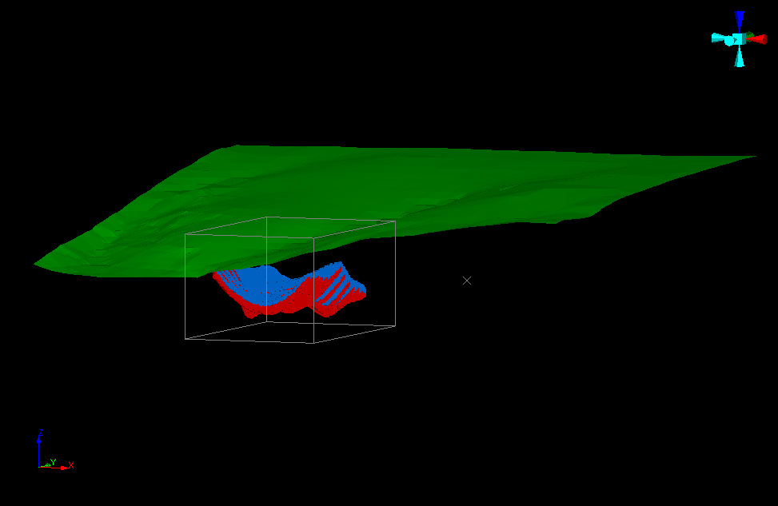
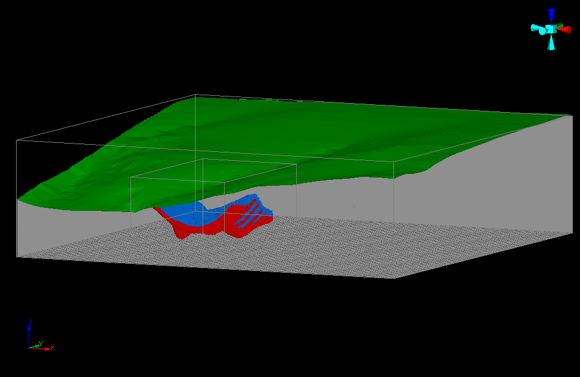

# EXPNDMOD Process  
  
To access this process:

  * **Model** ribbon **> > Manipulate >> Adjust Prototype >> Expand**.
  * Enter "EXPNDMOD" into the [Command Line](<../COMMON/Command_Toolbar.md>) and press <ENTER>.
  * View the **[Find Command](<../COMMON/findcommand.md>)** screen, select **EXPNDMOD** and click **Run**.

See this process in the [[Command Table](<../command_help/COMMAND%20TABLE_E.md#ESTIMATE>)](<../command_help/COMMAND%20TABLE_E.md#EXPNDMOD>).

## Process Overview

**Note** : This is a _superprocess_ and running it may have an effect on other Datamine files in the project.

Expand a model to cover a larger volume and fill it with cells. The volume can optionally be defined and constrained by input wireframe surfaces or perimeters.

**EXPNDMOD** fills a model with cells to the limits defined by its data definition and optionally extends its data limits to cover the maximum volume defined by a supplied wireframe, perimeter or extents defined by parameters

An optional wireframe can be supplied to define the limits of the required expanded model and also to constrain the addition of new cells. The minimum cell sizes to be created in X, Y and Z are defined in the same way as in the **[WIREFILL](<wirefill.md>)** process.

An optional perimeter file can be supplied to constrain cell creation to within the perimeters.

An optional table can be supplied to define default values of fields for new cells.

The parent cell sizes of the expanded model will always be the same as the input model, only the origin or number of cells in each direction may change. The model data definition is never decreased: the origin is either retained or moved in a negative X, Y or Z direction. The number of cells are either retained or increased.

**EXPNDMOD** is useful for preparing a model for mine planning, for example expanding a model that contains only mineralised zones to be used as an input to Studio NPVS (which requires a full model) or for other mine planning and evaluation purposes.

### EXPNDMOD Files

#### WIRETR and WIREPT 

The wireframe file is optional and is used to both define the expanded limits as well as constrain the addition of new cells. For example if a topography wireframe is supplied the model limits will be expanded to cover the wireframe extents and new cells will be added according the rules specified by the **WIRETYPE** parameter. For example if the default value of **WIREFTYPE** (2 - Surface Create cells below) is used the the model is expanded in X, Y and Z to the limits defined by the wireframe point file and cells are only created below the wireframe. The model limits are never decreased.

#### PERIMIN

The input perimeter file is optional. The model will be expanded to cover the limits defined by the input perimeter and cell addition is constrained to be within the perimeter. The filling direction is similar to that in the **[PERFIL](<perfil.md>)** process. The direction is implied by the **WIRETYPE** parameter. For example if the value of **WIREFTYPE** (2 - Surface Create cells below) is used then the perimeters are used to constrain the addition of cells in the X and Y directions with no constraint in the Z value; the Z value of the perimeters is ignored. The perimeters do not have to be planar.

### EXPNDMOD Parameters

#### [XYZ]MIN and [XYZ]MAX

It is possible to define the required limits of the expanded model using one or more of the optional limit parameters. For example if a topography wireframe is being used to define the expanded limits in X and Y the model could aso be expanded downwards by setting the **ZMIN** parameter to a value less than the existing Z model origin.

#### FILVOL

If a wireframe is being used to constrain the addition of new cells the **FILVOL** parameter can optionally be used to avoid cell splitting. If **FILVOL** is set to 1 then rather than add sub cells the process will add a **FILVOL** field with a value between zero and 1 that defines the proportion of the cell volume that is constrained by the wireframe.

#### DEFVALS

It is possible to define default values to be set in new cells using the optional **DEFVALS** file. This must contain two fields, one defining the field name (up to a 24 character alphanumeric field) and one defining the field value (alpha or numeric). If the value field is alpha numeric fields can still be set by having numbers represented as strings. To set absent alpha values leave the alpha field blank. The names of the **NAME** and **VALUE** fields in the **DEFVAL** file are specified using the field specification.

### Expanding Rotated models

The input model to be extended may be rotated. If the input model &**PROTO** is a Rotated Model, as defined using the **[PROTOM](<protom.md>)** process, then the coordinates of the input points in the &**WIREPT** and **PERIMIN** files are automatically transformed internally to the rotated model coordinate system for processing.

**EXPNDMOD** will usually be run with an input **PERIMIN** string file only if the rotated model has just a single rotation. **EXPNDMOD** uses the **PERFIL** process to create model cells within the string with the cells being orthogonal to the model prototype in the local coordinate system. **PERFIL** requires the string to be planar and lie on one of the XY, XZ or YZ planes, otherwise the process will fail with a message that the string is not planar. The string can therefore be digitised on the appropriate orthogonal plane in the world coordinate system as this plane will be parallel to the same plane in the local system.

If the model includes two or three rotations then the process can still be run successfully but the input string will no longer lie on an orthogonal plane in the world coordinate system. It must be on a plane that when rotated within **EXPNDMOD** will lie on one of the orthogonal planes of the model in the local coordinate system. This can be more difficult to achieve but in practice there are few situations where a second rotation with an input PERIMIN string would be required.

## EXPNDMOD Example

The first image below shows an input model to be expanded to the limits of the wireframe. It contains only cells in the mineralized zones. The second image shows the expanded model whose limits have been increased. Cells have been added outside the mineralized zone to fill the model but have been constrained by the wireframe.

;>)

;>)

## Input Files

Name |  Description |  I/O Status |  Required |  Type  
---|---|---|---|---  
MODEL |  Input block Model file to be expanded. |  Input |  Yes |  Model  
WIRETR |  Input wireframe triangle file to constrain and define the expansion limits. The wireframe may consist of one or more solid wireframes, or one or more single surface DTMs. It may not contain both solid wireframes and DTMs. |  Input |  No |  Wireframe Triangles  
WIREPT |  Input wireframe points file. |  Input |  No |  Wireframe Points  
PERIMIN |  Input perimeter file to constrain the model expansion. This file can contain multiple perimeters. The model will be expanded to the limits of the perimeters and constrained by them. |  Input |  No |  String  
DEFVALS |  Input file containing a list of default field values. This file must contain the fields **NAME** and **VALUE**. The **VALUE** field can be either alpha or numeric. |  Input |  No |  Table  
  
## Output Files

Name |  I/O Status |  Required |  Type |  Description  
---|---|---|---|---  
MODELOUT |  Output |  Yes |  Model |  Output expanded block model file.  
  
## Fields

Name |  Description |  Source |  Required |  Type |  Default  
---|---|---|---|---|---  
DENSITY |  Name of the **DENSITY** field in the input block model |  IN |  No |  Alphanumeric |  Undefined  
NAME |  Name of the **NAME** field in the default values file **DEFVALS** |  IN |  No |  Alphanumeric |  Undefined  
VALUE |  Name of the **VALUE** field in the default values file **DEFVALS** |  OUT |  No |  Alphanumeric |  Undefined  
  
## Parameters

Name |  Description |  Required |  Default |  Range |  Values  
---|---|---|---|---|---  
DENSITY |  Default density value to be applied to new cells |  No |  1 |  Undefined |  Undefined  
WIRETYPE |  Type of wireframe model to be filled with cells. Select one of the following options, with the default being 2: |  Option |  Description  
---|---  
1 |  solid - create cells inside.  
2 |  surface - create cells below.  
3 |  surface - create cells above.  
4 |  surface - create cells to the south.  
5 |  surface - create cells to the north.  
6 |  surface - create cells to the west.  
  
Yes |  2 |  1,6 |  1,2,3,4,5,6  
CELLXMIN |  Minimum cell size in the X direction. If it is set to zero then seam filling is used - ie the cell is split once at the wireframe boundary. Only one of the values **CELLXMIN** , **CELLYMIN** , and **CELLZMIN** may be zero. |  Yes |  2.5 |  Undefined |  Undefined  
CELLYMIN |  Minimum cell size in the X direction. If it is set to zero then seam filling is used - ie the cell is split once at the wireframe boundary. Only one of the values **CELLXMIN** , **CELLYMIN** , and **CELLZMIN** may be zero. |  Yes |  2.5 |  Undefined |  Undefined  
CELLZMIN |  Minimum cell size in the X direction. If it is set to zero then seam filling is used - ie the cell is split once at the wireframe boundary. Only one of the values **CELLXMIN** , **CELLYMIN** , and **CELLZMIN** may be zero. |  Yes |  2.5 |  Undefined |  Undefined  
XMIN |  Minimum value in the X direction that the output model must cover. This value will be used only if it is less than the minimum value defined by the input wireframe or perimeter(s) |  No |  Undefined |  Undefined |  Undefined  
YMIN |  Minimum value in the Y direction that the output model must cover. This value will be used only if it is less than the minimum value defined by the input wireframe or perimeter(s) |  No |  Undefined |  Undefined |  Undefined  
ZMIN |  Minimum value in the Z direction that the output model must cover. This value will be used only if it is less than the minimum value defined by the input wireframe or perimeter(s) |  No |  Undefined |  Undefined |  Undefined  
XMAX |  Maximum value in the X direction that the output model must cover. This value will be used only if it is greater than the maximum value defined by the input wireframe or perimeter(s) |  No |  Undefined |  Undefined |  Undefined  
YMAX |  Maximum value in the Y direction that the output model must cover. This value will be used only if it is greater than the maximum value defined by the input wireframe or perimeter(s) |  No |  Undefined |  Undefined |  Undefined  
ZMAX |  Maximum value in the Z direction that the output model must cover. This value will be used only if it is greater than the maximum value defined by the input wireframe or perimeter(s) |  No |  Undefined |  Undefined |  Undefined  
FILVOL |  Specify whether to use the input wireframe for cell splitting or to add a **FILVOL** field to the output model: |  Option |  Description  
---|---  
0 |  Use **WIREFILL** to split the cells against the wireframe.  
1 |  Add a **FILVOL** filed to the output model containing the proportion between 0 and 1 of the cell inside/below the wireframe  
No |  0 |  0,1 |  0,1  
  
* * *

## Macro Example
    
    
    !EXPNDMOD &MODEL(ore_mod), &WIRETR(topo_tr),&WIREPT(topo_pt),  
  
---  
      
    
    &DEFVALS(fields2),&MODELOUT(ore_mod_exp),*DENSITY(DENSITY),  
      
    
    *NAME(NAMEX),*VALUE(VALUEX),@DENSITY=2.5,@WIRETYPE=2.0,  
      
    
    @CELLXMIN=2.5,@CELLYMIN=2.5,@CELLZMIN=2.5,@FILVOL=0.0  
  
## Error and Warning Messages

WARNING - DATA ABOVE TOP OF MODEL <<<  
---  
ERR 132 <<< ( n) IN TRIFIL  
Data in the input wireframe point data file has been found to be above the top of the model. Warning; processing continues.  
WARNING - DATA BELOW BOTTOM OF MODEL <<<  
ERR 133 <<< ( n) IN TRIFIL  
Data in the input wireframe point data file has been found to be below the bottom of the model. Warning; processing continues.  
NO DATA IN INPUT FILE <<<  
ERR 136 <<< ( n) IN TRIFIL  
The input wireframe point data file has no data. Fatal; the process is exited.  
MISSING OR ALPHA FIELDS IN MODEL PROTOTYPE <<<  
ERR 142 <<< ( n) IN TRIFIL  
Fatal; the process is exited.  
ERR 143 <<< ( n) IN TRIFIL  
Fatal; the process is exited.  
MISSING OR ALPHA FIELDS IN WIREPT FILE <<<  
ERR 145 <<< ( n) IN TRIFIL  
Fatal; the process is exited.  
MISSING OR ALPHA FIELDS IN WIRETR FILE <<<  
ERR 146 <<< ( n) IN TRIFIL  
Fatal; the process is exited.