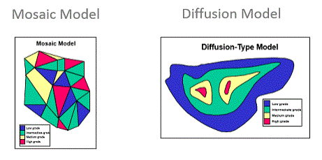

# GAUSANAM Process

To access this process:

  * Enter "GAUSANAM" into the [Command Line](<../COMMON/Command_Toolbar.md>) and press <ENTER>.
  * Display the **[Find Command](<../COMMON/findcommand.md>)** screen, locate **GAUSANAM** and click **Run**.

  * Launched as part of the [Uniform Conditioning Wizard](<../Uniform_Conditioning/UniformConditioning_Introduction.md>).

See this process in the [Command Table](<../command_help/COMMAND%20TABLE_G.md#GAUSANAM>).

## Process Overview

For mosaic-style modelling, all variograms are directly proportional, so indicator kriging will provide a correct solution. Diffusion-style models are a bigger challenge in that [co-kriging](<../STUDIO_RM/Grade%20Estimate%20Overview.md#cokriging>) is required as the model is discretely gaussian in nature. The important point is that the gaussian model will retain a gaussian distribution when the [support change](<../Uniform_Conditioning/About_Change_of_Support.md>) occurs (from points to blocks) as a result of Gaussian Anamorphosis.

The gaussian anamorphosis is a mathematical function which transforms a variable Y with a gaussian distribution in a new variable Z with any distribution. From a pragmatic viewpoint, this means transforming a non-Gaussian distribution into a Gaussian distribution (anamorphosis means transformation).

The Gaussian Anamorphosis Modelling functionality is designed to:

  * model the histogram of your raw dataset (Anamorphosis function),
  * transform a Raw Variable into a Gaussian Variable (normal score transformation) that will be used in the simulation processes, and;
  * calculate grade-tonnage curves

## Input Files

Name |  Description |  I/O Status |  Required |  Type  
---|---|---|---|---  
SAMPLES |  A Datamine file that contains sample positional information and supporting attributes. |  Input |  Yes |  Undefined  
  
## Output Files

Name |  I/O Status |  Required |  Type |  Description  
---|---|---|---|---  
GRAPH |  Output |  No |  Undefined |  A file containing the data required to construct scatter plot and histogram graphs relating to a locally-conditioned SMU model.  
STATS |  Output |  No |  Undefined |  A file containing summary statistical data (in Datamine binary format) relating to a locally-conditioned SMU model.  
  
## Fields

Name |  Description |  Source |  Required |  Type |  Default  
---|---|---|---|---|---  
GRADE |  The grade field (present in the samples file) that will be considered during anamorphosis. |  IN |  Yes |  Alphanumeric |  Undefined  
WEIGHT |  An optional weighting field. |  IN |  No |  Alphanumeric |  Undefined  
  
## Example
    
    
    !GAUSANAM  &SAMPLES(samples),  &GRAPH(s_graph),   &STATS(s_stats)  
  
---  
      
    
    *GRADE(AU),   *WEIGHT(DENSITY)  
  
Related topics and activities

  * [Uniform Conditioning Wizard](<../Uniform_Conditioning/UniformConditioning_Introduction.md>)

  * [GAUSAN Process](<gausan.md>)

  * [UNIFCOND Process](<unifcond.md>)