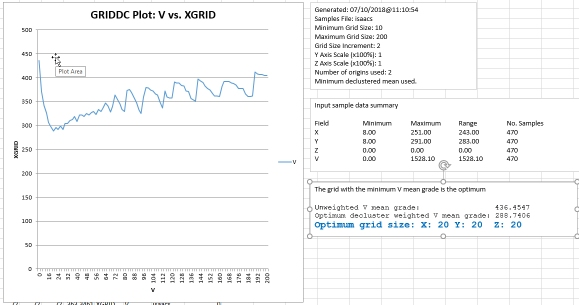
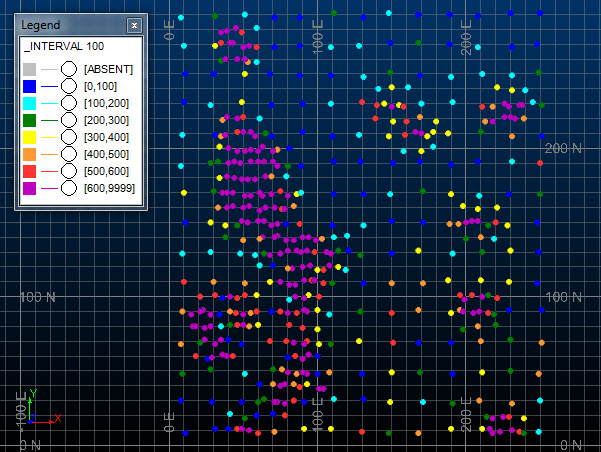
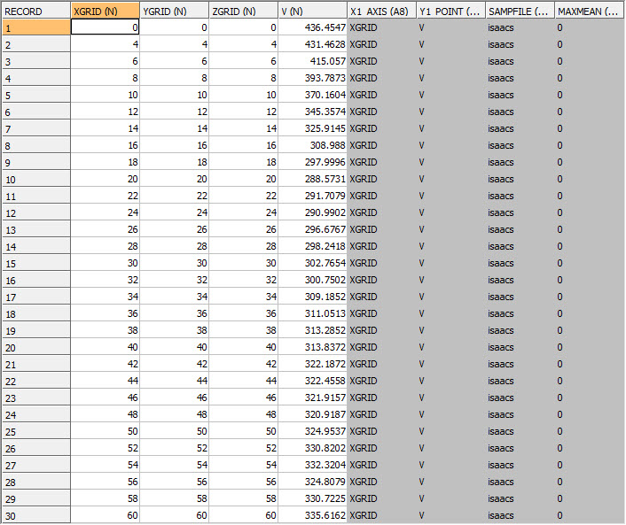
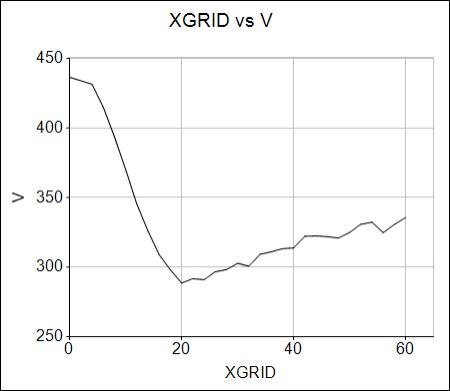
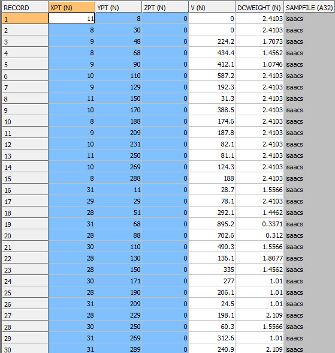
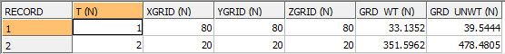

# GRIDDC Process

To access this process:

  * **Sample Analysis** ribbon **> > Decluster >> Optimum Grid**.
  * Enter "GRIDDC" into the [Command Line](<../COMMON/Command_Toolbar.md>) and press <ENTER>.
  * Display the **[Find Command](<../COMMON/findcommand.md>)** screen, locate **GRIDDC** and click **Run**.

See this process in the [Command Table](<../command_help/COMMAND%20TABLE_G.md#GRIDDC>).

## Process Overview

**Note** : This is a _superprocess_ and running it may have an effect on other Datamine files in the project.

The GRIDDC process calculates the declustered weight for a set of samples using a gridding method. It will also identify the optimum grid size in the case of preferential clustering where for example there is a high density of samples in the high grade area or conversely a high density of samples in the low grade area.

Data are often spatially clustered, but we usually need a histogram that is representative of the entire area of interest, for example for a conditional simulation study. To obtain a representative distribution the method assigns declustered weights whereby samples in areas with more data receive less weight than those in sparsely sampled areas.

The GRIDDC process uses a third party program DECLUS from the GSLIB library. The method creates multiple grids of different sizes that are superimposed over the samples. The weight for each sample for each grid size is then based on the number of samples in that grid cell.

The process provides a method for determining the optimum 3D grid cell size for those cases where the samples are known to be clustered preferentially in either high or low grade areas. In other cases a polygon-type declustering method should be considered where the weight is proportional to the sample volume of influence. This is provided by the declustering process [POLYDC](<polydc.md>).

The declustered weighted mean grade is calculated for each grid size. If the clustering is mainly in high grade areas then the optimum grid size corresponds to the minimum weighted mean grade whereas if the clustering is in low grade areas then the optimum size corresponds to the maximum weighted mean. The user must decide which of the two cases is appropriate for the input sample data and set the value of parameter MAXMEAN as either minimum or maximum.

### Specification of Grid Sizes

The minimum and maximum size of a grid cell in the X direction to be analyzed are defined by parameters XGRIDMIN and XGRIDMAX respectively. The parameter GRIDINC then controls the number of intermediate increments between the minimum and maximum. The grid size in the Y and Z directions is controlled by parameters YFACTOR and ZFACTOR that define the grid size as a multiplying factor of the X grid size. The factors can be less than 1 but must be greater than 0.00001.

### Multiple Grid Origins

The initial origin of the declustered grid is calculated automatically as the minimum X, Y and Z sample coordinates minus 0.01. If only one origin is tested then the choice of origin can make make a difference to the calculated weights and hence to the declustered weighted mean grade. Therefore it is recommended that multiple origins are selected so that the average weight for each sample over all origins is calculated for each grid size.

The number of grid origins is selected by parameter NORIG. The origins are located at regular increments along the 3D diagonal of a grid cell where the increment depends on the number of origins selected. Hence if NORIG=2 the second origin will be at the centre of the cell defined by the initial origin. A good number of origins is 4 for 2D data and 8 for 3D data.

### Excel Output

An example of GRIDDC output in Excel

If @EXCEL=1, GRIDDC outputs additional files in .csv format:

  * &OUT.csv: this contains the same information as the specified &OUT file, but in .csv format.
  * griddc_excel_params.csv: a summary file containing a listing of parameters and values. This is used to append the generated chart in Excel. This file is mandatory if you wish to display results in Excel.
  * griddc_excel_isummary.csv: the summary report that is output to the Output window is also exported in csv format. This is displayed alongside the grid vs. value chart in Excel. This file is optional - a chart can still be generated without it.
  * griddc_excel_osummary.csv: a file containing summary statistics and the optimum grid size result. Displayed alongside the Excel chart. This file is optional - a chart can still be generated without it.

These files are automatically loaded into Excel by GRIDDC.xlsm, a template Excel file copied from your installation folder when GRIDDC is run with @EXCEL=1.

The generated Excel file will contain the information found in &OUT, so can be used for further analysis if required.

Macro content must be enabled in Excel for the chart to be displayed. If neither ZONE1 or ZONE1 are specified, a single summary worksheet will be generated representing all input samples. If one or two zones are specified, a zone-specific worksheet will be create for each ZONE1 value or ZONE1-ZONE2 combination, up to a maximum of 255 worksheets.

### Retrieval Criteria

Retrieval criteria can be used with this process. For example, you may wish to consider only records matching a specific keyfield value such as ROCKTYPE.  

### ZONE Fields

One or two zone fields may be specified using the * **ZONE1** and * **ZONE2** fields. The zone values will then be included in the two output files for each zone or combination of two zones.

### GRIDDC Example

The example below is based on the data described by Isaaks and Srivastava in their book "An Introduction to Applied Geostatistics". The grade variable is V and there are 470 samples with 2D coordinates. The initial sample grid was 20x20m with subsequent infilling down to about 4x4m in places.

;>)

It can be seen in the graphic that the high density of sampling is in the high grade area. This means that parameter **MAXMEAN** should be set to zero so that the grid size with the minimum decluster weighted mean grade is identified as the optimum.

The first record in the **OUT** file shows the unweighted mean of the * **GRADE** sample values. The remaining records show the decluster weighted mean grade for the different grid sizes averaged over the 4 origin locations. The **X1_AXIS** and **Y1_AXIS** fields give the names of the fields to be plotted on the X and Y axes of the chart as shown below.

;>)

Chart of Grid Size v Weighted Mean Grade

You can plot XGRID on the X axis against V on the Y axis of a line chart. It can be seen from the graphic that the decluster weighted mean grade (V) decreases until the X grid size reaches 20m and then starts to increase. This shows that the optimum grid size is 20m in X. In this example **XFACTOR** and **YFACTOR** are both 1 so the corresponding grid sizes in Y and Z also 20m.

You can also output to Excel to generate a similar graph, using @**EXCEL** =1 (see above)

The **WTOUT** file contains the declustered weights. It is a copy of the input file for those samples with a non-absent * **GRADE** value with the extra field **DCWEIGHT**. The first 30 records of the file are shown in the graphic.

;>)   

This output **Summary** file contains one record for each zone combination. This includes the optimum declustered grid size, the decluster weighted mean grade (**GRD_WT**) and the unweighted mean grade (**GRD_UNWT**). In the example below the * **ZONE1** field is T.

;>)

Only weights for the optimum grid size are reported. If you want weights for a different grid size then you should rerun **GRIDDC** with the required grid size defined with **XGRIDMIN** =**XGRIDMAX**. **GRIDINC** can be any value greater than 0.1.

## Input Files

Name |  Description |  I/O Status |  Required |  Type  
---|---|---|---|---  
IN |  Input sample data file. This must contain a set of 3D coordinates (eg X,Y,Z) and at least one other field. |  Input |  Yes |  Sample  
  
## Output Files

Name |  Description |  I/O Status |  Required |  Type  
---|---|---|---|---  
OUT |  Output file containing declustered grid sizes and corresponding average grade values. |  Output |  Yes |  Table  
WTOUT |  Output file containing declustered weights. This will be a copy of the IN file for samples with a non-absent GRADE value, but will also include the field **DCWEIGHT**. |  Output |  No |  Table  
SUMMARY |  Output file containing a single record summarising the optimum results for each zone combination |  Output |  No |  Table  
  
## Fields

Name |  Description |  Source |  Required |  Type |  Default  
---|---|---|---|---|---  
X/Y/Z |  X, Y or Z sample coordinate |  IN |  Yes |  Numeric |  X/Y/Z  
GRADE |  Field to be used for calculating declustered weights. |  IN |  Yes |  Numeric |  X/Y/Z  
ZONE1 |  First sample classification field.  |  IN |  No |  Numeric or alphanumeric |  Undefined  
ZONE2 |  Second sample classification field.  |  IN |  No |  Numeric or alphanumeric |  Undefined  
  
## Parameters

Name |  Description |  Required |  Default |  Range |  Values  
---|---|---|---|---|---  
MAXMEAN |  Flag to identify whether minimum or maximum declustered mean grade is used to define the optimum. The declustered sample weights for the optimum grid size are output to the **WTOUT** file. The optimum declustered mean and corresponding grid size are reported to the **Command** window for both values of GSLIB: =0 : Use the grid with the minimum declustered mean to define the optimum. =1 : Use the grid with the maximum declustered mean to define the optimum. |  No |  0 |  0,1 |  0,1  
XGRIDMIN |  Minimum grid size in X |  Yes |  10 |  Undefined |  Undefined  
XGRIDMAX |  Maximum grid size in X |  Yes |  100 |  Undefined |  Undefined  
GRIDINC |  Grid increment size in X |  Yes |  10 |  Undefined |  Undefined  
YFACTOR |  Grid size factor in Y, e.g. if this is set to 3 then the grid cell size in the Y direction will be 3 times the X grid cell size. |  Yes |  1 |  Undefined |  Undefined  
ZFACTOR |  Grid size factor in Z. |  Yes |  1 |  Undefined |  Undefined  
NORIG |  Number of origins. Each grid size is tested for **NORIG** origin locations. Between 1 and 10 origins can be used. The origins are spaced at regular intervals along the diagonal of the 3D rectangle with sides defined by **XGRID** , **YFACTOR** and **ZFACTOR**. |  No |  1 |  1,10 |  1,2,3,4,5,6,7,8,9,10  
EXCEL |  Set to 1 to automatically display a graph in Excel of grid size against grade. See "Excel Output", above |  No |  0 |  0,1 |  0,1  
  
## Example
    
    
    !GRIDDC &IN(isaacs), &OUT(DC_Table),   
  
---  
      
    
     &WTOUT(DC_Wgts), &SUMMARY(DC_Summary),  
      
    
            *X(XPT), *Y(YPT), *Z(ZPT),   
      
    
     *GRADE(V), ZONE1(T),  
      
    
            @MAXMEAN=0,  
      
    
            @XGRIDMIN=4, @XGRIDMAX=60,   
      
    
     @GRIDINC=2,  
      
    
            @YFACTOR=1.0, @ZFACTOR=1.0,   
      
    
     @NORIG=4, @EXCEL=1  
  
* * *

Copyright

The Datamine command GRIDDC uses the GSLIB program DECLUS.

Copyright (C) 1996, The Board of Trustees of the Leland Stanford Junior University. All rights reserved.

The programs in GSLIB are distributed in the hope that they will be useful, but WITHOUT ANY WARRANTY. No author or distributor accepts responsibility to anyone for the consequences of using them or for whether they serve any particular purpose or work at all, unless he says so in writing. Everyone is granted permission to copy, modify and redistribute the programs in GSLIB, but only under the condition that this notice and the above copyright notice remain intact.