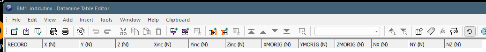
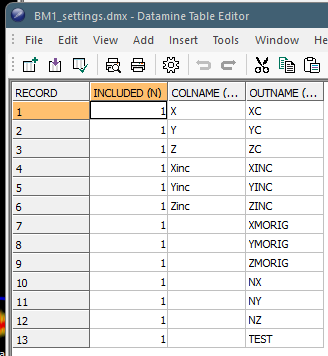

# INTEXT Process

To access this process:

  * **Data** ribbon >> **Data Tools >> Tables >> Import Text**.

  * Enter "INTEXT" into the [Command Line](<../COMMON/Command_Toolbar.md>) and press <ENTER>.
  * Display the **[Find Command](<../COMMON/findcommand.md>)** screen, locate **INTEXT** and click **Run**.

See this process in the [Command Table](<../command_help/COMMAND%20TABLE_I.md#INTEXT>).

## Process Overview

Import a text file with a known data definition to create a Datamine binary file (either .dm or .dmx, depending on your current **[default file format](<../COMMON/Datamine-File-Format.md>)**.

A data definition can either be determined from the header of the imported file, or from an existing Datamine binary file. If a separate file (**INDD**) is used, **INTEXT** attempts to calculate the type and (in the case of alphanumerics) size of the columns of the output file.

Several parameters are available to control the conversion process.

**INTEXT** is used by the [Text Importer](<../COMMON/text-importer.md>) tool, where many of the settings listed below appear as curated screen controls.

Datamine data is generated in the current default [Datamine File Formats](<../COMMON/Datamine-File-Format.md>).

Note: Data records may not start with the character "!". This is because the ! symbol acts as the end-of-data character. However, macro files, where the command starts with !, may be read if a blank is inserted prior to the ! symbol.

## SETTINGS and INDD Inputs

INTEXT import is governed by the presence of one of the following files (or neither of them):

##### *INDD

The **INDD** file is, in effect, a prototype file containing a header (other data is ignored). Just like a prototype block model file, **INDD** contains field definitions of the data _being imported_. "INDD" stands for "input data definition". This input data definition is used instead of a SETTINGS file (see below).

Note: If both **INDD** and **SETTINGS** are specified, **INDD** is ignored.

Important notes about INDD:

  * INDD must contain the full field definition: name, type, length, implicit flag and default value, using the syntax `<name>;<definition>=<default>`.

  * The default value is optional.

  * The name is optional for all standard definition fields, but must be included for additional rows.

  * Additional rows must be implicit fields.

For example, if importing block model data, the following definition matches the tabular data held in a text file:

;>)

If a text file header exists in the incoming file, 

##### *SETTINGS

**SETTINGS** is mandatory if **FIXWIDTH** =1.

A **SETTINGS** file determines how the incoming data attribute names are mapped to output names. In this case, you may want the cell size attributes (**Xinc** , **Yinc** , **Zinc**) to be capitalized in the DM file, and to ensure the expected system fields for a block model are present, convert **X** to **XC** , **Y** to **YC** and **Z** to **ZC**. In this case, the **SETTINGS** file looks like this:

Note: If both **INDD** (see above) and **SETTINGS** are specified, **INDD** is ignored.

The **SETTINGS** file can contain any or all of the following attributes:

  * **COLDWIDTH** The alphanumeric column width to be created in the output Datamine file. This is either 0 (a variable column width) or 1 (a fixed column width).

**COLDWIDTH** must be a positive integer, other than the final column that can be set to a negative value, meaning the COLWIDTH is set to the width of the all characters available.

Note: This field is mandatory if **FIXWIDTH** =1, otherwise the field is ignored.

  * **INCLUDED** 1 if the incoming field is included in the importation, or 0 if it is ignored. 

Note: If this column doesn't exist in the file, all columns are included in the import.

  * **OUTNAME** The output Datamine field name of an imported field (as shown in **COLNAME** for the same record).

  * **COLNAME** The name of the field in the imported text file that will be changed to **OUTNAME** during conversion.

Other important things to remember about **SETTINGS** :

  * The row order must follow the order of the text file columns.

  * **SETTINGS** can have more rows than the number of text file columns (additional rows) but the value for these rows must be 0 (zero).

Note: Where a field isn't specified, no data conversion occurs and the incoming data assumes default settings (default column width, included, input name = output name).

##### No Files Specified

If neither INDD nor SETTINGS are defined, data is imported as-is. This is useful if your incoming data file is already formatted as you want it and you want a precise copy in Datamine format.

##### Summary of Inputs

In essence, you can import data in one of four ways:

  * Define your field mapping and definitions in a SETTINGS file.

  * Use an existing file to derive a data definition (INDD). If imported data includes header information, this is used to name the output file fields and set column widths.

  * As above, but don't import header information. This means you can define field names and widths during import.

  * Import the data as-is, without defining INDD or SETTINGS

Import Features | SETTINGS |  INDD With text header |  INDD Without text header | Text Only  
---|---|---|---|---  
Set the field definition (DD) | YES | YES | YES | NO  
Set field default values | YES | YES | YES | NO  
Rename fields | YES | NO | YES | NO  
Create additional implicit fields | YES | YES | YES | NO  
Set fixed column widths | YES | NO | NO | NO  
Exclude columns | YES | YES | NO | NO  
| YES | NO | NO | NO  
  
## Input Files

Name |  Description |  I/O Status |  Required |  Type  
---|---|---|---|---  
INDD |  File containing Data Definition. Ignored if SETTINGS is specified. |  Input |  No |  Table  
SETTINGS |  File providing settings for each imported data column, with up to four optional fields.  See "SETTINGS and INDD inputs", above. If both INDD and SETTINGS are specified, INDD is ignored. | Input | No | Table  
  
Note: If neither INDD nor SETTINGS are defined, data is imported as-is. This is useful if your incoming data file is already formatted as you want it and you want a precise copy in Datamine format.

## Output Files

Name |  I/O Status |  Required |  Type |  Description  
---|---|---|---|---  
OUT |  Output |  Yes |  Table |  File to be created.  
  
## Parameters

Name |  Description |  Required |  Default |  Range |  Values  
---|---|---|---|---|---  
COLUMN |  Define the column separator in the input text file.

  1. Comma (default).
  2. Space.
  3. Tab.
  4. Semi colon.
  5. Colon. 

|  No |  1 |  1,5 |  1,2,3,4,5  
DELIMIT |  Treat consecutive delimiters as one. 

  * 0: Off. 
  * 1: On.

| No | 0 | 0,1 | 0,1  
FIXWIDTH |  Import data as fixed width columns. If **FIXWIDTH** =1 then **SETTINGS** must exist and contain a list of column widths for all importable fields (**COLWIDTH** attribute). If **FIXWIDTH** = 0, the column width is variable, and set according to the data in the imported file. |  |  |  |   
STARTROW |  Row number in input text file of the first record to import.  | No | 1 | Undefined | Undefined  
ENDROW |  Row number in input text file of the last record to import. Default=+, i.e. read all rows.  0 or negative will also be treated as read all rows. | No | "+" | Undefined | Undefined  
HEADER |  Row number in input text file that contains the field names. If no header is set, then the input data defintion (**INDD**) is required (see also **ALLCOL**).  0 or negative is treated as no header. | No | 1 | Undefined | Undefined  
UPCASE |  Force all field names to be upper case.  Note that if the data definition or input file contains multiple variations of a field name case, and **UPCASE** = 1, the import will stop. 

  * 0: Use case from text (default).
  * 1: Convert to upper case. 

| No | 0 | Undefined | Undefined  
DECIMAL |  Specify whether numbers use decimal points or commas. 

  * 0: Dot 
  * 1: Comma.

| No | 0 | 0,1 | 0,1  
QUOTESTR |  Single character used to quote strings in the imported data. The value can either be an integer code or a single character. Integer codes: 0 no quotes 1 double quotes (") 2 single quote (') Any column separator (according to COLUMN) found inside a quoted string is considered a normal text character. Note: Multiline strings are not supported. |  |  |  |   
COMMENT |  Single character used to identify comment lines in the incoming file. Any line starting with this character is ignored. The value can either be an integer code or single character. Integer codes: 0 no comment 1 # character |  |  |  |   
INCRMNT |  Only read every 1 of **INCRMNT** records / rows, starting from **STARTROW**. | No | 1 | Undefined | Undefined  
ABSENT |  Character string or number that defines absent data. | No | "-" | Undefined | Undefined  
TRACEDAT | A value that represents a trace numeric value. If this value is detected, it is assigned the system "TR" flag in the numeric field of the output file. |  |  |  |   
CEILING |  Character string or number that defines ceiling data.  | No | "+" | Undefined | Undefined  
ALLCOL |  Only used if **INDD** is specified.  Import all columns even if these do not exist in Data Definition.

  * 0: Only import columns if they occur in Data Definition provided by INDD (see also HEADER). 
  * 1: Import all columns in input text file. 

| No | 0 | 0,1 | 0,1  
NSCAN |  Number of records to read to auto detect field types and lengths. Not used if **IN** is defined and **HEADER** is 0 or negative.  If 0, let the process determine the appropriate number of rows to scan according to the file size.  | No | 0 | Undefined | Undefined  
WORLDXYZ |  This parameter is only used when importing block model. It is mainly designed for rotated block model when the incoming coordinates are not local grid coordinates as expected, but world (or mine local) coordinates. In this case use the value 1.  =1 : if you know that the XC,YC,ZC come as world coordinates. =0 : if you know that the XC,YC,ZC come as grid local coordinates.  =-1 : let the process choose (local grid coordinates for rotated block models, world coordinates otherwise) (default).  | No | -1 | -1,1 | -1,0,1  
  
## Example

In the following example, the CSV file for conversion does not contain a header file and the first row is blank, hence a separate data definition is required (**INDD**) and the data rows start at line 2 (**STARTROW**):
    
    
    !INTEXT   &INDD(my_dd),  
  
---  
      
    
    &SETTINGS(dd_settings),  
      
    
    &OUT(convertedDMfile),  
      
    
    @STARTROW=2.0  
      
    
    filetoconvert.csv  
  
Related topics and activities

  * [Text Importer](<../COMMON/text-importer.md>)

  * [Text Wizard](<../COMMON/Text%20Wizard.md>)

  * INTEXT Process

  * [INPDDF Process](<inpddf.md>)

  * [INPFIL Process](<inpfil.md>)

  * [INPFML Process](<inpfml.md>)

  * [INPUTC Process](<inputc.md>)

  * [INPUTD Process](<inputd.md>)

  * [INPUTW Process](<inputw.md>)

  * [OUTPUT Process](<output.md>)