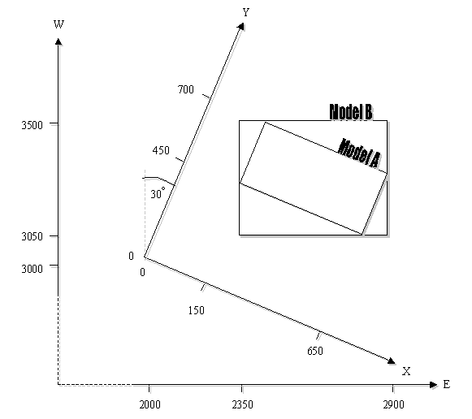
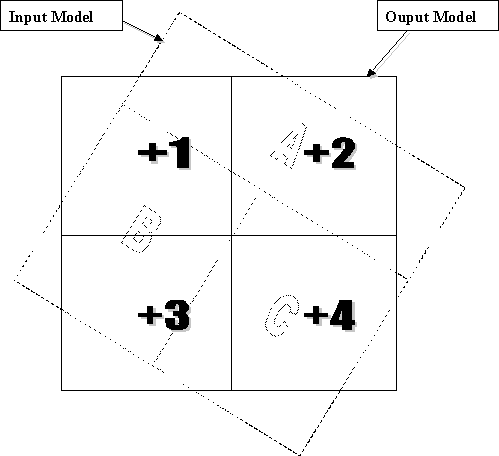

# MDTRAN Process

To access this process:

  * **Model** ribbon **> > Reposition >> Rotate**.

  * **Model** ribbon **> > Reposition >> Reposition >> Rotate**.
  * Enter "MDTRAN" into the [Command Line](<../COMMON/Command_Toolbar.md>) and press <ENTER>.
  * Display the **[Find Command](<../COMMON/findcommand.md>)** screen, locate **MDTRAN** and click **Run**.

See this process in the [Command Table](<../command_help/COMMAND%20TABLE_M.md#MDTRAN>).

## Process Overview

MDTRAN creates a new block model on a different prototype and coordinate system to an existing block model.

The coordinate system for the new model may be translated and rotated with respect to the existing system.

The parameters to define the translation and rotation are the same as those used in the [CDTRAN](<cdtran.md>) process. Three rotations about different axes may be specified. 

There are three MDTRAN scenarios:

|  &IN |  &PROTO |  &PROTOROT or Parameters |  &OUT  
---|---|---|---|---  
1 | Local grid, but not a rotated model | World grid | Rotations INVERSE=0 | World grid  
2 | Rotated model | World grid | &IN rotated model prototype INVERSE=1 | World grid  
3 | World grid | Rotated model prototype | &PROTO rotated model prototype INVERSE=-0 | Rotated model  
  
  * To convert from a local grid (without rotated model fields) to a rotated model simply append the rotated model prototype to the local grid model.
  * It is not possible to directly convert from a rotated model to another rotated model with different rotations. To do this you would have to run **MDTRAN** twice, first for scenario 2 then for scenario 3.
  * Usually, &**PROTO** will not contain records. If it does then only cells at &**PROTO** locations will be assigned values from &**IN**.
  * The rotations can be defined using either &**PROTOROT** or the MDTRAN parameters. If the &**PROTOROT** file is defined then its values take precedence over the parameters.
  * It would seem that **MDTRAN** is set up for scenario 1 rather than 2\. In scenario 1 there are no rotated model fields in &**IN** so they are not copied to &OUT.
  * In scenario 2 the rotated model fields in &**IN** are not identified as rotated model fields so they get copied from &**IN** to &**OUT** ; then they have to be removed.

The centre point of each subcell in the output model is identified, and the subcell values are set equal to the corresponding point in the input model. If the &**PROTO** model file contains records then the &**OUT** model will have the same configuration of cells/subcells, but with values taken from the &IN model. If there is no corresponding point in the &IN model, then absent data values will be assigned in the &**OUT** model.

If &**PROTO** is empty then the process will create subcells. Initially the entire model framework will be filled with cells and subcells as defined by the @**X/Y/ZSUBCELL** parameters. However only those subcells whose midpoints lie within a subcell of the &IN model will be assigned values and written to the &**OUT** model.

The assignment of values from the &**IN** model to the &**OUT** model is illustrated in Figure 2 (Examples section).

The translation and rotation are usually defined by the 12 parameters @**X0** , @**Y0** , @**Z0** , @**XR0** , @**YR0** , @**ZR0** , @**ANGLE1** , @**ANGLE2** , @**ANGLE3** , @**ROTAXIS1** , @**ROTAXIS2** , and @**ROTAXIS3**. Alternatively, a rotated model file may be defined as the optional &**PROTOROT** file. The data definition of this file will contain all the necessary translation and rotation information. 

Note: A macro illustrating this is included in the _Examples_ section below.

A scaling function is provided so that for example meters may be converted to feet, miles to kilometers, etc. If the optional @**FACTOR** parameter is set, then the units of the points in the rotated system will be @**FACTOR** times the units of the unrotated system. This means that, for example, if @**FACTOR** = 0.3048 and input units are feet then the output units will be meters. @FACTOR is the number of output units which equals one unit. The input point X0, Y0, Z0 will be in input units, and XR0, YR0, ZR0 will be in output units.

The @INVERSE parameter allows an inverse coordinate rotation. If @**INVERSE** =1 then the input model &**IN** is assumed to be in the rotated system, and the output model &**OUT** will be in the unrotated system. Otherwise the parameters @**X0** , @**Y0** , @**Z0** , @**XR0** , @**YR0** , @**ZR0** , @**ANGLE1** , @**ANGLE2** , @**ANGLE3** , @**ROTAXIS1** , @**ROTAXIS2** , and @**ROTAXIS3** are set exactly as they would be for the original conversion from the unrotated to the rotated system. In other words, X0, Y0 and Z0 is still the point in the unrotated system which matches point XR0, YR0, ZR0 in the rotated system, and ANGLE1, ANGLE2 and ANGLE3 are the angles to rotate from the unrotated system to the rotated.

## Input Files

Name |  Description |  I/O Status |  Required |  Type  
---|---|---|---|---  
IN |  Input model to be rotated. Must contain at least the fields XC, YC, ZC, XINC, YINC, ZINC, XMORIG, YMORIG, ZMORIG, NX, NY, NZ, and IJK. May also contain value fields. It must be sorted by IJK. |  Input |  Yes |  Block Model  
PROTO |  Prototype model defining output model. Must contain at least the fields **XC, YC, ZC, XINC, YINC, ZINC, XMORIG, YMORIG, ZMORIG, NX, NY, NZ** and **IJK**. May contain cells and subcells. Any fields which are in **PROTO** but not in **IN** will have their values carried across into **OUT**. |  Input |  Yes |  Model Prototype File  
PROTOROT |  Optional file containing the rotation and translation parameters stored as the default of implicit fields **ANGLE1, ANGLE2, ANGLE3, X0, Y0, Z0, XMORIG, YMORIG, ZMORIG, ROTAXIS1, ROTAXIS2** and **ROTAXIS3**. Fields **XMORIG, YMORIG** and **ZMORIG** correspond to parameters **XR0, YR0** and **ZR0**. The other nine fields have the same name as the corresponding parameters. If this file is specified and has valid values for all twelve fields then the parameter entries for rotation and translation are ignored. This file can be created using the Rotated Model option in process **[PROTOM](<protom.md>)**. Data will then be transformed into the local (rotated) coordinate system of the model. |  Input |  No |  Model Prototype File  
  
## Output Files

Name |  I/O Status |  Required |  Type |  Description  
---|---|---|---|---  
OUT |  Output |  Yes |  Block Model |  Output model. Will have default field values from PROTO for XC, YC, ZC, XINC, YINC, ZINC, XMORIG, YMORIG, ZMORIG, NX, NY, and NZ. Will also contain any value fields from IN and PROTO. It will be sorted by IJK.  
  
## Parameters

Name |  Description |  Required |  Default |  Range |  Values  
---|---|---|---|---|---  
ANGLE1 |  First rotation angle clockwise in degrees, around axis **ROTAXIS1**. It must lie between -360.0 and +360.0. A value of zero indicates no rotation. (0) |  No |  0 |  -360, 360 |  Undefined  
ANGLE2 |  Second rotation angle clockwise in degrees, around axis **ROTAXIS2**. It must lie between 360.0 and +360.0. A value of zero indicates no rotation. (0) |  No |  0 |  -360, 360 |  Undefined  
ANGLE3 |  Third rotation angle clockwise in degrees, around axis **ROTAXIS3**. It must lie between -360.0 and +360.0. A value of zero indicates no rotation. (0) |  No |  0 |  -360, 360 |  Undefined  
ROTAXIS1 |  Axis around which first rotation angle will occur. 0 for no rotation, 1 for X axis, 2 for Y axis, 3 for Z axis. (3) |  No |  3 |  0,3 |  0,1,2,3  
ROTAXIS2 |  Axis around which second rotation angle will occur. 0 for no rotation, 1 for X axis, 2 for Y axis, 3 for Z axis. (1) |  No |  1 |  0,3 |  0,1,2,3  
ROTAXIS3 |  Axis around which third rotation angle will occur. 0 for no rotation, 1 for X axis, 2 for Y axis, 3 for Z axis. (3) |  No |  3 |  0,3 |  0,1,2,3  
X0 |  X co-ordinate of known point in both systems, in unrotated co-ordinate system (0). |  No |  0 |  Undefined |  Undefined  
Y0 |  Y co-ordinate of known point in both systems, in unrotated co-ordinate system (0). |  No |  0 |  Undefined |  Undefined  
Z0 |  Z co-ordinate of known point in both systems, in unrotated co-ordinate system (0). |  No |  0 |  Undefined |  Undefined  
XR0 |  X co-ordinate of known point in both systems, in rotated co-ordinate system (0). |  No |  0 |  Undefined |  Undefined  
YR0 |  Y co-ordinate of known point in both systems, in rotated co-ordinate system (0). |  No |  0 |  Undefined |  Undefined  
ZR0 |  Z co-ordinate of known point in both systems, in rotated co-ordinate system (0). |  No |  0 |  Undefined |  Undefined  
XSUBCELL |  Cell division in X direction in OUT. Only used if **PROTO** is empty. Default (1), max 20. |  No |  1 |  1,20 |  Undefined  
YSUBCELL |  Cell division in Y direction in OUT. Only used if **PROTO** is empty. Default (1), max 20. |  No |  1 |  1,20 |  Undefined  
ZSUBCELL |  Cell division in Z direction in OUT. Only used if **PROTO** is empty. Default (1), max 20. |  No |  1 |  1,20 |  Undefined  
FACTOR |  Co-ordinate scaling factor. Default (1). The rotated co-ordinate system units will be e.g. 0.3048 for a grid in metres on an unrotated grid in feet. |  No |  1 |  Undefined |  Undefined  
INVERSE |  Inverse transformation. Default (0). |  Option |  Description  
---|---  
0 |  Rotate from IN through {ANGLE1, ANGLE2,ANGLE3} to OUT.  
1 |  Inverse transformation to above; OUT is in rotated system; IN is in unrotated system; ANGLE1-3 are same angles as for 0.  
No |  0 |  0,1 |  0,1  
PRINT |  Print flag. Default (0). 0 - minimum output. 1 - details of each subcell in output model. |  No |  0 |  0,1 |  0,1  
  
## Examples

#### Example 1

Model A was created on a local grid, and it is required to translate and rotate its data so that it is held in a model oriented to the standard grid, as shown in Figure 1. It is required to create model B with 4 subcells in X and Y and 2 in Z:
    
    
    > !START M1  
  
---  
      
    
    !REM =====================================================  
      
    
    !REM Define a prototype model in the standard grid  
      
    
    !REM =====================================================  
      
    
    !PROTOM &OUT(NEWPROTO)  
      
    
    N # No MINED field  
      
    
    Y # Yes - subcells  
      
    
    2350 # New model X origin  
      
    
    3050 # New model Y origin  
      
    
    500 # New model Z origin  
      
    
    10 # New model cell size in X  
      
    
    10 # New model cell size in Y  
      
    
    10 # New model cell size in Z  
      
    
    55 # Number of cells in X for new model  
      
    
    45 # Number of cells in Y for new model  
      
    
    20 # Number of cells in Z for new model  
      
    
    !REM =====================================================  
      
    
    !REM MODELA was created on a local grid.   
      
    
    !REM MODELB will be created on the standard grid.  
      
    
    !REM =====================================================  
      
    
    !MDTRAN&IN(MODELA), &PROTO(NEWPROTO), &OUT(MODELB),  
      
    
    > @ANGLE1=-30, @ANGLE2=0, @ANGLE3=0,  
      
    
    @ROTAXIS1=3, @ROTAXIS2=0, @ROTAXIS3=0,  
      
    
    @X0=0, @Y0=0, @Z0=0,  
      
    
    @XR0=2000, @YR0=3000, @ZR0=0,  
      
    
    @XSUBCELL=4, @YSUBCELL=4, @ZSUBCELL=2,  
      
    
    @FACTOR=1, @INVERSE=0  
      
    
    !END  
  
#### Example 2

Create a model in the world coordinate system from a model which was created using Studio 3's Rotated Model option.
    
    
    !START M2  
  
---  
      
    
    !REM =====================================================  
      
    
    !REM ROTMOD is a rotated model which has been created  
      
    
    !REM using Studio 3's rotated model options.  
      
    
    !REM   
      
    
    !REM PROTOM1 is a normal model prototype, defined in the  
      
    
    !REM world coordinate system.  
      
    
    !REM   
      
    
    !REM TEMPMOD will be created in the world coordinate system.  
      
    
    !REM   
      
    
    !REM Set @INVERSE to 1, because the rotations defined in the  
      
    
    !REM PROTOROT DD are for the original rotation.  
      
    
    !REM =====================================================  
      
    
    !MDTRAN&IN(ROTMOD), &PROTO(PROTOM1), &PROTOROT(ROTMOD),  
      
    
    &OUT(TEMPMOD), @FACTOR=1, @INVERSE=1  
      
    
    !REM =====================================================  
      
    
    !REM Now remove the rotated model fields from TEMPMOD, to  
      
    
    !REM create WORLDMOD  
      
    
    !REM =====================================================  
      
    
    !SELDEL&IN(TEMPMOD), &OUT(WORLDMOD),   
      
    
    > *F1(X0), *F2(Y0), *F3(Z0),  
      
    
    *F4(ANGLE1), *F5(ANGLE2), *F6(ANGLE3),  
      
    
    *F7(ROTAXIS1), *F8(ROTAXIS2), *F9(ROTAXIS3)  
      
    
    !END  
  
;>)

**MODELA** uses the X-Y grid axes; **MODELB** uses the E-N grid axes.  
  
The prototype for **MODELB** was defined to cover all of **MODELA**.   
Its limits (in the E-N grid and rounded outwards) can be calculated or measured to be:  
E = 2350 to 2900, N = 3050 to 3500

;>)   

Input model: subcell A: Au = 6.0, subcell B: Au = 4.0, subcell C: Au = 3.8  
  
Output model: subcell 1 has value from input model subcellBie Au = 4.0
    
    
    2         A ie Au = 6.0
    
    
    3         B ie Au = 4.0
    
    
    4         C ie Au = 3.8

## Error and Warning Messages

Message |  Description |  Solution  
---|---|---  
>>> Fatal error: &ffffff model file error <<< |  Where fffff is &**IN** or &**PROTO**. The program found an error trying to access the file you specified as &fffff. |  Check that the file name exists.  
>>> Fatal error: &fffff model field error <<< |  Where fffff is &**IN** or &**PROTO** The program found an error on trying to access one of the fields in the file you specified as &fffff. |  Check that the file contains the 13 compulsory model fields, and that they are of the correct type (Alpha/Numeric, Implicit, Explicit).  
>>> Fatal error: &fffff has IJK=mmmmmmm. Must be between 0 & nnnnnnnn <<< |  where fffff is &**IN** or &**PROTO**. The IJK values for subcells in a model range from 0 to a maximum calculated from (NX*NY*NZ)-1. The &fffff model you specified has an IJK of mmmmmmmmmm which is outside this range. |  Check how the model was created, and that there are no subcells which lie outside the model limits. Perhaps run **IJKGEN** in-place to re- calculate the IJK values.  
>>> Fatal error: &fffff must be sorted by IJK <<< |  Where fffff is &**IN** or &**PROTO**. |  Use **[MGSORT](<mgsort.md>)** or **[SORTX](<sortx.md>)** to sort the &fffff model on ascending IJK prior to use by **MDTRAN**.  
  
Related topics and activities

  * [CDTRAN Process](<cdtran.md>)

  * [PROTOM Process](<protom.md>)

  * [MGSORT Process](<mgsort.md>)