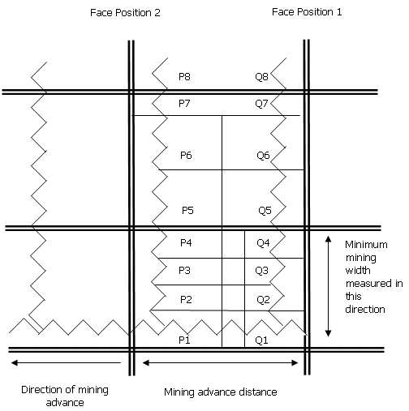
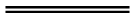
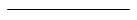
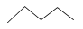
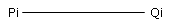
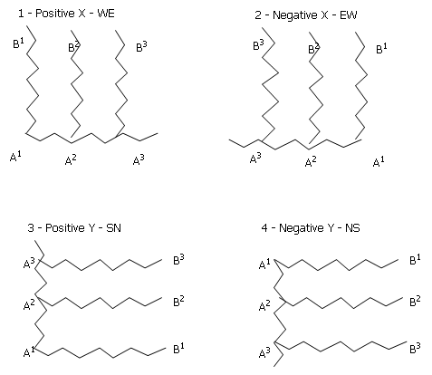
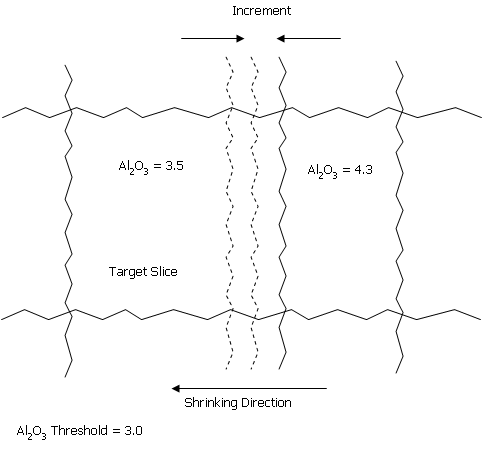

# MINZON Process

To access this process:

  * **Report** ribbon **> > Report >> Classify - Mining Zone**.

  * Enter "MINZON" into the [Command Line](<../COMMON/Command_Toolbar.md>) and press <ENTER>.
  * Display the **[Find Command](<../COMMON/findcommand.md>)** screen, locate **MINZON** and click **Run**.

See this process in the [Command Table](<../command_help/COMMAND%20TABLE_M.md#MINZON>).

## Process Overview

Investigate the relationship between mining parameters (bench height, minimum advance distance, minimum mining width) and the composition of each mining volume or zone.

The definition of a zone is configurable, and can take account of any modelled attribute such as rocktype, material type, stratigraphy, grade etc. For example, zone Z1 could be defined as having a mixture of rocktypes R1 and R2, where the proportion of R1 is greater than 50%, where the major stratigraphy is S3, and the grade of the element E1 is greater than 3.5 g/t.

If a zone does not meet the minimum mining width requirement then it may be combined with an adjacent zone according to a set of custom rules. An additional option allows the width of a zone to be shrunk in order to achieve grade criteria.

The process requires as input a geological model, a set of zone definitions, and the mining parameters. Two output files may be created; a model and a reserves file. The output model contains all the fields of the input model plus the zone field. Numeric fields are averaged over the zone, and alpha fields in the output model show the major value calculated on a tonnage basis. The output reserves file contains the tonnage and grade of each zone on each bench.

## MINZON Files

The following are the major files used by the **MINZON** process:

#### &IN - the input model

The input model file contains the standard 13 model fields plus a minimum of one additional field (e.g. grade, rocktype, etc). If it contains a field DENSITY, then this will be used for tonnage calculations.

#### &ZONEDEF - zone definitions

This file contains the definitions of each zone using conditional criteria on fields in the input model file. It contains six compulsory fields and has one optional field:

*ZONE  |  a four character alpha zone code.  
---|---  
*SUBZONE*  |  a secondary classification within the primary ZONE field. This is an optional field, and may be either alpha or numeric.  
*FIELD  |  the field in the input model file to which the criteria apply.  
*TEST1  |  a four character alpha field, containing one of the conditional operators: >, >=, <, <=, =, <>, /  
*VALUE1  |  an alpha field of up to 20 characters to which the conditional operation TEST1 applies.  
*TEST2  |  a four character alpha field, containing one of the conditional operators: >, >=, <, <=, =, <>, /  
*VALUE2  |  an alpha field of up to 20 characters to which the conditional operation TEST2 applies.  
  
If the value of **FIELD** is repeated within the same **ZONE** and **SUBZONE** classification then the condition is treated as a logical 'OR'. If different values of **FIELD** are specified within the same **ZONE** and **SUBZONE** classification then they are treated as a logical 'AND'.

The optional **SUBZONE** field is used to make alternative definitions for the same ZONE code. The SUBZONE does not form part of the output file.

The / operator represents a **BREAK** field. If the value of * **FIELD** changes then the zone is terminated. It does not require a * **VALUE1** or * **VALUE2** field.

Note: The <> operator represents 'not equals'.

#### &RULES - rules for slice combination

This file defines pairs of zones which may be combined and the order in which they are to be considered for combining. The order in which zones are compared is simply the order of the records in the file.

*TARGET  |  the main zone which is to be combined. This is a 4 character alpha field. Possible values are as defined in the *ZONE field of the &ZONEDEF file.  
---|---  
*ADJACENT  |  the zone to be combined with the *TARGET zone field. this is a 4 character alpha field. Possible values are as defined in the *ZONE field of the &ZONEDEF file.  
  
#### &THRESH - threshold values

This file defines values for threshold calculations. It is an optional file; if it is not specified then threshold calculations will not be used. The following five fields are compulsory:

*ZONE   
---  
*GRADE   
*THRESH   
*SHRINK   
*FAILZONE   
  
The &**THRESH** file may also contain any field from the input model file. The values of this field are used as criteria in addition to the *ZONE field. A value of - indicates that the field should be ignored.
    
    
    ZONE MATERIAL GRADE THRESH SHRINK FAILZONE
    
    
    C LGS FE 50 1 X
    
    
    D - AL2O3 -3 2 Y

**MATERIAL** is a field in the input model file. If the zone of a slice is C and the value of MATERIAL in the slice is LGS, and the grade of FE is less than 50, then redefine the zone as X. If the zone is D and the grade of AL2O3 exceeds 3, then shrinking will be attempted, irrespective of the value of MATERIAL.

#### &OUT - the output model

The output model file will contain all the fields from the input file plus the ZONE field. Numeric fields will contain the average value over the zone, and alpha fields will contain the majority alpha value. The majority alpha value is calculated on a tonnage weighted basis, excluding any blank (absent data) values.

#### &RESERVES - reserves by zone

The optional &RESERVES file contains tonnage classified by bench and zone:

*BENCH  |  Base of bench RL.  
---|---  
*ZONE  |  Zone code.  
*TONNES  |  The tonnage for the bench and zone.  
  
### Mining Parameters

Seven parameters are required to define mining dimensions. These are illustrated in Figure 1. @**ZXORIG** , @**ZYORIG** , @**ZZORIG** define the starting point for zone modeling, and @**DIRECTN** defines the direction of mining advance. The direction must be parallel to either increasing X or Y direction. this is illustrated in Figure 2. @**ZZORIG** is the elevation of the base of the lowest bench for which zoning is required.

The parameters @**MINWID** , @**MINADV** and @**MINBHT** define the minimum mining width, the mining advance distance, and the mining bench height respectively.

;>)

Plan through input model showing sub-cell structure

  * Parent Cell Boundary  

  * SubCell Boundary:  

  * Mining Slice Boundary:  
  

  * XZ Section Lines:  

Zone Model Origin:

Point Q1 is located at ZXORIG, ZYORIG, ZZORIG as defined by parameter.

;>)

Direction of mining

A1B1 - Face position 1

A2B2 - Face position 2

### Zone Definition

A zone is defined by the values of the individual cells and subcells which make up the zone volume. For example:
    
    
    Number ZONE MPROP FE ROCKTYPE BREAK1 BREAK2
    
    
    ------ ---- ----- -- -------- ------ ------
    
    
    1 D 0<MPROP<0.5 <50 R3 STRAT
    
    
    2 D 0<MPROP<0.5 <50 R2 STRAT
    
    
    3 E 0<MPROP<0.5 <50 - STRAT LITHO

Fields **MPROP** , **FE** and **ROCKTYPE** exist in the input model file. 

The zone field **ZONE** will be created in the output model according to the above definitions.

The **BREAK** fields show when changes in a field value cause a zone to be terminated. In the above example zone D is terminated when there is a change in the value of the field **STRAT** , where **STRAT** must be one of the fields in the input model file. This termination will occur even if the adjacent zone is also D. Zone E will be terminated when either of the fields **STRAT** or **LITHO** change. Up to 5 **BREAK** fields are permitted. It can be seen from the usage of these **BREAK** fields that they will usually reference alpha model fields which have discrete values rather than numeric fields which will normally be continuous.

The absent data sign - indicates that the value of that field is not important. It can be seen from the above example that the order in which zones are defined is significant. If the definition for zone E is placed first, then zone D will never be assigned. the above example also illustrates that the same zone code can apply to more than one combination of field values.

A volume which does not meet any of the zone definitions will be assigned the default zone code. this is taken from the default value of the * **ZONE** field in the &**ZONEDEF** file. Alternatively, the user may use the last record in the &**ZONEDEF** file to define the default value, by supplying no criteria with that zone code.

### Zone Assignment

Figure 1 shows a plan through the sub-cell structure of an orebody model. The direction of advance is the negative X direction. A model slice is defined as a rectangular volume with dimensions:

  * \- X: @**MINADV** the mining advance distance

  * \- Z: @**MINBHT** the mining bench height

  * \- Y: the dimension in Y is the maximum possible distance subject to the constraints that the zone type, and other specified fields, remain constant.

The dimension in Y is calculated as follows. The zone and **BREAK** values of cross-section XZ are calculated by applying the zone rules to the material intersected by a plane defined by **P1Q1** in plan and extending by the face height in a vertical direction. This plane is then pushed backwards (in the positive) Y direction in Figure 1) until it crosses a sub-cell boundary (**P2Q2**). The zone and **BREAK** values of this new plane are calculated. If any of these values have changed then the current slice is terminated and a new slice started. If none of the values have changed the XZ plane is pushed back to the next sub-cell boundary (**P3Q3**) and the process is repeated until the total model has been divided into slices with constant zone and BREAK values within each slice.

When a slice is terminated the average value of all numeric fields within the slice is calculated. For alpha fields, the major value is calculated. This is the value which has the largest tonnage within the slice. Alpha fields which are blank (absent data) are not included in the calculation of the major field value.

It should be noted that the example in the first image is in two dimensions, whereas sub-cell boundaries for slice termination will usually be in three dimensions.

### Minimum Mining Width

The slices defined by zone and BREAK represent potential mining slices. However, some of the slices may be narrow in the Y dimension, and therefore not selectively mineable as a single unit. Parameter @MINWID is used to specify a Minimum Mining Width. The next stage of the process is therefore to compare the width (W) of each slice with @MINWID, and to combine slices where W<@**MINWID**. The rules for combining slices are described below.

### Rules for Combining Slices

Two successive slices may be combined into a single slice according to a set of rules. These rules are defined by the user by specifying a set of target and adjacent zones, and a sequence of field priorities. The set of zones which can be considered for combining is specified using input file &**RULES**. This has two fields * **TARGET** and * **ADJACENT**. The order of the records in the &**RULES** file is the order in which the rules are applied.

An example of an &**RULES** file is shown in Figure 3. This shows that the first priority is to combine two neighboring C zones. Second in priority is to combine two D zones; then a C and an O zone; and so on.

### Rules of combining slices

Rule Number |  Target Zone |  Adjacent Zone  
---|---|---  
1 |  C |  C  
2 |  D |  D  
3 |  C |  O  
4 |  D |  O  
5 |  C |  P  
6 |  D |  P  
7 |  C |  M  
8 |  D |  M  
9 |  O |  O  
10 |  O |  D  
11 |  O |  C  
12 |  O |  P  
13 |  O |  M  
14 |  P |  P  
15 |  P |  O  
16 |  P |  D  
17 |  P |  C  
18 |  P |  M  
19 |  M |  M  
20 |  M |  P  
21 |  M |  C  
22 |  M |  D  
23 |  M |  O  
24 |  |   
25 |  |   
  
Each rule is applied to each of the slices in sequence. As a rule is applied to a slice that slice becomes the target slice. The target zone is the zone of the target slice. The adjacent slice is the slice which is being considered for combining with the target slice.

The rules are applied in sequence:

  * rule1 is applied to slice 1, then to slice 2, ..., then to slice n;

  * rule2 is applied to slice 1, then to slice 2, ..., then to slice n;

The rules are only applied if the width (W) of the target slice is less than the Minimum Mining Width (@**MINWID**). If this is true then the values of the target slice are compared with the values of the slices either side of it to see whether it can be combined with either of them.

A set of field priorities are used to decide which of the two adjacent slices should be combined. They are specified using the optional fields * **PRIORTY1** , * **PRIORTY2** , ....., * **PRIORTY5**. For example:
    
    
    *PRIORTY1(STRAT),*PRIORTY2(MATERIAL)

This defines the field **STRAT** to have the highest priority, and then the **MATERIAL** field.

The adjacent slice which is the nearest match to the target slice is selected for combining. If both adjacent slices provide an equal match then the mining width rule is used as described below.

Two examples of these rules are shown below where T is the target slice and A and B and the adjacent slices either side:

> \- if T, A and B have the same **STRAT** , but only B has the same **MATERIAL** then T and B are combined.  
> \- if only A has the same **STRAT** as T then A and T are combined, irrespective of the **MATERIAL** values of T, A and B.

If both adjacent slices are equally matched then the slice that creates the smallest combined width (CW) is selected, provided that CW is greater than or equal to the minimum mining width (@**MINWID**). If CW<@**MINWID** for both adjacent slices, then the one that maximises CW is selected.

After slices have been combined according to the above rules, the zone and all other field values of the combined slice will be recalculated. It should be noted that the resulting zone may not be the same as either of the individual components.

### Threshold Values

Threshold values are sometimes used to allow grade criteria to be applied after slices have been combined using the above rules. the threshold values are independent of any grade values used in zone definition. The values may be used to reset the zone, or to attempt to 'shrink' the width of the zone so that the grade of the critical field exceeds the threshold.

The &**THRESH** file contains the threshold values for each zone/grade combination. An example of an &THRESH file is given below:
    
    
    Zone MATERIAL Grade Threshold Shrink Fail Zone
    
    
    C LGS FE 50 1 X
    
    
    C HG AL2O3 -3 2 ALU

A positive threshold value implies that the slice should be greater than the threshold. A negative value indicates that the grade should be less than the threshold (e.g. for a contaminant).

The shrink value determines the required action as follows.

> 
>     Shrink = 1

If the zone of a slice is defined according to the rules as C, and if the value of the MATERIAL field is LGS, but its calculated FE grade is less than 50%, then it will be redefined as zone X.

> 
>     Shrink = 2

If a zone is defined as C, and the value of **MATERIAL** is _HG_ , and its calculated **AL2O3** grade is greater than 3% then shrinking will be attempted. First the **AL2O3** grade for the slice either side will be checked. If neither is below the threshold then shrinking will be abandoned. If one of the slices is below the threshold, then shrinking will be attempted in that direction as shown in Figure 4.

;>)

Shrinking Parameters

The boundary will be moved in increments of @**INCRMENT** and after each increment the **AL2O3** grade will be recalculated. When the value falls below the threshold, the width (W) of the new zone is checked against @**MINWID**. If W=>@**MINWID** , then both zones either side of the new boundary line are recalculated and rezoned.

### Output Model

After slices have been combined and the threshold values have been applied the resulting model is written to the output file &**OUT**. The output model contains the zone field, and average or majority values for all other fields that are in the input model.

The output model prototype is the same as the input model prototype. The boundaries of each zone slice will not therefore align with original cell boundaries. In the output model, each zone slice will be split into sub-cells at the original cell boundary.

### Progress Reports

The parameter @**PRINT** can be used to control the amount of information displayed to the screen and print file. The default 0 gives just a summary of the input parameters, and a progress report as each mining bench is processed. A value of @PRINT=1 gives a summary of tonnes by bench and zone. A value of @PRINT= 2 gives details of slice combination according to the specified rules. For example:

Bench  |  X  |  Y  |  Slice  |  Zone  |  Width  |  STRAT  |  MATERIAL  
---|---|---|---|---|---|---|---  
315  |  1234.5  |  23456.7  |  Target  |  C  |  3.8  |  DG1  |  BIF  
|  1234.5  |  23460.7  |  Adjacent  |  O  |  2.4  |  DG2  |  LGA  
|  1234.5  |  23456.7  |  Combined  |  O  |  6.2  |  GD1 |  BIF  
315  |  1456.7  |  23566.6  |  Target  |  D  |  2.4  |  MCS |  BIF  
  
### Proportions

The definition of a zone may require a certain proportion of a rocktype or group of rocktypes or stratigraphic unit to be present in the zone. This can be achieved by defining a 0/1 variable in the input model file dependent on the non-existence/existence of the selected attribute. This variable can then be used as part of the zone definition.

For example, suppose there is a field MATERIAL in the input model file and that certain of the MATERIAL values are contaminants. A new field, CPROP (contaminant proportion), can be created in the input model with a value of 1 if the MATERIAL is the contaminant or 0 if it is not a contaminant. This can be achieved most easily by using the DECODE process. When the zone definition is applied to a slice of sub-cells, the value of CPROP will give the proportion of the slice which is contaminant. the zone definition can therefore include criteria such as CPROP<0.3, so that the zone must have less than 30% contaminant.

### Grouping Field Values

There may be several alternative definitions for a single zone code. For example, there may be 30 possible values of field ROCK, of which 12 are possible for zone A. Each of the 12 options can be specified individually as previously illustrated. Alternatively, a new field could be defined in the input model which has a value of 1 if ROCK is one of the 12 permitted values, or a value of 0 otherwise. Zone definition can then be based on this new field, and then only one entry in the &ZONEDEF file is required. This is similar to the method described in the previous note for defining proportions.

## Input Files

Name |  Description |  I/O Status |  Required |  Type  
---|---|---|---|---  
IN |  Input model. Must contain at least the fields XC, YC, ZC, XINC, YINC, ZINC, XMORIG, YMORIG, ZMORIG, NX, NY, NZ, IJK. May contain cells and sub-cells. |  Input |  Yes |  Block Model  
ZONEDEF |  Zone definition file. Must contain the fields SEQNO, ZONE, FIELD, TEST1, VALUE1, TEST2, and VALUE2. May also contain SUBZONE field. Must be sorted by SEQNO, SUBZONE. |  Input |  Yes |  Undefined  
RULES |  Rules file. Must contain the fields TARGET and ADJACENT. |  Input |  Yes |  Undefined  
SCRATCH |  Overwritten |  Yes |  Undefined |  Working file.  
THRESH |  Threshold file. Must contain the fields ZONE, GRADE and THRESH. |  Input |  No |  Undefined  
  
## Output Files

Name |  I/O Status |  Required |  Type |  Description  
---|---|---|---|---  
OUT |  Output |  Yes |  Undefined |  Output model. Will contain all fields of IN input model plus ZONE, and optionally SLICENO and SLICEWID.  
RESERVES |  Output |  No |  Undefined |  Output reserves file. Will contain the fields BENCH, ZONE and TONNES.  
  
## Fields

Name |  Description |  Source |  Required |  Type |  Default  
---|---|---|---|---|---  
PRIORTY1 |  First field in model to be used in slice combination. Printed if PRINT=2. |  IN |  No |  Any |  Undefined  
PRIORTY2 |  Second field in model to be used in slice combination. Printed if PRINT=2. |  IN |  No |  Any |  Undefined  
PRIORTY3 |  Third field in model to be used in slice combination. Printed if PRINT=2. |  IN |  No |  Any |  Undefined  
PRIORTY4 |  Fourth field in model to be used in slice combination. Printed if PRINT=2. |  IN |  No |  Any |  Undefined  
PRIORTY5 |  Fifth field in model to be used in slice combination. Printed if PRINT=2. |  IN |  No |  Any |  Undefined  
PRINT1 |  First field to be printed ( PRINT=2) after any PRIORTY1..5 fields; upto maximum of 5 fields. |  IN |  No |  Any |  Undefined  
PRINT2 |  Second field to be printed ( PRINT=2) after any PRIORTY1..5 fields; upto maximum of 5 fields. |  IN |  No |  Any |  Undefined  
PRINT3 |  Third field to be printed ( PRINT=2) after any PRIORTY1..5 fields; upto maximum of 5 fields. |  IN |  No |  Any |  Undefined  
PRINT4 |  Fourth field to be printed ( PRINT=2) after any PRIORTY1..5 fields; upto maximum of 5 fields. |  IN |  No |  Any |  Undefined  
PRINT5 |  Fifth field to be printed ( PRINT=2) after any PRIORTY1..5 fields; upto maximum of 5 fields. |  IN |  No |  Any |  Undefined  
SLICENO |  Field name to hold slice number if SLICEFLD=1. Default is SLICENO. |  OUT |  No |  Numeric |  SLICENO  
SLICEWID |  Field name to hold slice width if SLICEFLD=1. Default is SLICEWID. |  OUT |  No |  Numeric |  SLICEWID  
  
## Parameters

Name |  Description |  Required |  Default |  Range |  Values  
---|---|---|---|---|---  
MINADV |  Mining advance distance. |  Yes |  Undefined |  Undefined |  Undefined  
ZXORIG |  X co-ordinate of origin for zone modelling. Default is the input model X origin. |  No |  Undefined |  Undefined |  Undefined  
ZYORIG |  Y co-ordinate of origin for zone modelling. Default is the input model Y origin. |  No |  Undefined |  Undefined |  Undefined  
ZZORIG |  Z co-ordinate of origin for zone modelling. Default is the input model Z origin. |  No |  Undefined |  Undefined |  Undefined  
MINWID |  Minimum mining width, measured perpendicular to the mining advance. Default (0) ensures no minimum mining width is applied. |  No |  0 |  Undefined |  Undefined  
MAXWID |  Maximum mining width, measured perpendicular to the mining advance. Default (0) ensures no maximum mining width is applied. |  No |  0 |  Undefined |  Undefined  
MINBHT |  Mining bench height. Default is the input model parent cell Z dimension. |  No |  Undefined |  Undefined |  Undefined  
DIRECTN |  Direction of mining advance. Default (1). |  Option |  Description  
---|---  
1 |  Positive X (West to East)  
2 |  Negative X (East to West)  
3 |  Positive Y (South to North)  
4 |  Negative Y (North to South)  
No |  1 |  1,4 |  1,2,3,4  
INCRMENT |  Increment distance for shrinking. Default (1). |  No |  1 |  Undefined |  Undefined  
EXZONE |  A value of the ZONE field - 4 character alpha - which will be excluded from the output model. Cells or sub-cells with this ZONE value will not be written to the OUT file. Must be enclosed in quotes e.g. EXZONE='HG'. Default is to write all ZONE values. |  No |  Undefined |  Undefined |  Undefined  
ONLYRULE |  Flag to always combine narrow slices. Default (0). |  Option |  Description  
---|---  
0 |  Slices less than MINWID will always be combined with an adjacent slice.  
1 |  Slices less than MINWID will be combined with an adjacent slice if one satisfies criteria in RULES file or PRIORTY1-5 fields, only.  
No |  0 |  0,1 |  0,1  
TRUEVOL |  Volume flag in output model. Default (0). |  Option |  Description  
---|---  
0 |  All slices will have the full volume of MINADV (advance distance) x MINBHT (bench height).  
1 |  Slices containing missing cells or subcells will have their Z dimension reduced so that they have the true volume.  
No |  0 |  Undefined |  Undefined  
DENSITY |  Density value to be used in calculations. If a DENSITY field exists in the input model the DENSITY parameter will be ignored. Default (1). |  No |  1 |  Undefined |  Undefined  
SLICEFLD |  Write slice width and number to OUT file. Default (1). 0 \- Slice width and number are not written to OUT file. 1 - OUT file will contain fields holding slice width and number. Field names are defined by SLICENO and SLICEWID. |  No |  1 |  Undefined |  Undefined  
PRINT |  Print flag. Default (0). 0 - minimum output. 1 - summary of tonnes per zone per bench. 2 - details of combination of slices including values of first five fields specified as PRIORTY1..5 , PRINT1..5. |  No |  0 |  0,2 |  0,1,2  
  
## Example
    
    
    !MINZON &IN(model), &ZONEDEF(zones), &RULES(must), &OUT(newmod),   
  
---  
      
    
    &SCRATCH(temp), &THRESH(thold), &RESERVES(resvs), *PRIORITY1(rock),   
      
    
    @MINADV=50, @MINWID=20, @DIRECTN=3  
  
## Error and Warning Messages

Message |  Description  
---|---  
>>> Warning: Minimum mining width = zero <<< >>> Fatal Error:MINWID must be 0 or a positive number <<< |  The @**MINWID** parameter is negative. Fatal; the process is exited.  
|   
>>> Fatal Error: MINADV must be a positive number <<< |  The @**MINADV** parameter is negative. Fatal; the process is exited.  
|   
>>> Fatal Error: in IN file <<< |  An error has occurred on opening the &IN file. Fatal; the process is exited.  
>>> Fatal Error: in a field in IN file <<< |  There is an error in a field in the &IN file. Fatal; the process is exited.  
>>> Fatal Error: in ZONEDEF file <<< |  An error has occurred on opening the &**ZONEDEF** file. Fatal; the process is exited.  
>>> Fatal Error: in a field in ZONEDEF file <<< |  There is an error in a field in the &**ZONEDEF** file. Fatal; the process is exited.  
>>> Fatal Error: ZONEDEF VALUEn field must be alpha <= 20 chars <<< | The **VALUE1** and **VALUE2** fields in the &**ZONEDEF** file must be alphanumeric and 20 or less characters in length. Fatal; the process is exited.  
>>> Fatal Error: VALUEn field in ZONEDEF is missing <<< |  The **VALUE1** or **VALUE2** field in the &**ZONEDEF** file is missing. Fatal; the process is exited.  
>>> Fatal Error: ZONEDEF file must be sorted by SEQNO and SUBZONE <<< |  Fatal; the process is exited.  
>>> Fatal Error: in RULES file <<< |  An error has occurred on opening the &**RULES** file. Fatal; the process is exited.  
>>> Fatal Error: in a field in RULES file <<< |  There is an error in a field in the &**RULES** file. Fatal; the process is exited.  
>>> Fatal Error: in OUT file <<< |  An error has occurred on opening &**OUT** file. Fatal; the process is exited.  
>>> Fatal Error: in a field in OUT file <<< |  There is an error in a field in the &**OUT** file. Fatal; the process is exited.  
>>> Fatal Error: in SCRATCH file <<< |  An error has occurred on opening &**SCRATCH** file. Fatal; the process is exited.  
>>> Fatal Error: in a field in SCRATCH file <<< |  There is an error in a field in the &**SCRATCH** file. Fatal; the process is exited.  
>>> Fatal Error: in a field in THRESH file <<< |  There is an error in a field in the &**THRESH** file. Fatal; the process is exited.  
>>> Fatal Error: in a field in RESERVES file <<< |  There is an error in a field in the &**RESERVES** file. Fatal; the process is exited.  
>>> Fatal Error: Please use valid coordinate numbers <<< |  There is an error in @**XMORIG** , @**YMORIG** or @**ZMORIG**. Fatal; the process is exited.  
>>> Fatal Error: Maximum coordinate must be greater than minimum <<< |  Fatal; the process is exited.