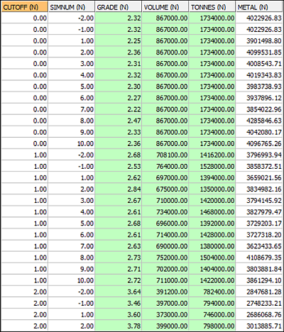
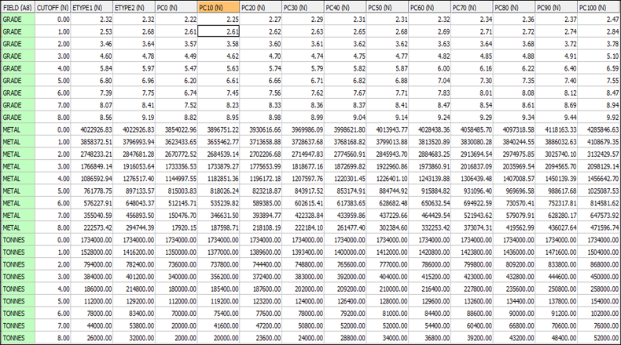
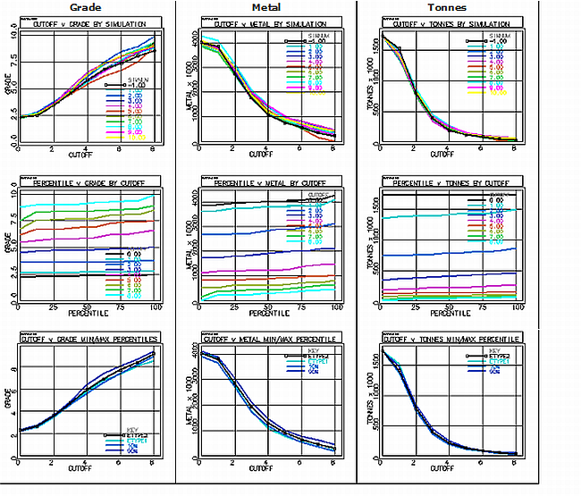

# MODCONF Process

To access this process:

  * **Estimate** ribbon **> > Conditional Simulation >> Confidence - Model**.

  * Enter "MODCONF" into the [Command Line](<../COMMON/Command_Toolbar.md>) and press ENTER.
  * Display the **[Find Command](<../COMMON/findcommand.md>)** screen, locate **MODCONF** and click **Run**.

See this process in the [Command Table](<../command_help/COMMAND%20TABLE_M.md#MODCONF>).

## Process Overview

**Note** : This is a _superprocess_ and running it may have an effect on other Datamine files in the project.

The MODCONF process is part of the Conditional Simulation module, and calculates the confidence of the tonnage and grade resource estimates of a block model.

The main input is a simulated model created by the [CSMODEL](<csmodel.md>) process. The output includes two tables: the main one showing the EType estimate, and a range of percentiles for grade, tonnage and metal content for a set of user-defined cutoff grades. A set of graphs based on the output tables is also created.

The input model can simply be a subset of cells from a simulated model \- the modeled volume representing a pushback, or the material mined in a week or month, for example. The following observations could potentially be derived from the results of this process:

  * Based on a 10x10x10m SMU, and a 1.0 g/t cutoff, the best estimate of the modeled resource is 1.38 mt at 2.68 g/t.
  * There is a 90% probability that the grade of the resource will exceed 2.61 g/t, and a 90% probability that it will be less than 2.74 g/t.
  * There is an 80% probability that the contained metal will exceed 3.66 million grams.

### Input Model File

Typically, the input model file is the simulated model (SIMMOD), created using the CSMODEL process. The following fields are required:

  * _SIMi_ i=1,N where N is the maximum number of realizations. Each SIMi value represents the simulated grade of a model cell.
  * _ETYPE_ The average of all realizations in a cell.

**Note** : CSMODEL creates additional fields, not required by MODCONF.

### Cutoff Grades

Results are presented for a set of regular cutoff grades that are selected using the CUTINT and CUTMAX parameters:

  * _CUTINT_ Defines the interval between successive cutoffs, starting at zero.
  * _CUTMAX_ he maximum cutoff to be considered. 

Note: If the maximum cell value of any realization is less than CUTMAX, then CUTMAX is automatically reduced so that all realizations have at least one value above the maximum.

### Percentiles

Results are presented for a set of regular percentiles that are selected using the PCINT parameter. This parameter defines the interval between successive percentiles, and is restricted to '2.5', '5', '10', '20' or '25'.

### Other Parameters

  * _DENSITY_ Used for tonnage calculations.
  * _FACTOR_ For graphs with tonnage or metal content values annotated on their axes, these values are divided by the FACTOR parameter prior to plotting, in order to reduce the amount of annotation.

### EType Estimates

In addition to results for simulations, the tables and graphs include results for two EType estimates, as follows:

  * _ETYPE1_ The average of all simulations within a cell. This is the ETYPE field that must be available in the input SIMMOD model file, and is processed and displayed in a similar way to the simulated grades for each cell.
  * _ETYPE2_ The average of all simulations for the entire model. For a cutoff of 0, values for ETYPE1 and ETYPE2 will be identical; however, for cutoffs greater than 0, the ETYPE2 grade will be greater than the ETYPE1 grade.

### Output Confidence Tables

The file **CONF_TBL** requires a filename template to be specified. Two file names are then created automatically from the template by adding the characters '_1' and '_2'. For example, if the template name CONF_MODA is specified, then two files are created, as follows:

  * _CONF_MODA_1_ Grade, volume, tonnes and metal for every combination of cutoff and simulation.
  * _CONF_MODA_2_ Grade, metal and tonnes by cutoff for each percentile.

A portion of a table is shown below that has been calculated using the following parameters:

  * Ten simulations are included in the input SIMMOD model.

Note: This number of simulations is too few for a conclusive study, and is for example purposes only.

  * The model cell size is 10x10x10.
  * **CUTINT** =1, **CUTMAX** =8: the results for nine cutoff grades, from 0 to 8 g/t inclusive, are reported:

;>)

In this example:

  * The complete table includes 108 records:(10 simulations + 2ETypes) * 9 cutoffs). These records show grade, volume, tonnes and contained metal (grade * tonnes) for the total model, for each simulation and cutoff.
  * A **SIMNUM** of -2 gives the results for **ETYPE2**.
  * A **SIMNUM** of -1 gives the results for **ETYPE1**.

The following table has been calculated using the same parameters as above. Additionally, **PCINT** =10 has been specified, resulting in percentiles being calculated from 0 to 100 in increments of 10%:

;>)

Referring to row '2', column '6' in the above table: for a cutoff of 1 g/t, the 10th percentile is 2.61 g/t. This represents a 10% probability that the grade of the deposit will be below 2.61, and therefore a 90% probability that it will exceed this value.

## Output Plots

The file CONF_PLT requires a filename template to be specified. File names are then created automatically from the template by adding four characters, "_ABC", where:

  * Character A=P for the plot file which can be displayed.
  * Character A=T for the data table from which the plot has been created.
  * B=1 for a plot of Cutoff v Grade (C=G), Cutoff v Metal (C=M) or Cutoff v Tonnes (C=T) for each Simulation.
  * B=2 for a plot of Percentile v Grade (C=G), Cutoff v Metal (C=M) or Cutoff v Tonnes (C=T) for each Cutoff.
  * B=3 for a plot of Cutoff v Grade (C=G), Cutoff v Metal (C=M) or Cutoff v Tonnes (C=T) for lower and upper Percentiles.

If a name is specified for the CONF_PLT file, and the parameter PLOT_TBL is set to '1', nine plot files are created. They can be displayed by right-clicking them in the Project Files control bar, and selecting Display.

;>)

  * The top row of plots shows Cutoff v Grade, Metal and Tonnes for the ten simulations and for ETYPE1 (SIMNUM -1).
  * The second row shows Percentile v Grade, Metal and Tonnes for the nine cutoff grades.
  * The third row shows Cutoff v Grade, Metal and Tonnes for ETYPE2, ETYPE1, 10th Percentile and 90th Percentile. 

Note: The 10th and 90th percentiles were selected as the lower and upper values from the specified range, excluding 0% and 100%. If the parameter PCINT had been set to 5, rather than 10, then the lower and upper percentiles would have been the 5th and 95th respectively.

## Input Files

Name |  Description |  I/O Status |  Required |  Type  
---|---|---|---|---  
SIMMOD |  The simulated model created using the CSMODEL process. |  Input |  Yes |  Model  
  
## Output Files

Name |  Description |  I/O Status |  Required |  Type  
---|---|---|---|---  
CONF_TBL |  Output table template for 2 model confidence tables. File names are created automatically from the template. |  Output |  Yes |  Table  
CONF_PLT |  Output plot template for displaying confidence values. File names are created automatically from the template. |  Output |  No |  Plot template  
  
## Parameters

Name |  Description |  Required |  Default |  Range |  Values  
---|---|---|---|---|---  
CUTINT |  Defines the cutoff interval between successive cutoff grades. |  No |  1 |  0.00001,9999999 |  Undefined  
CUTMAX |  For regular cutoff grades, this field defines the maximum cutoff grade for percentile tables and graphs. All simulations and the Etype estimator must have at least one value above the maximum cutoff value. If the selected maximum cutoff does not meet these criteria, then it will be automatically reduced. |  No |  10 |  0.00002,9999999 |  Undefined  
PCINT |  Defines the interval between successive percentiles in the output confidence table 2. |  No |  5 |  2.5,25 |  '2.5', '5', '10', '20','25'  
DENSITY |  The density parameter that is used for tonnage calculations. |  No |  1 |  Undefined |  Undefined  
FACTOR |  Dividing factor applied to Tonnes and Metal values before plotting - used to reduce the amount of annotation. |  No |  1 |  Undefined |  Undefined  
PLOT_TBL |  Flag to specify whether a plot data table is output for every plot file created. The plot data table contains the data used to create the CONF_PLT plot files, and could be used to recreate the plot in other software such as Excel. The plot data table name is the same as the plot file, except that "_P" is replaced by "_T". |  No |  0 |  0,1 |  '0' - do not output plot data tables. '1' - output all plot data tables.  
DISPLAY |  Flag to display whether the plot files are displayed as the process is run. |  No |  1 |  0,1 |  '0' - do not display plot files. '1' - display plot files as the process is run.  
  
## Example
    
    
    !MODCONF &SIMMOD(_SM1_10),&CONF_TBL(mod_conf),   
  
---  
      
    
     &CONF_PLT(mod_plot),@CUTINT=1, @CUTMAX=8,   
      
    
     @PCINT=10, @DENSITY=2,@FACTOR=1000, @PLOT_TBL=1,   
      
    
     @DISPLAY=1  
  
Related topics and activities

  * [CSMODEL Process](<csmodel.md>)