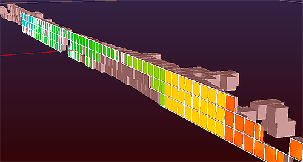

# MSO2NPV Process  
  
To access this process:

  * Enter "MSO2NPV" into the [Command Line](<../COMMON/Command_Toolbar.md>) and press <ENTER>.

See this process in the [Command Table](<../command_help/COMMAND%20TABLE_M.md#MSO2NPV>).

## Process Overview

Update a model containing ore and waste categories into a model suitable for strategic planning, using **[Mineable Shape Optimizer (MSO)](<../MSO/MSOv3_default.md>)** output wireframes.

;>)

A MODOUT1 model generated by MSO2NPV shown with a cutaway of stope wireframes.

The metal content and mass from the stope wireframe data is the same in the block model for the cells representing the MSO shapes, although an optional comparison table is available for analysis. All cells outside the MSO volumes are not considered ore. This process is intended to apply the selective mining units generated by MSO (or by any other means) into the model to be used for optimizing in **Studio NPVS**.

## Input Files

Name |  Description |  I/O Status |  Required |  Type  
---|---|---|---|---  
MODELIN |  Input model file containing ore and waste. This can be a normal or a rotated model  |  Input |  Yes |  Block Model  
WIRETR |  Input wireframe triangle file used to define the stopes. The file must also include the valuation fields (TONNES, VOLUME and grades) derived from MSO.  |  Input |  Yes |  Wireframe Triangles  
**WIREPT** |  Input wireframe point file. | Input | Yes | Wireframe Points  
  
## Output Files

Name |  I/O Status |  Required |  Type |  Description  
---|---|---|---|---  
MODOUT1 |  Output |  Yes |  Block Model |  Output model file containing just cells within the stope wireframes.  
MODOUT2 | Output | No |  Block Model |  Output model model created by adding MODOUT1 to MODELIN  
**COMPARE** | Output | No | Table |  Table showing the difference in volume and density, for each stope, between the input MSO values in the wireframe triangle file and the output MODOUT1 model.  
  
## Fields

Name |  Description |  Source |  Required |  Type |  Default  
---|---|---|---|---|---  
STOPEID |  Name of Stope Identifier field in the WIRETR file. |  WIRETR |  Yes |  Any |  Undefined  
VOLUME |  Name of field defining volume of stope in the input wireframe triangle file. |  WIRETR |  Yes |  Any |  Undefined  
TONNES |  Name of field defining tonnage of stope in the input wireframe triangle file. |  WIRETR |  Yes |  Any |  Undefined  
**F1 - F20** |  Grade field to be copied from WIRETR to the output models. F1 is mandatory. | WIRETR |  F1 = Yes F2+ = No | Any | Undefined  
**INSTOPE** |  Name of field to be created in the output model files to identify cells that lie inside a stope: =0 cell not in stope, =1 cell in stope  | - | No | Any | Undefined  
  
## Parameters

Name |  Description |  Required |  Default |  Range |  Values  
---|---|---|---|---|---  
SPLITS |  Maximum amount of splitting to be allowed.  =0 : no splitting: parent cell.  =1 : 1 split: 2 x 2 subcells.  =2 : 2 splits: 4 x 4 subcells.  =3 : 3 splits: 8 x 8 subcells.  |  No |  3 |  0-3 |  0,1,2,3  
XSUBCELL |  Number of subcells per parent cell in X direction. Max 16. Only used if SPLITS=0 | No | 1 | 1-16 | 1-16  
YSUBCELL |  Number of subcells per parent cell in Y direction (1). Max 16. Only used if SPLITS=0 | No | 1 | 1-16 | 1-16  
RESOL |  Defines boundary resolution in Z direction.  =0 : precise boundary location.  =N : boundary rounded to nearest 1/Nth of parent cell size.  | No | 0 | Undefined | Undefined